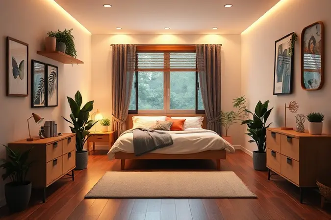

Já acordou com a sensação de que seu quarto está sufocando você? Que seu sono fica restrito pelas laterais da cama de solteiro, mas uma cama de casal padrão transformaria seu espaço em um labirinto?

Essa dor é compartilhada por milhares de pessoas que descobriram na cama de viúva a solução perfeita para espaços compactos sem abrir mão da liberdade. Imagine ter o espaço para se virar confortavelmente à noite, sem precisar se contorcer ou dormir na beirada.

Prepare-se para descobrir todas as respostas que você precisa para tomar a decisão certa e transformar suas noites de sono em verdadeiros momentos de reconexão.

<SummaryList products={frontmatter.top_products} />

## O que é uma Cama de Viúva e por que ela é a escolha inteligente?

Pense na cama de viúva como o ponto de equilíbrio perfeito entre conforto e otimização de espaço.

Com larguras que variam entre 1,38m e 1,40m, ela oferece cerca de 50cm a mais que uma cama de solteiro, o que faz toda a diferença na prática: é o espaço suficiente para você dormir de estrela-do-mar sem invadir a área de circulação do seu quarto.

Para casais que não precisam de uma superfície gigante, funciona como um abraço aconchegante, enquanto para quem mora sozinho representa o luxo de ter espaço sobrando.

Sua versatilidade faz dela a companheira ideal para quartos pequenos, escritórios que viraram dormitórios ou aquela guest room que precisa ser funcional mas não pode consumir toda a área.

## Medidas da Cama de Viúva: Entenda a diferença para Solteiro e Casal

Entender as medidas é entender liberdade espacial. Enquanto a cama de solteiro comum oferece apenas 88cm de largura (quase um metro a menos que uma pessoa deitada de braços abertos), a cama de viúva surge com 1,38m a 1,40m.

Isso significa cerca de 50cm extras que representam: rolar de um lado para o outro sem preocupação, acomodar um gato ou cachorro sem ser empurrado para a beirada, ou simplesmente ter espaço para apoiar um livro e um copo d'água na mesa de cabeceira.

Comparada aos 1,60m iniciais da cama de casal, a viúva economiza preciosos 20cm que em um quarto pequeno são a diferença entre conseguir abrir a porta do guarda-roupa ou não.

## 5 Vantagens de investir em uma Cama Meio Casal

Se você está na dúvida se essa solução intermediária vale o investimento, descubra como ela vai além do simples 'estar no meio do caminho':

1. **Otimização inteligente**: Em vez de desperdiçar espaço com uma cama de casal que você não usa completamente, ganha área de circulação que transforma seu quarto em um ambiente fluido.

2. **Conforto personalizado**: Para quem dorme sozinho, é o luxo de ter todo esse espaço só para si. Para casais que preferem proximidade, torna o sono mais aconchegante.

3. **Economia que faz sentido**: Os colchões e roupa de cama específicos para esse tamanho costumam ter preços mais acessíveis que os de casal, além de serem mais fáceis de encontrar em promoções.

4. **Facilidade logística**: Mover e montar uma cama de viúva é significativamente mais simples que uma de casal, especialmente em prédios com elevadores apertados ou escadas estreitas.

5. **Versatilidade decorativa**: Por ser um tamanho menos comum, você encontra modelos com designs mais elaborados e detalhados, já que as marcas investem em peças que se destacam.

## Cama de Viúva de Madeira: Durabilidade e Estilo Rústico

<ProductBox 
  title={frontmatter.top_products[0].title} 
  image={frontmatter.top_products[0].image} 
  link={frontmatter.top_products[0].link} 
/>

Se você busca aquela sensação de aconchego que só a madeira maciça proporciona, essa é sua opção. Feitas de carvalho, faia ou nogueira, essas camas não são apenas móveis, são heranças que você cria para sua casa.

Imagine acordar todas as manhãs com o calor natural da madeira ao redor, com aquela textura que conta histórias através dos veios. Os tratamentos com verniz especializado protegem não apenas da umidade, mas mantêm a beleza original por décadas.

E para quem valoriza sustentabilidade, as opções em eucalipto de reflorestamento oferecem a mesma resistência com a consciência tranquila de estar fazendo uma escolha responsável.

## Cama Box Viúva: A favorita para otimização de espaço e baú

<ProductBox 
  title={frontmatter.top_products[1].title} 
  image={frontmatter.top_products[1].image} 
  link={frontmatter.top_products[1].link} 
/>

Agora, se seu maior desafio é armazenamento, prepare-se para se apaixonar pela versão com baú. Essa cama não apenas ocupa menos espaço visível, mas transforma o vão abaixo do colchão em uma verdadeira sala de armazenamento secreto.

Pense em guardar todas as suas roupas de cama de reserva, cobertores de inverno e até malas de viagem sem precisar de um armário extra. Com 1,28m de largura por 1,88m de comprimento, ela é a solução para quem tem roupa demais e espaço de menos.

A tampa com mecanismo de abertura suave significa que você acessa tudo o que precisa sem esforço, mantendo a elegância do ambiente intacta.

## Cama de Ferro Meio Casal: O toque Industrial e Vintage no Quarto

<ProductBox 
  title={frontmatter.top_products[2].title} 
  image={frontmatter.top_products[2].image} 
  link={frontmatter.top_products[2].link} 
/>

Para quem acredita que os móveis devem ter personalidade, a cama de ferro meio casal é uma declaração de estilo. Com linhas limpas que vão do industrial puro ao vintage romântico, ela não se esconde no ambiente, mas se torna centro das atenções.

A sensação de segurança que a estrutura metálica proporciona é palpável, como se você estivesse dormindo dentro de uma obra de arte funcional.

E ao contrário do que muitos pensam, o peso extra se traduz em estabilidade que elimina aquele rangido desagradável toda vez que você se mexe.

Os acabamentos disponíveis, desde o preto fosco até o bronze envelhecido, permitem que você personalize seu quarto como uma galeria de arte pessoal.

## Como escolher o Colchão Ideal para Cama de Viúva? (Densidade e Molas)

<ProductBox 
  title={frontmatter.top_products[3].title} 
  image={frontmatter.top_products[3].image} 
  link={frontmatter.top_products[3].link} 
/>

Um colchão ruim pode arruinar até a cama mais perfeita, então essa escolha merece atenção especial. A densidade da espuma (aquele número acompanhado da letra D) não é apenas uma especificação técnica, é o que define se você vai acordar renovado ou com dores.

Para pessoas até 70kg, a D28 oferece o equilíbrio perfeito entre maciez e suporte. Entre 70kg e 90kg, a D33 se torna sua aliada, distribuindo o peso de forma uniforme. Acima de 90kg, a D45 garante que você não afunde no meio da noite, mantendo a coluna alinhada.

Já as molas ensacadas são como pequenos abraços individuais para cada parte do seu corpo. Elas se adaptam aos seus contornos, oferecendo suporte onde você precisa e maciez onde deseja. Para casais, a grande vantagem é que o movimento de um não perturba o sono do outro.

E sim, são mais pesadas que as opções em espuma, mas essa massa extra se traduz em durabilidade que vai acompanhar você por anos de noites tranquilas.

## Roupa de Cama para Viúva: Onde encontrar e como escolher o tamanho certo?

<ProductBox 
  title={frontmatter.top_products[4].title} 
  image={frontmatter.top_products[4].image} 
  link={frontmatter.top_products[4].link} 
/>

O segredo para lençóis que parecem feitos sob medida está em entender as medidas específicas: 1,28m x 1,88m. Marcas especializadas como Doni Enxovais e Maria Algodão oferecem opções específicas que se ajustam como uma segunda pele.

Mas o verdadeiro truque está na escolha do tecido. O algodão 100% penteado não é apenas macio, ele respira com você durante a noite, regulando a temperatura e absorvendo a umidade natural do corpo.

Se você não encontrar o tamanho exato, não entre em pânico. Lençóis com elástico em toda a volta se adaptam maravilhosamente bem, criando um visual de cama feita por profissionais.

E aqui vai uma dica valiosa: investir em duas capas de travesseiro extras e um jogo de lençol reserva transforma a rotina de trocar a cama em um momento prático, nunca mais precisando lavar e secar tudo no mesmo dia.

## Cabeceira para Cama de Viúva: Modelos para valorizar a decoração

<ProductBox 
  title={frontmatter.top_products[5].title} 
  image={frontmatter.top_products[5].image} 
  link={frontmatter.top_products[5].link} 
/>

A cabeceira é a moldura do seu sono, o elemento que transforma uma cama em um refúgio. As opções estofadas em suede ou veludo convidam para momentos de leitura antes de dormir, com o conforto de apoiar as costas em algo macio e acolhedor.

Já as de ferro oferecem aquela elegância vintage que nunca sai de moda, perfeitas para quem gosta de misturar épocas e estilos.

E sim, algumas podem exigir a compra separada do sistema de fixação, mas veja isso como uma oportunidade: você escolhe exatamente o apoio que melhor se adapta à sua altura e preferência.

Para quem tem o hábito de ler na cama, uma cabeceira mais alta e inclinada faz toda a diferença. Para quem prefere algo mais discreto, as opções baixas e limpas mantêm o foco no conjunto.

## Dicas de Decoração: Como posicionar a cama em quartos compactos

A posição da cama define a energia do quarto. Em espaços realmente apertados, experimente a diagonal: ao inclinar a cama em 45 graus, você cria cantos úteis atrás dela, perfeitos para uma prateleira de livros ou uma planta alta.

Se houver janela, posicionar a cama de forma que você acorde com a luz natural é um presente matinal.

Escolher móveis multifuncionais é como ganhar metros quadrados de graça: uma mesa de cabeceira com gavetas substitui uma cômoda, um banco no pé da cama oferece assento e armazenamento.

E nunca subestime o poder dos espelhos: posicionados estrategicamente, eles não apenas ampliam visualmente o espaço, mas refletem a luz, tornando o ambiente mais alegre e arejado.

## Perguntas Frequentes (FAQ) sobre Cama de Viúva

Todas as camas de viúva têm o mesmo tamanho?
Embora as medidas mais comuns sejam 1,38m x 1,88m, algumas variações existem, especialmente nas versões com baú que podem ter 1,28m. Sempre confirme as dimensões antes da compra.

Preciso de colchão especial?
Sim, mas não se assuste. A maioria das marcas oferece opções específicas para esse tamanho, e muitas vezes elas são mais acessíveis que os colchões de casal.

Encontro roupa de cama facilmente?
Hoje em dia, sim. Além das marcas especializadas, muitas lojas maiores já incluem esse tamanho em seus catálogos, especialmente nos conjuntos com elástico que se adaptam melhor.

Vale a pena para quem dorme sozinho?
Absolutamente. É o upgrade de conforto mais inteligente que você pode fazer, especialmente se trabalha em casa e seu quarto também é seu espaço de descanso diurno.

E para casais?
Funciona perfeitamente para quem prefere proximidade ou tem rotinas de sono diferentes. Para casais que se mexem muito durante a noite, talvez seja interessante testar antes.

## Conclusão

Escolher uma cama de viúva vai além de simplesmente trocar um móvel, é uma decisão inteligente sobre como você quer viver seu espaço e seu descanso.

É reconhecer que o conforto não precisa vir acompanhado de metros quadrados perdidos, que o design pode ser funcional sem abrir mão da beleza.

Cada centímetro economizado se transforma em liberdade de movimento durante o dia, enquanto cada centímetro ganho na cama se traduz em noites mais profundas e restauradoras.

Imagine acordar em um quarto que respira, onde tudo tem seu lugar e você tem espaço para ser você mesmo, incluso no sono. Esse é o verdadeiro luxo que a cama de viúva oferece: a possibilidade de transformar limitações em oportunidades criativas.

Agora que você tem todas as informações, o próximo passo é visitar uma loja, sentir a diferença no próprio corpo e descobrir que, às vezes, a solução perfeita está exatamente no ponto de equilíbrio. Seu quarto dos sonhos está esperando por você.