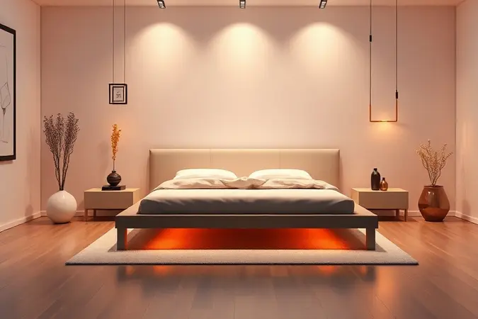
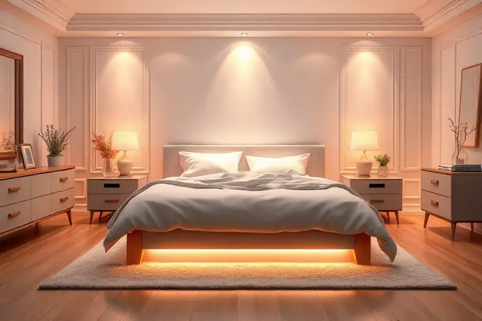

Imagine acordar depois de uma noite realmente reparadora, sem aquela dor nas costas que persegue você o dia todo.

Agora, olhe para o seu quarto: o colchão apoiado em uma estrutura que parece improvisada, cantos que poderiam ter mais espaço, a sensação de que tudo poderia ser mais organizado.

A escolha do suporte certo para seu colchão vai muito além da estética. É sobre saúde, sobre criar um santuário pessoal onde você realmente renova suas energias.

Neste guia, vou te mostrar como transformar essa visão em realidade, entendendo profundamente as camas box e encontrando o modelo que transformará suas noites.

<SummaryList products={frontmatter.top_products} />

## O que é Cama Box e por que ela superou as camas tradicionais?

A cama box é como o smartphone dos móveis de quarto: uma solução integrada que reúne estrutura e conforto em um único conjunto. Enquanto as camas tradicionais exigem cabeceiras, pés e estrutura, a box substitui tudo isso por um design pensado desde o início.

Seu segredo está na simplicidade inteligente. Como é produzida já pensando na dupla perfeita entre base e colchão, cada componente conversa melhor com o outro. O resultado?

Você sente uma diferença palpável: a distribuição de peso fica mais uniforme, seu corpo encontra o suporte nos lugares certos e o conjunto inteiro parece trabalhar a seu favor.

Mas a verdadeira revolução não está apenas no suporte. Ela está na liberdade que essa simplicidade cria: mais espaço visível, menos peças para limpar por baixo, e uma estética clean que se adapta ao seu estilo, seja ele qual for.

## 5 Benefícios Comprovados de Escolher uma Cama Box

Quando você troca o olhar técnico pelo olhar do dia a dia, os benefícios da cama box ficam ainda mais claros. É como descobrir que aquela solução simples está resolvendo problemas que você nem sabia que tinha.

Primeiro, pense no espaço. Sem as pernas e estruturas tradicionais, a base parece flutuar, criando uma ilusão preciosa em quartos menores: o de que o ambiente ganhou alguns centímetros preciosos. Você consegue circular melhor, o quarto respira.

Segundo, essa base elevada não é apenas estética. Ela se torna sua aliada para levantar com mais facilidade, especialmente se você tem dificuldades de mobilidade. É menos um obstáculo e mais um convite para começar o dia sem esforço.

Terceiro, respire fundo. Literalmente. O design das camas box prioriza ventilação adequada sob o colchão, criando um ambiente menos propício para umidade e ácaros. Seu investimento dura mais, e suas noites ficam mais frescas.

Quarto, a caixa de surpresas. Muitos modelos trazem soluções de armazenamento integrado que mudam completamente a organização do seu quarto. Roupas de cama, cobertores, malas... tudo tem seu lugar, sem precisar de um armário extra.

Quinto, a paz na montagem. Ao contrário das estruturas tradicionais com múltiplas peças pequenas, a cama box chega quase pronta. É menos tempo montando, mais tempo aproveitando.

## Guia de Tamanhos: Qual Cama Box cabe no seu quarto?

Esta é a hora da verdade: medir duas vezes, comprar uma. Não se trata apenas do tamanho da cama, mas do espaço que sobra ao redor dela. Você precisa de espaço para abrir gavetas, para caminhar confortavelmente, para que o quarto não pareça ocupado apenas por uma cama.

Comece com uma fita métrica. Meça o local exato, subtraia pelo menos 60cm para cada lado (isso é o mínimo para circulação confortável). Agora, vamos aos tamanhos que se encaixam nesse espaço descoberto.

### Cama Box Solteiro: Ideal para ambientes compactos

<ProductBox 
  title={frontmatter.top_products[0].title} 
  image={frontmatter.top_products[0].image} 
  link={frontmatter.top_products[0].link} 
/>

Para apartamentos studios, home offices que dobram como quarto de hóspedes, ou simplesmente para quem prefere a sensação aconchegante de um espaço pessoal bem definido, a solteiro é a resposta.

Com cerca de 88cm de largura, ela oferece espaço suficiente para um sono individual de qualidade.

O grande diferencial da versão box está na versatilidade. Muitos modelos trazem a opção de baú integrado, transformando o espaço antes vazio sob a cama em uma solução de organização inteligente.

São centímetros cúbicos que fazem toda diferença quando cada metro quadrado conta.

E se você acha que 'compacto' significa 'menos confortável', esqueça. A estrutura box oferece o mesmo suporte uniforme de modelos maiores, apenas em uma escala mais eficiente. Perfeita para quartos juvenis, de solteiros ou como cama auxiliar de alto nível.

### Cama Box Casal: O padrão de conforto e praticidade

<ProductBox 
  title={frontmatter.top_products[1].title} 
  image={frontmatter.top_products[1].image} 
  link={frontmatter.top_products[1].link} 
/>

Quando o sono se torna uma atividade a dois, o espaço precisa ser generoso. A cama box casal, com seus 138cm de largura, estabelece o equilíbrio perfeito: espaço suficiente para cada um ter seu território, sem que o conjunto ocupe todo o quarto.

O que você ganha nesse upgrade além dos centímetros extras? Primeiro, a sensação de que a cama foi projetada para ser duradoura. As estruturas costumam ser mais robustas.

Segundo, opções de armazenamento mais abundantes, muitas vezes com gavetas duplas laterais que se transformam em verdadeiras minigavetas auxiliares.

Para casais que não querem abrir mão da praticidade mas precisam de firmeza que preserve a saúde das duas colunas, essa é a opção que equilibra tudo.

A base uniforme do sistema box significa que tanto o lado direito quanto o esquerdo recebem o mesmo nível de suporte, sem pontos de pressão diferenciados que podem causar desconforto.

### Cama Box Queen Size: Conforto extra para quem se mexe muito

<ProductBox 
  title={frontmatter.top_products[2].title} 
  image={frontmatter.top_products[2].image} 
  link={frontmatter.top_products[2].link} 
/>

Existe um momento em que 'espaço suficiente' se transforma em 'espaço que permite liberdade'. Se você ou seu parceiro têm o hábito de mudar de posição várias vezes durante a noite, cada centímetro extra se transforma em paz preservada.

Com 158cm de largura, a cama queen oferece uma experiência generosa de sono que parece um upgrade de primeira classe em relação ao casal tradicional.

É o espaço que permite que um se vire sem acordar o outro, que os dois estiquem as pernas sem fazer contato não planejado.

Quando combinada com colchões de molas ensacadas, essa cama cria uma sinergia impressionante. As molas trabalham independentemente, isolando movimentos, enquanto a base box distribui o peso uniformemente.

O resultado é como ter duas camas individuais que compartilham o mesmo espaço. E com opções de armazenamento embaixo, você ainda ganha funcionalidade sem sacrificar a sensação de amplitude.

### Cama Box King Size: O máximo de espaço e luxo

<ProductBox 
  title={frontmatter.top_products[3].title} 
  image={frontmatter.top_products[3].image} 
  link={frontmatter.top_products[3].link} 
/>

Chegamos ao território do 'sonho realizado'. A cama king size box, com seus 193cm de largura, não é apenas uma cama maior. É uma declaração sobre como você valoriza seu descanso, seu espaço pessoal e a qualidade do seu sono.

Imagine: espaço suficiente para você, seu parceiro, e ainda sobra lugar para aquele momento aconchegante com as crianças na manhã de domingo. Ou para o pet que insiste em dormir no meio. A king é a cama que diz 'sim' ao conforto absoluto, sem negociar.

Marcas consagradas como Ortobom e Hellen City oferecem versões com tecnologia de ponta em suas molas ensacadas nesta medida, criando uma experiência de sono que isola completamente os movimentos. É como dormir em uma nuvem particular, mesmo com alguém ao lado.

Claro, essa generosidade exige espaço no quarto. É uma cama que se torna a peça central do ambiente, mas quando você tem o espaço necessário, ela se transforma no investimento mais gratificante que você pode fazer em seu bem-estar diário.

## Molas Ensacadas vs. Espuma: Qual o suporte ideal?

Depois de definir o tamanho, vem a decisão mais pessoal: como você prefere se sentir apoiado? Não existe resposta certa universal, apenas a que é certa para seu corpo e seus hábitos.

### Colchão Ortopédico e Densidade D33: Quando escolher?

<ProductBox 
  title={frontmatter.top_products[4].title} 
  image={frontmatter.top_products[4].image} 
  link={frontmatter.top_products[4].link} 
/>

Se você busca aquela sensação perfeita entre 'abraçado' e 'apoiado', o colchão ortopédico com densidade D33 pode ser seu par ideal.

A densidade 33kg/m³ representa o ponto ótimo para a maioria das pessoas: firmeza suficiente para manter sua coluna alinhada, com conforto que evita a rigidez excessiva.

Esse tipo de colchão é especialmente indicado para quem pesa até 100kg, mas sua verdadeira magia está na inteligência da distribuição. Ele cede onde precisa ceder (ombros, quadril) e oferece resistência onde deve oferecer (região lombar).

O resultado é acordar sem aquela dor surda nas costas que parece ter se instalado durante a noite.

Agora, se você prefere a sensação de afundar completamente, como se estivesse em uma nuvem, o D33 pode parecer firme demais.

Mas para quem já sofre com dores ou busca prevenir problemas posturais, essa densidade representa o equilíbrio que muitos fisioterapeutas recomendam.

## Cama Box com Baú: A solução inteligente para falta de espaço

<ProductBox 
  title={frontmatter.top_products[5].title} 
  image={frontmatter.top_products[5].image} 
  link={frontmatter.top_products[5].link} 
/>

Existem momentos em que a cama precisa ser mais do que um local de descanso. Precisa ser uma solução.

Para quartos pequenos, apartamentos sem armários planejados ou simplesmente para quem acumula itens sazonais, a cama box com baú se apresenta como o herói discreto da organização.

Pense nas estações. O cobertor de inverno pesado, as roupas de cama extra, os travesseiros de visita. Tudo isso ocupa espaço precioso. Agora, imagine que todo esse volume desaparece sob seus pés enquanto você dorme, em um compartimento discreto e acessível.

Os modelos variam de abas simples a sistemas com pistão de gás que abrem sem esforço, alguns com divisórias internas que transformam o espaço caótico em organização inteligente.

É a diferença entre um quarto que parece sempre bagunçado e um que conserva sua serenidade visual, mesmo com tudo o que você precisa à mão.

## Erros comuns ao comprar uma Cama Box que você deve evitar

O entusiasmo pela compra nova pode nos fazer esquecer detalhes importantes. Estes são os erros que mais vejo pessoas cometerem, e que podem transformar uma compra de sonho em uma fonte de frustração:

Não teste o colchão apenas sentando na beira. Deite. Fique pelo menos cinco minutos em sua posição preferida de sono. Como sua coluna se sente? Onde seu corpo cria pontos de pressão?

A loja pode achar estranho, mas essa experimentação é o que fará você dormir bem pelos próximos anos.

Ignore o 'espaço para respirar'. Uma cama que preenche exatamente o quarto é uma cama que criará sensação de sufocamento. Deixe espaço para caminhar, para abrir gavetas, para que o ambiente não se torne apenas uma extensão da cama.

Escolha pelo preço, não pelo custo-benefício. A diferença de R$200,00 em um investimento que você usará por 8+ anos é irrisória mensalmente. Mas a diferença na qualidade do sono, na durabilidade, na satisfação diária? Essa é gigante.

## Dicas de Especialista: Como aumentar a durabilidade do seu conjunto

Seu novo conjunto merece cuidados assim como qualquer investimento de qualidade. Algumas práticas simples podem estender sua vida útil em anos:

Rotacione e vire seu colchão a cada três meses. Isso distribui o desgaste de forma equitativa, evitando que você crie 'valetas' onde dorme mais frequentemente. Pense nisso como o rodízio de pneus do seu sono.

Respire. Mantenha o ambiente ventilado. Evite encostar a cama em paredes úmidas direto. Se possível, abra o baú periodicamente para arejar o interior. A umidade é o inimigo silencioso de colchões e estruturas.

Proteja antes de usar. Um protetor impermeável não é apenas para crianças ou acidentes. É uma barreira contra transpiração, células da pele, partículas que naturalmente acumulamos durante o sono. Sua cama permanece mais fresca por mais tempo.

Limpe com inteligência. Aspire a superfície mensalmente. Para manchas, menos é mais: soluções suaves, secagem natural, sem esfregar agressivamente. O colchão é como um grande travesseiro; ele precisa de cuidados delicados.

## Perguntas Frequentes (FAQ) sobre Camas e Colchões

Vamos esclarecer as dúvidas que mais perseguem quem está escolhendo uma nova cama:

Colchão de espuma ou molas? Imagine dois tipos de abraço. A espuma é como um abraço que se molda perfeitamente ao seu corpo, aliviando pontos de pressão. As molas são como um abraço firme que sustenta sem ceder completamente.

Para dores, a espuma ortopédica costuma ser mais indicada. Para quem se mexe muito, molas ensacadas isolam melhor o movimento. Não há superioridade absoluta, apenas adequação.

Que altura ideal? A altura certa é aquela que permite você sentar na beira com os pés tocando o chão confortavelmente e levantar sem fazer força exagerada. Para idosos ou pessoas com mobilidade reduzida, modelos mais altos facilitam muito essa transição.

Como saber quando trocar? Seu corpo dá os sinais: acordar com dores que desaparecem quando você se levanta, sentir que está 'rolando' para o meio mesmo em colchão novo, a cama apresentando ondulações visíveis.

Em média, 7-8 anos é o ciclo de troca ideal para manter a qualidade do sono.

## Conclusão

Escolher sua cama box é mais do que selecionar um móvel. É projetar o cenário onde um terço da sua vida acontecerá. É investir nos sonhos que você terá, no descanso que recuperará suas energias, no espaço que será seu refúgio diário.

Ao longo deste guio, você descobriu que a decisão se desdobra em camadas: primeiro o tamanho que conversa com seu espaço físico, depois o tipo de suporte que conversa com seu corpo, finalmente as funcionalidades que conversam com seu estilo de vida.

Seja a solteiro que maximiza um cantinho compacto, a queen que oferece liberdade generosa, ou a king que celebra o conforto sem limites, a cama box representa a evolução do dormir: integrada, inteligente, e profundamente focada no seu bem-estar.

Agora que você tem o mapa, resta fazer a viagem. Visite uma loja com seu conhecimento renovado, teste com atenção, imagine a cama no seu espaço. E quando encontrar a certa, você saberá.

Não apenas pelo modelo, mas pela sensação de antecipação: a de que suas próximas noites serão significativamente melhores.

Que sua nova cama seja tão revigorante quanto as manhãs que ela te ajudará a enfrentar.