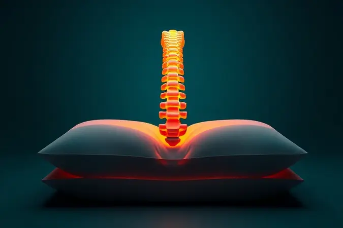
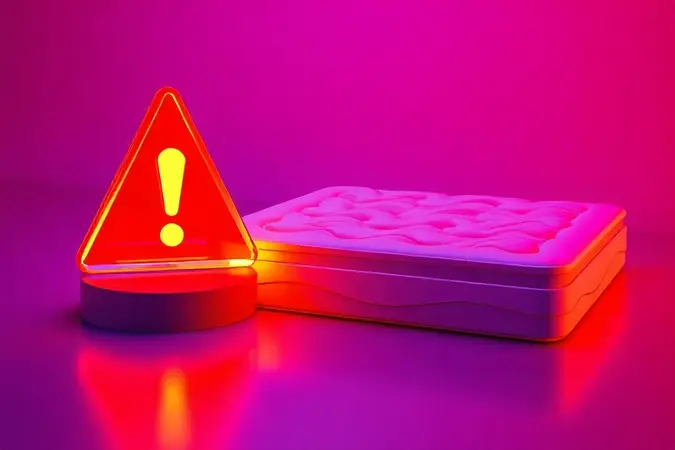

Se você já acordou com aquela rigidez nas costas que parece ter se instalado durante a noite, sabe que o problema não é apenas a posição em que dormiu. É a superfície onde seu corpo repousa.

Para quem convive com hérnia de disco ou dores posturais, o colchão deixa de ser um simples móvel para se tornar parte do tratamento.

Ao longo deste guia, você vai descobrir como transformar suas noites de sono de momentos de desconforto para verdadeiras sessões de recuperação da sua coluna.

<SummaryList products={frontmatter.top_products} />

## Por Que a Escolha do Colchão é Crucial para a Saúde da Coluna?

Imagine sua coluna vertebral como uma corrente delicada que precisa manter sua forma natural, não importa em que posição você esteja. Durante o sono, quando seus músculos relaxam totalmente, é o colchão que assume o papel de suporte principal.

Um modelo inadequado deixa sua coluna 'pendurada' em pontos de pressão, enquanto o ideal oferece apoio uniforme que mantém as vértebras alinhadas.

Pense na espuma viscoelástica e no látex não como materiais, mas como tecnologias que abraçam seu corpo de forma inteligente, aliviando a pressão exatamente onde você mais precisa.

Essa escolha vai além do conforto imediato, ela determina se você acorda revigorado ou se arrasta pela manhã.

## Hérnia de Disco: O que Você Precisa Saber Antes de Comprar

Quando você tem hérnia de disco, cada noite de sono vira uma negociação entre o descanso que seu corpo pede e a dor que ameaça aparecer. O segredo não está no colchão mais firme do mercado, mas naquele que conhece o conceito de equilíbrio.

Você precisa de uma superfície que não ceda demais nem resista ao ponto de criar novos pontos de pressão.

É como caminhar sobre a linha tênue entre o apoio e a adaptação, onde a espuma viscoelástica se torna sua aliada, moldando-se às suas curvaturas enquanto mantém a estrutura necessária.

Antes de ir às lojas, entenda que você não está apenas escolhendo um produto, está selecionando um parceiro noturno para sua recuperação.

## Como Avaliar a Firmeza Ideal: Nem Muito Macio, Nem Muito Rígido

Encontrar a firmeza perfeita é como afinar um instrumento musical, pois depende do seu peso corporal e do formato único da sua coluna.

Pessoas mais leves podem se sentir 'flutuando' em colchões muito firmes, enquanto quem tem mais peso pode afundar demais em superfícies muito macias. O teste real acontece quando você se deita e percebe: sua coluna está em linha reta dos quadris aos ombros?

O espaço entre suas costas e o colchão é mínimo? Essa é a avaliação prática que nenhum número de densidade substitui.

### O Mito do Colchão 'Duro como Tábua'

Lembra daquelas recomendações antigas que sugeriam dormir em superfícies quase tão duras quanto o chão? Esse conselho pertence ao passado. Um colchão extremamente rígido trata seu corpo como uma placa plana, ignorando completamente suas curvas naturais.

O resultado são pontos de pressão nas regiões dos ombros e quadris que, em vez de aliviar, podem intensificar sua dor.

Hoje sabemos que o verdadeiro suporte vem da combinação inteligente de materiais, onde a espuma viscoelástica abraça seu contorno enquanto mantém a integridade estrutural da sua coluna.

Os colchões híbridos representam essa evolução, oferecendo a firmeza necessária sem o desconforto da rigidez excessiva.

## Tipos de Colchão Recomendados por Ortopedistas

Quando ortopedistas discutem colunas comprometidas, dois materiais sempre aparecem em suas recomendações: espuma de memória e látex.

A razão é simples, esses materiais entendem algo fundamental, seu corpo muda de posição durante a noite, e eles acompanham esse movimento sem abandonar o suporte.

Enquanto colchões muito macios deixam sua coluna 'afundar', esses materiais oferecem a resistência progressiva que mantém tudo alinhado, mesmo quando você rola de um lado para o outro às 3 da manhã.

### 1. Colchão de Molas Ensacadas Individuais

<ProductBox 
  title={frontmatter.top_products[0].title} 
  image={frontmatter.top_products[0].image} 
  link={frontmatter.top_products[0].link} 
/>

Imagine cada mola do seu colchão como um dedo independente que se adapta especificamente à parte do corpo que está sobre ela. Essa é a magia das molas pocket.

Quando você se deita de lado, as molas sob seu quadril cedem ligeiramente enquanto as sob sua cintura mantêm firmeza. Esse movimento individualizado cria uma superfície personalizada que distribui seu peso de maneira quase perfeita.

O benefício mais imediato que você perceberá é a redução daquelas dores pontuais que aparecem nos ombros ao acordar.

O investimento inicial pode ser maior, mas pense nisso como pagar por anos de noites sem precisar se virar constantemente para encontrar uma posição menos dolorosa.

Além disso, se você divide a cama, essa tecnologia garante que o movimento do seu parceiro não se transforme em ondas que percorrem todo o colchão. É a diferença entre acordar porque sua dor piorou ou porque o despertador tocou.

### 2. Colchão de Espuma de Alta Densidade (D33 e D45)

<ProductBox 
  title={frontmatter.top_products[1].title} 
  image={frontmatter.top_products[1].image} 
  link={frontmatter.top_products[1].link} 
/>

Os números D33 e D45 não são apenas especificações técnicas, são promessas de durabilidade. O D33, com seus 33 kg/m³, é o equilíbrio perfeito para quem pesa até 100 kg e busca uma noite de sono onde conforto e suporte se dão as mãos.

Você sentirá que o colchão 'respira' com seu corpo, cedendo nos pontos certos sem jamais perder sua estrutura.

Já o D45 (45 kg/m³) é para quem precisa de um abraço mais firme. Se seu peso ultrapassa os 100 kg ou se sua hérnia de disco exige suporte extra, essa densidade oferece a resistência que previne o afundamento excessivo.

Sim, o custo é maior, mas quando você calcula quantas horas por ano passa sobre esse colchão, percebe que está investindo na fundação do seu descanso.

Ambos atendem às rigorosas normas do Inmetro, mas o verdadeiro teste acontece quando você acorda sem aquela rigidez matinal característica.

### 3. Colchão Ortopédico com Densidade Progressiva

<ProductBox 
  title={frontmatter.top_products[2].title} 
  image={frontmatter.top_products[2].image} 
  link={frontmatter.top_products[2].link} 
/>

A densidade progressiva é a resposta mais sofisticada para um problema simples: como manter a coluna alinhada enquanto o corpo precisa de conforto nas áreas de contato? A solução são camadas que conversam entre si.

As superiores, mais macias, acolhem seus ombros e quadris, enquanto as inferiores, mais firmes, atuam como pilares que sustentam sua estrutura espinal.

O resultado é uma distribuição de peso tão uniforme que você quase esquece que tem pontos de pressão. Marcas como Emma e Luuna dominam essa tecnologia, oferecendo não apenas alívio para dores existentes, mas prevenção para problemas futuros.

Quando você experimenta um desses modelos, percebe imediatamente a diferença: não é como deitar em uma superfície, é como ser recebido por um sistema inteligente que já conhece suas necessidades.

## Tabela de Densidade de Espuma vs. Peso Corporal

Pense na densidade como a 'personalidade' do colchão. Uma espuma com 20-30 kg/m³ é como um abraço suave ideal para quem pesa menos.

Já acima de 30 kg/m³, estamos falando de um apoio mais estruturado, necessário quando o corpo precisa de resistência extra para manter o alinhamento.

O parâmetro não é aleatório, pois o peso determina quanta pressão cada centímetro quadrado do colchão precisará suportar durante anos de uso.

## Suporte para Hérnia de Disco Lombar: O Papel da Base e do Colchão

Seu colchão e sua base funcionam como uma equipe. Imagine colocar o melhor colchão ortopédico sobre uma base frágil ou inadequada, seria como calçar tênis de corrida para caminhar na areia fofa.

No caso específico da hérnia lombar, onde a região inferior das costas carrega maior tensão, essa combinação precisa ser perfeita. A base firme assegura que o suporte do colchão não seja comprometido, distribuindo seu peso de forma que nenhuma área fique sobrecarregada.

## Melhores Posições para Dormir e Manter o Alinhamento Espinal

Sua posição preferida para dormir conta uma história sobre suas dores. Se você é dos que dormem de lado, sabe que um travesseiro entre os joelhos não é luxo, é necessidade, pois mantém seus quadris alinhados e tira a pressão da lombar.

Dormir de costas com apoio sob os joelhos permite que sua coluna distribua seu peso uniformemente, como se estivesse flutuando. O que poucos sabem é que essas posições otimizam ainda mais quando combinadas com o colchão certo, transformando o sono em terapia.

## O Complemento Essencial: Travesseiro Ortopédico Cervical

<ProductBox 
  title={frontmatter.top_products[3].title} 
  image={frontmatter.top_products[3].image} 
  link={frontmatter.top_products[3].link} 
/>

Seu colchão cuida das suas costas, mas quem cuida do seu pescoço? O travesseiro ortopédico cervical é o parceiro perfeito, trabalhando em sincronia com sua superfície de descanso.

Ele não apenas apoia seu pescoço, mas mantém toda a sua coluna cervical na posição neutra que permite músculos verdadeiramente relaxados.

Para quem dorme de lado, ele preenche o espaço entre o ombro e a orelha; para quem prefere dormir de costas, mantém a curvatura natural.

É a peça final do quebra-cabeça do seu descanso, mas lembre-se, ele complementa, não substitui, a orientação médica para dores persistentes.

## 5 Erros Comuns ao Comprar um Colchão para Problemas de Coluna

Cometer um desses erros pode significar meses de dores desnecessárias. O primeiro, e mais comum, é a busca desesperada pela firmeza máxima, ignorando que rigidez excessiva cria novos pontos de pressão.

O segundo é confiar apenas em recomendações alheias, pois o que funciona para o amigo pode não se adaptar às suas curvaturas específicas.

O terceiro erro é menosprezar o período de teste, comprando impulsivamente sem considerar que seu corpo precisa de noites reais para se ajustar. O quarto equívoco é focar apenas no preço, sem analisar os materiais que determinarão sua durabilidade e suporte.

Por fim, não verificar a política de devolução é como comprar um terno sem provar, você pode descobrir tarde demais que não serve.

## Perguntas Frequentes (FAQ)

### Colchão de látex é bom para quem tem hérnia de disco?

O látex natural possui uma característica quase mágica: ele resiste uniformemente. Isso significa que quando você se deita, ele se adapta ao seu corpo sem criar bolsas de afundamento que desalinham sua coluna.

Para quem tem hérnia de disco, essa capacidade de oferecer suporte sem rigidez é transformadora. Além disso, sua estrutura celular aberta repele naturalmente ácaros e umidade, criando um ambiente mais saudável para noites de sono.

### Com que frequência devo trocar o colchão para evitar dores?

Seu colchão fala com você através de sinais sutis. Quando ele começa a manter a impressão do seu corpo por minutos após você levantar, está perdendo resiliência. Quando você rola para o centro involuntariamente durante a noite, formou um vale de afundamento.

Esses sinais geralmente aparecem entre 7 e 10 anos de uso, mas podem chegar mais cedo se o material for de baixa qualidade. A troca não é sobre seguir um calendário, mas sobre responder às necessidades da sua coluna.

Dores que surgem sem explicação podem ser o grito de socorro do seu suporte noturno.

## Conclusão

Escolher o colchão certo quando se vive com hérnia de disco não é um gasto, é o investimento mais inteligente que você pode fazer na sua qualidade de vida diária.

Pense nas aproximadamente 2.920 horas que você passa dormindo a cada ano, e reflita: não faz sentido que esse tempo seja usado para recuperação em vez de agravar seu desconforto? O modelo ideal não promete milagres, mas oferece o que sua coluna mais precisa, uma pausa.

Durante essas horas de repouso, enquanto você sonha, um bom colchão trabalha para manter sua estrutura alinhada, reduzir pontos de pressão e preparar seu corpo para mais um dia.

Comece vendo-o não como mobília, mas como parte essencial do seu tratamento, e você descobrirá que acordar sem dor não é privilégio, é consequência de escolhas conscientes.

Suas costas agradecerão todas as manhãs, e sua energia durante o dia será o testemunho silencioso desse cuidado.