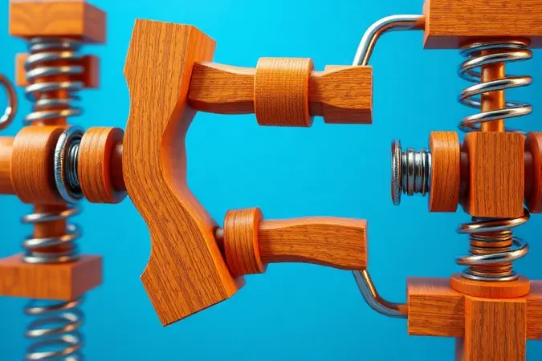

Imagine aquela situação: você finalmente consegue relaxar, fecha os olhos para cair no sono profundo... e lá vem o som.

Aquele rangido que parece um personagem extra na sua noite, protestando cada vez que você respira mais forte ou tenta encontrar uma posição confortável.

Pior ainda quando você percebe que está acordando seu parceiro ou, se mora sozinho, vive interrompendo seu próprio ciclo de sono.

Mais do que apenas um incômodo auditivo, esse barulhinho persistente pode ser um sinal de que algum componente da sua cama está sofrendo desgaste desnecessário. A boa notícia é que, na maioria das vezes, você nem precisa chamar um especialista ou gastar uma fortuna.

Com alguns truques simples e ferramentas que provavelmente já tem em casa, é possível transformar sua cama em um verdadeiro santuário do silêncio.

<SummaryList products={frontmatter.top_products} />

## Por que a cama faz barulho? As causas mais comuns do rangido

Por trás do incômodo sonoro existe uma lógica que você pode dominar.

O rangido geralmente se origina em um desses três pontos: nas molas do colchão que começam a ceder com o tempo, criando pequenos atritos internos; nas conexões da estrutura que perderam a firmeza original; ou no próprio material da cama trabalhando contra si mesmo.

Camas de madeira, por exemplo, têm uma tendência natural a expandir e contrair com variações de umidade, fazendo com que as peças esfreguem umas nas outras de forma quase musical.

Já as estruturas metálicas, embora geralmente mais silenciosas, podem desenvolver seus próprios ruídos se parafusos ou dobradiças não estiverem devidamente ajustados.

Entender essa origem não é apenas uma curiosidade técnica, mas a chave para aplicar a solução certa de primeira.

## Como localizar a origem do ruído (O "Teste do Silêncio")

Saber que o som existe é uma coisa, descobrir exatamente de onde ele vem é outra. É aqui que entra uma técnica simples que chamo de "Teste do Silêncio". Comece preparando a cena: retire todos os cobertores, lençóis e travesseiros para eliminar possíveis falsos culpados.

Peça para alguém (ou você mesmo, com um pouco de malabarismo) se deitar e se mover lentamente pela cama. Agora, a parte mais importante: abaixe-se ao nível do chão e escute. Não apenas ouça, mas preste atenção. Mova-se ao redor da cama enquanto a pessoa muda de posição.

Em qual lado o som parece mais intenso? É perto da cabeceira ou dos pés? Dê leves balanços laterais para testar resistência.

Esse exercício de escuta ativa revela se o vilão mora na estrutura (som mais metálico e estridente) ou se está escondido nas entranhas do colchão (som mais abafado, como uma mola rangendo por dentro).

## 7 Soluções Práticas para Silenciar sua Cama em Minutos

<ProductBox 
  title={frontmatter.top_products[0].title} 
  image={frontmatter.top_products[0].image} 
  link={frontmatter.top_products[0].link} 
/>

Com o diagnóstico em mãos, é hora da ação. O segredo está em começar pelas soluções mais simples, aquelas que exigem quase nenhum investimento, pois muitas vezes é justamente ali que está a resposta.

Antes de cogitar uma compra nova, tente uma volta na sua cama com uma chave de fenda na mão, apertando cada conexão que encontrar. Para camas de madeira, às vezes tudo o que precisa é da fricção certa de uma vela comum nos pontos de encontro entre as ripas.

Estruturas metálicas geralmente respondem maravilhosamente a uma rápida aplicação de lubrificante seco.

Mas essas são apenas as primeiras camadas de uma estratégia completa, que inclui desde ajustes invisíveis até pequenos reforços que podem fazer toda a diferença entre uma noite interrompida e o sono dos anjos.

### 1. O Truque da Vela de Parafina para Estrados de Madeira

<ProductBox 
  title={frontmatter.top_products[1].title} 
  image={frontmatter.top_products[1].image} 
  link={frontmatter.top_products[1].link} 
/>

Às vezes a solução mais eficaz também é a mais poética. Pegue uma vela comum de parafina, daquelas que você tem guardada para algum eventual apagão, e transforme-a em sua aliada contra o rangido.

Simplesmente passe a vela nas bordas das ripas do estrado, especialmente nos pontos onde elas se encaixam nas laterais da estrutura.

A parafina cria uma camada de deslizamento quase invisível que reduz drasticamente o atrito, como se você tivesse colocado uma fina camada de gelo entre as superfícies. Em questão de minutos, aquela madeira que protestava a cada movimento começa a trabalhar em silêncio.

Embora seja uma solução temporária (a parafina vai se desgastando com o tempo), ela pode durar meses e serve como um excelente teste para ver se vale a pena investir em lubrificantes mais sofisticados.

### 2. Uso de Feltros e Calços para Eliminar Atrito entre Peças

<ProductBox 
  title={frontmatter.top_products[2].title} 
  image={frontmatter.top_products[2].image} 
  link={frontmatter.top_products[2].link} 
/>

Se você já usou aqueles discos de feltro embaixo dos pés de uma cadeira que riscava seu piso, sabe exatamente do que estamos falando.

Aplicar feltros autoadesivos nos pontos de contato entre diferentes partes da estrutura da cama é como colocar palmilhas de gel em seus sapatos. Eles absorvem microvibrações que, de outra forma, se transformariam em sons audíveis.

Para lugares onde existe uma pequena folga entre peças (aquele espaço que não deveria existir, mas existe), calços de borracha ou EVA podem preencher o vazio e estabilizar a conexão.

Uma alternativa caseira e surpreendentemente eficaz são tampinhas de garrafa plástica cortadas ao meio e posicionadas estrategicamente. Não é apenas sobre eliminar o ruído atual, mas prevenir que novos surjam, como colocar um colchão de ar entre seu móvel e o futuro.

### 3. Aperto e Nivelamento dos Pés e Parafusos Estruturais

<ProductBox 
  title={frontmatter.top_products[3].title} 
  image={frontmatter.top_products[3].image} 
  link={frontmatter.top_products[3].link} 
/>

Imagine cada parafuso solto como um músico desafinado numa orquestra. Quando você aperta todos eles, a cacofonia se transforma em harmonia.

Pegue uma chave de fenda ou uma chave inglesa adequada e percorra metodicamente toda a estrutura da sua cama, girando cada conexão até sentir uma leve resistência.

Não exagere na força, especialmente em madeiras mais macias, mas garanta que nenhuma peça tenha liberdade para dançar sozinha. Em seguida, concentre-se nos pés. Muitos modelos modernos têm pés rosqueáveis que permitem ajustes individuais de altura.

Use um nível de bolha ou, se não tiver um, apenas um copo com água até a borda para verificar se a cama está perfeitamente plana. Piso irregular? É aqui que pequenas cunhas de madeira ou até mesmo moedas embaixo dos pés podem fazer milagres.

### 4. Isolamento de Juntas Metálicas com Borracha ou Fita Veda Rosca

<ProductBox 
  title={frontmatter.top_products[4].title} 
  image={frontmatter.top_products[4].image} 
  link={frontmatter.top_products[4].link} 
/>

Quando o som vem especificamente das juntas metálicas da sua cama, é como se estivéssemos lidando com pequenos instrumentos de percussão que tocam sem nossa permissão. O isolamento adequado pode silenciá-los completamente.

Para conexões roscadas, aquelas porcas e parafusos que são os principais suspeitos, a fita veda rosca (aquela branca de Teflon) é sua melhor amiga. Basta enrolar algumas voltas ao redor da rosca antes de apertar a porca, criando uma vedação à prova de movimentos.

Para dobradiças ou pontos onde peças metálicas se encostam, pequenas arruelas de borracha ou silicone atuam como amortecedores, absorvendo o impacto que antes se transformava em som.

É uma intervenção quase cirúrgica, invisível ao olhar mas perfeitamente audível pelos seus ouvidos agradecidos.

### 5. Como Diminuir o Atrito entre a Base Box e o Colchão

<ProductBox 
  title={frontmatter.top_products[5].title} 
  image={frontmatter.top_products[5].image} 
  link={frontmatter.top_products[5].link} 
/>

Às vezes o problema não está nem na estrutura da cama, nem no colchão em si, mas na relação tensa entre os dois. Quando a base box e o colchão desenvolvem um relacionamento barulhento, a solução está em intermediar a comunicação entre eles.

Colocar uma manta antiderrapante (daquelas que evitam que tapetes escorreguem) entre as duas superfícies aumenta a fricção e elimina aquele deslizamento quase imperceptível que gera ruído.

Outra opção elegante são tiras de velcro autoadesivo aplicadas na parte inferior do colchão e na superfície da base. Elas criam uma conexão firme, mas não permanente, que mantém tudo no lugar sem comprometer a possibilidade de girar o colchão periodicamente.

E não se esqueça do básico: aquele plástico protetor que vem no colchão novo precisa ser removido completamente, pois ele pode criar uma superfície escorregadia e barulhenta.

### 6. Reforço de Quinas e Junções com Adesivos Estruturais

<ProductBox 
  title={frontmatter.top_products[6].title} 
  image={frontmatter.top_products[6].image} 
  link={frontmatter.top_products[6].link} 
/>

Quando a estrutura da sua cama parece um pouco mais frágil do que gostaria, especialmente nas quinas onde as peças se encontram, adesivos estruturais podem ser a resposta.

Não estamos falando daquela cola branca comum, mas de produtos específicos como adesivos epóxi ou de poliuretano que oferecem resistência quase esquelética.

A aplicação é simples: limpe bem a área, aplique o adesivo no ponto de junção, pressione as peças firmemente e deixe curar conforme as instruções do fabricante.

O resultado é uma conexão que praticamente vira uma única peça, eliminando qualquer possibilidade de movimento ou rangido. É uma solução mais definitiva para problemas estruturais que outros métodos apenas mascaram.

### 7. Substituição de Pés Danificados ou Instáveis

<ProductBox 
  title={frontmatter.top_products[7].title} 
  image={frontmatter.top_products[7].image} 
  link={frontmatter.top_products[7].link} 
/>

Os pés da cama são como os sapatos do seu móvel. Se estão gastos, desnivelados ou simplesmente inadequados para o peso que carregam, todo o resto sofre as consequências.

A boa notícia é que substituí-los é geralmente um processo simples que não exige habilidades especiais de marcenaria. Identifique o tipo de conexão (geralmente uma rosca padrão) e procure pés compatíveis nas lojas de móveis ou ferragens. Materiais?

Depende do seu estilo: metal para uma aparência industrial, madeira para um visual rústico, ou plástico para uma solução econômica.

Se ao remover o pé antigo você encontrar o furo danificado ou "estourado", uma dica de mestre é encher o buraco com uma mistura de cola branca e palitos de churrasco fincados, deixar secar completamente e então rosquear o novo pé.

Não é apenas uma correção funcional, mas uma oportunidade de dar um pequeno upgrade estético ao seu quarto.

## Cuidados Específicos: Cama de Madeira vs. Cama Box vs. Cama de Ferro

Cada material tem sua personalidade e, consequentemente, seus cuidados especiais. Camas de madeira são como seres vivos que respiram, expandindo e contraindo com as estações.

Elas agradecem um tratamento periódico com ceras específicas para madeira, que não apenas silenciam rangidos momentâneos, mas nutrem o material prevenindo rachaduras futuras. Já as camas box, com sua estrutura de espuma e molas, pedem rotatividade.

Gire a base periodicamente para distribuir uniformemente o desgaste, evitando que certas áreas ceda prematuramente enquanto outras permanecem praticamente novas.

As camas de ferro, por sua vez, são as guerreiras silenciosas, mas ainda assim precisam de check-ups regulares. Uma passada rápida com uma chave nas conexões a cada seis meses pode prevenir que a ferrugem ou o afrouxamento natural causem problemas.

## Manutenção Preventiva: Checklist Mensal para Evitar Novos Barulhos

Transforme o cuidado com sua cama em um ritual mensal rápido, daqueles que tomam menos tempo do que escovar os dentes mas garantem dividendos enormes em qualidade do sono.

Duas vezes por ano, faça uma inspeção completa: desmonte o colchão e examine cada conexão, cada junta.

Nos meses intermediários, mantenha uma rotina simples: verifique se não há parafusos visivelmente soltos, balance levemente a cama para detectar sons prematuros, e aplique um pouco de lubrificante seco nas dobradiças se sua cama tiver cabeceira articulada.

Limpe o piso embaixo da cama regularmente, poeira acumulada pode migrar para os mecanismos. Considere isso não como uma tarefa doméstica, mas como um investimento em noites mais tranquilas.

## Quando o conserto não basta: Sinais de que é hora de trocar a base ou o colchão

<ProductBox 
  title={frontmatter.top_products[8].title} 
  image={frontmatter.top_products[8].image} 
  link={frontmatter.top_products[8].link} 
/>

Existe um momento em que consertar deixa de fazer sentido economicamente. Se sua cama já passou por quase todas as soluções desta lista e ainda assim insiste em fazer concerto ao vivo a cada movimento, pode ser hora de uma mudança mais radical.

Afundamentos visíveis no colchão (aquela impressão corporativa que permanece mesmo quando você se levanta), deformações na estrutura da base, ou simplesmente o fato de acordar com dores que não tinha antes são sinais claros.

Um colchão geralmente dura entre 5 a 10 anos, mas isso depende tanto da qualidade original quanto do uso.

O maior erro que as pessoas cometem é substituir apenas um dos elementos, um novo colchão numa base desgastada é como colocar pneus novos num carro com suspensão quebrada.

## Perguntas Frequentes sobre Camas Barulhentas (FAQ)

### Posso usar óleo de cozinha para lubrificar a cama?

Por mais tentador que pareça pegar aquele óleo de soja da cozinha, resista à tentação. Óleos comestíveis são formulados para outras coisas, não para móveis.

Eles oxidam, ficam rançosos, atraem poeira criando uma pasta abrasiva que pode danificar a madeira ou metal com o tempo, além de possivelmente manchar seu colchão.

Existem lubrificantes secos ou sprays de silicone projetados especificamente para móveis, que não deixam resíduos pegajosos e oferecem proteção duradoura sem os efeitos colaterais desagradáveis.

### O barulho pode ser dentro do colchão de molas?

Absolutamente sim. Imagine que dentro do seu colchão existe uma pequena orquestra de molas que, com o tempo, podem perder sua elasticidade, enferrujar ou simplesmente começar a se esfregar umas nas outras.

O som que isso produz é geralmente mais abafado do que o rangido de uma estrutura de madeira, como se viesse de dentro de um travesseiro.

Se você já tentou todas as soluções para a estrutura e o barulho persiste especialmente quando se deita diretamente sobre certas áreas do colchão, é provável que o problema esteja mesmo nas entranhas do seu descanso.

### Como saber se o problema é o piso irregular?

Um piso desnivelado é um mestre do disfarce. Para descobrir se é esse o culpado, experimente um truque simples: coloque pequenas cunhas de papelão ou madeira (aqueles palitos de picolé funcionam bem) embaixo dos pés da cama que parecem mais altos.

Se o rangido diminuir ou desaparecer, você encontrou o vilão. Outra dica é observar padrões: o barulho é mais intenso quando você está de um lado específico da cama? A cama balança mesmo depois de você ter apertado todas as conexões?

Um nível de bolha, ou mesmo um aplicativo de nível no seu celular, pode dar a resposta final.

## Conclusão

Uma cama barulhenta não precisa ser uma sentença de noites mal dormidas, muito menos um motivo para investir em uma nova antes de esgotar todas as possibilidades.

Como você descobriu, a maioria dos rangidos responde a intervenções simples, que exigem mais paciência do que dinheiro.

O verdadeiro valor vai além do silêncio momentâneo: é restaurar aquele espaço sagrado onde seu corpo se reconecta, onde sua mente desacelera, onde você se permite descansar de verdade, sem interrupções ou ruídos de fundo.

Imagine acordar depois de uma noite verdadeiramente tranquila, sem aquela sensação de ter lutado contra seu próprio móvel. Essa transformação começa com um simples teste, continua com ajustes estratégicos e se consolida em hábitos de manutenção fáceis de incorporar.

O sono reparador que você merece pode estar a apenas algumas voltas de parafuso de distância. Experimente uma dessas soluções hoje mesmo, seu corpo (e seu parceiro, se tiver um) agradecerá amanhã de manhã.