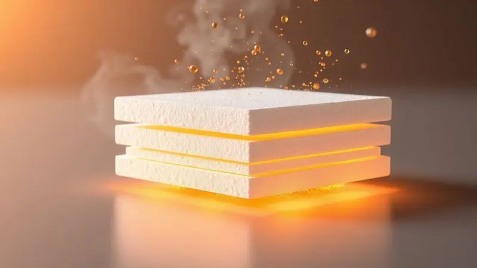
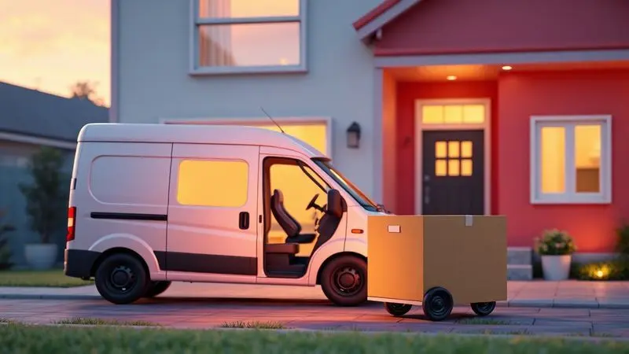

O mercado de dormitórios passou por uma revolução silenciosa que chegou em uma caixa. Imagine receber um colchão na sua porta, desembalá-lo como se fosse um presente e assistir ele ganhar vida diante dos seus olhos.

Essa conveniência dos 'colchões na caixa' é irresistível, mas você já parou para se perguntar: será que toda essa magia da compressão não esconde algum truque?

Será que aquele produto compacto que sai da caixa pode realmente oferecer o suporte ortopédico que suas costas merecem? Muita gente tem esse mesmo medo: a compressão danificar as molas, comprometer a densidade da espuma e, no fim, entregar noites cheias de dor.

A verdade é que essa tecnologia chegou para ficar, e hoje vamos desvendar como ela realmente funciona, por que você pode descansar tranquilo e quais são os modelos que valem cada centavo do seu investimento em sono.

<SummaryList products={frontmatter.top_products} />

## O que é o colchão embalado a vácuo (colchão na caixa)?

Pense naquela cena clássica: o colchão enorme que mal cabe na escada, a luta para passar pela porta, o suor derramado só para colocá-lo no quarto. Os colchões na caixa existem justamente para apagar essa memória de sua mente.

São modelos que passam por um processo de compressão e enrolamento, saindo da fábrica em um pacote surpreendentemente compacto. A mágica acontece quando você abre a embalagem: ele começa a respirar, a se expandir, voltando à sua forma original pronta para te receber.

Não é só uma questão de praticidade; é sobre receber a solução para suas noites de sono sem o estresse do transporte.

### Como funciona o processo de compressão?

Aqui está onde a engenhosidade se revela. O colchão é cuidadosamente enrolado e colocado em uma máquina que, basicamente, dá um grande suspiro nele, extraindo todo o ar do seu interior.

Esse vácuo criado reduz drasticamente seu volume, mas sem aplicar pressão destrutiva sobre os materiais internos. Pelo contrário, essa compressão atua como uma cápsula protetora: durante o transporte, o produto fica blindado contra pancadas, umidade e sujeira.

Quando você corta o plástico, o ar volta a preencher cada célula da espuma, cada mola ensacada. Em minutos, você testemunha o renascimento de um colchão completo, pronto para ser a base do seu descanso.

## Embalar a vácuo causa algum dano à estrutura do colchão?

É natural que esse pensamento cruze sua cabeça. Você está prestes a investir em algo que vai usar por anos, então é justo questionar se a compactação não deixa sequelas. A resposta tranquila é: não, quando feito da maneira correta.

Materiais de qualidade, como espumas de alta resiliência e os sistemas de molas ensacadas, são projetados justamente para passar por esse ciclo de compressão e expansão sem perder suas propriedades. Eles têm 'memória' da sua forma original.

A chave está em confiar em marcas que dominam essa tecnologia e seguir suas instruções simples de desembalagem.

Ao optar por um colchão embalado a vácuo de uma marca séria, você não está abrindo mão da durabilidade; está escolhendo a inteligência de um processo logístico que prioriza a integridade do produto até chegar em você.

## 1. Colchão Gel de Molas Ensacadas à Vácuo ViscoVitagel Max - Castor

<ProductBox 
  title={frontmatter.top_products[0].title} 
  image={frontmatter.top_products[0].image} 
  link={frontmatter.top_products[0].link} 
/>

Imagine dormir em uma nuvem que se molda perfeitamente ao contorno do seu corpo, dissipando o calor e oferecendo um suporte que parece feito sob medida. É essa sensação que o ViscoVitagel Max da Castor busca entregar.

Sua tecnologia de molas ensacadas age como milhares de pontos de apoio independentes, garantindo que o movimento do seu parceiro não se transforme em um terremoto no seu lado da cama.

Já a espuma viscoelástica com infusão de gel faz um trabalho duplo: primeiro, cede gentilmente aos seus pontos de pressão; segundo, regula a temperatura, evitando aquela sensação abafada em noites mais quentes.

É o tipo de colchão que parece entender exatamente o que você precisa.

<CaixaProsContras>

**Prós:**

- Sistema de molas ensacadas para suporte independente e mínima transferência de movimento

- Espuma viscoelástica com gel que se adapta anatomicamente e regula a temperatura

- Tecido com tratamento antiácaro e antifungo, ideal para alérgicos

- Embalagem a vácuo que elimina o transtorno do transporte tradicional

**Contras:**

- Perfil de firmeza classificado como macio, podendo não atender quem prefere algo mais firme

- Condições de garantia podem variar conforme os componentes específicos

</CaixaProsContras>

## 2. Colchão Enrolado à Vácuo Molas Ensacadas MasterPocket Night and Day - Probel

<ProductBox 
  title={frontmatter.top_products[1].title} 
  image={frontmatter.top_products[1].image} 
  link={frontmatter.top_products[1].link} 
/>

Para quem acredita que conforto e suporte robusto podem andar de mãos dadas, o MasterPocket Night and Day da Probel é uma declaração de princípios.

O diferencial começa com o Pillow Top Europeu, uma camada extra de aconchego que recebe seu corpo como um travesseiro macio e amplo, antes mesmo que as molas ensacadas entrem em ação para dar o suporte estrutural.

Essa combinação cria uma sensação de dormir 'sobre' o colchão, sem abrir mão de estar 'dentro' do conforto. Sim, após desembalá-lo, ele pode pedir algumas horas para que cada camada se assente completamente e alcance seu potencial máximo.

Mas considere isso como um breve período de aclimatação, um pequeno preço a pagar por noites de descanso profundamente revigorantes.

<CaixaProsContras>

**Prós:**

- Molas ensacadas individuais garantindo suporte pontual e isolamento de movimento

- Camada extra de maciez com o Pillow Top Europeu para conforto imediato

- Revestimento com tratamento antiácaro e antifungo, promovendo higiene

- Praticidade total com a embalagem a vácuo para entrega simplificada

**Contras:**

- Pode exigir algumas horas para expansão e acomodação total após a abertura

- O nível de firmeza, equilibrado pelo Pillow Top, pode não agradar a todos os perfis

</CaixaProsContras>

## 3. Colchão Herval de Espuma D33 Mega Firm Vácuo - Herval

<ProductBox 
  title={frontmatter.top_products[2].title} 
  image={frontmatter.top_products[2].image} 
  link={frontmatter.top_products[2].link} 
/>

Há pessoas que buscam no colchão uma base sólida, uma plataforma firme que ofereça segurança e alinhamento postural acima de tudo. Para esses perfis, o Herval de Espuma D33 é praticamente uma resposta direta.

A densidade D33 da espuma não é apenas um número; é a promessa de uma estrutura que não cede facilmente, projetada para suportar com dignidade. Ele é a escolha de quem tem um biótipo mais robusto ou simplesmente prefere a sensação de dormir 'em' algo, e não 'afundado'.

A versatilidade de poder virá-lo e usar ambos os lados é um detalhe inteligente que dobra sua vida útil potencial. É o colchão que não faz rodeios: entrega firmeza, durabilidade e a confiança de uma marca com história.

<CaixaProsContras>

**Prós:**

- Firmeza acentuada e suporte robusto, ideal para quem prioriza essa sensação

- Tecido com proteção antiácaro e antifungo para um ambiente de sono saudável

- Uso duplo (ambos os lados), ampliando significativamente sua durabilidade prática

- Respaldo de uma marca tradicional e consolidada no mercado

**Contras:**

- Período de garantia que varia consideravelmente (de 3 a 12 meses)

- Não é recomendado para quem tem preferência declarada por colchões macios ou médios

</CaixaProsContras>

## Qual o preço médio de um colchão a vácuo?

Ao explorar esse universo, você encontrará uma faixa de preço tão variada quanto as tecnologias disponíveis. A boa notícia é que a praticidade da embalagem a vácuo não cobra um 'pedágio' exorbitante.

Você encontrará modelos de entrada com preços bastante competitivos em relação aos colchões tradicionais, enquanto as opções premium, recheadas de tecnologias como memory foam, gel e sistemas avançados de molas, naturalmente ocupam uma faixa superior.

O valor real, porém, vai além da etiqueta. Considere-o como um investimento na qualidade do seu sono, na praticidade de recebê-lo em casa e na durabilidade que uma boa marca entrega.

Sempre priorize a relação entre o preço pago e as garantias, políticas de troca e, claro, as avaliações de quem já dormiu nele.

## Qual a melhor marca de colchão embalado a vácuo?

Tentar eleger uma única campeã nesse mercado é como querer definir o melhor sabor de sorvete: a resposta está inteiramente nos seus gostos e necessidades. Entre as opções que analisamos, cada uma brilha por uma razão diferente.

A Castor aposta na combinação inteligente de tecnologias de conforto adaptativo. A Probel se destaca pela camada extra de aconchego que convida ao descanso. A Herval atrai com a solidez e firmeza de sua construção.

A 'melhor' marca será aquela cuja proposta conversa diretamente com o que seu corpo pede e com o que sua rotina valoriza. O segredo é alinhar o perfil do produto ao seu perfil pessoal de sono.

### Benefícios para o consumidor e logística de entrega

A beleza dos colchões a vácuo se estende muito além do seu quarto, transformando toda a experiência de compra.

Para você, consumidor, significa fim das dificuldades: não precisa alugar uma van, recrutar amigos para ajudar ou se preocupar se o colchão vai passar pela porta. Ele chega em uma caixa manuseável, muitas vezes entregue diretamente no cômodo desejado.

Para o planeta e para as empresas, a logística fica mais inteligente e sustentável: menos viagens, menos combustível, menos embalagens volumosas e menos risco de danos durante o transporte.

É um modelo onde todos ganham: você ganha praticidade, o vendedor ganha eficiência e o produto chega protegido, pronto para se tornar o protagonista das suas noites bem dormidas.

## Conclusão

A jornada em busca do colchão ideal pode parecer cercada de dúvidas técnicas e medos infundados, especialmente quando a solução chega em uma caixa surpreendentemente compacta.

O que descobrimos, porém, é que a tecnologia do vácuo não é um atalho que compromete a qualidade; é uma evolução logística que preserva, e muitas vezes até protege, a integridade dos melhores materiais.

Seja você atraído pelo abraço adaptativo do viscoelástico, pela maciez acolhedora do pillow top ou pela segurança inabalável de uma espuma de alta densidade, existe um colchão na caixa pronto para atender sua busca por descanso.

Essa conveniência moderna elimina barreiras físicas e logísticas, mas não abre mão do essencial: suporte ortopédico, conforto duradouro e noites verdadeiramente reparadoras.

A revolução do dormitório não está apenas no que está dentro do colchão, mas em como ele chega até você. Agora, a decisão está em suas mãos. Que tal transformar a próxima noite em um convite para experimentar esse novo padrão de conforto e praticidade?

Seu futuro eu, bem descansado, agradecerá.