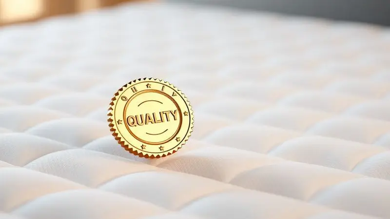
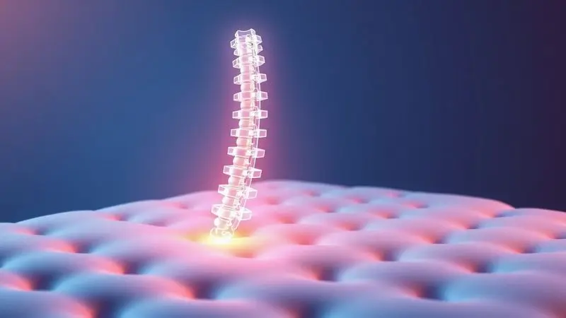
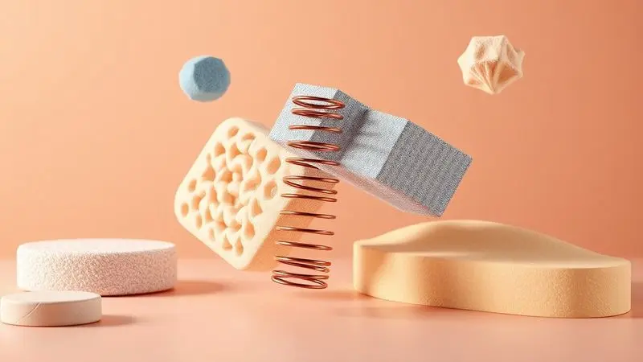

Imagine transformar aquela cama que parece mais uma obrigação do que um refúgio em um verdadeiro santuário de descanso. A marca Anjos conquistou seu espaço no mercado brasileiro justamente por entender que dormir bem vai muito além de deitar em uma superfície qualquer.

Se você está cansado de acordar com dores ou simplesmente procura elevar a qualidade do seu sono, este guia foi pensado para você.

Analisamos os modelos mais vendidos, desde os tecnológicos com vibromassagem até os clássicos de molas ensacadas e espuma D33, para ajudar você a fazer a escolha certa.

Descubra qual colchão Anjos pode finalmente trazer aquele descanso revigorante que sua coluna e sua mente tanto precisam.

<SummaryList products={frontmatter.top_products} />

## A Marca de Colchões Anjos é Boa?

Quando você pensa em investir em um colchão, surge aquela dúvida: será que a marca entrega o que promete? Com a Anjos, a resposta vai além das especificações técnicas.

O que realmente define essa marca é como ela une conhecimento ortopédico com tecnologia aplicada ao bem-estar. Não se trata apenas de materiais de qualidade, mas de uma compreensão real sobre como nosso corpo se comporta durante o sono.

Os colchões são projetados para oferecer suporte onde você mais precisa, aliviando pontos de pressão e criando um ambiente que respeita sua anatomia.

Os consumidores frequentemente relatam não apenas a redução de ruídos (aqueles rangidos incômodos desaparecem), mas principalmente a sensação de acordar mais descansado, com menos dores nas costas e nas articulações.

Claro, cada corpo responde de maneira única, e encontrar o modelo perfeito envolve entender suas necessidades específicas.

O que você pode esperar da Anjos é uma abordagem séria e dedicada ao seu descanso, com produtos que realmente fazem diferença na hora de fechar os olhos.

## Ranking dos 10 Melhores Colchões Anjos de 2024

Para ajudar você a navegar pelas opções e encontrar a combinação perfeita de conforto, suporte e tecnologia, organizamos os principais modelos em um ranking detalhado.

Cada um desses colchões foi analisado considerando não apenas suas especificações, mas como elas se traduzem em benefícios reais para sua noite de sono.

### 1. Colchão Magnético c/Vibro Massagem Commodite - Anjos

<ProductBox 
  title={frontmatter.top_products[0].title} 
  image={frontmatter.top_products[0].image} 
  link={frontmatter.top_products[0].link} 
/>

Se suas noites são marcadas por tensão muscular e aquela sensação de nunca conseguir relaxar completamente, este modelo pode ser a revolução que você busca.

O Commodite une vibromassagem com tecnologia magnética em uma proposta que vai além do simples descanso: é um convite ao relaxamento ativo.

Imagine controlar a intensidade da massagem diretamente pelo controle remoto, sentindo as vibrações trabalhando especificamente nas áreas mais rígidas do seu corpo enquanto você prepara o terreno para o sono.

Aqui, a tecnologia funciona em camadas: as molas ensacadas garantem que cada parte do seu corpo receba o suporte exato que precisa, como se o colchão entendesse seus contornos.

A espuma viscoelástica complementa esse cuidado, reduzindo pontos de pressão nos ombros e quadris. E o revestimento com proteção antiácaro e antifungo cria um ambiente saudável, livre de agentes que poderiam roubar a qualidade do seu descanso.

Para quem precisa de firmeza extra para manter a coluna alinhada, essa pode ser a combinação perfeita entre terapia e conforto.

<CaixaProsContras>

**Prós:**

- Sistema de vibro massagem que ajuda no relaxamento.

- Tecnologias que promovem alívio de tensões e melhor circulação.

- Molas ensacadas que oferecem suporte individual.

- Revestimento com proteção contra ácaros e fungos.

**Contras:**

- O conforto extra firme pode não ser ideal para todas as preferências.

- Alguns podem achar a adaptação inicial um pouco desconfortável.

</CaixaProsContras>

### 2. Colchão Magnético c/Vibro Massagem Confort - Anjos

<ProductBox 
  title={frontmatter.top_products[1].title} 
  image={frontmatter.top_products[1].image} 
  link={frontmatter.top_products[1].link} 
/>

Para quem acredita que dormir bem é uma forma de autocuidado, o modelo Confort apresenta uma proposta interessante.

Com oito cápsulas de vibromassagem estrategicamente posicionadas e ímãs que supostamente auxiliam na oxigenação sanguínea, ele aborda o descanso sob uma perspectiva holística.

A espuma Rabatan e a base em Poliestireno Expandido trabalham juntas para criar uma superfície que acolhe sem afundar, com tratamento especial que mantém ácaros e fungos bem longe do seu espaço pessoal.

É verdade que os benefícios terapêuticos dos colchões magnéticos ainda são discutidos na literatura científica, mas muitos usuários relatam sensação de relaxamento mais profundo e alívio de dores musculares.

Importante considerar: se você utiliza marca-passo ou tem dispositivos médicos implantados, consulte seu médico antes da compra.

Para os demais, trata-se de uma experiência diferenciada que suporta até 120 kg por pessoa e vem com garantia de 24 meses, um investimento em noites mais tranquilas.

<CaixaProsContras>

**Prós:**

- Tecnologia de vibro massagem que alivia tensões musculares.

- Ímãs que podem auxiliar na circulação sanguínea.

- Tratamento antiácaro, antibacteriano e antifúngico.

- Disponível em vários tamanhos, adaptando-se a diferentes necessidades.

**Contras:**

- Eficácia terapêutica ainda discutível na literatura científica.

- Não recomendado para pessoas com marca-passo ou dispositivos implantados sem consulta médica.

</CaixaProsContras>

### 3. Colchão Molas Superlastic King Best - Anjos

<ProductBox 
  title={frontmatter.top_products[2].title} 
  image={frontmatter.top_products[2].image} 
  link={frontmatter.top_products[2].link} 
/>

Às vezes, o que você precisa não são dezenas de tecnologias complexas, mas sim da combinação perfeita entre firmeza e aconchego. É aqui que o King Best brilha.

Utilizando o sistema Superlastic de molas, que pode vir em fio contínuo ou em versão ensacada, ele cria uma base de suporte que se adapta ao seu corpo sem perder a estabilidade.

Imagine deitar e sentir que a superfície "entende" seus pontos de pressão, enquanto mantém sua coluna perfeitamente alinhada.

O estofamento em espuma D28 e o Pillow Top Europeu adicionam camadas de conforto que transformam o deitar em um verdadeiro abraço. O tratamento antiácaro e antifungo opera nos bastidores, protegendo sua saúde enquanto você descansa.

Com capacidade para 130 kg por pessoa e um design ecologicamente correto, ele prova que sustentabilidade e conforto podem caminhar juntos, oferecendo um valor excepcional pelo investimento.

<CaixaProsContras>

**Prós:**

- Sistema de molas que proporciona bom suporte

- Estofamento em espuma D28 para conforto extra

- Tratamento antiácaro e antifungo

- Design ecologicamente correto

**Contras:**

- Peso máximo suportado de 130 kg pode ser limitante para alguns

- Variação de altura entre os modelos

</CaixaProsContras>

### 4. Colchão Molas Ensacadas MasterPocket Versalhes - Anjos

<ProductBox 
  title={frontmatter.top_products[3].title} 
  image={frontmatter.top_products[3].image} 
  link={frontmatter.top_products[3].link} 
/>

Para quem divide a cama e cansa de acordar cada vez que o parceiro se mexe, o Versalhes apresenta uma solução elegante.

Suas molas ensacadas MasterPocket funcionam como pequenos sistemas independentes: cada uma responde apenas ao peso que recebe, isolando completamente os movimentos. O resultado?

Você pode se virar à vontade durante a noite sem que isso se torne um alerta para quem está ao seu lado.

Com 138x188x32 cm e um Pillow Top Americano, ele oferece espaço generoso e um toque premium. A espuma Hiper Soft com camada D33 proporciona uma firmeza classificada como macia, ideal para quem gosta de sentir o colchão se moldando suavemente ao corpo.

A certificação pelo INMETRO e Abicol garante que você está levando para casa um produto que passou pelos mais rigorosos controles de qualidade, mesmo que a capacidade de 120 kg por pessoa possa ser uma consideração importante para alguns perfis.

<CaixaProsContras>

**Prós:**

- Design que se adapta ao corpo, melhorando o alinhamento da coluna.

- Revestimento em malha de alta qualidade com tratamento antiácaro e antifungo.

- Boa firmeza com espuma Hiper Soft, ideal para quem gosta de colchões macios.

- Certificações de qualidade que garantem segurança.

**Contras:**

- Suporta até 120 kg por pessoa, o que pode ser um ponto negativo para alguns.

- A garantia varia conforme o vendedor, podendo ser confusa.

</CaixaProsContras>

### 5. Colchão Molas Ensacadas Látex Impressione Visco - Anjos

<ProductBox 
  title={frontmatter.top_products[4].title} 
  image={frontmatter.top_products[4].image} 
  link={frontmatter.top_products[4].link} 
/>

Se você já experimentou a sensação única do látex natural, sabe que há algo quase terapêutico na maneira como ele combina sustentação com maciez.

O Impressione Visco eleva essa experiência ao unir látex com espuma viscoelástica, criando um ambiente que parece feito sob medida para seu corpo.

As propriedades antimicrobianas do látex trabalham silenciosamente para manter seu espaço de descanso saudável, enquanto as molas ensacadas garantem que nenhum movimento seu perturbe o sono do parceiro.

O revestimento em malha de alta qualidade e o possível Pillow Top Europeu são detalhes que fazem diferença no dia a dia, transformando o simples ato de deitar em um ritual de prazer.

Embora possa levar alguns dias para seu corpo se adaptar completamente à nova firmeza (suporta até 180 kg por pessoa), essa transição geralmente culmina em noites significativamente mais reparadoras, onde você acorda sentindo que realmente descansou.

<CaixaProsContras>

**Prós:**

- Conforto com camadas de espuma viscoelástica e látex

- Molas ensacadas que reduzem a transferência de movimento

- Revestimento durável e toque suave

- Design que promove um ambiente saudável para dormir

**Contras:**

- Adaptação inicial pode levar alguns dias

- Peso máximo suportado pode ser um limitador para algumas pessoas

</CaixaProsContras>

### 6. Colchão Molas Ensacadas MasterPocket Classic Clean - Anjos

<ProductBox 
  title={frontmatter.top_products[5].title} 
  image={frontmatter.top_products[5].image} 
  link={frontmatter.top_products[5].link} 
/>

Na busca pelo equilíbrio perfeito entre liberdade de movimento e suporte estruturado, o Classic Clean se destaca como uma escolha inteligente.

Seu tampo em malha suave permite que você mude de posição naturalmente durante a noite, sem a sensação de estar "presa" ao colchão.

Enquanto isso, o sistema MasterPocket de molas ensacadas atua nos bastidores, garantindo que cada parte do seu corpo receba atenção individualizada.

A estrutura interna com EPS oferece isolamento térmico, e o tratamento Actigard forma uma barreira invisível contra ácaros, bactérias e fungos.

Com firmeza intermediária e capacidade para 120 kg por pessoa, ele se apresenta em várias alturas (22cm, 26cm e 30cm) para se adaptar ao seu gosto pessoal.

Apenas note que a versão de 22cm pode não incluir a PRA® Placa Rígida Anjos, mas mesmo assim cumpre brilhantemente sua função de garantir noites tranquilas.

<CaixaProsContras>

**Prós:**

- Conforto individualizado com sistema de molas ensacadas.

- Proteção contra ácaros, bactérias e fungos.

- Disponibilidade em diferentes alturas.

- Design que favorece a livre movimentação.

**Contras:**

- A opção de 22cm pode não incluir a base mais robusta.

- O peso máximo suportado pode ser limitante para algumas pessoas.

</CaixaProsContras>

### 7. Colchão Molas Superlastic Classic Brown - Anjos

<ProductBox 
  title={frontmatter.top_products[6].title} 
  image={frontmatter.top_products[6].image} 
  link={frontmatter.top_products[6].link} 
/>

Há uma beleza simples em produtos que fazem exatamente o que prometem, sem complicações desnecessárias.

O Classic Brown personifica essa filosofia: com molas contínuas Superlastic que oferecem suporte firme e duradouro, combinadas com espumas D70 e D26 que criam o acolhimento ideal. O Pillow Top Europeu é o carinho extra que transforma o deitar em um momento especial.

Para quem sofre com alergias, o tratamento antiácaro e antialérgico pode significar noites inteiras sem espirros ou coceiras. A tecnologia "No Turn" elimina aquela tarefa chata de virar o colchão periodicamente, simplificando sua rotina.

Com suporte para 130 kg por pessoa, ele atende à maioria dos usuários, embora sua altura de 22 cm possa não satisfazer quem prefere colchões mais altos e imponentes na cama.

<CaixaProsContras>

**Prós:**

- Conforto excelente com camada Pillow Top

- Tratamento antiácaro e antialérgico

- Estrutura firme e durável

- Tecnologia "No Turn", facilitando a manutenção

**Contras:**

- Altura de 22 cm pode não agradar a todos

- Suporte máximo de 130 kg por pessoa

</CaixaProsContras>

### 8. Colchão Molas Ensacadas Visco Gel Richesse - Anjos

<ProductBox 
  title={frontmatter.top_products[7].title} 
  image={frontmatter.top_products[7].image} 
  link={frontmatter.top_products[7].link} 
/>

Você já passou por aquelas noites onde fica alternando entre sentir calor e frio, sem nunca encontrar a temperatura ideal?

O Richesse aborda diretamente esse desafio com sua camada de espuma Visco Gel, que não apenas regula a temperatura como também alivia pontos de pressão e melhora a circulação.

As molas ensacadas garantem que cada movimento seu seja absorvido individualmente, criando uma experiência quase privada mesmo compartilhando a cama.

O tecido de alta qualidade oferece um toque que convida ao descanso, enquanto os tratamentos contra ácaros e fungos trabalham para manter seu santuário do sono impecavelmente limpo.

Com firmeza classificada entre intermediária e macia, ele é perfeito para quem valoriza o aconchego sem abrir mão do suporte adequado para a coluna. Se você busca conforto térmico inteligente, essa pode ser sua resposta.

<CaixaProsContras>

**Prós:**

- Sistema de molas ensacadas que evita a transferência de movimento.

- Camada de espuma Visco Gel para conforto térmico.

- Tratamentos antiácaro e antifungo para maior higiene.

- Disponível em diversas opções de medidas.

**Contras:**

- Firmeza pode ser considerada macia demais para alguns.

- Pode ter um valor acima da média em comparação a colchões convencionais.

</CaixaProsContras>

### 9. Colchão Anatômico de Magnum - Anjos

<ProductBox 
  title={frontmatter.top_products[8].title} 
  image={frontmatter.top_products[8].image} 
  link={frontmatter.top_products[8].link} 
/>

Para quem precisa de uma base sólida que não ceda com o tempo, o Magnum apresenta uma construção inteligente em dupla face.

A combinação de espumas D70 e D28 cria um equilíbrio preciso entre firmeza e maciez, como se o colchão entendesse quando seu corpo precisa de apoio e quando precisa de acolhimento.

O revestimento em malha no tampo e suede na lateral oferece um toque sofisticado que agrada aos sentidos.

Com Pillow Top para conforto extra e capacidade para 140 kg, ele é particularmente interessante para casais ou pessoas com peso mais elevado que buscam durabilidade.

Seu nível de conforto mais firme pode não agradar a todos, mas para quem tem problemas posturais ou simplesmente prefere sentir-se "apoiado" em vez de "afundado", essa característica se transforma em vantagem.

Disponível em vários tamanhos, ele se adapta naturalmente ao seu espaço e às suas necessidades.

<CaixaProsContras>

**Prós:**

- Combinação de espumas de alta qualidade para conforto ideal.

- Construção de dupla face aumenta a durabilidade.

- Pillow Top para conforto adicional.

- Diversas opções de tamanhos disponíveis.

**Contras:**

- Nível de firmeza pode não agradar a todos os usuários.

- É necessário verificar a compatibilidade com a cama usada.

</CaixaProsContras>

### 10. Colchão Espuma D33 Orthosono Double Face - Anjos

<ProductBox 
  title={frontmatter.top_products[9].title} 
  image={frontmatter.top_products[9].image} 
  link={frontmatter.top_products[9].link} 
/>

Quando a prioridade é manter sua coluna perfeitamente alinhada, noite após noite, a espuma D33 do Orthosono oferece a firmeza estável que muitos procuram. Com capacidade para 140 kg por pessoa, ele transmite segurança desde o primeiro contato.

O tratamento antiácaro e antifungo não é apenas um detalhe técnico, mas um cuidado genuíno com sua saúde respiratória, especialmente importante para quem sofre com alergias.

A dupla face é um trunfo inteligente: basicamente, você tem dois colchões em um, podendo alternar os lados para prolongar significativamente a vida útil do produto.

Essa firmeza característica, que alguns podem achar excessiva, é justamente o que garante uma postura correta durante todo o seu descanso.

Para quem valoriza longevidade e suporte ortopédico acima de tudo, essa escolha representa investimento em anos de noites bem dormidas.

<CaixaProsContras>

**Prós:**

- Tratamento antiácaro e antifungo que promove saúde durante o sono.

- Dupla face aumenta a durabilidade do colchão.

- Suporte firme ideal para postura correta.

- Disponível em várias medidas, atendendo diferentes necessidades.

**Contras:**

- Firmeza pode não agradar a todos; pessoas que preferem colchões macios podem achar desconfortável.

- Os tecidos podem não ser tão respiráveis como modelos mais caros.

</CaixaProsContras>

## Qual é o melhor colchão Anjos para a coluna?

A resposta não é única, porque sua coluna tem necessidades tão particulares quanto sua digital. O conceito crucial aqui é "alinhamento": durante o sono, sua coluna precisa manter sua curva natural, sem torções nem compressões inadequadas.

Os colchões Anjos que mais se destacam nesse aspecto são justamente aqueles que entendem essa individualidade.

A tecnologia de molas ensacadas, presente em vários modelos, permite que cada segmento da sua coluna receba o suporte exato que precisa, como se o colchão conversasse diretamente com suas vértebras.

Modelos com espumas de densidade elevada (como D33 ou D28) oferecem a resistência necessária para evitar que regiões como a lombar afundem excessivamente.

Já os que combinam firmeza com camadas de conforto (como os Pillow Top) criam um equilíbrio delicado: sustentação onde é preciso, acolhimento onde é desejado.

A verdade é que o melhor colchão para sua coluna é aquele que, após algumas noites de adaptação, faz você esquecer que tem uma coluna - porque simplesmente não dói mais ao acordar.

## Como escolher o colchão Anjos ideal para o seu perfil?

Escolher um colchão é como encontrar um parceiro de dança: precisa haver sintonia, resposta aos seus movimentos e confiança no suporte.

Comece observando como você dorme: se você é dos que dormem de lado, procure modelos que ofereçam alívio específico para ombros e quadris, evitando que essas áreas fiquem comprimidas.

Para os que preferem dormir de costas, o foco deve ser na manutenção do alinhamento lombar, sem que a pelve afunde demais.

Sua sensibilidade térmica também importa: se você costuma sentir calor durante a noite, tecnologias como o Visco Gel podem fazer toda diferença.

O peso corporal é outro fator decisivo - não apenas pelo limite de suporte, mas porque influencia diretamente na firmeza ideal para você.

E não subestime o poder de experimentar: se possível, teste diferentes modelos, deite em várias posições, imagine acordar naquela superfície. Seu corpo sabe, melhor que qualquer especificação técnica, onde ele se sente verdadeiramente em casa.

## Conclusão

Investir em um colchão Anjos vai muito além de trocar um móvel: é redesenhar sua relação com o descanso.

Ao longo deste guia, você descobriu que cada modelo apresenta uma personalidade distinta, desde os tecnológicos com vibromassagem que transformam a hora de dormir em terapia, até os clássicos de molas ensacadas que garantem privacidade de movimento em casais.

O que une todas essas opções é o compromisso com um princípio simples, porém profundo: seu sono merece ser tratado com a mesma seriedade que qualquer outro aspecto da sua saúde.

Sua escolha final dependerá de como você responde a algumas perguntas essenciais: Você prioriza firmeza ortopédica ou conforto acolhedor? Prefere tecnologias ativas ou a simplicidade eficiente? Divide a cama ou dorme sozinho?

Cada uma dessas respostas aponta para um modelo específico dentro do universo Anjos. Lembre-se que um bom colchão não é um gasto, mas um investimento em anos de acordar revigorado, sem dores, pronto para enfrentar seus dias com energia renovada.

Agora que você tem todas as informações, está pronto para dar o próximo passo em direção a noites que realmente restaurarão seu corpo e sua mente.