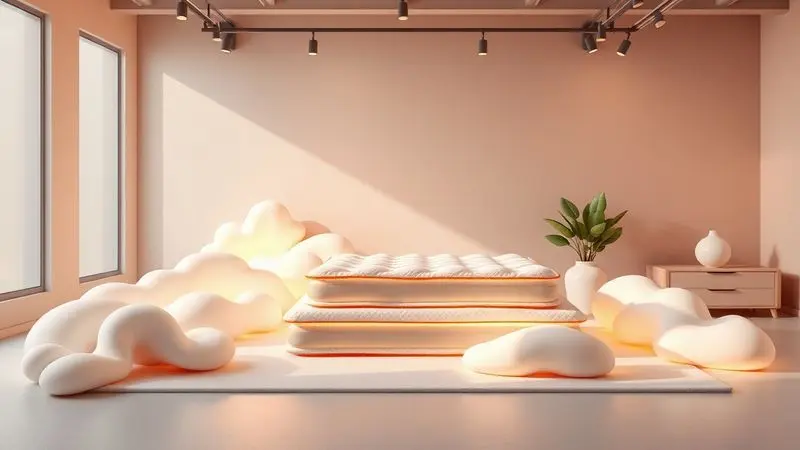
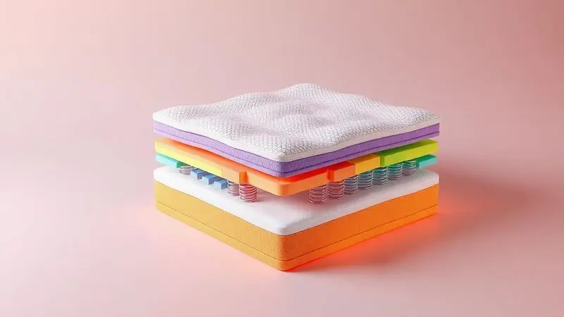
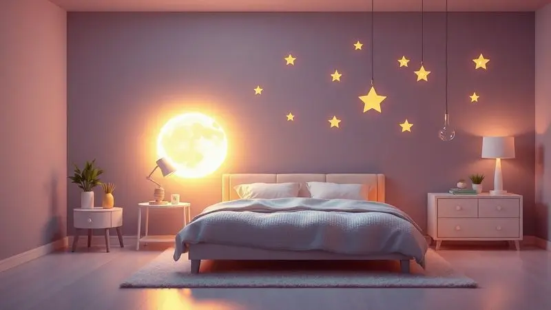
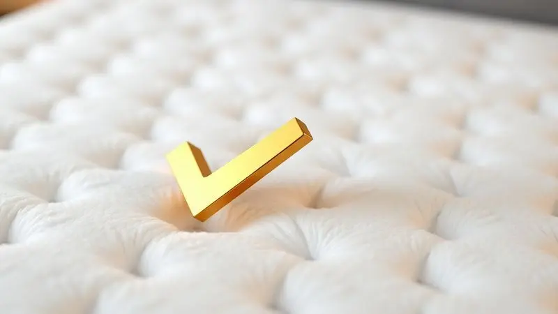

Escolher um colchão novo é uma daquelas decisões que ecoam na sua rotina por anos. Afinal, é onde você recarrega as energias, processa o dia e, quando tudo vai bem, encontra aquele sono profundo e reparador.

No vasto mercado brasileiro, a Anjos Colchões se destaca como uma marca que transformou décadas de experiência em inovação constante, sempre com um pé na tradição e outro nas tecnologias mais recentes.

Mas com tantas opções, desde as mais populares até os modelos premium como King Best e Cripton, como saber se o investimento realmente vale a pena em 2025?

Nós mergulhamos fundo na reputação da marca, analisamos materiais, feedback de clientes e, claro, o tão importante custo-benefício para trazer respostas claras.

<SummaryList products={frontmatter.top_products} />

## A marca Anjos Colchões

Imagine uma empresa que nasceu da necessidade simples de proporcionar noites melhores para as pessoas.

Essa é a essência da Anjos Colchões, uma marca nacional que conquistou seu espaço não apenas pela presença em diversas regiões do Brasil, mas pelo compromisso visceral com a durabilidade e o conforto.

O que diferencia a Anjos é a obsessão por detalhes: desde as espumas de alta densidade que mantêm a estrutura por anos até as molas ensacadas que trabalham de forma independente para garantir que seu descanso não seja perturbado.

É uma marca que entende que um colchão não é apenas um móvel, mas um aliado silencioso do seu bem-estar.

## Principais características dos colchões Anjos

A experiência do sono com um colchão Anjos começa com uma sensação de acolhimento inteligente. As camadas de espuma não apenas aliviam a pressão nas articulações, mas se moldam ao seu corpo de forma tão natural que você esquece que está deitado em uma superfície firme.

A tecnologia das molas pocket é como ter centenas de pequenos amortecedores trabalhando em sinergia, cada um respondendo apenas ao peso sobre ele.

Isso significa que você pode se virar à noite sem que o movimento ecoe pelo lado da cama, um alívio para quem divide o leito.

E há ainda o cuidado com o clima do seu sono. Os tecidos respiráveis atuam como um sistema de ventilação natural, evitando o acúmulo de calor e umidade que transformam a cama em um forno às 3 da manhã.

Seja você alguém que busca firmeza ortopédica ou prefere afundar levemente em um abraço macio, a variedade de opções mostra que a Anjos não fabrica apenas colchões, mas sim soluções personalizadas para diferentes histórias de sono.

## Conheça as linhas de colchão Anjos

Pensar nas linhas da Anjos é como explorar uma coleção criada para diferentes personalidades do sono. Cada linha carrega uma identidade própria, equilibrando materiais, tecnologias e, principalmente, a promessa de despertar renovado.

Da sofisticação da Diamante à acessibilidade da Bronze, há um caminho traçado para quem valoriza o suporte clínico, o conforto luxuoso ou a versatilidade do dia a dia.

### Linha Diamante

Para quem busca o que há de mais refinado na experiência do descanso, a Linha Diamante representa o ápice da tecnologia e do conforto.

Imagine se deitar em camadas de espuma viscoelástica ou látex que não apenas acompanham suas curvas, mas respondem à sua temperatura corporal, criando um apoio personalizado a cada movimento.

É a escolha para quem não negocia qualidade e entende que a cama é o centro do seu santuário de descanso, especialmente pensando na harmonia de casais, onde a transferência de movimento se torna praticamente imperceptível.

### Linha Ouro

Versatilidade que se traduz em conforto para diferentes corpos e hábitos de sono.

Os colchões da Linha Ouro foram projetados para oferecer aquele equilíbrio sutil entre firmeza e aconchego, aliviando pontos de pressão nas costas e ombros sem que você tenha a sensação de estar deitado em uma superfície rígida.

Os materiais foram selecionados para durar, transformando seu investimento em anos de noites tranquilas, seja você alguém que precisa de um apoio mais estruturado ou busca apenas uma suave amortecimento ao final do dia.

### Linha Prata

Uma das escolhas mais populares entre quem descobre que um bom sono não precisa custar uma fortuna.

A construção em espuma de alta resiliência se adapta ao seu corpo com uma inteligência que surpreende, distribuindo o peso de forma uniforme para aliviar a tensão acumulada.

O tecido antitranspirante funciona como um respiro constante durante a noite, mantendo a temperatura estável e evitando aquela sensação abafada que interrompe o sono profundo.

É a opção ideal para quem sofre com desconfortos nas costas e busca uma solução acessível e eficaz.

### Linha Bronze

O equilíbrio perfeito entre custo e qualidade, projetado para quem busca um colchão que ofereça firmeza sem sacrificar o aconchego. A estrutura inteligente se adapta ao seu corpo, proporcionando o apoio necessário para a coluna enquanto mantém uma sensação acolhedora.

A durabilidade aqui não é um acidente, mas uma consequência da escolha de materiais que resistem ao tempo, garantindo que seu investimento continue proporcionando noites reparadoras por anos.

### Linha Saúde

Quando o sono se torna uma extensão do cuidado com o corpo, a Linha Saúde entra em cena com foco específico no suporte ortopédico.

Projetada para alinhar a postura durante o descanso, ela trabalha na prevenção de dores nas costas e desconfortos que surgem de uma noite mal dormida.

A ventilação inteligente do material evita o acúmulo de umidade e calor, criando um ambiente saudável que beneficia especialmente quem busca aliar conforto a um cuidado ativo com o bem-estar físico.

## Análise dos Melhores Colchões Anjos de 2025

Em 2025, os melhores colchões Anjos não são apenas produtos, mas reflexos de anos de pesquisa em torno de uma pergunta simples: como fazer alguém dormir melhor?

A resposta se materializa em modelos que equilibram tecnologias inovadoras com um entendimento profundo das necessidades humanas, sempre com um compromisso inegociável com a qualidade dos materiais.

### Colchão Anjos King Best

<ProductBox 
  title={frontmatter.top_products[0].title} 
  image={frontmatter.top_products[0].image} 
  link={frontmatter.top_products[0].link} 
/>

Para quem enxerga o conforto como uma experiência tecnológica, o King Best é uma declaração de princípios.

O sistema de molas ensacadas individualmente funciona como uma rede de suporte personalizada, ajustando-se aos seus contornos de forma tão precisa que reduz drasticamente qualquer transferência de movimento, uma benção para casais com ritmos de sono diferentes.

Com uma classificação entre intermediário e firme, ele oferece aquele abraço seguro da espuma D28 sem afundar demais, enquanto o tecido de malha premium mantém o calor sob controle durante a noite inteira.

Os tratamentos antiácaro e antimofo criam um ambiente mais saudável para o descanso, especialmente importante para quem sofre com alergias.

Embora o design não seja reversível, essa simplicidade se traduz em menos preocupação com manutenção, deixando você focar apenas em desfrutar de noites cada vez melhores.

<CaixaProsContras>

**Prós:**

- Molas ensacadas que se adaptam ao corpo

- Boa combinação de firmeza e conforto

- Tecido de malha premium para conforto térmico

- Tratamentos antiácaro promovem um ambiente de sono saudável

**Contras:**

- Design não reversível pode limitar a durabilidade

- Pode ser considerado um pouco pesado para movimentação

</CaixaProsContras>

### Colchão Anjos Black Graphite

<ProductBox 
  title={frontmatter.top_products[1].title} 
  image={frontmatter.top_products[1].image} 
  link={frontmatter.top_products[1].link} 
/>

Quem busca sofisticação visual aliada a um desempenho de alto nível encontra no Black Graphite uma proposta intrigante.

As molas ensacadas individualmente oferecem um suporte tão preciso que parece que o colchão foi moldado especificamente para o seu corpo, minimizando completamente aquela desconfortável transferência de movimento entre parceiros.

O revestimento em malha com faixas de poliéster e o estofamento em espuma AG70 criam uma experiência tátil diferenciada, agradável desde o primeiro toque.

A base em Poliestireno Expandido (EPS) atua como uma barreira térmica inteligente, enquanto o tratamento Actigard mantém ácaros e fungos bem longe do seu espaço de descanso.

Com capacidade para suportar até 130 kg por pessoa, ele oferece uma robustez que justifica completamente o investimento em qualidade e conforto.

<CaixaProsContras>

**Prós:**

- Molas ensacadas que oferecem suporte individualizado.

- Tratamento Actigard que previne ácaros e fungos.

- Boa durabilidade e conforto garantidos pela qualidade dos materiais.

- Certificação do Inmetro, indicando padrão de segurança e qualidade.

**Contras:**

- Pode ter um preço um pouco mais alto em relação a colchões básicos.

- Algumas avaliações ainda são limitadas devido à nova introdução no mercado.

</CaixaProsContras>

### Colchão Anjos Ortoline

<ProductBox 
  title={frontmatter.top_products[2].title} 
  image={frontmatter.top_products[2].image} 
  link={frontmatter.top_products[2].link} 
/>

A resposta da Anjos para quem precisa de firmeza sem comprometer o conforto. Construído com uma combinação inteligente de espumas D70 e D28, o Ortoline oferece uma resistência ao peso que inspira segurança, especialmente projetado para usuários de até 120kg.

A possibilidade de alguns modelos serem duplos face adiciona uma camada extra de praticidade, prolongando a vida útil do investimento.

O tratamento antiácaro e antibacteriano transforma o cuidado com a higiene em uma característica intrínseca do produto, enquanto a certificação do INMETRO funciona como um selo de garantia silencioso.

Perfeito para quem busca apoio ortopédico eficiente, ele entrega a firmeza que alinha a coluna sem se esquecer de que também é preciso relaxar.

<CaixaProsContras>

**Prós:**

- Conforto firme e suporte adequado para biotipos maiores

- Tecido com tratamento antiácaro e antibacteriano

- Certificação do INMETRO que garante qualidade

- Opção de uso dos dois lados em alguns modelos

**Contras:**

- Firmeza pode não agradar quem prefere colchões mais macios

- Variedade de modelos pode ser confusa para alguns compradores

</CaixaProsContras>

### Colchão Anjos Cripton

<ProductBox 
  title={frontmatter.top_products[3].title} 
  image={frontmatter.top_products[3].image} 
  link={frontmatter.top_products[3].link} 
/>

O casamento perfeito entre tecnologia de ponta e conforto intuitivo. O sistema de molas ensacadas trabalha de forma independente, garantindo que seu lado da cama seja um território exclusivo de descanso, livre de interrupções.

O pillow top em Visco Gel é aquela camada extra de inteligência que se adapta ao seu corpo, aliviando pontos de pressão e mantendo uma temperatura agradável que acompanha você da meia-noite ao amanhecer.

Com firmeza intermediária proporcionada pela espuma D28, ele equilibra suporte e aconchego com uma maestria que atende diferentes biotipos.

O tratamento antialérgico e a durabilidade comprovada, geralmente acompanhada de 12 meses de garantia, transformam o Cripton em uma escolha que oferece tranquilidade tanto na compra quanto nas centenas de noites seguintes.

<CaixaProsContras>

**Prós:**

- Sistema de molas ensacadas que oferece suporte individual.

- Camada superior em Visco Gel que alivia pontos de pressão.

- Tratamento antialérgico para um ambiente saudável.

- Durabilidade garantida com qualidade certificada.

**Contras:**

- Pode não ser ideal para quem busca um colchão extremamente macio ou firme.

- Limitado a uma capacidade de peso de 120 kg por pessoa.

</CaixaProsContras>

### Colchão Anjos Comfortable

<ProductBox 
  title={frontmatter.top_products[4].title} 
  image={frontmatter.top_products[4].image} 
  link={frontmatter.top_products[4].link} 
/>

O nome já entrega a proposta: conforto como missão principal. O sistema de molas Masterpocket representa um avanço onde cada mola envolta individualmente cria uma experiência de sono praticamente silenciosa, perfeita para casais que valorizam a harmonia noturna.

Com classificação de médio a macio, ele se adapta a diferentes preferências, sempre com aquele toque extra de aconchego proporcionado pela camada adicional de espuma.

O tecido de malha premium adiciona uma sensação refrescante ao toque, enquanto os tratamentos antiácaros e antialérgicos cuidam da saúde do seu sono.

Embora exija rotação mensal para manter sua durabilidade ideal, essa pequena manutenção é um preço justo a pagar por noites consistentemente confortáveis.

<CaixaProsContras>

**Prós:**

- Sistema de molas Masterpocket que proporciona conforto individualizado.

- Tecido de malha premium que oferece suavidade e sensação refrescante.

- Camada de espuma que melhora o conforto sem necessidade de virar.

- Tratamentos antiácaros e antialérgicos que beneficiam a saúde.

**Contras:**

- A manutenção regular com a rotação mensal pode ser um inconveniente.

- O modelo é de uso unicamente em um lado, o que pode limitar opções para algumas pessoas.

</CaixaProsContras>

## Qual a reputação da Anjos no Reclame Aqui?

Uma marca se revela não apenas nos produtos que cria, mas na maneira como responde quando as coisas não saem como planejado. No Reclame Aqui, a Anjos demonstra uma postura proativa que vai além da simples resolução de problemas.

A maioria das reclamações gira em torno de questões logísticas e atendimento ao cliente, áreas onde a empresa mostra um compromisso visível com respostas rápidas e soluções concretas.

O que mais chama atenção, porém, é o coro de elogios à durabilidade e ao conforto dos colchões, comentários que surgem mesmo em meio a eventuais problemas de entrega.

Essa capacidade de manter a confiança dos consumidores mesmo diante de contratempos fala mais alto sobre a relação da marca com seus clientes: trata-se de uma parceria de longo prazo, onde o produto final justifica o caminho percorrido.

## Como escolher o melhor colchão Anjos?

Selecionar o colchão certo é uma conversa íntima com seu próprio corpo. Comece entendendo como você dorme: de costas, de lado ou de bruços? Cada posição pede um tipo diferente de firmeza que a Anjos oferece em suas diversas linhas.

Observe os materiais com cuidado, pois a diferença entre espuma e mola não é apenas técnica, mas sensorial, afetando diretamente como seu corpo relaxa durante a noite.

Pense no longo prazo. Um colchão é um investimento que deve durar anos, então considere não apenas o conforto imediato, mas como os materiais envelhecerão com você.

Se possível, permita-se experimentar pessoalmente, pois nenhuma descrição substitui a sensação de se deitar e perceber que ali, finalmente, você encontrou o lugar perfeito para descansar.

## Análise final: Colchão Anjos é Bom? Vale a pena?

Quando as avaliações técnicas convergem com a experiência de milhares de usuários, a resposta se torna clara: sim, os colchões Anjos representam um investimento que vale a pena.

A combinação entre conforto que se adapta ao seu corpo e suporte que cuida da sua postura cria uma experiência de sono que transcende a simples aquisição de um produto.

A durabilidade consistentemente elogiada transforma o valor pago em anos de noites reparadoras, um retorno difícil de quantificar, mas fácil de sentir ao acordar renovado.

## FAQ: Perguntas frequentes sobre Colchão Anjos

Na jornada para encontrar o colchão ideal, algumas dúvidas surgem com frequência. Quanto tempo dura um colchão Anjos? Com manutenção adequada, você pode esperar anos de desempenho consistente, graças à qualidade dos materiais escolhidos. E o alívio de pressão?

É justamente onde a marca mais se destaca, usando tecnologias que distribuem seu peso uniformemente para proporcionar um sono verdadeiramente restaurador.

Os materiais variam conforme a linha, mas todos seguem um padrão de qualidade que atende desde quem busca firmeza ortopédica até quem prefere o aconchego de uma superfície mais acolhedora.

## Conclusão

Escolher um colchão é escolher como você quer se sentir ao despertar todos os dias, pelos próximos anos. A Anjos Colchões entende essa responsabilidade e responde com uma gama de produtos que transformam especificações técnicas em benefícios reais para seu descanso.

Desde as linhas básicas que entregam conforto acessível até os modelos premium onde cada detalhe foi pensado para maximizar sua experiência noturna, há uma proposta para cada necessidade e orçamento.

A reputação sólida no Reclame Aqui e o compromisso com materiais duráveis completam o cenário de uma marca que não apenas vende colchões, mas cultiva relacionamentos de confiança com quem busca noites melhores.

Agora, com todas as informações em mãos, você está pronto para dar o próximo passo em direção ao sono que sempre mereceu. Que tal experimentar pessoalmente e descobrir qual modelo da Anjos foi feito para você?