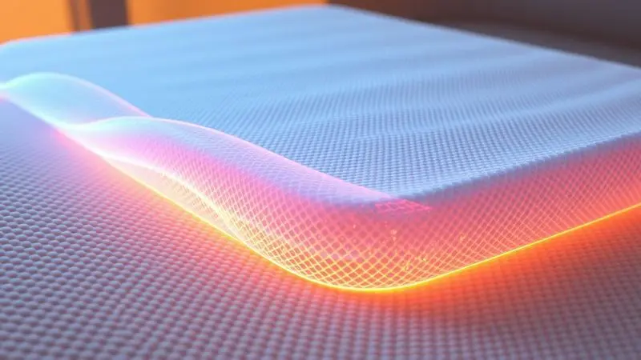
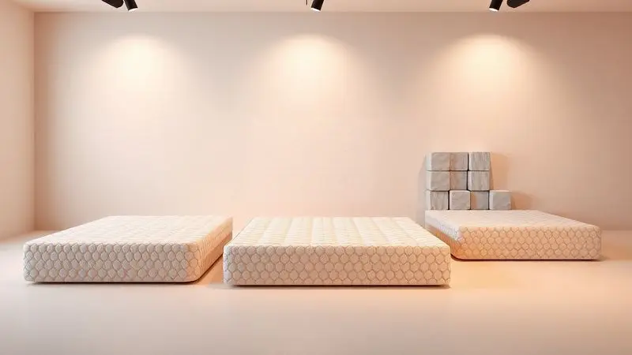

Imagine aquela sensação no peito cada vez que você precisa ajustar a posição de alguém que depende totalmente de você. A preocupação constante com cada ponto de pressão, cada área da pele que parece mais vulnerável.

Não é apenas sobre conforto, é sobre evitar que pequenos desconfortos se transformem em problemas graves que comprometem a dignidade e a saúde. A escolha do colchão torna-se então não um detalhe, mas uma decisão que muda a qualidade de cada dia.

Neste guia, você vai descobrir como um colchão anti-escaras pode ser essa ferramenta que transforma cuidado em proteção eficaz, oferecendo desde os princípios básicos até a escolha perfeita para seu caso específico.

<SummaryList products={frontmatter.top_products} />

## O que é um Colchão Anti-escaras e qual sua função real?

Mais que um simples colchão, este é um sistema de proteção desenvolvido especificamente para pessoas que permanecem na mesma posição por longos períodos.

Sua função real não é apenas oferecer conforto, mas criar um ambiente onde a pressão nunca se concentra em um único ponto do corpo.

Através de materiais como espuma de alta densidade ou sistemas inteligentes de ar, ele redistribui o peso de forma tão uniforme que a circulação sanguínea mantém seu fluxo natural, prevenindo o início do processo que leva às escaras.

## Por que as escaras aparecem? Entenda a importância da prevenção tecnológica

Para compreender por que esses colchões são tão importantes, precisamos visualizar o que acontece quando alguém está imobilizado.

A pressão constante em áreas como os quadris, ombros ou costas reduz gradualmente o fluxo sanguíneo, criando zonas onde o oxigênio não chega adequadamente. As células começam a morrer, e pequenas lesões podem surgir quase silenciosamente.

A tecnologia entra aqui não como luxo, mas como necessidade: um colchão que se adapta dinamicamente ao corpo interrompe esse ciclo, mantendo a circulação ativa mesmo quando o movimento do paciente é limitado.

## 5 Benefícios Fundamentais do Colchão Terapêutico para Acamados

Com esse entendimento claro do problema, podemos explorar como um colchão terapêutico transforma essa realidade em cinco dimensões concretas que afetam diretamente a qualidade de vida.

### 1. Prevenção de Úlceras por Pressão (UPP)

O que você realmente ganha quando a pressão é distribuída uniformemente? Liberdade mental. Você não precisa calcular constantemente se é hora de mudar a posição, ou se aquela área específica está sob risco.

O colchão faz esse trabalho continuamente, criando um ambiente onde as zonas vulneráveis nunca recebem carga excessiva. Isso significa menos vigilância constante e mais espaço para outros cuidados.

### 2. Melhora Significativa da Circulação Sanguínea

Imagine o sangue fluindo sem obstáculos, mesmo quando o corpo está quieto. Essa é a promessa que se concretiza através do apoio adequado que esses colchões oferecem.

Ao eliminar pontos de compressão, eles permitem que o sistema circulatório funcione como deveria, oxigenando tecidos e mantendo a saúde da pele não apenas superficialmente, mas em suas camadas mais profundas.

### 3. Redução de Dores e Tensões Musculares

Quando o peso não se concentra em áreas específicas, algo mágico acontece: o corpo relaxa verdadeiramente. As tensões que normalmente se acumulam nos ombros, quadris ou costas dissipam-se porque o apoio é distribuído.

Isso não apenas melhora o conforto imediato, mas contribui para um sono mais reparador, onde cada hora de repouso realmente regenera.

### 4. Facilidade no Manejo e Cuidados Diários

Aqui está um benefício que transforma a rotina: muitos desses colchões são pensados para facilitar sua vida. Capas removíveis que podem ser lavadas rapidamente, estruturas leves que permitem ajustes sem grande esforço, materiais que resistem ao uso constante.

Isso significa que o cuidado se torna mais simples, mais digno, menos sobrecarregado.

### 5. Termorregulação e Conforto Térmico

Pense naquele calor acumulado que pode tornar cada hora de repouso um desconforto adicional. Colchões com boa termorregulação resolvem isso mantendo a temperatura ideal, dissipando o calor onde ele se concentra.

Para alguém que já enfrenta desafios de mobilidade, não ter que lidar com superaquecimento é um alívio que muda completamente a experiência.

## Colchão Pneumático: O Sistema de Pressão Alternada que Salva Vidas

<ProductBox 
  title={frontmatter.top_products[0].title} 
  image={frontmatter.top_products[0].image} 
  link={frontmatter.top_products[0].link} 
/>

Para pacientes com risco mais elevado ou que já apresentam algum nível de comprometimento da pele, o sistema pneumático representa um nível de proteção mais dinâmico.

As células infláveis que alternam entre inflar e desinflar criam um movimento constante que simula mudanças de posição, mesmo quando o paciente não pode se mover. Essa tecnologia não apenas redistribui pressão, mas estimula a circulação de forma ativa.

A necessidade de um compressor é compensada pela tranquilidade de saber que a proteção está funcionando continuamente, muitas vezes com consumo energético mínimo e operação silenciosa que não interfere no ambiente.

## Colchão de Espuma Piramidal (Casca de Ovo): Quando é a melhor opção?

<ProductBox 
  title={frontmatter.top_products[1].title} 
  image={frontmatter.top_products[1].image} 
  link={frontmatter.top_products[1].link} 
/>

Quando o objetivo é prevenir riscos enquanto oferece um conforto palpável a um custo mais acessível, a estrutura piramidal mostra seu valor. Suas ondulações funcionam como pequenos pontos de apoio que dispersam o peso, criando uma sensação de suporte uniforme.

A ventilação natural que sua estrutura proporciona ajuda especialmente em climas mais quentes.

O cuidado necessário com a higienização regular compensa pelo benefício claro: uma opção que protege sem complicações excessivas, ideal para quem busca uma solução eficaz que se integra facilmente ao ambiente doméstico ou institucional.

## Colchão de Gel ou Viscoelástico: Tecnologia para Casos Específicos

<ProductBox 
  title={frontmatter.top_products[2].title} 
  image={frontmatter.top_products[2].image} 
  link={frontmatter.top_products[2].link} 
/>

Se o paciente enfrenta dores articulares específicas ou precisa de controle térmico mais preciso, essas tecnologias oferecem respostas personalizadas.

O viscoelástico molda-se ao corpo com precisão, aliviando pontos de pressão específicos como os que surgem em articulações sensíveis. Para quem enfrenta calor constante, o gel regula a temperatura mantendo uma sensação fresca.

E quando ambas necessidades coexistem, opções combinadas (Visco Gel) entregam o alívio ortopédico junto com o controle térmico, mostrando como a tecnologia pode adaptar-se às necessidades individuais.

## Guia de Compra: Como escolher o colchão ideal para cada perfil de paciente?

A escolha começa entendendo não apenas a condição física, mas a realidade diária. Para pacientes com mobilidade muito reduzida, o suporte dinâmico e a redistribuição constante de pressão tornam-se prioridades.

Se existe capacidade de algum movimento, a combinação de conforto e prevenção pode ser balanceada. Materiais que respeitam sensibilidades alérgicas e estruturas que permitem ventilação adequada completam o quadro.

Equilibrar essas características é menos sobre seguir uma lista e mais sobre visualizar como cada dia será vivido com essa escolha.

## Cuidados Essenciais: Como higienizar e manter o colchão anti-escaras?

A manutenção transforma-se em uma prática simples quando seguida corretamente. Remover capas protetoras regularmente e lavá-las conforme as orientações mantém o ambiente saudável. Para o colchão em si, um pano com água e detergente neutro limpa sem agredir os materiais.

A secagem completa antes do uso previne a acumulação de humidade. Evitar exposição solar prolongada protege a integridade dos componentes. Esses pequenos hábitos garantem que a proteção continue funcionando ano após ano.

## Erros Comuns no Uso do Colchão Anti-escaras que você deve evitar

A eficácia do colchão depende também de como ele é utilizado. Verificar regularmente se está nivelado e sem dobras previne pontos de pressão inadvertidos. Não subestimar a importância da higiene mantém o ambiente seguro.

Observar mudanças no conforto do usuário e ajustar conforme necessário faz parte do processo. Ignorar esses detalhes pode comprometer o trabalho que o colchão realiza diariamente.

## FAQ: Dúvidas Frequentes sobre Colchões Antiescaras

Depois de explorar todas essas opções, algumas dúvidas práticas podem ainda persistir. Como escolher entre tantos tipos? A resposta reside nas necessidades específicas: peso, tempo de permanência, condições particulares de saúde. A manutenção realmente é simples?

Modelos com capas removíveis transformam a limpeza em uma tarefa rápida. E quanto à durabilidade? Esses colchões são construídos para resistir ao uso constante, mas seguir as especificações do fabricante garante que essa resistência se mantenha.

## Conclusão

Escolher um colchão anti-escaras é mais que selecionar um produto, é decidir sobre como cada dia será vivido por alguém que depende desse cuidado.

Essa escolha transforma a preocupação constante em uma proteção sistemática, a vigilância exaustiva em uma segurança que funciona silenciosamente.

Dos sistemas dinâmicos pneumáticos às estruturas piramidais acessíveis, cada opção oferece uma resposta específica para necessidades particulares. O resultado não é apenas a prevenção de lesões, mas a recuperação de dignidade, conforto e tranquilidade.

Quando você investe nesta prevenção, investe na qualidade de cada hora de repouso, na paz de saber que a saúde está sendo protegida de forma inteligente e respeitosa.

A ação agora é visualizar a realidade específica do seu caso e encontrar a solução que transformará essa realidade.