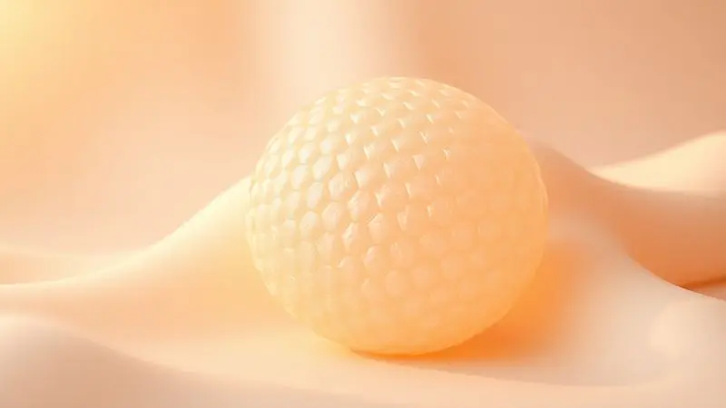
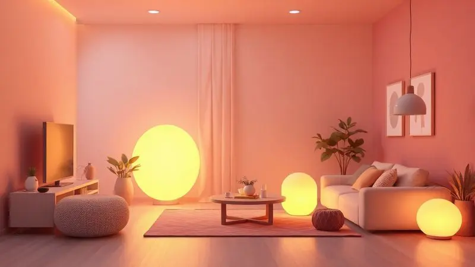

Você já passou a noite toda revirando na cama, tentando encontrar uma posição confortável que não deixe suas costas doloridas pela manhã? Se está pesquisando colchões, provavelmente se deparou com a Apolospuma e se perguntou se vale mesmo o investimento.

Afinal, um colchão não é só uma compra - é um compromisso com seu sono, sua saúde e seus próximos anos de descanso. Neste artigo, vamos além das especificações técnicas para entender como cada tecnologia da Apolospuma se traduz em noites realmente reparadoras.

Prepare-se para descobrir se essa marca pode ser a resposta para suas noites mal dormidas.

<SummaryList products={frontmatter.top_products} />

## Conheça as tecnologias dos colchões Apolospuma

<ProductBox 
  title={frontmatter.top_products[0].title} 
  image={frontmatter.top_products[0].image} 
  link={frontmatter.top_products[0].link} 
/>

Imagine um quebra-cabeça onde cada peça foi projetada para resolver um problema específico do seu sono. É assim que a Apolospuma constrói seus colchões - cada tecnologia conversa com a outra para criar uma experiência completa.

Começamos pela base: a espuma viscoelástica com infusão de gel não é apenas uma característica técnica, mas a solução para quem acorda suando no meio da noite. Ela trabalha dissipando o calor do seu corpo, mantendo a superfície fresca enquanto você dorme.

O sistema de blocos contínuo garante que essa espuma mantenha suas propriedades por anos, sem afundar nos lugares onde você mais se apoia.

Já as molas ensacadas funcionam como uma rede de suporte personalizado: cada uma se adapta independentemente ao peso do seu corpo, criando uma base que acompanha suas curvas naturais.

E para completar esse ecossistema de conforto, o tratamento antibacteriano age silenciosamente durante a noite, criando uma barreira invisível contra ácaros e alérgenos.

### Malha Belga Luxe Quality

O primeiro contato físico com seu colchão acontece através do tecido, e é aqui que a Malha Belga Luxe Quality faz toda diferença. Sinta o toque macio que não esquenta mesmo nas noites de verão, graças à sua estrutura respirável que permite que o ar circule livremente.

Para quem sofre com alergias, essa malha oferece uma proteção extra com suas propriedades hipoalergênicas, enquanto sua resistência à abrasão significa que seu colchão vai manter aquela aparência de novo por muito mais tempo.

É o tipo de detalhe que transforma um produto funcional em uma experiência de luxo acessível.

### Camada de Conforto em Látex

Se você já sentiu aquela pressão incômoda nos ombros ou quadris ao acordar, entende por que a camada de látex é tão valorizada.

Este material possui uma elasticidade natural que cede exatamente na medida certa, aliviando os pontos de tensão sem comprometer o suporte da coluna.

Mas o látex vai além do conforto imediato: sua estrutura celular aberta age como um sistema de ventilação interno, regulando a temperatura de forma passiva. O resultado é que você acorda sem aquela sensação pegajosa, mesmo depois de horas de sono profundo.

### Molas HSS Ensacadas e Wrapped Coil System (Pocket)

Lembra da última vez que você acordou porque seu parceiro se virou na cama? Com as molas HSS ensacadas, esse problema simplesmente desaparece. Cada mola é envolta individualmente em tecido, funcionando como uma unidade independente que reage apenas ao peso sobre ela.

Isso significa que quando alguém se move do seu lado, o movimento não viaja através do colchão até você. Além do isolamento de movimento, esse sistema cria bolsões de ar que melhoram a ventilação, mantendo o interior do colchão fresco e seco por mais tempo.

### Tecnologia Viscogel para Conforto Térmico

O Viscogel é onde a inovação encontra o conforto na sua forma mais pura. Combine a adaptação perfeita da espuma viscoelástica com a capacidade de resfriamento do gel, e você terá um material que parece quase inteligente.

Ele não apenas se molda ao seu corpo para distribuir o peso uniformemente, mas também absorve e dissipa o calor exatamente onde você mais precisa.

Para quem tem dificuldade em dormir no calor ou acorda frequentemente por sentir-se abafado, essa tecnologia pode ser o divisor de águas entre uma noite comum e um sono verdadeiramente reparador.

### Proteção 100% e Copperwash (Banho de Cobre Antiferrugem)

Seu colchão é um dos poucos itens da sua casa que você usa todos os dias, por anos. A tecnologia Copperwash transforma essa convivência diária em uma relação mais saudável.

O banho de cobre não é apenas um tratamento superficial, mas uma proteção integrada que age continuamente contra microrganismos.

Imagine dormir todas as noites sabendo que seu colchão está se defendendo ativamente contra ácaros e bactérias, sem que você precise fazer nada. É a tranquilidade de saber que seu investimento em sono também é um investimento em bem-estar.

### Hard-Frame: Sustentação nas Laterais

Quantas vezes você já se sentou na borda da cama para calçar os sapatos e sentiu o colchão ceder? O sistema Hard-Frame resolve exatamente esse problema do dia a dia.

As laterais reforçadas oferecem uma base firme que mantém sua estrutura mesmo com uso constante, eliminando aquela sensação desagradável de estar prestes a rolar para fora.

Para quem tem o hábito de sentar na beirada ou simplesmente valoriza um produto que mantém sua forma ao longo do tempo, essa sustentação extra faz toda diferença na durabilidade e na confiança que você deposita no seu colchão.

### Diferenciais das Espumas: Hypersoft, Ecofoam e Certifoam

A Apolospuma entende que o conforto é pessoal. Por isso oferece três perfis distintos de espuma: a Hypersoft para quem busca a sensação de afundar em uma nuvem, perfeita para quem prioriza o aconchego acima de tudo.

A Ecofoam atende ao consumidor consciente que não quer abrir mão do conforto, mas se preocupa com o impacto ambiental. Já a Certifoam é para quem precisa de firmeza, seja por recomendação ortopédica ou preferência pessoal.

Ter essa variedade significa que você não precisa se adaptar ao colchão - ele é que se adapta a você.

<CaixaProsContras>

**Prós:**

- Tecnologia de espuma viscoelástica com gel para conforto térmico.

- Molas ensacadas que oferecem suporte e adaptação ao corpo.

- Tratamento antibacteriano que ajuda na saúde do sono.

- Compromisso com sustentabilidade na produção.

**Contras:**

- O preço pode ser mais elevado em comparação a opções básicas.

- Alguns modelos podem ser mais pesados, dificultando o manuseio.

</CaixaProsContras>

## O que os clientes dizem sobre a Apolospuma

A verdade sobre qualquer produto mora na experiência de quem já o usa há meses. Os relatos dos clientes da Apolospuma revelam um padrão interessante: muitos destacam como a combinação de tecnologias resolveu problemas específicos que tinham há anos.

"Depois de três colchões em cinco anos, finalmente encontrei um que não dói minhas costas", compartilha um usuário.

Outros valorizam os pequenos detalhes que fazem diferença no dia a dia: "A borda firme é uma benção para mim que sempre sento na cama para trabalhar no notebook".

Sim, alguns mencionam que a entrega pode levar mais tempo do que o esperado, mas a maioria concorda: a espera vale a pena quando você finalmente experimenta a qualidade do sono que esses colchões proporcionam.

É como se o investimento inicial se transformasse, mês após mês, em retornos tangíveis de bem-estar e disposição.

## Conclusão

A busca pelo colchão perfeito sempre foi cercada de dúvidas e receios - afinal, como saber se algo vai ser confortável pelas próximas décadas antes mesmo de dormir nele?

A Apolospuma enfrenta esse desafio com uma abordagem que vai além das especificações técnicas: ela oferece soluções reais para problemas reais do sono.

Seja o calor noturno, a transferência de movimento, ou simplesmente a busca por um apoio que não comprometa seu conforto, cada tecnologia parece responder a uma necessidade específica.

O que fica claro é que essa marca não vende apenas colchões, vende a promessa de noites mais tranquilas, acordar sem dores e a segurança de um investimento que dura.

Sim, o preço pode ser mais elevado que opções básicas, mas quando você considera que passa um terço da sua vida dormindo, talvez valha a pena investir na qualidade desse terço. A recomendação final?

Se você está disposto a ver seu colchão como um aliado da sua saúde e não apenas um móvel, a Apolospuma merece sua atenção. Experimente, sinta a diferença e decida se essa é a peça que faltava no quebra-cabeça do seu descanso ideal.