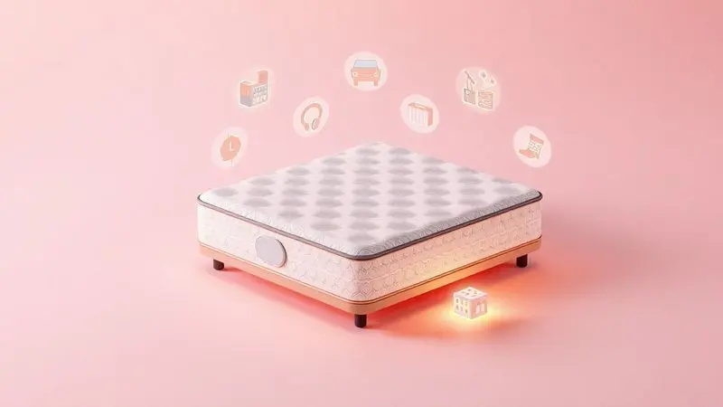

Escolher o colchão ideal é um dos investimentos mais importantes para sua saúde e bem-estar, mas nem sempre o orçamento permite as opções de luxo. A dúvida "será que esse colchão barato é bom?" é extremamente comum e justa. Afinal, passamos um terço da vida dormindo.

Neste guia completo, analisamos as melhores opções do mercado que equilibram preço justo e durabilidade. Vamos explorar modelos de marcas consagradas como Ortobom, Castor e Herval, revelando quais realmente entregam conforto sem comprometer seu orçamento.

Descubra agora qual a melhor escolha para suas noites de descanso e garanta uma compra segura.

<SummaryList products={frontmatter.top_products} />

## Por que buscar a melhor marca de colchão barata?

Imagine acordar renovado, sem aquela dor nas costas que insiste em aparecer todas as manhãs. Um colchão de qualidade influencia diretamente nessa sensação, prevenindo problemas como dores lombares e insônia.

A busca pela melhor marca acessível vai além de economizar dinheiro, trata-se de encontrar aquele equilíbrio perfeito entre conforto e durabilidade. Muitos modelos oferecem tecnologia e suporte semelhantes aos premium, mas sem o preço exorbitante.

Ao optar por um colchão com bom custo-benefício, você investe em noites tranquilas que realmente restauram seu corpo, tudo sem pesar no bolso.

## Como escolher a melhor marca de colchão barata?

Comece entendendo que "barato" não precisa significar "ruim". A chave está em saber onde procurar. Materiais como viscoelástico e espuma de alta resiliência costumam oferecer excelente relação custo-benefício, adaptando-se ao seu corpo sem perder a firmeza.

A reputação da marca também conta, então vale a pena ler avaliações de quem já comprou para sentir a experiência real de uso.

Outro detalhe que muitos ignoram: a garantia. Colchões de qualidade costumam ter prazos mais longos, o que demonstra confiança da fabricante no produto. Por fim, fique atento a promoções sazonais.

É possível encontrar modelos incríveis em períodos de liquidação, transformando um investimento necessário em uma compra inteligente.

## Top Opções de Colchões Custo-Benefício para Comprar

Separamos 10 opções que provam que é possível dormir bem sem gastar uma fortuna. Cada um tem seu perfil específico, mas todos compartilham uma característica essencial: entregam muito mais do que seu preço sugere.

### 1. Colchão de Molas Spain Herval

<ProductBox 
  title={frontmatter.top_products[0].title} 
  image={frontmatter.top_products[0].image} 
  link={frontmatter.top_products[0].link} 
/>

Para quem busca a tradição das molas com um toque moderno de conforto, o Spain Herval é uma escolha certeira.

Seu sistema Maxspring oferece suporte anatômico que parece abraçar seu corpo, enquanto o Pillow Top Americano garante aquela maciez inicial que faz você suspirar ao deitar.

O segredo está nos detalhes: o tecido Malha não só tem uma textura agradável como permite que sua pele respire durante a noite. E se você se preocupa com sustentabilidade, vai gostar de saber que ele utiliza EcoSpuma®, feita a partir de materiais reciclados.

Com tratamento antiácaro e antifungo, é como ter um guardião silencioso cuidando da higiene do seu sono.

<CaixaProsContras>

**Prós:**

- Excelente suporte anatômico com molas Maxspring.

- Conforto inicial macio devido ao Pillow Top Americano.

- Revestimento com tecido Malha e tratamento antiácaro.

- Sustentável, utilizando EcoSpuma®.

**Contras:**

- Não é o colchão mais rígido do mercado.

- Suporta até 140 kg por pessoa, o que pode não atender a todos os perfis.

</CaixaProsContras>

### 2. Colchão Ortopédico Wood Light - Ortobom

<ProductBox 
  title={frontmatter.top_products[1].title} 
  image={frontmatter.top_products[1].image} 
  link={frontmatter.top_products[1].link} 
/>

Se sua coluna pede socorro após longos dias de trabalho, o Wood Light pode ser a resposta. Sua estrutura de madeira não é apenas firme, é inteligente, projetada para manter seu alinhamento postural enquanto você descansa profundamente.

A espuma D28 Pró Aditivada trabalha em conjunto com o OrtoPillow para distribuir seu peso de maneira uniforme. E o melhor: o sistema One Side elimina aquela tarefa chata de virar o colchão regularmente.

Feito com madeira de reflorestamento, ele une cuidado com seu corpo e com o planeta em um só produto.

<CaixaProsContras>

**Prós:**

- Estrutura ortopédica oferece excelente suporte postural.

- Camada de espuma D28 proporciona conforto adicional.

- Tratamentos antiácaro e antifungo aumentam a durabilidade e saúde do produto.

- Produzido com madeira de reflorestamento, é uma escolha sustentável.

**Contras:**

- Firmeza extra pode não agradar a quem prefere colchões mais macios.

- Disponibilidade de tamanhos variados, mas pode haver limitações em alguns modelos.

</CaixaProsContras>

### 3. Colchão Molas Classic - Anjos

<ProductBox 
  title={frontmatter.top_products[2].title} 
  image={frontmatter.top_products[2].image} 
  link={frontmatter.top_products[2].link} 
/>

Para casais que têm ritmos de sono diferentes, as molas ensacadas individualmente são uma revolução. Elas garantem que o movimento de um lado não vire um terremoto do outro, permitindo que cada um durma em paz mesmo quando o parceiro se mexe.

A espuma D26 oferece densidade suficiente para anos de uso sem deformar, enquanto o Pillow Top opcional cria uma camada extra de aconchego. O tecido de alta qualidade com proteção contra ácaros e fungos transforma seu quarto em um santuário do descanso verdadeiro.

<CaixaProsContras>

**Prós:**

- Excelente suporte com molas ensacadas individualmente.

- Camada extra de conforto com Pillow Top disponível.

- Alta qualidade no tecido, resistente a ácaros e fungos.

- Variedade de modelos para diferentes necessidades de suporte.

**Contras:**

- A manutenção requer cuidados específicos para evitar danos.

- A faixa de preço pode ser superior a modelos básicos, refletindo sua qualidade.

</CaixaProsContras>

### 4. Colchão de Molas Bonnel Revolution Euro Pillow - Castor

<ProductBox 
  title={frontmatter.top_products[3].title} 
  image={frontmatter.top_products[3].image} 
  link={frontmatter.top_products[3].link} 
/>

Às vezes, tudo que precisamos é daquele abraço perfeito ao deitar. O Euro Pillow da Castor oferece exatamente isso: uma camada extra de maciez que recebe seu corpo como se estivesse afundando em uma nuvem.

O sistema Bonnel Híbrido mescla resistência e conforto progressivo, adaptando-se aos seus contornos sem perder a sustentação. Com certificação do INMETRO e tratamentos que mantêm alergias longe, ele prova que sofisticação não precisa custar os olhos da cara.

<CaixaProsContras>

**Prós:**

- Sistema de molas Bonnel Híbrido que combina resistência e conforto.

- Camada Euro Pillow para maior maciez.

- Tratamentos antialérgicos, antiácaros e antimofos.

- Certificação do INMETRO, garantindo qualidade.

**Contras:**

- Poder não ser firme o suficiente para quem prefere colchões mais duros.

- Pode ser considerado muito macio por alguns usuários.

</CaixaProsContras>

### 5. Colchão Confort Soft D28 Gazin

<ProductBox 
  title={frontmatter.top_products[4].title} 
  image={frontmatter.top_products[4].image} 
  link={frontmatter.top_products[4].link} 
/>

Equilíbrio é a palavra-chave aqui. O Confort Soft D28 da Gazin sabe dosar firmeza e maciez na medida certa, criando uma superfície que apoia sua coluna sem parecer uma tábua.

Seu revestimento em poliéster é prático para limpar e mantém os ácaros bem longe do seu espaço de descanso. Alguns modelos ainda trazem a tecnologia Double Face, permitindo que você use ambos os lados e estique a vida útil do produto por anos a mais.

<CaixaProsContras>

**Prós:**

- Excelente equilíbrio entre firmeza e maciez.

- Revestimento fácil de limpar e hipoalergênico.

- Durabilidade superior com tecnologia Double Face.

- Disponível em diferentes tamanhos.

**Contras:**

- Adequado apenas para usuários de até 90 kg.

- Garantia de apenas 3 meses, o que pode ser considerado curto por alguns.

</CaixaProsContras>

### 6. Colchão Thor D33 Umaflex

<ProductBox 
  title={frontmatter.top_products[5].title} 
  image={frontmatter.top_products[5].image} 
  link={frontmatter.top_products[5].link} 
/>

Quem disse que resistência precisa ser desconfortável? O Thor D33 desafia essa ideia com uma densidade que suporta até 100 kg sem abrir mão do aconchego. Com 19 cm de altura, ele oferece profundidade suficiente para um mergulho relaxante no sono.

A espuma de poliuretano e o tecido macio criam uma parceria perfeita entre durabilidade e sensação agradável ao toque. Se você precisa de firmeza extra para cuidar da coluna, mas não quer sentir que está dormindo no chão, essa pode ser sua solução.

<CaixaProsContras>

**Prós:**

- Ótima relação custo-benefício.

- Confortável e resistente.

- Suporte para até 100 kg por pessoa.

- Ideal para quem busca firmeza no descanso.

**Contras:**

- Pode ser muito firme para quem prefere colchões macios.

- Garantia de 12 meses pode ser considerada curta por alguns.

</CaixaProsContras>

### 7. Colchão ortopédico D45 BF Colchões

<ProductBox 
  title={frontmatter.top_products[6].title} 
  image={frontmatter.top_products[6].image} 
  link={frontmatter.top_products[6].link} 
/>

Quando o assunto é suporte robusto, o D45 da BF Colchões não brinca em serviço. Com densidade máxima e capacidade para 150 kg por pessoa, ele foi feito para quem precisa de uma base realmente sólida.

A construção dupla face é um presente para sua durabilidade, permitindo rotações que distribuem o desgaste uniformemente. E como é hipoalergênico e antimicrobiano, você pode respirar fundo sabendo que está em um ambiente protegido, perfeito para quem sofre com alergias.

<CaixaProsContras>

**Prós:**

- Suporte robusto para pesos maiores.

- Hipoalergênico e antimicrobiano.

- Construção dupla face para maior durabilidade.

- Bom alinhamento postural e alívio de dores.

**Contras:**

- Firmeza excessiva pode ser desconfortável para pessoas leves.

- Pode não agradar a quem prefere colchões mais macios.

</CaixaProsContras>

### 8. Colchão de molas Qatar Celuplas

<ProductBox 
  title={frontmatter.top_products[7].title} 
  image={frontmatter.top_products[7].image} 
  link={frontmatter.top_products[7].link} 
/>

Versatilidade é o sobrenome do Qatar da Celuplás. Disponível em tamanhos que vão do solteiro ao Queen Size, ele se adapta ao seu espaço e às suas necessidades sem complicações.

A combinação de molas de alta qualidade com espuma D65 cria uma estrutura que parece feita para durar, mantendo sua forma e conforto ano após ano. É a prova de que investir em um bom colchão hoje significa economizar em trocas prematuras amanhã.

<CaixaProsContras>

**Prós:**

- Conforto e suporte firme com molas de alta qualidade.

- Disponível em diversos tamanhos para atender várias necessidades.

- Utiliza espuma D65, que garante durabilidade.

- Bom custo-benefício para quem busca qualidade.

**Contras:**

- Capacidade de suporte pode variar entre os modelos.

- Não é indicado para quem prefere colchões mais macios.

</CaixaProsContras>

### 9. Colchão Espuma Diamante - Orthocrin

<ProductBox 
  title={frontmatter.top_products[8].title} 
  image={frontmatter.top_products[8].image} 
  link={frontmatter.top_products[8].link} 
/>

Firmeza com inteligência define o Espuma Diamante. Com densidade D33 certificada, ele oferece o suporte que sua coluna pede, especialmente se você passa o dia em pé ou sentado.

O tecido misto de poliéster e algodão com tratamento antiácaro cria uma barreira protetora enquanto você descansa. E como pode ser usado dos dois lados, ele se reinventa periodicamente, prolongando sua vida útil de maneira prática.

<CaixaProsContras>

**Prós:**

- Conforto firme, ideal para quem busca suporte.

- Densidade D33 oferece durabilidade.

- Tecido com tratamento antiácaro e antifungo.

- Utilização dupla face aumenta a vida útil.

**Contras:**

- Firmeza pode não agradar a todos.

- Limitado a um suporte de peso de 100 kg por pessoa.

</CaixaProsContras>

### 10. Colchão Probel D28

<ProductBox 
  title={frontmatter.top_products[9].title} 
  image={frontmatter.top_products[9].image} 
  link={frontmatter.top_products[9].link} 
/>

O meio-termo perfeito entre aconchego e sustentação. O Probel D28 tem aquela densidade que abraça seus pontos de pressão sem deixar sua coluna desamparada, criando um equilíbrio que funciona para a maioria das pessoas.

Os tratamentos antiácaro e antialérgico são bônus que fazem diferença no dia a dia, principalmente se você tem sensibilidade respiratória. E para quem odeia a logística de mudança, a tecnologia "Bed In The Box" transforma o transporte em algo quase divertido.

<CaixaProsContras>

**Prós:**

- Boa combinação de conforto e suporte.

- Tratamentos antiácaro e antialérgico.

- Tecnologia "Bed In The Box" para fácil transporte.

- Densidade adequada para apoio à coluna.

**Contras:**

- Suporte geralmente limitado a até 90 kg por pessoa.

- Pode não ser tão macio para quem prefere colchões mais suaves.

</CaixaProsContras>

## Diferença entre o tamanho dos colchões

Escolher o tamanho certo é como encontrar o parceiro perfeito para dançar: precisa haver espaço para se movimentar, mas também proximidade suficiente para o aconchego.

O solteiro tradicional (88 cm) é ideal para quem dorme sozinho ou para quartos compactos, enquanto o casal (138 cm) oferece aquela folga necessária para não invadir o espaço do outro durante a noite.

Já os tamanhos queen e king são para quem não abre mão de liberdade mesmo compartilhando a cama. Pense no espaço do seu quarto e em como você realmente dorme. Vale mais ter um colchão menor de qualidade do que um enorme que não oferece o suporte necessário.

## Qual é o melhor colchão para a coluna?

Sua coluna não quer firmeza excessiva nem maciez sem fim, ela busca o equilíbrio que mantenha sua curvatura natural durante o sono.

Colchões de espuma viscoelástica e látex costumam acertar nesse ponto, moldando-se ao seu corpo como uma segunda pele que sabe exatamente onde oferecer apoio.

A posição em que você dorme também dita as regras. Quem dorme de lado geralmente se beneficia de colchões mais macios que acomodem o quadril e ombro, enquanto quem dorme de barriga para cima pode preferir uma firmeza moderada.

O segredo está em ouvir seu corpo após uma noite de sono, não apenas durante os 5 minutos de teste na loja.

## Como economizar ainda mais e evitar ciladas

Economizar não significa comprar qualquer coisa que esteja em promoção. Significa ser estratégico.

Datas como Black Friday e Natal podem trazer descontos reais em modelos de qualidade, mas fique atento: um preço muito abaixo do mercado pode esconder materiais inferiores.

Políticas de devolução são seu seguro contra arrependimentos. Muitas lojas online oferecem períodos de teste que permitem sentir o colchão no conforto de casa.

E nunca subestime o poder das avaliações de outros consumidores, elas são retratos reais de como o produto se comporta depois de meses de uso.

## Cuidados na hora de escolher o seu colchão barato

O preço baixo não precisa ser uma bandeira vermelha, mas sim um sinal para prestar atenção extra. Densidade e firmeza devem conversar com seu peso e preferências pessoais. Materiais como espuma de memória costumam oferecer melhor retorno de conforto por menos dinheiro.

Durabilidade é outro fator crítico. Um colchão que dura 5 anos em vez de 2 acaba saindo mais barato no longo prazo, mesmo com um investimento inicial um pouco maior.

Por fim, confie nas experiências compartilhadas por quem já comprou, elas revelam detalhes que nem sempre aparecem nas especificações técnicas.

## Conclusão

Encontrar a melhor marca de colchão barato é mais do que uma simples compra, é um ato de autocuidado inteligente. As opções que apresentamos mostram que é possível ter conforto, suporte e durabilidade sem comprometer suas finanças.

Desde o aconchego das molas ensacadas até a firmeza ortopédica das espumas de alta densidade, cada modelo tem sua personalidade, mas todos compartilham uma missão: transformar suas noites em verdadeiros rituais de recuperação.

Lembre-se que seu colchão será seu companheiro por anos, testemunhando suas conquistas e oferecendo refúgio nos dias difíceis. Invista o tempo necessário para conhecer suas opções, leia experiências reais de outros usuários e, se possível, teste pessoalmente.

O sono de qualidade que você conquistará valerá cada minuto de pesquisa. Durma bem, viva melhor, e faça dessa escolha um investimento no seu bem-estar diário.