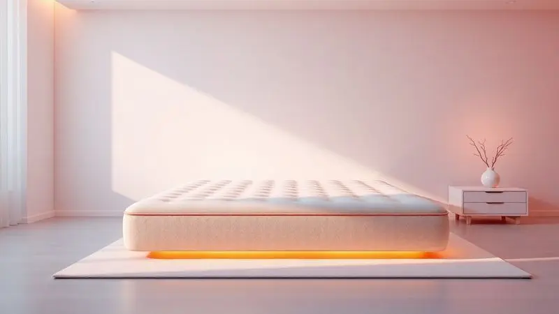
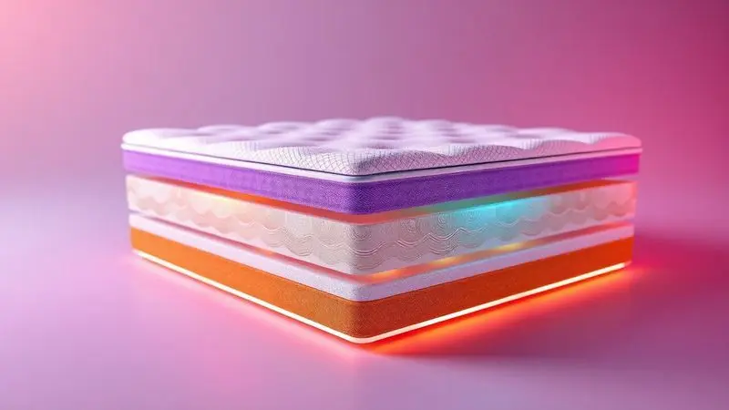

Decidir sobre um colchão Berflex vai além do preço atrativo que você encontra na loja.

Essa marca brasileira oferece uma linha que vai do solteiro até o king size, mas o que realmente importa é como essas opções se traduzem em conforto real na sua cama e durabilidade que vai acompanhar seu sono por anos.

Se você está analisando a densidade da espuma ou o funcionamento das molas ensacadas, este guia vai mergulhar nas características técnicas enquanto conecta cada detalhe às experiências reais dos consumidores.

Ao final, você terá uma visão completa para escolher com segurança e transformar suas noites.

<SummaryList products={frontmatter.top_products} />

## A marca Berflex

Com mais de 30 anos de experiência no mercado brasileiro, a Berflex construiu sua reputação não apenas pelo tempo, mas pela atenção constante à evolução do sono.

O que começou como uma empresa focada em colchões básicos hoje se transformou em uma marca que desenvolve tecnologias específicas para diferentes tipos de dorminhocos.

Você pode encontrar desde modelos mais simples, perfeitos para quem busca uma solução econômica, até opções com sistemas avançados de molas e espumas que respondem às necessidades específicas de cada corpo.

Essa trajetória de décadas significa que quando você escolhe um Berflex, está escolhendo um produto que passou por refinamentos constantes, sempre buscando aquela combinação ideal entre suporte firme e sensação de abraço.

## Principais características dos colchões Berflex

Para entender o que diferencia um Berflex, precisamos olhar para os componentes que definem sua experiência de sono. Cada detalhe técnico se traduz em um benefício que você sentirá ao acordar.

### Molas Ensacadas e Espumas

Imagine um sistema onde cada ponto do seu corpo recebe apoio individualizado, como se o colchão fosse composto por milhares de pequenos assistentes personalizados.

As molas ensacadas funcionam dessa maneira: cada mola opera independentemente, ajustando-se ao peso e movimento específico da área que ela suporta.

Para casais, essa tecnologia significa que os movimentos de um não se propagam para o outro, mantendo a paz mesmo quando um precisa se ajustar durante a noite.

Complementando esse sistema, as espumas, especialmente a viscoelástica, não apenas oferecem uma camada de maciez, mas se adaptam à forma do seu corpo, aliviando pontos de pressão que podem transformar uma noite tranquila em uma jornada de desconforto.

### Revestimento e Acabamento

O toque que você sente ao primeiro contato com o colchão e a sensação que ele proporciona durante horas de uso dependem diretamente do seu revestimento.

Os tecidos utilizados pela Berflex, normalmente combinando poliéster e algodão, são escolhidos não apenas pela durabilidade, mas pela capacidade de respirar.

Essa respirabilidade significa que seu corpo não acumula calor excessivo, mantendo uma temperatura equilibrada que evita aquela sensação de abafamento que pode interromper o sono.

A atenção aos detalhes do acabamento, desde a costura até a estrutura das bordas, reflete um cuidado que transforma o colchão de um simples produto para dormir em um elemento de conforto que se integra ao seu espaço pessoal.

## Berflex no Reclame Aqui

Uma marca com décadas de mercado naturalmente acumula histórias, tanto positivas quanto negativas. O espaço da Berflex no Reclame Aqui funciona como um mural público onde essas experiências se manifestam.

O que você encontra lá não é apenas uma lista de reclamações, mas um diálogo real entre consumidores e empresa.

A taxa de resposta da Berflex às questões levantadas revela seu compromisso com essa conversa, demonstrando que há um canal aberto para ajustes e esclarecimentos.

Analisar essas interações oferece uma dimensão prática da durabilidade prometida: você pode ver como os materiais resistem ao tempo real e como o atendimento responde quando algo precisa de atenção.

## Os Melhores Colchões Berflex da Atualidade

Entre a variedade oferecida pela marca, alguns modelos se destacam por equilibrar características técnicas com experiências que realmente transformam o sono. Aqui estão os que recebem maior atenção pelos resultados que entregam.

### 1. Colchão Casal Berflex Ribeirão Preto 138x188x23cm

<ProductBox 
  title={frontmatter.top_products[0].title} 
  image={frontmatter.top_products[0].image} 
  link={frontmatter.top_products[0].link} 
/>

Se você e seu parceiro têm padrões diferentes de movimento durante a noite, um mais agitado, outro mais tranquilo, este modelo oferece uma solução que respeita essas diferenças.

As molas ensacadas individualmente criam zonas de isolamento, onde o movimento de um lado praticamente não chega ao outro. Isso significa que você pode ajustar sua posição sem a preocupação de interromper o sono da pessoa ao lado.

Com capacidade para até 100 kg por pessoa e um tampo em malha 100% poliéster, o colchão combina resistência com um toque que não esquenta.

A combinação de molas e espuma com densidade de 20kg/m³ proporciona suporte que se mantém firme, enquanto a altura de 23 cm oferece espaço suficiente para acomodar diferentes preferências de conforto.

A garantia, que varia entre 3 e 6 meses dependendo da loja, pode parecer breve, mas reflete uma proposta onde o custo-benefício se concentra na experiência imediata do produto.

<CaixaProsContras>

**Prós:**

- Molas ensacadas que reduzem a transferência de movimento.

- Conforto anatômico ideal para casais.

- Tecido antiderrapante na base para maior segurança.

- Boa durabilidade em relação ao investimento.

**Contras:**

- Garantia variável pode gerar incertezas.

- Pode ser considerado mais básico para quem busca recursos avançados.

</CaixaProsContras>

### 2. Colchão Queen Berflex Manaus Molas Ensacadas

<ProductBox 
  title={frontmatter.top_products[1].title} 
  image={frontmatter.top_products[1].image} 
  link={frontmatter.top_products[1].link} 
/>

Para quem passa a noite buscando a posição perfeita e acaba sentindo cada movimento do colchão, este modelo apresenta uma resposta silenciosa.

As molas ensacadas não apenas oferecem estabilidade, mas operam sem os ruídos que podem tornar perceptíveis até pequenos ajustes.

A camada de conforto acrescentada não compromete a firmeza necessária para a coluna, criando uma sensação onde maciez e suporte coexistem sem conflito.

O acabamento sofisticado transforma o colchão em um elemento que se integra visualmente ao ambiente, enquanto seu espaço de uso proporciona amplitude sem desperdício.

O peso adicional, resultado da estrutura robusta, é um reflexo da durabilidade que você ganha, uma compensação que muitos usuários consideram válida quando percebem como o produto mantém sua forma e função ao longo do tempo.

<CaixaProsContras>

**Prós:**

- Molas ensacadas que proporcionam estabilidade e conforto

- Boa adaptação ao corpo, reduzindo os movimentos percebidos

- Acabamento sofisticado e visual atraente

- Durabilidade acima da média

**Contras:**

- Não é a opção mais barata do mercado

- Pode ser um pouco pesado para manusear devido à sua estabilidade

</CaixaProsContras>

### 3. Colchão Casal Berflex BH Molas Ensacadas com Viscoelástico

<ProductBox 
  title={frontmatter.top_products[2].title} 
  image={frontmatter.top_products[2].image} 
  link={frontmatter.top_products[2].link} 
/>

Quando você dorme de lado e sente pontos de pressão nos ombros ou quadril ao acordar, a espuma viscoelástica deste modelo trabalha para dissipar essa tensão.

Combinada com molas ensacadas que isolam movimentos, ela cria um ambiente onde cada parte do seu corpo recebe apoio personalizado. Essa combinação é especialmente valiosa para casais onde um tem preferências diferentes de firmeza ou padrões distintos de movimento.

A estrutura reforçada, capaz de suportar até 130 kg por pessoa, oferece segurança para quem busca um colchão que não cedirá com o tempo. O tecido em malha mantém uma sensação fresca, evitando o acumulo de calor que pode tornar o sono menos tranquilo.

O investimento mais elevado reflete essa combinação de tecnologias, um preço que se justifica quando você considera o alívio físico e a tranquilidade emocional que o produto proporciona.

<CaixaProsContras>

**Prós:**

- Reduz a transferência de movimento entre casais.

- Espuma viscoelástica que alivia pontos de pressão.

- Estrutura robusta com capacidade de suporte de até 130 kg por pessoa.

- Tecido em malha que proporciona conforto e frescor.

**Contras:**

- Preço relativamente mais alto comparado a outras opções.

- Pode não estar disponível em todas as variações.

</CaixaProsContras>

### 4. Colchão King Berflex Canela Molas Ensacadas D33

<ProductBox 
  title={frontmatter.top_products[3].title} 
  image={frontmatter.top_products[3].image} 
  link={frontmatter.top_products[3].link} 
/>

Para casais que buscam espaço amplo sem sacrificar o suporte individual, este modelo king size oferece dimensões generosas (193x203cm) combinadas com uma estrutura que mantiene a firmeza necessária.

As molas ensacadas continuam trabalhando para isolar movimentos, enquanto a espuma D33, com densidade de 33kg/m³, oferece uma base que não se deforma facilmente, garantindo que o conforto se mantenha consistente ao longo dos anos.

O revestimento em malha 100% poliéster proporciona um toque suave que resiste ao uso diário, criando uma superfície que não irrita a pele. A altura entre 32cm e 34cm oferece uma presença visual robusta que se traduz em conforto físico substancial.

Este não é um colchão extremamente macio, ele se posiciona na zona intermediária-firme que atende à maioria dos dorminhocos, oferecendo equilíbrio entre adaptação ao corpo e mantenimento da postura.

<CaixaProsContras>

**Prós:**

- Molas ensacadas que reduzem a transferência de movimento.

- Espuma D33 proporciona bom suporte e durabilidade.

- Revestimento em malha que oferece conforto adicional.

- Dimensões amplas ideais para casais.

**Contras:**

- Nível de firmeza pode não agradar a quem busca colchões muito macios.

- Alguns usuários podem achar o preço elevado em comparação a opções mais simples.

</CaixaProsContras>

## FAQ: Perguntas Frequentes sobre a Berflex

Depois de explorar as características e modelos específicos, algumas questões permanecem comuns entre os interessados nos colchões Berflex. Estas perguntas refletem as preocupações que surgem quando você está próximo da decisão final.

### Qual marca de colchão tem menos reclamações?

Ao analisar o histórico de reclamações, a Berflex mantiene um desempenho que muitos consideram positivo dentro do seu segmento.

Isso não significa ausência total de questões, mas indica uma proporção onde os relatos positivos sobre durabilidade e conforto superam os problemas reportados.

Outras marcas como Ortobom e Castor também apresentam bons índices, mas a escolha ideal sempre retorna às suas preferências pessoais: o nível de firmeza que seu corpo necessita, os materiais que proporcionam o conforto que você busca e o equilíbrio entre investimento e expectativa de uso.

Comparar essas experiências em sites de avaliação oferece uma dimensão prática além das especificações técnicas.

### Qual a melhor marca de colchão para dormir?

A resposta para essa pergunta nunca é única, porque a melhor marca é aquela que se adapta ao seu corpo, seus hábitos de sono e suas expectativas de durabilidade.

Tempur se destaca pela tecnologia viscoelástica que oferece suporte personalizado, Sealy combina sistemas de molas e espumas em modelos híbridos, e Emma traz designs modernos com bom custo-benefício.

A Berflex se posiciona neste cenário como uma opção brasileira que acumula experiência prática, oferecendo tecnologias adaptadas ao mercado local.

O que define a melhor escolha para você é como essas características se traduzem na sua experiência pessoal ao acordar cada manhã.

## Conclusão

Quando você começa a buscar um colchão Berflex, inicialmente pode parecer uma decisão sobre materiais, densidades e tamanhos. Mas ao final desta análise, o que realmente emerge é uma escolha sobre como você quer que suas noites sejam transformadas.

As molas ensacadas não são apenas componentes técnicos, são sistemas que respeitam sua individualidade mesmo quando compartilha a cama. As espumas não são simples materiais, são camadas que dialogam com seu corpo para dissipar pressões.

A trajetória de 30 anos da marca não é apenas um número, é um histórico de refinamentos que evolui junto com as necessidades dos dorminhocos brasileiros.

Os modelos específicos que exploramos oferecen soluções para problemas concretos: isolamento de movimento para casais, alívio de pontos de pressão para quem dorme de lado, firmeza consistente para quem precisa de suporte robusto.

A análise do Reclame Aqui mostra que essa experiência não acontece apenas nas especificações, mas na vida real dos consumidores, onde durabilidade e atendimento se testam diariamente.

Se você busca um equilíbrio entre investimento consciente e conforto real, os colchões Berflex apresentam uma proposta onde cada característica técnica se conecta a um benefício emocional: tranquilidade ao dividir a cama, segurança ao sentir o suporte, confiança ao saber que o produto acompanha sua evolução.

A decisão final, portanto, não é apenas sobre comprar um colchão, é sobre escolher como você quer que cada noite seja vivida.