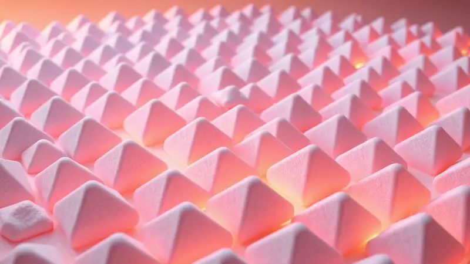
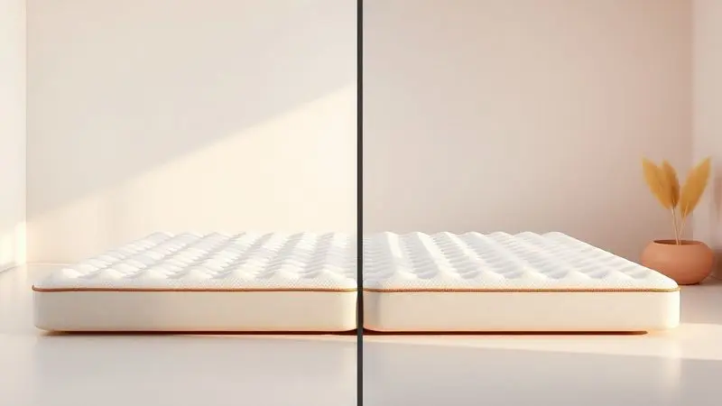
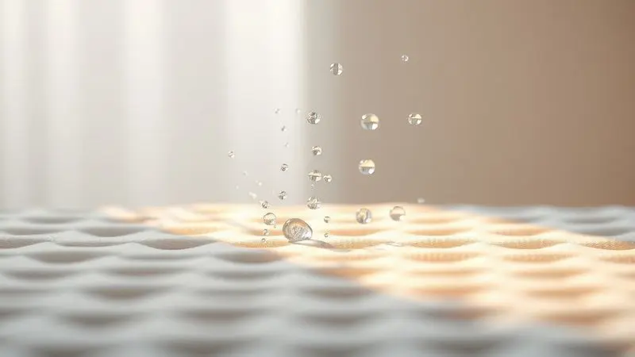

Muitas pessoas acreditam que um colchão comum é suficiente para o repouso prolongado, mas quem cuida de pacientes acamados sabe que a realidade é mais complexa.

O surgimento de escaras e o desconforto constante são problemas reais que podem ser evitados com a solução certa.

Neste guia completo, você vai descobrir exatamente para que serve o colchão casca de ovo, como ele atua na prevenção de lesões por pressão e quais são os benefícios reais para a saúde e o bem-estar.

Prepare-se para entender como escolher o modelo ideal e garantir o máximo de conforto para quem você ama.

<SummaryList products={frontmatter.top_products} />

## O que é e para que serve o colchão casca de ovo?

Imagine tocar uma superfície que parece acolher cada curva do corpo, distribuindo seu peso como se fosse água escorrendo suavemente pelas montanhas.

É isso que o colchão casca de ovo oferece: uma estrutura em forma de ondas ou cristas que se assemelha à casca de um ovo, projetada não apenas para suportar, mas para abraçar. Pense na pessoa que você cuida passando horas na mesma posição.

O que parece confortável no início pode se transformar em pontos de pressão invisíveis que evoluem para lesões na pele.

Esse tipo de colchão é especialmente crucial para quem permanece muito tempo deitado, pois trabalha ativamente para prevenir escaras, além de permitir que o ar circule livremente, evitando que o calor se acumule e transforme o repouso em sofrimento.

## Como funciona a tecnologia piramidal na distribuição de pressão?

Você já observou como uma almofada de pinos de acupuntura parece intimidar, mas na verdade proporciona alívio surpreendente? A tecnologia piramidal segue uma lógica similar.

Enquanto seu olho vê picos e vales, seu corpo experimenta milhares de pontos de contato que cedem exatamente na medida certa.

Quando alguém se deita sobre essa superfície, as áreas mais altas das pirâmides se moldam suavemente, como se cada uma delas fosse um minúsculo profissional de fisioterapia trabalhando para redistribuir o peso.

O resultado vai além do conforto momentâneo: essa dança entre resistência e cedência promove a circulação sanguínea, mantendo o fluxo vital mesmo durante longos períodos de imobilidade.

Você não está apenas oferecendo um local para deitar, está proporcionando um sistema ativo de cuidado.

## 5 Benefícios Comprovados do Colchão Casca de Ovo para a Saúde

Depois de entender como a tecnologia piramidal opera, fica mais fácil visualizar os benefícios concretos que ela traz para o dia a dia de quem precisa de cuidados especiais. São transformações que vão do físico ao emocional:

Imagine poder dormir sem aquela sensação de calor abafado que faz você acordar várias vezes durante a noite. A ventilação natural da superfície texturizada mantém a temperatura corporal regulada, especialmente importante em climas quentes.

Pense na circulação sanguínea como rios que precisam fluir livremente. Quando pontos de pressão bloqueiam esses rios, o corpo sofre silenciosamente. A distribuição uniforme do peso mantém esses canais abertos.

Considere a diferença entre dormir e realmente descansar. Um sono reparador não é luxo, é medicina. O alívio da pressão permite que o corpo entre em estágios mais profundos de repouso.

Visualize a pele respirando em vez de apenas existir sob pressão constante. A prevenção de escaras é o benefício mais visível, mas é apenas a ponta do iceberg de um cuidado holístico.

Por fim, imagine a tranquilidade de saber que, mesmo quando a rotina de reposicionamento a cada duas horas escapa por um momento, existe uma camada extra de proteção trabalhando continuamente.

### Colchão Casca de Ovo Densidade 28: O equilíbrio entre suporte e maciez

<ProductBox 
  title={frontmatter.top_products[0].title} 
  image={frontmatter.top_products[0].image} 
  link={frontmatter.top_products[0].link} 
/>

Se você pudesse descrever a densidade 28 em uma palavra, seria 'acolhimento'. Esta opção é perfeita para quem busca a sensação de ser abraçado sem ser comprimido.

Enquanto densidades mais altas oferecem firmeza quase clínica, o D28 entende que conforto também tem relação com suavidade.

Para pacientes em recuperação pós-operatória ou pessoas com circulação delicada, essa camada extra de maciez pode significar a diferença entre tolerar o repouso e verdadeiramente descansar.

É como ter um travesseiro que se adapta às suas necessidades, mas estendido por todo o corpo. A espuma de poliuretano de qualidade garante que essa suavidade não seja passageira, mas uma característica constante ao longo do tempo.

Para quem prefere um apoio mais rígido, é verdade que o D28 pode parecer generoso demais. Mas antes de descartá-lo, considere a pessoa que vai usá-lo diariamente.

Muitas vezes, o que parece 'muito macio' para quem testa por alguns minutos é exatamente o que permite horas contínuas de conforto para quem não pode mudar de posição facilmente.

### Colchão Casca de Ovo Densidade 33: Maior durabilidade para uso contínuo

<ProductBox 
  title={frontmatter.top_products[1].title} 
  image={frontmatter.top_products[1].image} 
  link={frontmatter.top_products[1].link} 
/>

Quando o uso passa de ocasional para contínuo, como em ambientes clínicos ou recuperações prolongadas, a densidade 33 entra em cena como a escolha que combina resistência com cuidado constante.

Com 33 kg/m³, este modelo oferece um equilíbrio mais pronunciado entre firmeza e maciez, como um profissional experiente que sabe exatamente quando ceder e quando manter a postura.

Pense no colchão D33 como um investimento em resiliência. Enquanto opções menos densas podem se adaptar mais rapidamente, esta mantém sua forma e funcionalidade mesmo após meses de uso ininterrupto.

Sua superfície perfilada trabalha com uma precisão quase cirúrgica para aliviar pontos de pressão, tornando-se fundamental na prevenção avançada de escaras.

É importante entender que, como camada adicional, ele complementa mais do que substitui um colchão ortopédico especializado.

Mas como complemento, ele brilha, transformando um leito comum em um sistema ativo de conforto que massageia sutilmente o corpo inteiro, estimulando a circulação de maneira quase imperceptível, mas profundamente eficaz.

## Como usar o colchonete casca de ovo corretamente sobre o colchão comum?

Você já comprou um acessório promissor que, mal colocado, perde toda sua funcionalidade? A aplicação correta do colchonete casca de ovo evita essa frustração.

Comece criando uma base limpa e nivelada sobre seu colchão existente, como preparar uma tela antes de pintar uma obra-prima. Remova poeira e partículas que possam criar pontos irregulares.

Agora, desenrole o colchonete com paciência, como se estivesse estendendo um mapa de alívio sobre a superfície. Certifique-se de que ele se ajuste uniformemente, sem dobras ou bolhas que possam criar novos pontos de pressão.

Aqui está o segredo mais importante: posicione os nódulos voltados para cima. Essas pequenas elevações são os instrumentos da orquestra de conforto, cada uma pronta para responder às curvas do corpo.

Quando corretamente orientados, eles criam uma camada de micro-massagem que trabalha enquanto a pessoa descansa.

Finalmente, escolha lençóis que abracem sem comprimir. Tecidos muito apertados podem achatar os nódulos, enquanto materiais muito soltos permitem deslizamentos.

O equilíbrio certo mantém tudo no lugar, criando uma experiência de sono que parece ter sido personalizada apenas para quem a utiliza.

## A importância da capa protetora: Higiene e durabilidade do material

<ProductBox 
  title={frontmatter.top_products[2].title} 
  image={frontmatter.top_products[2].image} 
  link={frontmatter.top_products[2].link} 
/>

Imagine investir em um sistema de cuidado sofisticado apenas para vê-lo deteriorar prematuramente por conta de derramamentos acidentais ou acúmulo de poeira. A capa protetora é o guardião silencioso que evita esse cenário.

Funciona como uma barreira inteligente: permite que o ar circule enquanto bloqueia líquidos, poeira e alérgenos que tentam penetrar na espuma.

Em ambientes de cuidado prolongado, onde derramamentos são mais prováveis, essa proteção se transforma em necessidade, não em opção.

A umidade não apenas cria odores desagradáveis, mas estabelece o ambiente perfeito para bactérias e fungos que comprometem tanto a saúde do usuário quanto a integridade do material.

A verdadeira beleza da capa protetora está em sua praticidade. Ela pode ser removida e lavada com facilidade, restaurando a limpeza sem esforço excessivo.

Sim, existem modelos mais caros no mercado, mas pense nisso como um seguro: o investimento extra pode significar anos adicionais de uso eficaz do seu colchão.

Lembre-se, entretanto, que mesmo o melhor protetor não substitui os cuidados básicos. Ele complementa, não isenta. Mas sua presença transforma a limpeza de uma tarefa árdua em uma manutenção simples e eficiente.

## Colchão Casca de Ovo vs. Colchão Pneumático: Qual escolher?

Às vezes, a escolha parece difícil porque ambas as opções são boas, mas para necessidades diferentes. Vamos simplificar: o colchão casca de ovo é como ter um terapeuta dedicado que já conhece exatamente onde aplicar o alívio.

Sua superfície em formato de ondas trabalha continuamente para prevenir escaras, especialmente valiosa para quem permanece na mesma posição por longos períodos. É uma solução ativa e constante.

Já o colchão pneumático oferece a flexibilidade do ajuste personalizado. Se as necessidades mudam frequentemente, ou se diferentes pessoas utilizam o mesmo leito, a capacidade de regular a firmeza pode ser decisiva.

Pense nele como um instrumento versátil que se adapta a múltiplos cenários.

A escolha final não é sobre qual tecnologia é superior, mas sobre qual dialoga melhor com a realidade específica de quem vai utilizá-lo.

Questione-se: a prioridade é a prevenção contínua de lesões por pressão ou a adaptabilidade para diferentes necessidades e preferências? Às vezes, a resposta surge claramente quando você considera a rotina diária de cuidado.

## Dicas de Especialista: Como prevenir escaras além do uso do colchão

Um colchão excelente é um aliado poderoso, mas a prevenção completa de escaras exige uma abordagem multifacetada. Considere estas práticas como camadas adicionais de proteção:

O reposicionamento regular continua sendo fundamental. Mesmo com a melhor tecnologia piramidal, mudar a posição a cada duas horas (ou conforme recomendado pelo profissional de saúde) alivia áreas específicas que podem estar sob pressão constante.

A pele é um órgão vivo que precisa respirar e ser nutrida. Mantenha-a limpa, seca e hidratada, usando produtos suaves que não removam a barreira natural de proteção. Pense nela como um jardim que precisa de cuidados delicados e consistentes.

As roupas também desempenham um papel crucial. Tecidos ásperos ou costuras pronunciadas criam atrito invisível que pode iniciar o processo de lesão. Opte por materiais suaves e sem costuras nas áreas de maior pressão.

Por fim, não subestime o poder da nutrição. Uma dieta rica em proteínas, vitaminas e minerais fornece os blocos de construção que a pele precisa para se regenerar e resistir. É o cuidado que vem de dentro para fora.

Quando combinadas, essas práticas criam um ecossistema de proteção onde o colchão casca de ovo é a base, mas não a única defesa.

## Como limpar e conservar seu colchão piramidal por mais tempo

Investir em um colchão de qualidade é apenas o primeiro passo. Garantir que ele mantenha suas propriedades ao longo do tempo é onde a sabedoria prática entra em ação. Pense na manutenção como uma conversa contínua com o material.

Comece com a aspiração regular. Não espere pela poeira visível; incorpore essa prática na rotina de limpeza semanal. Essa simples ação remove partículas que poderiam se acumular nos vales da superfície piramidal.

Para manchas, a abordagem gentil é a mais eficaz. Utilize um pano úmido com detergente neutro, trabalhando com movimentos suaves que respeitem a textura do material. A tentação de esfregar vigorosamente é compreensível, mas contraproducente.

Após qualquer limpeza úmida, permita que o colchão respire. Coloque-o em um local arejado, mas proteja-o da luz solar direta, que pode ressecar e fragilizar os materiais ao longo do tempo.

A cada poucos meses, gire e vire o colchão conforme as instruções do fabricante. Essa prática simples distribui o desgaste uniformemente, como rotacionar os pneus de um carro para prolongar sua vida útil.

Esses cuidados podem parecer pequenos, mas são exatamente o que transforma um produto bom em um companheiro duradouro de cuidado e conforto.

## Perguntas Frequentes sobre Colchões Casca de Ovo (FAQ)

O colchão casca de ovo substitui a necessidade de virar o paciente regularmente? Não completamente. Embora ele reduza significativamente o risco, o reposicionamento periódico continua sendo uma prática essencial para a prevenção completa de escaras.

Pense nele como um sistema de apoio que torna a rotina de reposicionamento mais eficaz, não como um substituto.

Pessoas com dores nas costas podem se beneficiar do colchão casca de ovo? Sim, especialmente aquelas que passam longos períodos deitadas. A distribuição uniforme do peso pode aliviar pontos de pressão que exacerbam desconfortos pré-existentes.

No entanto, para problemas específicos de coluna, consulte sempre um profissional de saúde para orientação personalizada.

O formato texturizado é desconfortável para dormir de bruços?
Curiosamente, muitas pessoas acham o contrário. Os nódulos criam um leve efeito de massagem que pode ser reconfortante. O ajuste pode levar algumas noites, mas a maioria se adapta rapidamente.

Posso usar o colchonete sobre um colchão de molas?
Absolutamente. Na verdade, ele pode melhorar significativamente o conforto de colchões mais antigos ou muito firmes, adicionando uma camada de alívio de pressão sem comprometer o suporte estrutural.

Com que frequência preciso substituir o colchão casca de ovo? Isso depende da qualidade do material e da intensidade de uso. Sinais de substituição incluem perda visível da forma piramidal, áreas permanentemente achatadas ou redução notável no conforto.

Em uso contínuo, muitos modelos mantêm sua eficácia por 2 a 3 anos.

Como escolho entre densidade 28 e 33? Pense na densidade 28 como o abraço suave ideal para conforto máximo e necessidades de alívio imediato. A densidade 33 oferece um apoio mais estruturado para uso contínuo ou quando durabilidade é prioridade.

A escolha reflete a relação entre conforto imediato e suporte prolongado.

## Conclusão

Cuidar de alguém que passa longos períodos acamado é uma jornada que combina amor, paciência e sabedoria prática. O colchão casca de ovo emerge nesta jornada não como um simples acessório, mas como um parceiro inteligente no cuidado contínuo.

Mais do que uma superfície para repousar, ele oferece um sistema ativo de prevenção que trabalha silenciosamente enquanto você cuida de outras necessidades.

Desde a escolha da densidade certa, que equilibra abraço e apoio, até os cuidados de manutenção que prolongam sua eficácia, cada detalhe contribui para transformar o repouso obrigatório em verdadeiro descanso.

A combinação entre a tecnologia piramidal e práticas complementares de cuidado cria um ecossistema onde a prevenção de escaras deixa de ser uma preocupação constante para se tornar uma realidade gerenciável.

Lembre-se: você não está apenas adquirindo um produto, está investindo em qualidade de vida, em noites mais tranquilas e dias com menos desconforto. É um gesto de cuidado que fala em silêncio, através do alívio proporcionado e da dignidade preservada.

Quando você escolhe o colchão casca de ovo certo e o utiliza com conhecimento, está dizendo à pessoa que cuida: seu conforto importa, seu bem-estar é prioridade, e merece o melhor que a tecnologia e o cuidado humano podem oferecer juntos.