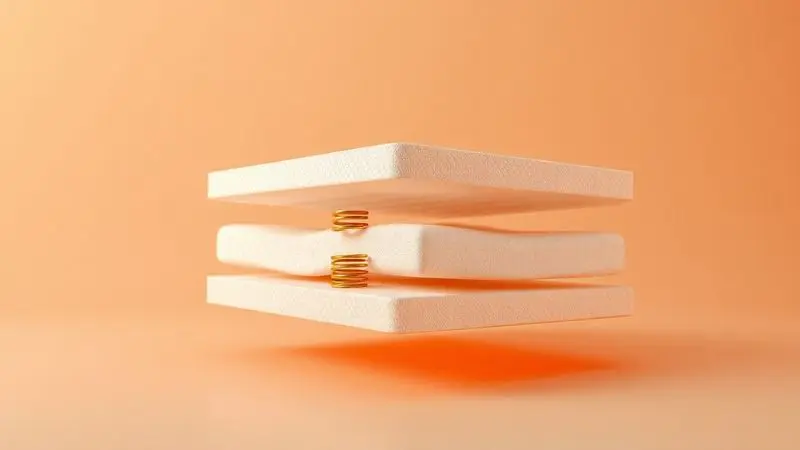
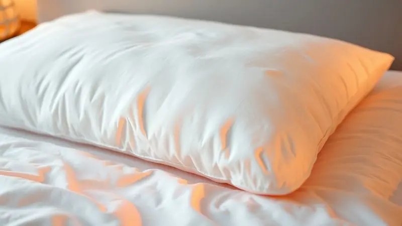
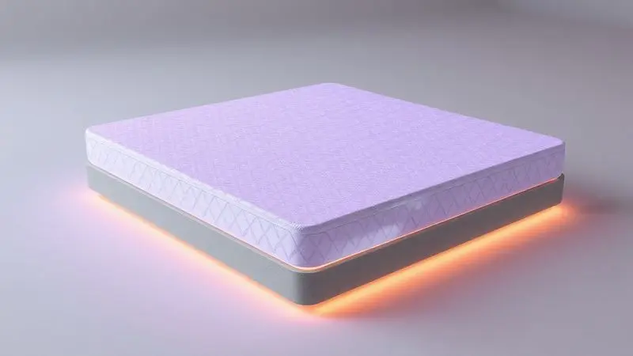

Escolher o colchão ideal é uma das decisões mais importantes para a sua saúde e bem-estar, afinal, passamos cerca de um terço da vida dormindo.

A Castor é uma das marcas mais tradicionais e respeitadas do Brasil, mas com tantas opções de densidade, molas ensacadas e tecnologias exclusivas, surge a dúvida: qual o melhor colchão Castor para o meu perfil?

Neste guia completo, analisamos detalhadamente os modelos de maior destaque no mercado, comparando desde os clássicos de espuma D45 até as modernas opções de molas pocket com viscoelástico. Descubra agora qual deles garantirá a noite de sono perfeita para você.

<SummaryList products={frontmatter.top_products} />

## Diferenciais dos Colchões Castor: Tradição e Qualidade

Mais de seis décadas de história não se constroem ao acaso. Os colchões Castor carregam no DNA essa tradição de qualidade, mas o que isso realmente significa para você na hora de deitar? Significa confiança.

É a certeza de que por trás de cada costura e de cada mola há uma pesquisa dedicada a entregar não apenas um produto, mas uma experiência de descanso.

A marca investe continuamente em tecnologia para criar soluções que vão além do conforto imediato, focando no suporte adequado que sua coluna precisa para se recuperar todas as noites.

E o melhor: essa expertise se materializa em uma variedade impressionante de materiais, desde as espumas resilientes até os sofisticados sistemas de molas, garantindo que, independente do seu gosto ou necessidade específica, exista um colchão Castor com o seu nome.

## Como Escolher o Melhor Colchão Castor para Você

Diante de tanta variedade, a escolha pode parecer complexa, mas ela se resume a um diálogo íntimo com suas próprias necessidades. Comece ouvindo seu corpo. Você dorme de lado, de barriga para cima ou de bruços?

Prefere se afundar em um abraço macio ou sentir um suporte firme que sustenta sua postura? Nada substitui a experiência sensorial. Sempre que possível, visite uma loja e dedique alguns minutos para deitar no colchão.

É nele que você vai passar anos da sua vida, então valerá cada segundo desse teste.

### Escolha de Acordo com o Tamanho: Casal, Queen e King

Depois de refletir sobre a sensação ao deitar, pense no espaço que você precisa para se entregar completamente ao sono. Os modelos Casal (138 x 188 cm) são a escolha clássica e eficiente para quem não dispõe de muito espaço no quarto.

Se você e seu parceiro gostam de um pouco mais de liberdade para se movimentar sem tocar no outro a todo instante, o Queen (158 x 198 cm) oferece esse respiro extra.

Para o ápice do conforto espacial, onde até dormir de "estrela-do-mar" é possível, o King (193 x 203 cm) é o território do sono sem fronteiras, ideal para quem prioriza o luxo do espaço acima de tudo.

### Material Interno: Espuma, Molas Bonnel ou Molas Pocket Ensacadas

O coração do colchão é o que define sua personalidade. A espuma é a escolha da adaptabilidade, aquela que envolve o corpo com uma sensação acolhedora, perfeita para quem busca um toque mais suave e íntimo.

As molas Bonnel, por sua vez, são a tradição em forma de suporte: garantem firmeza e uma ventilação excelente, mantendo o colchão fresco. Já as molas pocket ensacadas são a tecnologia a serviço da harmonia a dois.

Como cada mola trabalha de forma independente, o movimento de um lado não se propaga para o outro. É a solução definitiva para casais com ciclos de sono diferentes, permitindo que um se vire sem despertar o parceiro.

### Densidade e Peso Máximo Suportado por Pessoa

A densidade é o segredo da longevidade e do suporte consistente. Pense nela como a "espinha dorsal" do colchão.

Uma densidade adequada não só previne que o colchão afunde com o tempo, criando depressões que prejudicam sua coluna, como também garante que o suporte seja uniforme.

Para quem tem um biótipo mais avantajado, optar por densidades mais altas (como a D45) não é um luxo, é uma necessidade para assegurar que o produto mantenha suas propriedades de conforto e ergonomia ao longo dos anos.

Sempre verifique o peso máximo suportado por pessoa, essa informação é um termômetro direto da robustez do produto.

### Revestimentos e Tratamentos de Saúde (Antiácaro e Antifungo)

Seu colchão deve ser um santuário de saúde, não um depósito de ácaros. Os modelos Castor levam isso a sério, incorporando tecidos com tratamentos que inibem a proliferação de ácaros, fungos e bactérias.

Para quem sofre com alergias respiratórias, rinite ou simplesmente quer um ambiente mais puro para dormir, essa não é uma característica secundária.

É um investimento direto no seu bem-estar, garantindo que todas as noites você respire um ar mais limpo e durma sobre uma superfície que resiste ativamente aos agentes que podem causar desconforto.

### Pillow Top: Conforto Extra e Praticidade

Imagine afundar a cabeça em uma nuvem macia assim que se deita. É essa a sensação que a camada adicional do Pillow Top proporciona.

Mais do que um simples acréscimo de conforto, essa tecnologia ajuda a distribuir a pressão do corpo de forma mais inteligente, minimizando pontos de tensão nos ombros e quadris.

E a praticidade acompanha: muitos desses modelos são projetados para facilitar a limpeza e a manutenção, unindo o prazer sensorial à funcionalidade do dia a dia.

## Top 10 Melhores Colchões Castor de 2025

Chegou a hora de conhecer os protagonistas. Reunimos os modelos que se destacam neste ano, cada um com sua vocação específica. Seja pela firmeza terapêutica, pelo isolamento de movimentos ou pelo conforto luxuoso, um deles tem o seu perfil escrito nas estrelas.

### 1. Colchão Castor Espuma D45 Black White AIR Double Face

<ProductBox 
  title={frontmatter.top_products[0].title} 
  image={frontmatter.top_products[0].image} 
  link={frontmatter.top_products[0].link} 
/>

Para quem acredita que firmeza é sinônimo de cuidado com a coluna, este modelo é uma lição de casa. A espuma de alta densidade D45 oferece um suporte que não negocia com a postura, ideal se você acorda com dores e suspeita que seu colchão atual é muito mole.

O diferencial double face é um trunfo para a durabilidade, permitindo que você gire o colchão periodicamente e praticamente dobre sua vida útil.

O sistema AIR, por sua vez, trabalha silenciosamente para ventilar o interior, afastando a umidade e o calor abafado que podem roubar a qualidade do seu sono. E para finalizar, os tratamentos antiácaro e antifungo fazem a sua parte na higiene.

Apenas aviso: se você é fã daquela sensação de afundar em uma nuvem, a firmeza aqui pode ser um choque inicial.

<CaixaProsContras>

**Prós:**

- Alta densidade D45 para suporte firme e duradouro.

- Uso dupla face aumenta a vida útil do produto.

- Sistema AIR para melhor circulação de ar.

- Tratamentos higiênicos antiácaro e antifungo.

**Contras:**

- A firmeza pode não agradar a todos os perfis.

- Pode ser mais pesado em comparação com colchões mais simples.

</CaixaProsContras>

### 2. Colchão Castor Espuma D45 Sleep Max

<ProductBox 
  title={frontmatter.top_products[1].title} 
  image={frontmatter.top_products[1].image} 
  link={frontmatter.top_products[1].link} 
/>

Aqui está a robustez personificada. O Sleep Max D45 é para quem não abre mão de um suporte inabalável e precisa de um colchão que aguente o tranco (até 150 kg por pessoa, para ser exato).

A espuma de densidade D45 garante um alinhamento ergonômico que é uma bênção para a coluna, especialmente para quem dorme de costas ou de bruços. O fato de ser double face novamente entra como um aliado da economia a longo prazo, prolongando os anos de conforto.

A ressalva é a mesma: essa é uma experiência de sono decididamente firme. Não espere maciez, espere suporte. E para quem precisa exatamente disso, é uma excelência.

<CaixaProsContras>

**Prós:**

- Firmeza e suporte adequados para o corpo.

- Excelente resistência e durabilidade.

- Opção double face que prolonga a vida útil.

- Várias opções de tamanho disponíveis.

**Contras:**

- Firmeza excessiva pode não agradar a todos.

- Pode ser menos macio do que outros tipos de colchões.

</CaixaProsContras>

### 3. Colchão Castor Molas Pocket Gold Star Light Stress Oxygen Plush

<ProductBox 
  title={frontmatter.top_products[2].title} 
  image={frontmatter.top_products[2].image} 
  link={frontmatter.top_products[2].link} 
/>

Este é o colchão que promete acabar com as noites de estresse. A combinação do sistema de molas pocket (que isola perfeitamente os movimentos) com a camada plush cria uma experiência de sono profundamente aconchegante e tranquila.

A grande estrela, no entanto, é a tecnologia "Light Stress Oxygen". Desenvolvida para melhorar a oxigenação sanguínea e promover relaxamento, ela tenta atacar o mal pela raiz, ajudando você a desligar de verdade.

O design one side facilita a vida, pois elimina a necessidade de virar o colchão. É, sim, um investimento em um patamar superior, mas para quem vê o sono como um ritual essencial de recuperação, cada centavo pode valer a pena.

<CaixaProsContras>

**Prós:**

- Sistema de molas ensacadas que minimiza movimentos

- Camada plush para maior conforto

- Tecnologia que melhora a circulação e reduz estresse

- Estrutura reforçada para maior durabilidade

**Contras:**

- Pode não ser a opção mais acessível

- Necessidade de cuidados específicos devido à sua composição

</CaixaProsContras>

### 4. Colchão Castor Molas Ensacadas Pocket Silver Star Air Híbrido

<ProductBox 
  title={frontmatter.top_products[3].title} 
  image={frontmatter.top_products[3].image} 
  link={frontmatter.top_products[3].link} 
/>

Imagine o equilíbrio perfeito entre suporte técnico e conforto respirável. É isso que o Silver Star Air Híbrido oferece.

As molas pocket trabalham ponto a ponto para sustentar sua coluna, enquanto as camadas de espuma de diferentes densidades garantem a adaptação perfeita ao seu contorno.

O revestimento em malha 3D e veludo não é apenas bonito, é funcional: permite que o ar circule livremente, evitando que você acorde suado no meio da noite. Com 32 cm de altura e capacidade para 130 kg por pessoa, ele impõe presença e durabilidade.

A única contrapartida é o peso, que pode tornar a movimentação um desafio, mas que também é sinal da solidez de sua construção.

<CaixaProsContras>

**Prós:**

- Excelente suporte para a coluna com o molejo Pocket.

- Materiais que garantem a ventilação e conforto térmico.

- Disponível em diversos tamanhos.

- Construído com espumas de diferentes densidades que proporcionam conforto.

**Contras:**

- Pode ser um pouco pesado para mover.

- O preço pode ser elevado em comparação a modelos mais simples.

</CaixaProsContras>

### 5. Colchão Castor Molas Ensacadas Pocket Class Euro Pillow

<ProductBox 
  title={frontmatter.top_products[4].title} 
  image={frontmatter.top_products[4].image} 
  link={frontmatter.top_products[4].link} 
/>

Este modelo é um abraço elegante. As molas pocket garantem que você e seu parceiro durmam em universos separados no que diz respeito a movimentos, enquanto o Euro Pillow Top recebe seu corpo com uma maciez imediata e acolhedora.

A firmeza é equilibrada, um meio-termo que agrada quem quer conforto sem sentir que está afundando. Os tratamentos antiácaro e antifungo incorporados ao tecido são o cuidado extra que transforma o colchão em um aliado da saúde.

É robusto, durável e, como consequência, tem um peso considerável. Mas quando você se deita e sente o isolamento completo dos movimentos ao seu lado, percebe que esse é um pequeno preço a pagar pela paz noturna.

<CaixaProsContras>

**Prós:**

- Excelente adaptação ao corpo com as molas ensacadas

- Euro Pillow Top que proporciona conforto adicional

- Tratamento antiácaro e antifungo

- Alta durabilidade e resistência

**Contras:**

- Pode ser um pouco pesado para manusear

- Variedade nas especificações dependendo do modelo

</CaixaProsContras>

### 6. Colchão Castor Molas Bonnel Premium Tecnopedic Euro Pillow

<ProductBox 
  title={frontmatter.top_products[5].title} 
  image={frontmatter.top_products[5].image} 
  link={frontmatter.top_products[5].link} 
/>

Para quem aprecia a firmeza confiável das molas tradicionais, mas não abre mão de um toque de requinte, este colchão é a resposta. O sistema Bonnel com tecnologia Tecnopedic oferece uma base estável e de suporte consistente.

A camada Euro Pillow entra então como o contraponto perfeito, adicionando uma superfície macia que torna o deitar instantaneamente mais prazeroso. A combinação de densidades de espuma no interior trabalha para alinhar sua coluna sem sacrificar o conforto.

E a tecnologia Aria 3D assegura que a ventilação seja sempre eficiente, mantendo o frescor. Como é one side, você não precisará se preocupar em virá-lo, uma praticidade bem-vinda, mas que limita as opções de rotatividade.

<CaixaProsContras>

**Prós:**

- Conforto superior com camada de Euro Pillow.

- Excelente suporte e firmeza com molas Bonnel.

- Boa ventilação e antiácaro.

- Design moderno e atraente.

**Contras:**

- Por ser um modelo one side, não há opção de virar.

- Pode não ser a melhor escolha para quem prefere colchões muito macios.

</CaixaProsContras>

### 7. Colchão Castor Molas Bonnel System Class Euro Pillow

<ProductBox 
  title={frontmatter.top_products[6].title} 
  image={frontmatter.top_products[6].image} 
  link={frontmatter.top_products[6].link} 
/>

Aqui, a durabilidade clássica encontra o conforto contemporâneo. As molas Bonnel em formato de ampulheta garantem uma distribuição uniforme do peso, ajudando a minimizar pontos de pressão e proporcionando um sono mais reparador.

O Euro Pillow é o elemento que transforma essa firmeza técnica em uma experiência acolhedora. Os tratamentos contra ácaros e fungos são um alívio para alérgicos, contribuindo para um ambiente mais saudável.

É importante notar, porém, que o suporte é limitado a 110 kg por pessoa. Para a maioria, será mais que suficiente, mas se você está acima desse peso, pode ser interessante olhar para modelos com especificações mais robustas.

<CaixaProsContras>

**Prós:**

- Durabilidade com o sistema de molas Bonnel.

- Conforto extra devido à camada Euro Pillow.

- Tratamento contra ácaros e fungos.

- Boa distribuição de peso para um sono mais tranquilo.

**Contras:**

- Suporte de peso limitado a 110 kg por pessoa.

- Pode não ser ideal para quem busca um colchão extremamente firme.

</CaixaProsContras>

### 8. Colchão Castor Espuma D45 SR Victory Euro Pillow

<ProductBox 
  title={frontmatter.top_products[7].title} 
  image={frontmatter.top_products[7].image} 
  link={frontmatter.top_products[7].link} 
/>

Potência e conforto em uma só assinatura. O Victory Euro Pillow une a densidade poderosa da D45 (suporta até 150 kg) com a maciez reconfortante de um Pillow Top europeu.

É o modelo para quem precisa de um suporte sério, mas recusa a ideia de dormir em uma superfície dura. O tecido Jacquard/Malha, com seus tratamentos antiácaro e antifungo, completa o pacote de cuidados.

Por ser "One Side", a manutenção é simplificada, mas você perde a opção de rotacioná-lo. A firmeza, ainda que amortecida pelo Pillow Top, é perceptível.

Quem está migrando de um colchão muito macio pode precisar de um período de adaptação, mas sua coluna certamente agradecerá.

<CaixaProsContras>

**Prós:**

- Alta densidade (D45) adequada para suportar até 150 kg.

- Pillow Top Europeu para maior conforto.

- Tecido com tratamento antiácaro e antifungo.

- Disponível em diversos tamanhos.

**Contras:**

- Modelo "One Side" que limita a rotação.

- Pode ser considerado firme demais para alguns usuários.

</CaixaProsContras>

### 9. Colchão Castor Molas Bonnel Revolution Euro Pillow

<ProductBox 
  title={frontmatter.top_products[8].title} 
  image={frontmatter.top_products[8].image} 
  link={frontmatter.top_products[8].link} 
/>

Este colchão é um convite ao relaxamento profundo. O sistema Bonnel oferece um suporte progressivo e durável, enquanto o acabamento em Euro Pillow cria uma sensação de colo macio que torna o adormecer um verdadeiro prazer.

Os tratamentos antiácaro, antialérgico e antibacteriano são diferenciais importantes para quem prioriza a saúde no ambiente do sono. Com capacidade de suporte que varia entre 105 kg e 130 kg, ele atende a uma ampla gama de pessoas.

O perfil é decididamente macio, o que pode não combinar com quem busca firmeza ortopédica. Mas se o seu objetivo é afundar em um mar de conforto após um dia longo, este pode ser o seu porto seguro.

<CaixaProsContras>

**Prós:**

- Sistema de molas Bonnel para durabilidade.

- Acabamento em Euro Pillow para maior conforto.

- Tratamentos antiácaro e antibacterianos.

- Disponível em diversos tamanhos.

**Contras:**

- O perfil macio pode não ser ideal para quem prefere colchões mais firmes.

- Algumas variações no suporte de peso podem causar confusão.

</CaixaProsContras>

### 10. Colchão Castor Sleep Max D33 Double Face

<ProductBox 
  title={frontmatter.top_products[9].title} 
  image={frontmatter.top_products[9].image} 
  link={frontmatter.top_products[9].link} 
/>

Para quem busca um excelente custo-benefício sem abrir mão de características importantes, o Sleep Max D33 é um candidato forte. A densidade D33 oferece um suporte firme e correto para a postura, aliviando pontos de pressão de forma eficiente.

A opção double face é um trunfo valioso, estendendo a vida útil do produto de forma prática. O revestimento matelassado em poliéster dá um toque de sofisticação visual, enquanto os tratamentos antiácaro e antifungo cuidam da higiene.

A firmeza é uma característica marcante, então se você sonha com um colchão fofinho, este não é para você. Mas se valoriza um suporte honesto e duradouro por um investimento mais acessível, ele merece sua atenção.

<CaixaProsContras>

**Prós:**

- Oferece bom suporte devido à densidade D33.

- Modelo double face prolonga a vida útil do colchão.

- Revestimento matelassado que proporciona conforto.

- Tratamentos antiácaros e antifungos para maior higiene.

**Contras:**

- Firmeza alta pode não agradar a todos os gostos.

- Possivelmente não é adequado para quem busca um colchão extremamente macio.

</CaixaProsContras>

## Comparativo: Afinal, é melhor comprar Ortobom ou Castor?

A batalha entre duas gigantes do setor muitas vezes se reduz à sua filosofia pessoal de sono.

A Ortobom é amplamente reconhecida por suas inovações em conforto e tecnologias que moldam ao corpo, como o viscoelástico e o látex, sendo frequentemente a escolha de quem prioriza a sensação de adaptação e alívio de pressão.

A Castor, por sua vez, construiu sua reputação sobre os pilares da durabilidade e resistência, oferecendo produtos com uma relação custo-benefício muito atraente e um foco claro em suporte estrutural.

Ambas possuem linhas completas que atendem a necessidades ortopédicas.

No final, a decisão passa pelo seu orçamento, pela sua sensibilidade tátil (prefere o abraço do viscoelástico ou a firmeza da espuma D45?) e, claro, pela análise concreta das especificações de cada modelo que cair no seu gosto.

## Qual é o melhor colchão Castor para a coluna?

O melhor colchão Castor para a sua coluna é aquele que entende a diferença entre ser macio e ser suportivo.

Modelos como as linhas Plus, com espuma de alta densidade, ou aqueles equipados com molas pocket, se destacam por oferecer um suporte ortopédico que mantém a coluna alinhada, independente da posição em que você dorme.

Eles trabalham para distribuir o peso de forma equilibrada, evitando que vértebras e discos sejam sobrecarregados em pontos específicos.

A chave é encontrar o equilíbrio pessoal entre a firmeza necessária para esse suporte e o nível de conforto superficial que faz você sentir prazer em deitar. Escute seu corpo, considere seu peso e suas dores existentes.

O colchão certo não vai magicamente curar tudo, mas vai criar as condições ideais para que seu corpo se recupere todas as noites.

## Conclusão

Escolher um colchão Castor é mais do que selecionar um produto, é iniciar um relacionamento de anos com o seu próprio descanso.

Ao longo deste guio, você viu que por trás da tradição da marca existe uma diversidade cuidadosamente planejada: desde a firmeza terapêutica das espumas D45, que desafiam o tempo, até a tecnologia inteligente das molas pocket, que garantem paz mesmo no sono compartilhado.

Cada tratamento antiácaro, cada camada de Pillow Top, cada sistema de ventilação existe com um propósito: transformar suas horas na cama em um ritual genuíno de recuperação.

A resposta para "qual o melhor colchão Castor" não está em uma lista, mas dentro de você. Está na forma como você dorme, no peso que seu corpo precisa suportar, na sensação que traz paz ao seu espírito ao anoitecer. Use os critérios que detalhamos como um mapa.

Visite uma loja, deite-se, feche os olhos e imagine acordar revigorado por anos a fio. O investimento em um bom colchão é um investimento em você mesmo.

Agora, com todas as informações em mãos, você está pronto para tomar a decisão que vai mudar, noite após noite, a qualidade do seu sono e, por consequência, da sua vida.