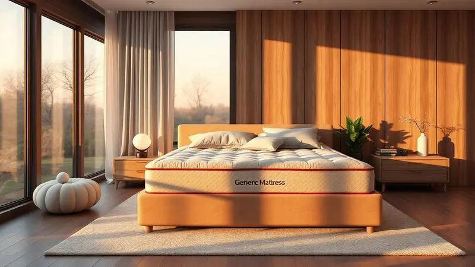

Se você está em busca de uma noite de sono verdadeiramente revigorante e se deparou com o modelo premium Kingdom Aloe Vera Castor, a dúvida sobre seu valor é natural. Afinal, promessas de luxo e tecnologia costumam soar distantes da realidade do seu dia-a-dia.

É justamente essa lacuna que vamos explorar, desvendando se as especificações técnicas, do sistema de molas pocket ao tecido com Aloe Vera, realmente se traduzem em conforto e durabilidade palpáveis para você.

<SummaryList products={frontmatter.top_products} />

## O Colchão Castor Kingdom Aloe Vera é bom?

<ProductBox 
  title={frontmatter.top_products[0].title} 
  image={frontmatter.top_products[0].image} 
  link={frontmatter.top_products[0].link} 
/>

A resposta vai além do simples "é bom" ou "é ruim". Este colchão é uma proposta de transformação no seu descanso.

Imagine dormir em um tecido que não apenas é macio, mas que carrega o extrato de Aloe Vera, aquela sensação refrescante e de cuidado que você busca para sua pele acontece naturalmente, sem que você precise pensar nisso.

O sistema de molas Pocket® é como um abraço individual para cada ponto do seu corpo: ele oferece suporte anatômico preciso enquanto praticamente elimina a transferência de movimento, perfeito para quem divide o espaço com outra pessoa.

Essa experiência vem com uma característica importante: a firmeza. Para alguns, ela pode ser um ajuste inicial; para quem convive com dores nas costas, é a certeza de que sua coluna será protegida, não apenas acomodada.

E quando pensamos em investimento, o design double face não é apenas um detalhe, é um compromisso com durabilidade, garantindo que essa qualidade se mantenha ao longo do tempo.

<CaixaProsContras>

**Prós:**

- Tecido com Aloe Vera que ajuda na hidratação da pele.

- Sistema Pocket® que melhora o suporte e minimiza movimentos.

- Acabamento artesanal que agrega valor estético.

- Durabilidade prolongada com o design double face.

**Contras:**

- Firmeza pode não agradar a todos os usuários.

- Não é o modelo mais acessível do mercado.

</CaixaProsContras>

### Principais Características e Vantagens

Tudo que mencionamos sobre conforto e suporte tem uma base técnica sólida. As propriedades hipoalergênicas do material significam, na prática, que você pode respirar tranquilo mesmo se tem alergias ou sensibilidades, o colchão trabalha para não ser um agravante.

A espuma de alta resiliência não é apenas densa; ela tem a inteligência de oferecer resistência adequada onde sua coluna precisa, adaptando-se sem perder sua estrutura.

E o revestimento com Aloe Vera? Ele vai além do marketing. O toque macio que você sente vem acompanhado de benefícios antibacterianos e anti-inflamatórios, criando um ambiente mais saudável diretamente onde você passa horas repousando.

Quando juntamos isso com a promessa de durabilidade, temos um produto que não busca apenas ser confortável hoje, mas permanecer confortável por anos.

## Resenha Colchão Kingdom Aloe Vera Castor

Depois de entender como cada tecnologia funciona, como elas se traduzem na experiência real?

O primeiro contato é marcado pelo tecido: a sensação refrescante do extrato de aloe vera não é apenas uma promessa, ela se manifesta como um frescor discreto que acompanha você durante a noite.

O poliéster na construção garante que essa experiência não se degrade rápido, a resistência e durabilidade são percebidas na falta de deformações com o tempo.

Mas o verdadeiro teste acontece quando você se acomoda. O sistema de ventilação integrado não trabalha apenas para "evitar calor"; ele mantém uma temperatura equilibrada, fazendo com que seu corpo não precise lutar contra o ambiente para encontrar o conforto ideal.

É essa sinergia entre materiais e design que transforma o colchão de uma "opção interessante" para uma escolha que realmente harmoniza conforto com saúde do sono.

## Mais informações

Para quem busca detalhes sobre como essa combinação funciona no nível material, a base está na fusão entre óleo de mamona e extrato de aloe vera.

Não são apenas ingredientes naturais; eles carregam propriedades hipoalergênicas e de regulagem térmica que operam silenciosamente.

Em vez de apenas "resfriar" ou "aquecer", essa composição ajuda seu corpo a manter sua temperatura natural durante a noite, reduzindo os micro-despertares que acontecem quando você sente desconforto.

E a camada de espuma adaptativa? Ela não apenas "molda" ao seu corpo; ela alivia pontos de pressão específicos, como ombros e quadril, distribuindo o peso de forma inteligente. Isso significa menos tensão acumulada e um descanso que respeita sua anatomia.

Quando você prioriza saúde no descanso, esses detalhes fazem toda a diferença entre dormir e realmente restaurar-se.

## Avaliações

O que os usuários que já investiram neste colchão percebem? A palavra "conforto" aparece frequentemente, mas ela vem acompanhada de "suporte", não é apenas uma sensação agradável, é a segurança de que a estrutura está trabalhando para sua coluna.

A tecnologia com gel de aloe vera realmente traz aquele toque fresco que promete, tornando o aconchego mais leve e menos "pesado".

A durabilidade é outro ponto que ganha elogios: as espumas de alta densidade não perdem sua forma rapidamente, mantendo o bom suporte mesmo após meses de uso. Essa viabilidade para o longo prazo é crucial para quem quer fazer um investimento consciente.

Porém, a firmeza mencionada anteriormente aparece como um divisor: alguns se adaptam rapidamente e encontram nela o alívio para dores; outros preferem uma sensação mais "afundável".

É justamente essa subjetividade que reforça a importância de sentir o colchão pessoalmente antes da decisão final.

## Conclusão

O Colchão Kingdom Aloe Vera Castor não é apenas um produto com tecnologias avançadas; é uma proposta de como você pode transformar suas horas de descanso.

Ele reúne o cuidado com a pele através do Aloe Vera, o respeito à sua anatomia com o sistema Pocket®, e a inteligência térmica com materiais reguladores.

Para quem busca um investimento que equilibre conforto imediato com durabilidade futura, ele representa uma opção sólida.

Se você convive com dores nas costas ou valoriza um ambiente hipoalergênico, essas características se tornam decisivas. A firmeza pode ser um ponto de adaptação, mas para muitos é o elemento que faltava em outros colchões.

O caminho final, como sempre, é pessoal: experimentar permite sentir se essa combinação de tecnologias realmente conversa com seu corpo. Sua próxima noite de sono pode estar esperando nesse equilíbrio entre ciência e cuidado natural.