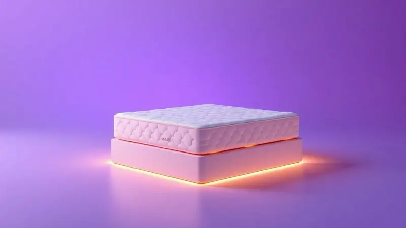

O mercado de sono foi revolucionado pela chegada do colchão na caixa, uma inovação que une tecnologia, conforto e uma praticidade sem precedentes.

Mas, diante de tanta novidade, é natural questionar: será que comprimir algo tão pessoal como seu colchão não compromete sua qualidade? Muitos temem que o processo de compressão possa afetar a durabilidade ou deixar o suporte insuficiente.

Vamos desmistificar essa tecnologia mostrando quais são os reais benefícios que fazem valer o investimento, desde a facilidade que você terá no dia da entrega até a economia que sentirá na sua conta.

Prepare-se para descobrir como uma simples caixa pode transformar completamente suas noites.

<SummaryList products={frontmatter.top_products} />

## O que é colchão na caixa?

<ProductBox 
  title={frontmatter.top_products[0].title} 
  image={frontmatter.top_products[0].image} 
  link={frontmatter.top_products[0].link} 
/>

Imagine receber um colchão de alta qualidade que, em vez de exigir três pessoas para carregar pelas escadas do seu prédio, chega em uma caixa compacta que você mesmo consegue levar para o quarto. Essa é a essência do colchão na caixa.

Ele é projetado para ser comprimido a vácuo, enrolado e cuidadosamente embalado, tudo para que a jornada desde a fábrica até sua cama seja a mais simples possível.

Ao abrir a embalagem e cortar o plástico protetor, você testemunha uma transformação fascinante enquanto o produto se expande e recupera seu formato original, pronto para proporcionar o conforto que promete.

A beleza dessa tecnologia vai além da logística. Fabricantes utilizam materiais inteligentes, como espuma viscoelástica, que já são conhecidos por sua capacidade de adaptação.

A compressão, portanto, é apenas uma fase temporária do processo, não afetando a integridade estrutural ou as propriedades de conforto do produto. É uma combinação perfeita entre engenharia moderna e o desejo ancestral de uma boa noite de sono.

<CaixaProsContras>

**Prós:**

- Facilita o transporte e manuseio

- Chega embalado de forma prática

- Muitas opções com tecnologias avançadas

- Geralmente oferece períodos de teste

**Contras:**

- Pode demorar um pouco para expandir completamente

- Alguns modelos podem não ser adequados para todos os tipos de corpo

</CaixaProsContras>

### Colchão na caixa é bom?

A resposta curta é um retumbante sim. Mas o que realmente define algo como 'bom' quando falamos de algo tão subjetivo quanto o sono? A questão vai muito além da compressão. A verdadeira medida está em como essa inovação resolve problemas reais do seu dia a dia.

Você já precisou se desdobrar para subir um colchão tradicional por uma escada em espiral ou pagou uma fortuna em frete porque a embalagem era enorme? Essas dores de cabeça simplesmente desaparecem.

Mais importante ainda, o conceito democratizou o acesso a materiais de alta performance, como a espuma viscoelástica, que antes eram privilégio de marcas muito caras. A pergunta, portanto, não é se o colchão é bom, mas se ele é a solução ideal para o seu estilo de vida.

A partir de agora, vamos mostrar por que ele provavelmente é.

## 5 motivos que tornam o colchão na caixa perfeito para você

Mais do que uma lista de características, esses motivos formam uma sequência de alívios. Cada um deles resolve uma frustração específica da compra tradicional de um colchão, criando uma experiência que faz você se perguntar: como eu vivia sem isso antes?

### 1. O colchão na caixa mantém a qualidade

Seu maior medo, aquele de que o colchão chegará 'amassado' ou perderá sua firmeza, é compreensível. No entanto, a tecnologia por trás do processo é extremamente precisa.

Materiais como espuma viscoelástica e látex são projetados para ter memória elástica, o que significa que sua estrutura celular se recupera completamente após a compressão. É como uma esponja de alta qualidade que, mesmo espremida, sempre volta à sua forma original.

Fabricantes investem em pesquisas rigorosas para garantir que cada camada do colchão expanda de maneira uniforme, assegurando que o suporte para suas costelas e a maciez para seus ombros sejam exatamente como os engenheiros projetaram.

A garantia de longa duração, muitas vezes oferecida por décadas, é o selo final de confiança de que a qualidade está intacta.

### 2. Facilidade de transporte

Lembra da última vez que comprou um móvel grande e teve que reorganizar sua agenda para receber a entrega, preocupado se o caminhão caberia na sua rua ou se os entregadores conseguiriam passar pela porta? Com um colchão na caixa, essa ansiedade simplesmente não existe.

A caixa compacta cabe no elevador, no porta-malas de um carro comum e, se você mora em um apartamento sem elevador, pode carregá-la degrau por degrau sem precisar chamar os amigos para ajudar.

A leveza da embalagem transforma um evento logístico complexo em uma tarefa simples, que você mesmo pode resolver em uma tarde. Essa liberdade não tem preço.

### 3. Economia de espaço

Para quem vive em apartamentos compactos ou divide o espaço com outras pessoas, a ideia de receber um colchão enorme pode ser aterrorizante. Onde você vai deixar aquilo até conseguir montar a cama? A caixa resolve esse dilema elegantemente.

Ela ocupa um canto discreto, permitindo que você se organize no seu próprio tempo. Essa praticidade é uma bênção para quem se muda com frequência, estudantes ou pessoas que simplesmente valorizam um lar desimpedido.

Mais do que um produto, você está comprando flexibilidade e paz de espírito.

### 4. Montagem facilitada

A experiência de desembalar um colchão na caixa é quase mágica. Não há parafusos para apertar, estruturas pesadas para levantar ou instruções confusas para decifrar. Você simplesmente posiciona a caixa sobre o estrado da cama, abre, corta o plástico e observa.

Em questão de horas, o colchão cresce diante dos seus olhos, assumindo sua forma final. Não é preciso ser habilidoso ou ter ferramentas especiais. A única 'montagem' necessária é ter um pouco de paciência para deixar o produto respirar e expandir completamente.

É a simplicidade em sua forma mais pura.

### 5. Economia de frete

Quando um produto é embalado de forma compacta e eficiente, os custos de transporte caem drasticamente. A empresa economiza, e essa economia é repassada diretamente para você.

O valor que você deixa de gastar com um frete caro e especializado pode ser realocado para algo que realmente agrega valor à sua experiência de sono.

Pense em um jogo de lençóis de algodão egípcio de alta linha, uma capa protetora premium ou até mesmo um travesseiro com tecnologia de resfriamento.

Você está não apenas comprando conforto, mas também obtendo um poder de compra extra para personalizar seu santuário do sono exatamente como sempre sonhou.

## Onde comprar colchão na caixa?

O acesso a essa inovação nunca foi tão democrático. As principais marcas do segmento operam através de seus sites oficiais, onde você encontra toda a gama de produtos, detalhes técnicos completos e, o mais importante, políticas de teste generosas.

Grandes marketplaces também oferecem uma variedade impressionante, facilitando a comparação de preços e avaliações de outros clientes.

Para os mais tradicionais, algumas lojas físicas já abraçaram a tendência e mantêm unidades de exibição, permitindo que você sinta o toque e a firmeza antes de pedir a versão compactada para entrega.

A escolha do canal depende apenas de como você prefere fazer suas compras: com a conveniência do clique ou com a segurança do toque.

### Encontre o melhor colchão na caixa para você!

Toda essa conversa sobre praticidade e economia só faz sentido se o produto final atender às necessidades únicas do seu corpo. Comece entendendo seu perfil: você dorme de lado e precisa de um colchão mais macio para acomodar os ombros?

Prefere algo mais firme para o apoio lombar? Modelos de espuma viscoelástica são campeões em alívio de pressão, enquanto os híbridos, com suas camadas de molas, oferecem uma firmeza consistente e uma ventilação superior. Use o período de teste a seu favor.

Durma nele por algumas semanas, preste atenção a como você acorda. Não tenha medo de trocar se não sentir que é a combinação perfeita. Afinal, você está escolhendo um parceiro para um terço da sua vida.

## Conclusão

O colchão na caixa representa muito mais que uma tendência passageira do mercado. Ele é a materialização de uma mudança de mentalidade, que coloca a experiência do consumidor e a inteligência no design no centro da produção.

É uma solução que entende as dores reais de quem precisa de um bom colchão: a logística complicada, o espaço limitado, o orçamento apertado e, acima de tudo, a busca incansável por um descanso verdadeiramente restaurador.

Ao escolher um modelo que vem em uma caixa, você não está apenas optando por conforto. Está optando por conveniência, por economia e por uma promessa de que noites melhores não precisam ser complicadas de alcançar. O convite está feito.

Agora, é só abrir a caixa e descobrir como será acordar revigorado amanhã.