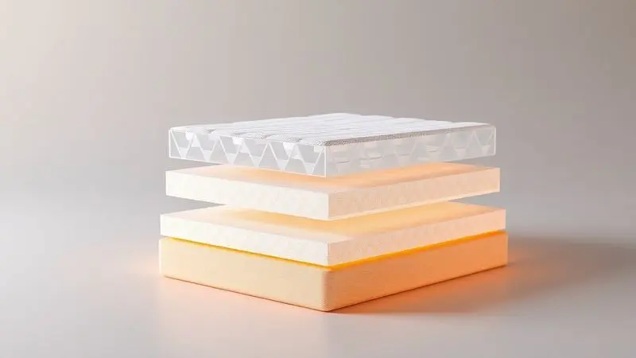
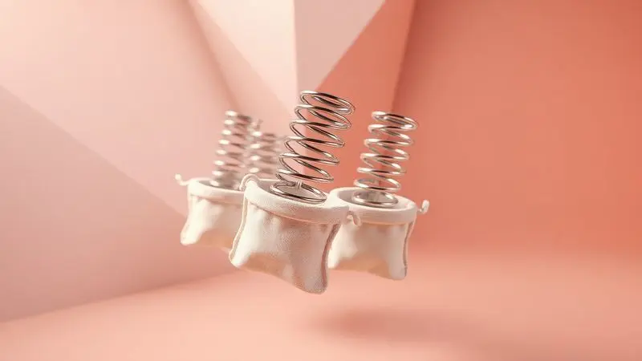
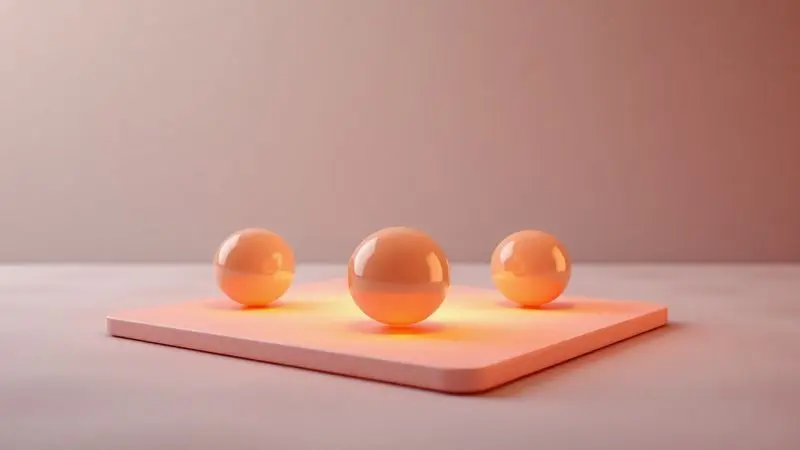
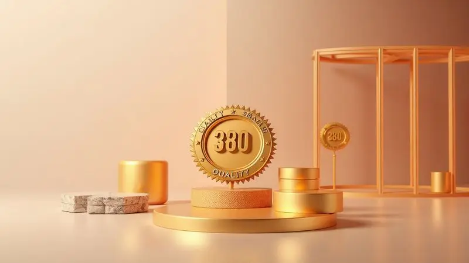

Escolher um colchão é uma das decisões mais importantes para a saúde e o bem-estar diário, mas com tantas opções no mercado, a dúvida 'esse modelo é bom?' é inevitável.

O Colchão Castor Premium Gel surge como uma promessa de sofisticação e frescor, combinando as famosas molas pocket ensacadas com uma camada de espuma tecnológica de gel.

Mas será que ele realmente entrega o suporte necessário para uma noite de sono reparadora e mantém a temperatura agradável?

Neste review, vamos analisar cada detalhe técnico, do acabamento à durabilidade, para que você descubra se este investimento vale a pena para o seu perfil de sono.

<SummaryList products={frontmatter.top_products} />

## O que é o Colchão Castor Premium Gel?

<ProductBox 
  title={frontmatter.top_products[0].title} 
  image={frontmatter.top_products[0].image} 
  link={frontmatter.top_products[0].link} 
/>

Quando você imagina um colchão que equilibra firmeza com conforto, o Castor Premium Gel aparece como uma resposta.

Esta opção de alta qualidade alia molas ensacadas independentes com espuma de alta densidade, criando uma base que se adapta ao seu corpo enquanto oferece suporte consistente.

O segredo está na tecnologia de gel que dissipa o calor corporal, garantindo que você não precise disputar espaço na cama com a sensação de abafamento. Imagine acordar revigorado, sem aquela pele pegajosa que te faz levantar já cansado.

Com acabamento em tecidos como o Argentum, que possui propriedades antibacterianas, você ganha não apenas conforto, mas também higiene. Muitos modelos ainda oferecem a vantagem da dupla face, estendendo sua vida útil de forma inteligente.

Os usuários costumam elogiar justamente esse equilíbrio entre suporte firme e acolhimento reconfortante.

<CaixaProsContras>

**Prós:**

- Tecnologia de gel que mantém a temperatura agradável durante o sono.

- Molas ensacadas que oferecem suporte personalizado e minimizam a transferência de movimento.

- Acabamento com tecidos antibacterianos para maior higiene.

- Opções de dupla face que aumentam a durabilidade do produto.

**Contras:**

- O preço pode ser um pouco elevado em comparação a modelos mais simples.

- Pode não ser ideal para quem prefere colchões extremamente macios.

</CaixaProsContras>

## Ficha Técnica e Tecnologia de Conforto

Aqui é onde o Castor Premium Gel revela sua engenharia inteligente. Mais do que um simples conjunto de materiais, ele usa camadas estrategicamente organizadas para criar uma experiência de sono que respeita sua anatomia enquanto controla seu conforto térmico.

### Molas Pocket Ensacadas Individualmente

Cada mola funciona como um pequeno sistema de suporte independente, adaptando-se especificamente às áreas de maior pressão do seu corpo.

Quando você se deita, essas molas respondem individualmente ao seu peso e formato, distribuindo a carga de maneira uniforme e minimizando pontos de desconforto.

Se você dorme com alguém, vai apreciar como essa independência reduz drasticamente a transferência de movimento. Você vira para o lado, ele continua dormindo profundamente, sem aquelas ondulações que interrompem o sono do parceiro.

Além desta vantagem prática, a configuração favorece a ventilação interna, criando um ecossistema respirável que evita o acúmulo de umidade.

### Camada de Espuma Premium Gel e Termorregulação

Enquanto as molas cuidam do suporte, a espuma com tecnologia de gel assume o papel do regulador térmico.

Esta camada não apenas se molda aos seus contornos para aliviar a pressão em ombros e quadris, mas age como um climatizador pessoal, dissipando o calor acumulado durante a noite.

O resultado? Mesmo durante as noites mais quentes, você mantém aquela sensação fresca que convida ao sono profundo. É como ter um colchão que respira junto com você, adaptando-se não só ao seu corpo, mas também ao seu ritmo térmico natural.

### Estrutura Polyframe e Estabilidade Lateral

A base que sustenta toda essa tecnologia é igualmente importante. O Polyframe cria uma estrutura sólida que mantém o colchão estável, mesmo quando você se aproxima das bordas.

Essa estabilidade lateral significa que não há áreas esquecidas, sem aquela sensação de que a cama vai ceder quando você se move durante a noite.

Para quem precisa de apoio extra na hora de se levantar ou simplesmente gosta de usar toda a superfície do colchão, essa característica faz toda diferença. A coluna se mantém alinhada, a distribuição de peso é uniforme, e você ganha segurança em cada movimento.

### Pillow Top One Side e Tecido Matelassê

Como toque final de conforto, o design inclui o Pillow Top em uma das faces, oferecendo uma camada extra de maciez sem comprometer o suporte.

Este acolhimento adicional é especialmente bem-vindo para quem dorme de lado, protegendo pontos de pressão sensíveis como ombros e quadris.

O tecido matelassê completa a experiência com um toque suave e respirável, trabalhando em conjunto com a tecnologia de gel para manter o conforto térmico.

A combinação cria uma superfície que convida ao relaxamento, onde cada detalhe foi pensado para transformar seu descanso em uma experiência completa.

## Avaliação do Nível de Firmeza e Suporte de Peso

Classificado como médio em firmeza, o Castor Premium Gel encontra seu ponto ideal ao equilibrar suporte e adaptabilidade.

Para quem dorme de lado ou de costas, essa característica é particularmente valiosa, pois permite que a coluna se mantenha alinhada enquanto o corpo encontra acomodação confortável.

A tecnologia de gel desempenha um papel duplo aqui, dissipando a pressão enquanto regula a temperatura.

Independentemente do seu peso ou posição preferida para dormir, o colchão mantém sua integridade estrutural, prometendo não apenas uma noite de conforto, mas anos de suporte consistente.

## Durabilidade e a Excelência da Marca Castor

Investir em um colchão é como fazer uma aposta no seu próprio bem-estar futuro. Com a Castor, essa aposta é respaldada por uma reputação construída através de materiais de alta tecnologia e testes rigorosos de qualidade.

A durabilidade não é apenas uma promessa, mas uma característica projetada desde a concepção do produto.

A robustez da construção, aliada à possibilidade de uso dupla face, transforma esse colchão em um companheiro de longo prazo para suas noites de descanso.

Quando você escolhe uma marca reconhecida no mercado, está escolhendo mais do que um produto, está optando pela tranquilidade de saber que seu investimento será honrado ano após ano.

## Veredito Final: O Colchão Castor Premium Gel é bom?

O Castor Premium Gel cumpre sua promessa de oferecer uma experiência de sono superior.

Se você busca um equilíbrio perfeito entre suporte firme e conforto adaptativo, com o bônus de um controle térmico que transforma noites quentes em momentos de frescor, este colchão merece sua atenção.

A combinação inteligente de molas pocket independentes, espuma de gel termorreguladora e construção robusta cria um ecossistema de descanso que respeita suas necessidades individuais.

Para casais, a redução na transferência de movimento é um diferencial transformador, enquanto a durabilidade comprovada da marca oferece paz de mente a longo prazo.

Antes de decidir, considere seu perfil específico: se você prefere colchões extremamente macios, talvez queira testar pessoalmente.

Mas se busca qualidade, tecnologia e um investimento que se paga em noites bem dormidas, o Castor Premium Gel se apresenta como uma escolha que honra seu compromisso com seu próprio descanso.

## Conclusão

Ao final desta análise, fica clara a proposta do Colchão Castor Premium Gel: não se trata apenas de um lugar para dormir, mas de uma solução pensada para quem valoriza qualidade de vida através do descanso.

As tecnologias integradas conversam entre si para criar uma experiência que vai além do básico, oferecendo controle térmico, suporte personalizado e durabilidade confiável.

Você merece acordar renovado, sem dores ou sensação de calor excessivo. Se está disposto a investir em um produto que entrega não apenas conforto imediato, mas consistência ao longo dos anos, este colchão representa uma escolha inteligente.

A decisão final será sua, mas agora você tem todas as informações para fazer uma escolha que realmente converse com suas necessidades de sono.