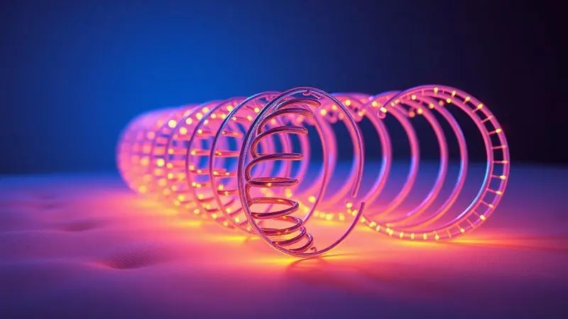
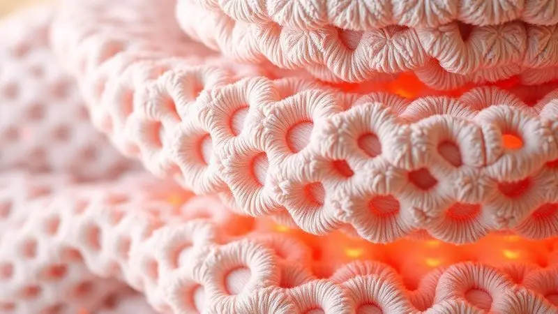

Escolher o colchão certo vai muito além de comprar um produto. É investir na qualidade das suas próximas milhares de horas de descanso, na disposição para enfrentar o dia e no bem-estar que você carrega nas costas ao acordar.

O Colchão Castor Premium Molas Tecnopedic surge nesse cenário com uma proposta clara: oferecer tecnologia de ponta sem abrir mão do conforto que seu corpo merece. Mas será que ele cumpre essa promessa?

Nesta análise, vamos além das especificações técnicas para descobrir como esse colchão se traduz na experiência real de dormir, e se ele pode ser a peça que falta no seu quarto para noites verdadeiramente reparadoras.

<SummaryList products={frontmatter.top_products} />

## O que é o Colchão Castor Premium Molas Tecnopedic?

<ProductBox 
  title={frontmatter.top_products[0].title} 
  image={frontmatter.top_products[0].image} 
  link={frontmatter.top_products[0].link} 
/>

Imagine um sistema inteligente que se molda exatamente ao seu corpo, como uma segunda pele que sabe onde você precisa de mais apoio e onde pode relaxar completamente. É assim que o Castor Premium opera.

O coração desse colchão bate com a tecnologia de molas Tecnopedic®, desenvolvidas para oferecer uma firmeza que não é rígida, mas adaptativa.

Elas trabalham em conjunto, distribuindo seu peso de forma uniforme e criando uma base estável que evita aquela sensação de "afundar" em determinados pontos.

Para completar, as camadas de espuma e os revestimentos respiráveis criam um microclima ideal para o sono. Eles permitem que o ar circule, evitando o calor excessivo e a umidade que podem roubar o seu descanso profundo. O resultado?

Uma superfície que parece ter sido projetada especialmente para o seu biotipo e suas preferências pessoais de conforto.

<CaixaProsContras>

**Prós:**

- Conforto equilibrado com suporte firme.

- Tecnologia de molas que reduz a transferência de movimento.

- Revestimento respirável que promove ventilação.

- Tratamentos higiênicos que previnem microrganismos.

**Contras:**

- Pode ser considerado firme demais para quem prefere colchões mais macios.

- As opções de altura podem ser limitadas em alguns modelos.

</CaixaProsContras>

O equilíbrio entre essas características positivas e as considerações a fazer define o perfil ideal de quem mais se beneficiará com essa escolha, algo que exploraremos detalhadamente a seguir.

## Tecnologia de Molas Tecnopedic: O Diferencial da Castor

Você já passou pela frustração de ser acordado toda vez que seu parceiro se vira na cama? Essa tecnologia foi criada para acabar com esse problema. As molas Tecnopedic funcionam como unidades independentes que respondem separadamente à pressão exercida sobre elas.

Quando uma pessoa se move, apenas as molas daquela região reagem, mantendo o resto da superfície imóvel.

Essa inteligência mecânica vai além do conforto para casais. Ela se traduz em suporte ortopédico preciso para seu corpo, aliviando pontos de pressão nos ombros, quadril e lombar, áreas que mais sofrem durante o sono.

A combinação dessa estrutura com camadas estratégicas de espuma cria uma durabilidade que você sente a cada noite, como se o colchão fosse novo mês após mês.

## Camadas Internas e Estofamento de Espuma

Por dentro, o Castor Premium é como uma arquitetura sofisticada projetada para o descanso. Cada camada tem uma função específica, trabalhando em harmonia para transformar características técnicas em sensações reais.

A espuma de alta densidade não é apenas um material, é o que garante que o colchão mantenha sua forma ano após ano, evitando aquelas depressões que aparecem em produtos de qualidade inferior e que prejudicam o alinhamento da sua coluna.

### Densidades Utilizadas: De D20 a D45

Aqui está onde a personalização encontra a ciência do sono.

O Castor Premium oferece uma gama que vai do D20, com uma maciez convidativa para quem busca a sensação de afundar levemente em um abraço acolchoado, até o D45, que proporciona um suporte firme e resiliente ideal para quem precisa de mais estrutura para a coluna vertebral.

Essa variedade não é acidental. Ela reconhece que nossos corpos são diferentes, em peso, formato e preferências sensoriais.

Você pode escolher o nível que conversa melhor com suas necessidades específicas, seja para aliviar dores crônicas, seja simplesmente para encontrar aquela sensação perfeita ao deitar depois de um dia longo.

### Nível de Firmeza: Conforto Macio com Firmeza

A magia acontece quando o macio encontra o firme sem que um anule o outro. O Castor Premium alcança esse equilíbrio delicado através de uma combinação calculada de materiais.

A superfície acolhe seu corpo com suavidade, envolvendo-o em conforto, enquanto as camadas mais profundas garantem que sua coluna permaneça perfeitamente alinhada durante toda a noite.

Para quem sofre com dores nas costas, essa combinação é particularmente transformadora. Ela permite que músculos tensionados finalmente relaxem, enquanto as vértebras encontram o apoio que precisam para se recuperar do estresse diário.

É o tipo de diferença que você percebe não apenas ao deitar, mas principalmente ao levantar, com menos rigidez e mais disposição.

## Design e Revestimento: Euro Pillow e Malha 3D

A primeira impressão importa, especialmente quando se trata de um elemento central do seu quarto. O design do Castor Premium comunica sofisticação desde o primeiro olhar, mas sua beleza vai muito além da superfície.

A malha 3D do revestimento não é apenas estética, ela é funcional, criando milhares de microcanais que permitem que o ar circule livremente.

### Pillow Top Europeu e Acabamento Matelassê

Deitar em um colchão com Pillow Top Europeu é como adicionar uma camada extra de carinho ao seu ritual noturno.

Essa superfície acolchoada oferece uma maciez imediata que envolve seu corpo, enquanto o acabamento matelassê garante que esse conforto seja distribuído de forma uniforme.

O resultado é uma experiência tátil que transforma o simples ato de deitar em um momento de genuíno prazer.

Além do conforto sensorial, esse design inteligente ajuda a preservar a integridade estrutural do colchão. O matelassê mantém as camadas internas no lugar certo, evitando deslocamentos que poderiam criar pontos de desconforto ao longo do tempo.

É beleza que trabalha a favor da durabilidade.

### Tecido com Tratamento Antiácaro e Antifungo

Para quem luta contra alergias, o quarto pode ser um campo minado de espirros e noites mal dormidas. O tecido especial do Castor Premium foi desenvolvido como uma barreira ativa contra esses inimigos invisíveis do sono.

O tratamento antiácaro e antifungo cria um ambiente hostil para esses microorganismos, reduzindo significativamente os gatilhos alérgicos que podem roubar seu descanso.

Essa proteção é combinada com a respirabilidade que mencionamos anteriormente, criando um ciclo virtuoso: menos umidade significa menos proliferação de ácaros, e menos ácaros significa noites mais tranquilas.

Você respira melhor, dorme melhor e acorda renovado, sem precisar recorrer a medicamentos ou soluções paliativas.

## Especificações Técnicas e Suporte de Peso

Os números contam uma história importante sobre confiança e capacidade.

Com uma estrutura projetada para suportar até 120 kg por pessoa, o Castor Premium oferece a tranquilidade de saber que ele será seu parceiro confiável, independentemente do seu biotipo ou de como seu peso se distribui.

### Suporte de até 120 kg por pessoa

Esse limite não é apenas uma especificação técnica, é uma promessa de estabilidade. Significa que o colchão manterá suas propriedades ortopédicas mesmo sob pressão constante, garantindo que o suporte para sua coluna permaneça consistente noite após noite.

Para casais, essa capacidade se traduz em uma superfície que não cede no meio, evitando aquela desagradável sensação de rolar para o centro da cama.

### Sistema Polyframe: Reforço das Bordas em Espuma

Quantas vezes você já evitou sentar na beirada da cama com medo de que ela cedesse? O Sistema Polyframe foi criado para eliminar essa preocupação.

Através de um reforço estratégico com espuma de alta densidade nas bordas, o colchão ganha uma estrutura perimetral tão firme quanto seu centro.

Isso transforma toda a superfície em uma zona útil. Você pode se sentar confortavelmente para calçar os sapatos, deitar perto da beirada sem sentir que vai cair ou simplesmente aproveitar cada centímetro quadrado do investimento que fez.

É uma atenção aos detalhes que faz toda a diferença na experiência diária.

## Modo de Utilização: One Side (No Turn)

A praticidade é um luxo que valorizamos cada vez mais em nossa rotina acelerada. O design "No Turn" do Castor Premium elimina a necessidade daquela tarefa semestral de virar e rotacionar o colchão.

A tecnologia das molas e a disposição das camadas foram otimizadas para oferecer desempenho consistente utilizando apenas uma face.

Isso significa menos trabalho para você e mais tempo desfrutando do conforto que adquiriu. A ausência da necessidade de manuseio constante também reduz o desgaste físico do produto, contribuindo para sua longevidade.

É uma solução inteligente para quem busca qualidade sem complicações.

## Durabilidade e Garantia de Fábrica Castor

Investir em um colchão é uma decisão de longo prazo, e a Castor compreende essa expectativa. A construção do Premium utiliza materiais selecionados não apenas pelo conforto imediato, mas pela resistência ao teste do tempo.

Cada componente, das molas às espumas, foi escolhido considerando como ele se comportará após anos de uso contínuo.

A garantia de fábrica que acompanha o produto é o reflexo tangível dessa confiança. Mais do que uma obrigação legal, ela é um compromisso da marca com sua satisfação e tranquilidade.

Saber que você está protegido contra eventuais defeitos de fabricação permite que você durma profundamente, em todos os sentidos da expressão.

## Veredito: O Colchão Castor Premium Molas Tecnopedic vale a pena?

O Castor Premium se posiciona de forma convincente naquele ponto ideal onde tecnologia, conforto e durabilidade se encontram.

Suas molas inteligentes resolvem problemas reais de casais, seu sistema de camadas oferece personalização genuína e seus acabamentos demonstram uma atenção ao detalhe que transcende o básico.

## Conclusão

Escolher um colchão é escolher como você quer se sentir ao acordar todos os dias pelos próximos anos.

O Colchão Castor Premium Molas Tecnopedic oferece mais do que especificações técnicas, ele oferece uma experiência de sono coerente, desde a primeira noite até muito além do que a garantia cobre.

Sua capacidade de transformar características em benefícios reais (noites ininterruptas, alívio de dores, respiração melhor) faz dele uma opção que vale ser considerada seriamente.

Se você busca um equilíbrio entre inovação tecnológica e conforto humano, se valoriza a durabilidade tanto quanto a sensação inicial ao deitar, e se acredita que o investimento em um bom sono é o melhor presente que pode dar a si mesmo, o Castor Premium merece seu olhar atento.

Ele não é apenas um colchão, é um parceiro silencioso no seu caminho rumo a noites mais reparadoras e manhãs mais produtivas.

A decisão final, é claro, sempre considerará suas necessidades específicas, mas uma coisa é certa: esse é um produto que entende que dormir bem é viver melhor.