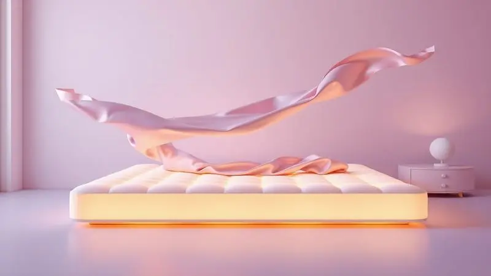

Escolher o colchão certo vai muito além de simples conforto, é um investimento na sua saúde e bem-estar diário. Quando cada manhã começa com dores nas costas ou com a sensação de que não descansou de verdade, você percebe que a cama está roubando sua energia.

No mercado brasileiro, a Castor se tornou referência com suas tecnologias exclusivas, mas muitas pessoas ficam perdidas entre tantas opções. Molas Tecnopedic realmente funcionam? O sistema Pocket vale o investimento?

Se você está dividido entre o Revolution e o Bonnel Premium, ou simplesmente quer entender qual tecnologia se encaixa no seu jeito de dormir, chegou ao guia definitivo.

Analisamos cada detalhe técnico para traduzi-lo em benefícios reais, aqueles que você sente quando fecha os olhos e acorda renovado.

<SummaryList products={frontmatter.top_products} />

## Molas Tecnopedic ou Pocket®? Entenda as diferenças

<ProductBox 
  title={frontmatter.top_products[0].title} 
  image={frontmatter.top_products[0].image} 
  link={frontmatter.top_products[0].link} 
/>

Imagine que seu colchão precisa fazer mais do que apenas ser macio, ele precisa ser inteligente. É aí que entram as duas principais tecnologias da Castor, cada uma com uma filosofia diferente de como seu corpo merece ser tratado durante a noite.

As molas Tecnopedic funcionam como uma equipe sincronizada. Com formato bicônico e temperadas eletronicamente, elas criam uma base de suporte firme e progressiva.

Pense nelas como a estrutura perfeita para quem acorda com dores e busca algo que realmente mantenha a coluna alinhada. A resistência é uniforme, estável e projetada para durar, praticamente eliminando aquele 'rangido' clássico dos colchões antigos.

Já as molas Pocket® pensam de forma individualista. Cada uma vive dentro de seu próprio saco de tecido, trabalhando independentemente.

O resultado é uma experiência quase personalizada: seu quadril recebe o suporte exato de que precisa, seus ombros afundam na medida certa, e o melhor, quando seu parceiro se vira ou levanta, você quase não sente.

É como ter uma ilha de conforto só para você, mesmo dividindo a cama.

A escolha, no final, reflete sua prioridade. Você valoriza mais a estabilidade absoluta e o alinhamento postural, ou o conforto anatômico e a paz de um casal que não se perturba? Ambas são excelentes, mas atendem a desejos diferentes.

<CaixaProsContras>

**Prós:**

- A firmeza das Tecnopedic elimina a sensação de 'afundar' e oferece suporte consistente para a coluna.

- O isolamento de movimento das Pocket transforma as noites de casais, garantindo um sono ininterrupto.

- Ambas são construídas com materiais premium que prometem anos de uso sem perder a qualidade original.

- A durabilidade testada significa menos preocupação com trocas a curto prazo.

**Contras:**

- Se você prefere a sensação de um 'abraço' macio ao deitar, as Tecnopedic podem parecer excessivamente firmes.

- A tecnologia avançada das Pocket se reflete em um investimento inicial mais elevado.

</CaixaProsContras>

## Colchão Casal Revolution Castor com molas Tecnopedic

<ProductBox 
  title={frontmatter.top_products[1].title} 
  image={frontmatter.top_products[1].image} 
  link={frontmatter.top_products[1].link} 
/>

Para o casal que busca equilíbrio entre robustez e aconchego, o Revolution com molas Tecnopedic é um candidato forte. Este não é apenas um colchão firme, é um colchão inteligente.

O sistema Tecnopedic® foi projetado para entender e distribuir o peso do seu corpo de forma progressiva, suportando até 130 kg por pessoa sem ceder.

A mágica acontece nas camadas. Espumas D20 e D26 trabalham juntas, criando uma superfície que é firme o suficiente para sua coluna, mas com uma amortecimento suave que evita pontos de pressão.

O toque final é o revestimento em malha e linho, uma combinação pensada para quem sofre com calor à noite. A sensação é de frescor constante, como se o ar circulasse sob você.

Com opções de 27 cm a 30 cm de altura e a flexibilidade dos modelos One Face (um lado só) ou Double Face (dois lados utilizáveis), você encontra a configuração perfeita para sua rotina.

Alguns usuários relatam que, após anos de uso, a sensação pode suavizar levemente, mas o consenso é de um conforto que permanece excepcional, prova da resiliência do seu projeto.

<CaixaProsContras>

**Prós:**

- A firmeza progressiva das molas Tecnopedic® proporciona um alinhamento postural eficiente, ideal para quem sofre com dores.

- A combinação de densidades de espuma (D20 e D26) cria um equilíbrio perfeito entre suporte e aconchego.

- O revestimento em malha e linho mantém a superfície fresca, combatendo o calor excessivo durante o sono.

- Escolher entre One Face ou Double Face oferece flexibilidade para diferentes necessidades e espaços.

**Contras:**

- Em casos de uso muito intensivo, a sensação inicial de extrema firmeza pode suavizar um pouco com o passar dos anos.

- Como qualquer colchão firme, pode não agradar quem tem uma preferência muito específica por superfícies ultra macias.

</CaixaProsContras>

### Diferenciais e Ficha Técnica Essencial

Para tomar sua decisão com segurança, é crucial entender o que cada tecnologia entrega em detalhes. As molas Tecnopedic, com sua construção bicônica, são sinônimo de solidez e uniformidade.

Elas não afundam de maneira desigual, oferecendo uma plataforma estável que é a melhor amiga da sua postura. Sua resistência progressiva significa que quanto mais peso, mais suporte ela oferece, de maneira controlada e silenciosa.

No universo das Pocket, o conceito é o oposto: individualidade perfeita. Cada mola, envolta em seu próprio invólucro, reage apenas ao peso que está diretamente sobre ela.

Isso não só cria um suporte anatômico que se molda a cada curva do seu corpo, como isola completamente o movimento. A consequência prática? Você pode virar a página de um livro ou se levantar para beber água sem risco de despertar quem está ao seu lado.

A escolha técnica, portanto, se transforma em uma escolha de estilo de vida: você prioriza a estabilidade estrutural ou a independência de movimento?

### Dicas de Uso para Maximizar seu Investimento

Escolher o colchão certo é o primeiro passo, mas cuidar dele é o que garante que ele cuidará de você por anos. Primeiro, se tiver a oportunidade, teste! Deitar por alguns minutos em uma loja pode revelar mais do que horas lendo especificações.

Depois de levar para casa, permita que ele respire. Retire da embalagem e deixe expandir em um ambiente ventilado por algumas horas, isso dissipa qualquer odor residual da fabricação e permite que as espumas atinjam sua forma final.

Lembre-se que o colchão é um sistema. Para que as molas Tecnopedic ofereçam sua firmeza característica ou as Pocket seu isolamento perfeito, uma base adequada é fundamental. Verifique se sua cama ou base oferece suporte plano e uniforme.

Para modelos One Face como o Bonnel Premium, a facilidade de não precisar virar é um grande benefício, mas ainda assim, girá-lo periodicamente (cabeceira para os pés) ajuda a distribuir o desgaste de maneira uniforme, prolongando sua vida útil.

## Colchão Castor Molas Bonnel Premium Tecnopedic One Face

<ProductBox 
  title={frontmatter.top_products[2].title} 
  image={frontmatter.top_products[2].image} 
  link={frontmatter.top_products[2].link} 
/>

Se você busca a evolução do clássico, o Bonnel Premium é a resposta. Ele pega a confiável estrutura Bonnel e a aprimora com a tecnologia Tecnopedic®, entregando uma firmeza que não é rígida, mas sim inteligente.

A resistência progressiva trabalha para você, oferecendo suporte onde seu corpo mais precisa, especialmente nos pontos de maior pressão como lombar e quadril.

Além do excelente suporte, este colchão pensa no seu conforto térmico. A tecnologia Aria 3D cria um sistema de ventilação interna que age como um climatizador natural, canalizando o ar para longe do seu corpo e mantendo uma temperatura agradável durante toda a noite.

Acordar sem aquela sensação de umidade ou calor excessivo faz toda a diferença na qualidade do seu descanso.

O design com Pillow Top é outro acerto, adicionando uma camada extra de maciez exatamente onde você apoia o corpo, sem comprometer a firmeza da base.

E a praticidade vem com o fato de ser One Face, você nunca precisa se preocupar em virá-lo, apenas girá-lo ocasionalmente.

Com capacidade para suportar até 110 kg por pessoa, atende a grande maioria dos biotipos, estabelecendo-se como uma opção acessível sem abrir mão da tecnologia de ponta da Castor.

<CaixaProsContras>

**Prós:**

- A firmeza inteligente da Tecnopedic oferece suporte postural adequado com conforto duradouro.

- A ventilação Aria 3D mantém o microclima da cama fresco e seco, ideal para oites quentes.

- Estrutura reforçada garante que o colchão mantenha sua forma e características por muito mais tempo.

- A praticidade do sistema One Face elimina a tarefa semanal de virar o colchão.

**Contras:**

- Para pessoas com peso consistentemente acima de 110 kg, o suporte pode não ser o ideal a longo prazo.

- Ter apenas um lado utilizável limita as opções de rotatividade para desgaste uniforme.

</CaixaProsContras>

## Conclusão

No final da jornada por um colchão Castor, a decisão se resume a ouvir seu corpo e seu estilo de vida.

As molas Tecnopedic oferecem o abraço firme e consistente da estabilidade, ideais para quem prioriza o alinhamento perfeito da coluna e acorda determinado a eliminar as dores matinais.

As molas Pocket, por outro lado, são a promessa de independência e conforto personalizado, a solução definitiva para casais que desejam compartilhar a cama sem compartilhar cada movimento durante a noite.

Seja o Revolution com seu equilíbrio robusto e revestimento fresco, ou o Bonnel Premium com sua ventilação inteligente e praticidade One Face, você está escolhendo mais do que um produto, está escolhendo uma experiência de sono.

Uma que respeita sua individualidade, seja ela firmeza inabalável ou adaptabilidade completa. Agora, com cada tecnologia traduzida em sensações reais, você pode fechar os olhos e imaginar: como você quer se sentir ao acordar amanhã?

A resposta está na tecnologia que melhor se conecta com essa visão.