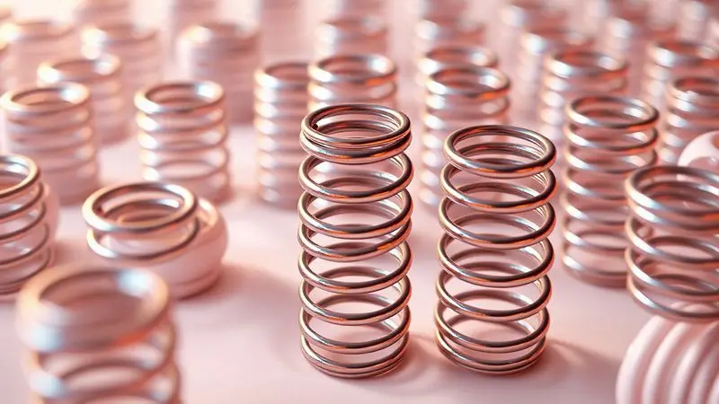
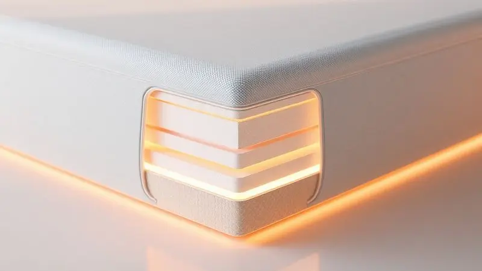

Procurando por um sono reparador com tecnologia de ponta? O Colchão Castor Gold Star Vitagel é uma das opções mais buscadas por quem não abre mão de conforto e regulação térmica. Mas será que ele é realmente bom para o seu perfil?

Nesta análise completa, exploramos desde a tecnologia das molas ensacadas pocket até o diferencial do tecido com gel, garantindo que você tome a melhor decisão para suas noites de descanso.

Descubra a ficha técnica, a qualidade dos materiais e se o investimento neste modelo premium da Castor realmente vale a pena para o seu bem-estar.

<SummaryList products={frontmatter.top_products} />

## Análise do Colchão Castor Gold Star Vitagel Molas Ensacadas

<ProductBox 
  title={frontmatter.top_products[0].title} 
  image={frontmatter.top_products[0].image} 
  link={frontmatter.top_products[0].link} 
/>

Imagine deitar em um colchão que parece entender exatamente onde você precisa de apoio. O Colchão Castor Gold Star Vitagel com Molas Ensacadas entrega essa sensação, adaptando-se não apenas ao seu corpo mas também às suas necessidades térmicas.

As molas Pocket funcionam como um exército pessoal de suporte, reduzindo significativamente aquela transferência de movimento que tanto perturba casais. Quando seu parceiro se vira, você continua imerso no seu próprio universo de descanso.

A verdadeira magia, no entanto, acontece com a tecnologia Vitagel. Enquanto você mergulha no sono, essa camada inteligente dissipa o calor corporal, criando um microclima perfeito em qualquer estação.

Combinado com a tecnologia Feran Ice, você experimenta uma regulação térmica que parece ter sido personalizada para sua pele.

A construção robusta vem com tratamentos antiácaros e antifungos, garantindo que a única coisa que compartilha sua cama sejam momentos de descanso profundo, não alergias.

A altura mais generosa pode surpreender inicialmente, mas essa é justamente a característica que proporciona o suporte adicional para quem precisa de um alívio verdadeiro na coluna.

<CaixaProsContras>

**Prós:**

- Molas Pocket para adaptação e conforto.

- Tecnologia Vitagel que regula a temperatura.

- Construção com materiais de alta qualidade.

- Tratamentos antiácaros e antifungos.

**Contras:**

- Maior altura pode ser uma preocupação na escolha do colchão.

- Pode não se adequar a quem prefere modelos mais firmes.

</CaixaProsContras>

## Tecnologia Premium Gel: Conforto Térmico e Sofisticação

Você já passou por aquelas noites em que, mesmo com o ar condicionado ligado, parece que está dormindo sobre uma superfície quente? A tecnologia Premium Gel do Gold Star foi desenvolvida para acabar com essa sensação.

Ela age como um climatizador pessoal, regulando a temperatura de forma tão natural que você esquece que ela existe. A sofisticação aqui não está apenas no nome, mas na experiência prática: acordar renovado, sem aquela umidade desconfortável que interrompe o descanso.

### Molas Pocket Ensacadas e a Independência de Movimentos

Cada uma dessas molas é envolta em seu próprio saco de tecido, funcionando como unidades independentes que respondem apenas ao peso que suportam. Pense nelas como sensores individuais que mapeiam cada curva do seu corpo.

Quando seu parceiro se move para o outro lado da cama, suas molas permanecem completamente estáveis, como se vocês estivessem em universos paralelos de conforto.

Essa independência vai além do silêncio. Ela distribui o peso de forma tão uniforme que os pontos de pressão nos ombros e quadris simplesmente desaparecem.

Para quem tem hábitos de sono diferentes do parceiro ou precisa mudar de posição frequentemente durante a noite, essa tecnologia transforma o compartilhamento da cama em uma experiência harmoniosa, não em uma negociação constante.

### Pillow Top One Side e Acabamento em Tecido Matelassê

Ao deitar, a primeira sensação é de afundar suavemente em uma camada extra de maciez que envolve seu corpo como um abraço. O design Pillow Top One Side oferece esse toque aveludado sem comprometer o suporte necessário para manter sua coluna alinhada.

Não é apenas sobre conforto imediato, mas sobre como você se sente ao acordar.

O acabamento em tecido matelassê completa essa experiência premium. Além do visual elegante que transforma qualquer quarto, essa construção aumenta significativamente a durabilidade do colchão.

Cada ponto do matelassê é um reforço contra o desgaste diário, garantindo que a sensação de novidade permaneça por anos. Para quem valoriza tanto a estética quanto a funcionalidade, essa combinação cria um produto que você se orgulha de ter em casa.

## Estrutura Polyframe e Forro Antiderrapante para Maior Estabilidade

Quantas vezes você já precisou empurrar seu colchão de volta para o lugar porque ele deslizou durante a noite? A estrutura Polyframe do Gold Star Vitagel resolve esse problema com bordas tão reforçadas que resistem às deformações mais comuns em colchões tradicionais.

Essa engenharia garante que cada centímetro do colchão mantenha sua forma original, preservando as características de conforto que fizeram você escolhê-lo.

O forro antiderrapante completa essa solução de estabilidade. Ele age como uma âncora discreta, mantendo o colchão firmemente posicionado na base.

O resultado é uma sensação de segurança que permite movimentos livres durante o sono, sem aquela preocupação subconsciente de que você pode "cair" da cama.

Para quem se mexe bastante à noite ou prefere dormir nas bordas do colchão, essa combinação transforma o descanso em uma experiência sem interrupções.

## Especificações Técnicas e Dimensões do Produto

À primeira vista, as dimensões podem parecer apenas números, mas elas contam uma história de adaptabilidade. Disponível em tamanhos solteiro, casal e queen, o Gold Star Vitagel se encaixa não apenas no seu quarto, mas no seu estilo de vida.

A espuma de alta densidade não é apenas um material, é a base que se molda ao seu corpo enquanto você dorme, aprendendo suas preferências de conforto noite após noite.

A tecnologia Vitagel continua trabalhando silenciosamente, evitando o superaquecimento que tanto prejudica a qualidade do sono profundo. E quando falamos de cuidados práticos, a capa lavável e hipoalergênica transforma a manutenção em uma tarefa simples.

Para quem sofre com alergias ou simplesmente busca uma higiene impecável, essa característica significa noites tranquilas sem preocupações com ácaros ou irritações cutâneas.

## Conclusão

O Colchão Castor Gold Star Vitagel representa mais do que uma simples peça de mobiliário. Ele é um investimento na qualidade do seu descanso, na saúde da sua coluna e na harmonia dos seus relacionamentos noturnos.

Ao combinar tecnologias inovadoras como o Vitagel para controle térmico inteligente, molas Pocket para independência de movimento e uma construção Polyframe para estabilidade duradoura, este modelo cria um ecossistema completo de bem-estar.

A verdadeira questão não é se ele oferece conforto, mas como esse conforto se manifesta na sua vida: em acordares mais dispostos, em noites sem interrupções por calor excessivo, na liberdade de se movimentar sem perturbar quem divide sua cama.

Sim, o investimento é significativo, mas quando medido em termos de sono reparador e qualidade de vida ao longo dos anos, cada centavo se justifica.

Se você busca um colchão que entenda que dormir bem vai além de simplesmente fechar os olhos, o Gold Star Vitagel merece sua atenção.

Experimente, sinta a diferença e descubra por si mesmo como a tecnologia certa pode transformar suas noites em verdadeiras sessões de recuperação física e mental. Seu corpo - e quem divide sua cama - agradecerão essa escolha todas as manhãs.