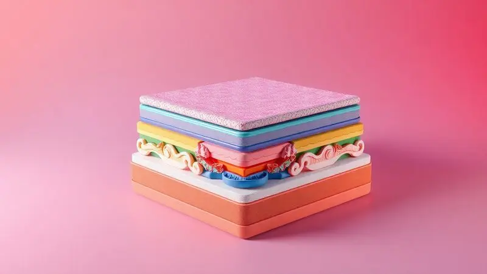
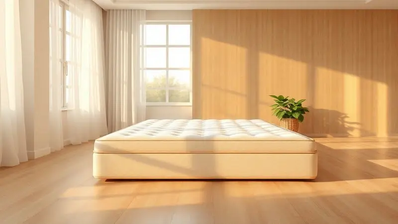

Na hora de trocar de colchão, a Herval surge como uma das marcas mais tradicionais e respeitadas do mercado brasileiro. Mas, com tantas opções de molas e espumas, fica a dúvida: o colchão Herval é bom de verdade ou é apenas marketing?

Neste artigo, mergulhamos nas especificações técnicas dos modelos mais vendidos, como o Coimbra, Imperatore e Toronto, para avaliar durabilidade, suporte de peso e nível de conforto.

Se você busca uma noite de sono reparadora e quer saber se o investimento vale a pena, acompanhe nossa análise completa e descubra qual modelo Herval é o ideal para o seu perfil.

<SummaryList products={frontmatter.top_products} />

## Afinal, o colchão Herval é bom? Conheça a reputação da marca

Durante décadas no mercado, a Herval construiu sua reputação em torno de um compromisso inabalável: entregar não apenas um colchão, mas uma experiência de sono que você confia noite após noite.

O que torna essa marca tão especial não são apenas números de produção ou certificações, mas o número de pessoas que acordam sem dores, que não sentem o movimento do parceiro ao lado, que finalmente encontram o equilíbrio perfeito entre firmeza e aconchego.

Quando você investe em um colchão Herval, está comprando anos de pesquisa, materiais selecionados e, acima de tudo, a paz de saber que seu repouso será protegido como merece.

## Principais Tecnologias e Materiais dos Colchões Herval

O que realmente acontece por baixo daquele tecido macio? A resposta está nas tecnologias que transformam uma estrutura simples em algo que cuida ativamente do seu corpo.

Cada componente foi pensado para resolver um problema específico do sono, desde a firmeza que alinha sua coluna até a maciez que acolhe seus ombros e quadris como um abraço.

### Molas Maxspring vs. Molas Ensacadas (Pocket)

Imagine dormir em uma rede de segurança, onde cada movimento é absorvido com inteligência. É isso que as molas ensacadas proporcionam, agindo independentemente para minimizar completamente a transferência de movimento, perfeito para casais que têm horários diferentes.

Agora, pense na estabilidade de uma base sólida que distribui seu peso uniformemente, essa é a proposta das molas Maxspring, ideal para quem prefere maior firmeza e suporte linear.

A escolha entre elas define como você experimentará cada minuto do seu sono: em isolamento tranquilo ou em consistência reconfortante.

### Espuma Viscoelástica e EcoSpuma Sustentável

Quando você pressiona a espuma viscoelástica com o dedo, ela responde lentamente, como se memorizasse seu formato, depois volta ao normal.

Em cima do colchão, essa mesma adaptação acontece com todo seu corpo, aliviando pontos de pressão, especialmente nas articulações, enquanto mantém sua coluna perfeitamente alinhada.

Já a EcoSpuma faz tudo isso com uma consciência adicional, utilizando até 90% de materiais reaproveitados, provando que conforto e responsabilidade ambiental podem compartilhar o mesmo espaço.

Ambas oferecem o mesmo benefício essencial: o descanso que você sente ao acordar, renovado e sem marcas no corpo.

## Análise Detalhada dos Melhores Modelos de Colchão Herval

Navegar pelos modelos Herval é como descobrir diferentes personalidades do sono. Cada um tem sua voz própria, sua proposta única de conforto, mas todos compartilham o mesmo DNA de qualidade e durabilidade.

Vamos explorar seis modelos que representam o melhor da marca, desde o pioneiro Coimbra até os campeões de sustentabilidade.

### 1. Colchão Herval Coimbra (Molas Maxspring)

<ProductBox 
  title={frontmatter.top_products[0].title} 
  image={frontmatter.top_products[0].image} 
  link={frontmatter.top_products[0].link} 
/>

Pense no Coimbra como o guardião do sono tradicional, aquele colchão que nunca vai te decepcionar. Suas molas Maxspring trabalham em conjunto como uma única estrutura, oferecendo uma base sólida e uniforme que muitos buscam para alívio postural.

A camada Pillow Top One Side é como um travesseiro embutido, adicionando maciez exatamente onde seu corpo mais precisa, sem exigir que você se preocupe em virá-lo, apenas girá-lo periodicamente.

Os tratamentos antiácaro e antifungo agem como um escudo invisível, protegendo sua saúde respiratório enquanto você dorme, enquanto o forro antiderrapante mantém tudo no lugar, eliminando aquela frustração de acertar o colchão na base toda manhã.

<CaixaProsContras>

**Prós:**

- Sistema de molas Maxspring oferece excelente suporte.

- Camada adicional de conforto com o Pillow Top One Side.

- Tratamento antiácaro e antifungo para saúde respiratória.

- Forro antiderrapante aumenta a segurança na utilização.

**Contras:**

- Necessita ser girado periodicamente para melhor conservação.

- Pode não ser adequado para quem prefere colchões mais firmes.

</CaixaProsContras>

### 2. Colchão Herval Imperatore Eco Bamboo (Molas Ensacadas)

<ProductBox 
  title={frontmatter.top_products[1].title} 
  image={frontmatter.top_products[1].image} 
  link={frontmatter.top_products[1].link} 
/>

Se o Coimbra é o guardião, o Imperatore Eco Bamboo é o diplomata do sono. Cada mola ensacada negocia individualmente com seu corpo, garantindo que seu parceiro não sinta nenhum movimento seu durante a noite.

Isso transforma o compartilhamento da cama em um ato de respeito mútuo, onde cada um tem seu espaço de conforto sem interferências.

O toque do bambu no revestimento não é apenas uma textura, mas uma resposta inteligente à sua temperatura corporal, mantendo você na zona certa de conforto térmico durante toda a noite.

A espuma viscoelástica, que lembra a tecnologia da NASA, parece saber exatamente onde aliviar a pressão, adaptando-se como uma segunda pele ao seu formato.

Sim, é um investimento, mas pense no que você está realmente comprando: anos de noites tranquilas onde o único movimento que importa é aquele do sono profundo.

<CaixaProsContras>

**Prós:**

- Conforto adaptativo com molas ensacadas.

- Revestimento em bambu que regula a temperatura.

- Camada de pillow top que aumenta a maciez.

- Propriedades antiácaros e resistência a fungos.

**Contras:**

- Preço relativamente alto.

- Necessita de rotação periódica para manutenção.

</CaixaProsContras>

### 3. Colchão Herval Toronto (Molas Ensacadas)

<ProductBox 
  title={frontmatter.top_products[2].title} 
  image={frontmatter.top_products[2].image} 
  link={frontmatter.top_products[2].link} 
/>

O Toronto leva a adaptabilidade do Imperatore e a combina com uma consciência ambiental que faz diferença. Sua EcoSpuma® incorpora espuma reciclada sem perder um pingo de conforto, provando que sustentabilidade e qualidade dormem juntas.

As molas ensacadas continuam seu trabalho silencioso de isolamento de movimento, enquanto o tecido Jacquard, às vezes com fios de seda, oferece um toque que faz você querer adiantar a hora de dormir.

Aqui, o Pillow Top funciona como um acolhimento extra que elimina a necessidade de virada, apenas rotações ocasionais para manter o equilíbrio.

Para quem precisa de firmeza genuína (suporta até 130 kg por pessoa), mas não quer abrir mão da sofisticação tátil, o Toronto é um encontro perfeito entre força e elegância.

<CaixaProsContras>

**Prós:**

- Conforto adaptável devido às molas ensacadas

- Pillow Top para maior suavidade

- Sustentabilidade com EcoSpuma®

- Tratamentos antiácaros e antialérgicos

**Contras:**

- Classificado como firme, o que pode não agradar a todos

- Pode exigir manutenção periódica para melhor conservação

</CaixaProsContras>

### 4. Colchão Herval Meditare (Conforto Sustentável)

<ProductBox 
  title={frontmatter.top_products[3].title} 
  image={frontmatter.top_products[3].image} 
  link={frontmatter.top_products[3].link} 
/>

Chame o Meditare de filantropo do sono. Ele utiliza até 90% de materiais reaproveitados em sua EcoSpuma, transformando o que seria lixo em conforto que regenera tanto seu corpo quanto o planeta.

As molas ensacadas mantêm sua promessa habitual de isolamento de movimento, enquanto o pillow top unilateral oferece maciez sem complicações de manutenção.

O tratamento antimofo e antiácaro funciona como uma equipe de limpeza noturna, garantindo que você respire apenas ar puro enquanto descansa.

A espessura variável entre modelos é um aviso gentil: meça seu espaço antes de escolher, porque este colchão merece um lar adequado para retribuir todo o cuidado que tem com sua saúde e com o meio ambiente.

<CaixaProsContras>

**Prós:**

- Sistema de molas ensacadas que minimiza a transferência de movimento.

- Camada pillow top para maior conforto.

- Confeccionado com materiais sustentáveis (EcoSpuma).

- Tratamento antimofo e antiácaro para um sono mais saudável.

**Contras:**

- A espessura e peso podem ser diferentes entre modelos.

- Necessita de cuidado na hora de girar, já que não deve ser virado.

</CaixaProsContras>

### 5. Colchão Herval Frontier (Espuma D45 Extra Firme)

<ProductBox 
  title={frontmatter.top_products[4].title} 
  image={frontmatter.top_products[4].image} 
  link={frontmatter.top_products[4].link} 
/>

Para alguns, firmeza não é apenas uma preferência, é uma necessidade. É para essas pessoas que o Frontier existe.

Sua espuma D45 cria uma base tão sólida que parece esculpida para o seu corpo, oferecendo suporte anatômico que mantém sua postura perfeita durante todo o repouso.

Quando suportar até 150 kg por pessoa deixa de ser uma especificação técnica e se torna uma promessa: você pode descansar com total confiança, sem medo de afundar ou perder apoio.

O revestimento em tecido de malha não é apenas estético, é uma barreira adicional contra o desgaste, estendendo a vida útil do colchão além do esperado.

Se você se reconhece naquelas que precisam sentir o abraço firme do apoio, não apenas o carinho da maciez, o Frontier será sua fortaleza particular contra as noites mal dormidas.

<CaixaProsContras>

**Prós:**

- Alta durabilidade graças à espuma D45.

- Suporte robusto para bom alinhamento postural.

- Disponível em várias dimensões para diferentes necessidades.

- Revestimento resistente que garante conforto.

**Contras:**

- Firmeza excessiva pode não agradar a todos.

- Não é ideal para quem prefere colchões muito macios.

</CaixaProsContras>

### 6. Colchão Herval Scotland (Molas Maxspring)

<ProductBox 
  title={frontmatter.top_products[5].title} 
  image={frontmatter.top_products[5].image} 
  link={frontmatter.top_products[5].link} 
/>

O Scotland fecha nosso percurso com uma mensagem clara: tradição e inovação podem dançar juntas. Voltando às molas Maxspring, ele oferece a estabilidade linear que muitos amam, agora enriquecida com camadas de EcoEspuma® que suavizam o contato sem comprometer a firmeza.

O Pillow Top adiciona seu toque especial, enquanto a facilidade de manutenção (apenas giro, sem virada) mostra que a Herval ouviu o pedido por praticidade.

Resistente a ácaros e fungos, ele protege seu sono como um guardião silencioso. Se você já experimentou colchões muito macios e sentiu falta daquele apoio que parece dizer 'estou aqui para te sustentar', o Scotland será sua resposta.

Ele não pede adaptação, oferece consistência, aquele tipo de confiabilidade que faz você relaxar apenas por saber que está ali.

<CaixaProsContras>

**Prós:**

- Sistema de molas contínuas que proporciona estabilidade.

- Camadas de espuma para conforto adicionado.

- Tratamento antiácaro e antifungo para um sono higiênico.

- Design que facilita a manutenção com rotação ao invés de virar.

**Contras:**

- Firmeza pode ser intensa para alguns.

- Não é o modelo ideal para quem prefere colchões muito macios.

</CaixaProsContras>

## Guia de Compra: Como escolher o seu colchão Herval ideal

Escolher não precisa ser complicado quando você sabe o que realmente importa para seu corpo. Este não é apenas um móvel, é o local onde você passa um terço da sua vida.

Pense nas escolhas não como especificações técnicas, mas como convites para diferentes tipos de repouso.

### Analisando o Suporte de Peso e Densidade (D33, D45 e D60)

Os números D33, D45 e D60 são mais do que códigos, são promessas de apoio. O D33 é aquele amigo confiável para quem não ultrapassa os 80 kg, oferecendo conforto sem exageros.

O D45 se torna o parceiro fiel para até 100 kg, garantindo que cada noite seja tão bem sustentada quanto a primeira. E o D60?

Esse é o herói silencioso para quem exige robustez, uma base inabalável que suporta tranquilamente mais de 100 kg, como se dissesse 'descanse, eu seguro você'.

Escolher a densidade certa é garantir que seu corpo terá exatamente o que precisa para relaxar completamente, sem compensações.

### O que é o Pillow Top One Side e Double Side?

Pensando em manutenção ou em durabilidade? O Pillow Top One Side simplifica sua vida, concentrando toda a maciez em uma única face, então você só precisa girá-lo.

Já o Double Side é como ter dois colchões em um, permitindo que você alterne entre as faces e prolongue a sensação de novidade.

Escolher entre eles é decidir como você quer se relacionar com o colchão ao longo dos anos: menos preocupações com manutenção ou mais opções de uso.

Em ambos os casos, o resultado é o mesmo: seu corpo recebendo aquela camada extra de atenção que faz toda diferença entre dormir e descansar.

## Garantia e Cuidados com o seu Colchão Herval

A garantia da Herval, que varia de 1 a 5 anos dependendo do modelo, é mais do que um papel. É um aperto de mão, um compromisso da marca com a qualidade que você está levando para casa.

Para retribuir esse cuidado, algumas ações simples farão seu colchão durar ainda mais. Girá-lo a cada três meses é como dar a ele um novo ângulo de trabalho, distribuindo o desgaste uniformemente.

Um protetor não é apenas prevenção contra manchas, é uma segunda pele que guarda a primeira.

Evite a luz solar direta prolongada, pois mesmo os materiais mais resistentes merecem proteção. Seguir esses passos não é só manter um produto em bom estado, é honrar o investimento que você fez no seu próprio bem-estar.

Afinal, um colchão bem cuidado cuida melhor de você.

## Conclusão

Depois de percorrer os modelos, materiais e cuidados dessa marca tão respeitada, a resposta para aquela pergunta inicial se torna clara: sim, o colchão Herval é bom de verdade, e o marketing apenas reflete aquilo que gerações de clientes já comprovaram em suas próprias noites de sono.

O que realmente define essa marca não é uma característica técnica isolada, mas como todas elas se unem para criar experiências diferentes para perfis diferentes.

Seja você quem precisa do abraço firme do Frontier, da diplomacia do Imperatore, ou da consciência ambiental do Meditare, existe uma versão do descanso perfeito com a assinatura Herval.

Investir em um colchão é investir em você mesmo, na sua energia do dia seguinte, na sua postura, na sua saúde.

Quando esse investimento vem com a tradição, a tecnologia e a confiança que a Herval construiu ao longo de décadas, ele deixa de ser uma compra e se torna uma escolha inteligente para o seu futuro.

Agora, a única pergunta que resta é: qual desses guardiões do sono será seu companheiro nas próximas milhares de noites?