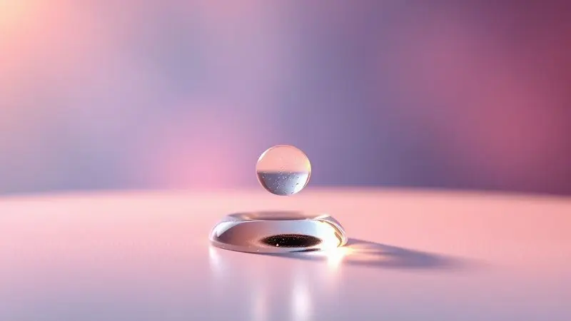

Você já passou uma noite revirando na cama, tentando encontrar uma posição que não pressione seus ombros ou que não deixe sua coluna travada? A busca por um sono verdadeiro muitas vezes esbarra na superfície onde repousamos.

O colchão de água, que evoluiu de um símbolo de luxo para uma verdadeira ferramenta terapêutica, oferece uma experiência única: um alívio de pressão que materiais convencionais simplesmente não conseguem replicar.

Neste guia, vamos navegar pelo universo desses colchões, descobrir como eles realmente funcionam, explorar os tipos que atendem às suas necessidades específicas e ajudar você a decidir se essa tecnologia é a resposta para suas noites ou para o cuidado de alguém especial.

<SummaryList products={frontmatter.top_products} />

## O que é um colchão de água e como ele funciona?

Imagine uma superfície que não é sólida, mas que se adapta ao seu corpo como um abraço perfeito. Essa é a essência do colchão de água. Em vez de espuma ou molas, ele utiliza água dentro de um compartimento impermeável como seu principal elemento de suporte.

Quando você se deita, o líquido se redistribui, moldando-se ao seu contorno em tempo real. Esse movimento inteligente é o que proporciona o alinhamento adequado da coluna, quase como se você fosse suspenso, livre das pontas de pressão que cansam músculos e articulações.

E por isso que muitos modelos permitem ajustar a firmeza: você pode tornar a experiência mais firme ou mais suave, personalizando o conforto conforme seu corpo pede. A única atenção necessária?

A manutenção periódica, para garantir que o nível de água está ideal e que não há riscos de vazamentos.

## Para que serve o colchão de água: do conforto ao uso terapêutico

A principal missão desse colchão é entregar um conforto que se traduz em qualidade de vida. Ele se adapta ao formato do seu corpo de maneira tão precisa que alivia a pressão em áreas específicas, aquelas que normalmente gritam depois de uma longa jornada.

Para casais, essa tecnologia tem um benefício silencioso: a água absorve movimentos, reduzindo drasticamente a transferência de movimento. Isso significa que um parceiro se levantando não vai perturbar o sono do outro. Mas o alcance vai além do dormir bem.

Na recuperação de lesões ou no manejo de dores crônicas, especialmente nas costas, o suporte adaptativo pode ser terapêutico. E quando você adiciona a possibilidade de aquecer a água?

A experiência se transforma em um relaxamento profundo, ideal para dissolver o estresse acumulado e promover um bem-estar que começa no momento em que você se apoia.

## Conheça os principais tipos de colchão de água

Dentro desse universo adaptativo, os colchões se dividem principalmente em dois perfis: os de onda e os estabilizados. Os de onda mantêm uma movimentação fluida, oferecendo uma sensação suave que lembra o balanço relaxante de um mar calmo.

Os estabilizados, por outro lado, têm compartimentos internos que minimizam o movimento, entregando um suporte mais firme e constante. A escolha entre um e outro depende do tipo de experiência que seu corpo e sua mente buscam.

### Colchão de água casal: Conforto compartilhado

<ProductBox 
  title={frontmatter.top_products[0].title} 
  image={frontmatter.top_products[0].image} 
  link={frontmatter.top_products[0].link} 
/>

Para casais, essa opção é uma verdadeira declaração de cuidado mútuo. O suporte uniforme se adapta ao contorno de dois corpos diferentes simultaneamente, aliviando pontos de pressão de ambos sem comprometer o espaço compartilhado.

Imagine reduzir as interrupções no sono porque os movimentos do outro são absorvidos pela água, uma paz silenciosa que vale cada investimento.

Essa característica é especialmente benéfica para pessoas com dores musculares ou articulares que precisam de uma superfície inteligente.

A manutenção, é verdade, pode exigir mais atenção comparada aos colchões convencionais, principalmente para evitar vazamentos. Mas essa atenção é compensada pela durabilidade robusta e pela resistência natural a ácaros e fungos, criando um ambiente higiênico e saudável.

E quando você considera as opções com aquecimento ou refrigeração? Cada lado da cama pode ter sua temperatura preferida, garantindo que o conforto seja verdadeiramente personalizado e compartilhado.

### Colchão de água solteiro: Ideal para diversas idades

<ProductBox 
  title={frontmatter.top_products[1].title} 
  image={frontmatter.top_products[1].image} 
  link={frontmatter.top_products[1].link} 
/>

Se você busca conforto e suporte que acompanham todas as fases da vida, o colchão solteiro é uma resposta elegante. Ele se molda ao seu corpo com precisão, proporcionando alívio de dores e uma melhora na circulação sanguínea que pode transformar suas noites.

Essa adaptação faz dele uma excelente escolha para pessoas com questões ortopédicas que precisam de atenção constante.

Uma vantagem que muitas vezes passa despercebida é a higiene implícita: esses colchões não acumulam ácaros e alérgenos, criando um refúgio para quem sofre de alergias respiratórias.

A manutenção, claro, pede limpezas regulares e o cuidado com a qualidade da água, mas esses são pequenos ritos que garantem um sono saudável e reparador por anos.

### Colchão de água caixa de ovo (hospitalar): Prevenção de escaras

<ProductBox 
  title={frontmatter.top_products[2].title} 
  image={frontmatter.top_products[2].image} 
  link={frontmatter.top_products[2].link} 
/>

No cuidado de pacientes acamados, a prevenção de escaras é uma prioridade crítica. O colchão de água caixa de ovo combina a tecnologia adaptativa da água com um design que distribui o peso do corpo de forma inteligente, aliviando a pressão em áreas vulneráveis da pele.

Essa combinação é essencial para evitar úlceras de pressão, um risco constante para pessoas com mobilidade reduzida.

O custo, comparado a opções convencionais, pode ser um ponto de consideração, e a manutenção exige atenção. Mas quando você pondera o impacto no bem-estar do paciente e a prevenção de complicações graves, o investimento se revela estratégico.

É importante complementar seu uso com mudanças frequentes de posição, criando uma proteção em duas frentes contra as escaras.

### Colchão de água para bebê: Segurança e ergonomia

<ProductBox 
  title={frontmatter.top_products[3].title} 
  image={frontmatter.top_products[3].image} 
  link={frontmatter.top_products[3].link} 
/>

Para o universo delicado dos bebês, o colchão de água pode ser uma alternativa interessante, oferecendo conforto e uma adaptação ao corpo pequeno.

A segurança é uma preocupação central: muitos modelos possuem bordas elevadas que ajudam a evitar que o bebê escorregue durante trocas ou brincadeiras.

O material de qualidade, com revestimento impermeável e livre de substâncias tóxicas, cria um ambiente seguro para esses momentos.

Em termos de ergonomia, o colchão se ajusta bem ao corpo do bebê, proporcionando uma sensação de aconchego.

É crucial, porém, lembrar que ele não é ideal para o sono contínuo a longo prazo, especialmente quando comparado a colchões tradicionais projetados para o desenvolvimento infantil.

Portanto, enquanto oferece vantagens práticas pontuais, seu uso deve ser considerado dentro das normas de segurança apropriadas para cada fase.

## Benefícios do colchão de água para a saúde e o sono

Os benefícios desse tipo de colchão não são apenas teóricos, eles se manifestam na qualidade do seu descanso e na saúde do seu corpo.

O suporte ideal à coluna, o alívio de pontos de pressão e a melhora na circulação sanguínea são consequências naturais de uma superfície que se adapta.

### Alívio de pontos de pressão e circulação sanguínea

Para quem passa muitas horas deitado, seja por trabalho ou por necessidade terapêutica, a pressão em áreas específicas como ombros e quadris pode ser uma fonte constante de desconforto.

O colchão de água resolve isso distribuindo o peso uniformemente, como se cada parte do seu corpo fosse recebendo seu próprio espaço de apoio.

Essa distribuição inteligente não só acaba com os pontos de pressão, mas também melhora a circulação sanguínea, permitindo que o fluxo ocorra sem obstáculos. A combinação resulta em um sono mais reparador, onde você não está apenas dormindo, mas se recuperando.

### Alinhamento da coluna e relaxamento muscular

A sensação de ter sua coluna alinhada naturalmente, sem forças externas, é um dos maiores presentes desse colchão. Ele se adapta ao seu contorno, distribuindo o peso de maneira que mantém a estrutura vertebral em uma posição saudável.

Para quem vive com dores nas costas, essa característica pode ser transformadora.

A flexibilidade do material também contribui para um relaxamento muscular profundo durante o sono, permitindo que os músculos se recuperem verdadeiramente após um dia de trabalho ou atividade.

É por isso que tantas pessoas relatam uma qualidade de sono superior e um despertar que realmente renova.

## Vale a pena investir em um colchão de água para cães e gatos?

<ProductBox 
  title={frontmatter.top_products[4].title} 
  image={frontmatter.top_products[4].image} 
  link={frontmatter.top_products[4].link} 
/>

Se você busca um conforto extra para seu pet, especialmente em dias de calor intenso ou para animais com problemas articulares, o colchão de água pode ser uma solução inteligente.

A água ajuda a regular a temperatura corporal, oferecendo uma sensação refrescante que é um verdadeiro alívio nos períodos mais quentes.

E ela se molda ao corpo do animal, aliviando a pressão sobre as articulações, um benefício crucial para pets mais velhos que precisam de cuidado especial.

O manuseio, devido ao peso da água, pode ser um desafio, exigindo mais esforço para movimentar o colchão.

Mas quando você considera a durabilidade e a qualidade dos materiais, essa desvantagem operacional é compensada pelos benefícios de conforto e bem-estar que seu pet recebe. Investir em uma opção resistente e fácil de usar torna a experiência positiva para ambos.

## Colchão de água quente: Como funciona o controle de temperatura?

A capacidade de criar seu próprio microclima de relaxamento é uma das magias dos colchões de água quente.

Eles possuem um sistema de aquecimento integrado ao compartimento de água, permitindo que você ajuste a temperatura conforme sua preferência, geralmente através de um termostato intuitivo ou controle remoto. E para casais com preferências distintas?

Muitos modelos oferecem zonas de aquecimento personalizáveis, onde cada lado da cama pode ter sua temperatura ideal. Essa tecnologia transforma a experiência de sono, especialmente em climas frios, entregando um conforto térmico que vai além do simples apoio.

## Vantagens e desvantagens: O veredito honesto

Como qualquer tecnologia, o colchão de água apresenta um conjunto de vantagens e considerações. A adaptação perfeita ao corpo, o suporte excelente para a coluna e o alívio de pontos de pressão são seus maiores triunfos.

A água também tem uma capacidade natural de dissipar calor, ajudando a regular a temperatura do ambiente de sono.

Por outro lado, seu peso pode tornar a movimentação mais difícil, e a manutenção periódica é necessária para evitar vazamentos e garantir que a água esteja sempre na condição ideal.

A decisão, portanto, deve passar por uma avaliação honesta: essas características atendem às necessidades específicas do seu corpo, do seu espaço e da sua rotina de cuidados?

## Como fazer a manutenção e cuidar do seu colchão de água

Para manter seu colchão de água performando como um aliado de longa duração, alguns cuidados simples são essenciais. Verifique regularmente o nível da água e adicione estabilizadores conforme orientação do fabricante.

Limpe a superfície com um pano úmido e evite exposição direta ao sol para preservar a integridade do material.

### Como encher e esvaziar corretamente

O processo de enchimento e esvaziamento é fundamental para a vida do seu colchão. Para enchê-lo, utilize uma mangueira conectada à fonte de água, seguindo rigorosamente as instruções do fabricante sobre o nível ideal, o excesso pode comprometer a estrutura.

Para esvaziar, conecte a mangueira a um ralo ou área de drenagem, permitindo que a água flua completamente. Durante ambos processos, verifique as válvulas por sinais de vazamentos, prevenindo problemas futuros.

### Dicas para evitar vazamentos e prolongar a vida útil

A prevenção de vazamentos começa com uma manutenção regular. Examine frequentemente as válvulas de enchimento e as costuras, buscando qualquer sinal de desgaste. Utilize uma capa protetora de qualidade para defender o colchão contra furos ou arranhões.

Evite posicionar objetos pesados sobre ele, pois a pressão adicional pode causar falhas. Mantenha o colchão em um ambiente livre de temperaturas extremas, essa estabilidade ajuda a preservar sua integridade por muitos anos.

Com esses cuidados, você garante uma experiência confortável que dura.

## Conclusão

O colchão de água representa uma tecnologia que transforma o simples apoio em uma experiência personalizada de cuidado.

Ele não é apenas uma superfície para dormir, mas uma ferramenta que se adapta ao seu corpo, alivia suas pressões e pode até ajudar na recuperação de dores e lesões.

Dos modelos para casais que buscam paz compartilhada às opções terapêuticas para pacientes acamados, a versatilidade dessa solução é impressionante.

Como qualquer investimento, ele pede consideração sobre manutenção e características específicas, mas os benefícios em conforto, saúde e qualidade de sono frequentemente justificam a escolha.

Se você está em busca de uma mudança real na maneira como seu corpo repousa, explorar o universo dos colchões de água pode ser o primeiro passo para noites verdadeiramente renovadoras.

## Perguntas frequentes sobre colchões de água (FAQ)

As dúvidas sobre colchões de água são naturais, especialmente quando consideramos uma tecnologia diferente. A manutenção, que inclui verificação de vazamentos e tratamento da água para evitar fungos, é uma preocupação comum.

Para casais, a questão do movimento na água sendo sentido por ambos existe, mas muitos usuários relatam que após um período de adaptação isso não se torna um problema significativo, a água absorve a maior parte da perturbação.

O controle de temperatura também é um ponto de interesse frequente: a capacidade de ajustar a água para seu conforto térmico cria uma experiência personalizada que pode ser especialmente valiosa em climas extremos.

Essas são questões que, quando esclarecidas, ajudam você a tomar uma decisão confortável sobre como essa tecnologia pode entrar na sua vida.