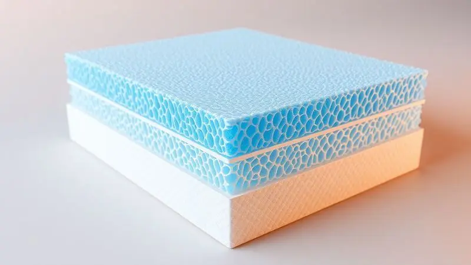

Ao procurar um novo colchão, você já deve ter visto o termo "espuma selada" sendo destacado como um grande diferencial. Mas o que isso realmente significa? É apenas uma jogada de marketing ou uma garantia concreta de qualidade e durabilidade?

Entender a diferença entre um colchão comum e um selado, especialmente as distinções entre os selos INMETRO e Pró-Espuma, é fundamental para garantir um investimento seguro e noites de sono verdadeiramente reparadoras.

Este guia desvenda os mistérios por trás da espuma selada, ensina como identificar selos falsos e mostra por que essa certificação pode ser decisiva para a saúde da sua coluna.

<SummaryList products={frontmatter.top_products} />

## O que é um colchão de espuma selada?

Imagine um colchão que não apenas oferece conforto, mas também protege sua saúde.

A espuma selada é uma tecnologia que envolve a espuma com uma camada externa protetora, geralmente de tecido ou poliéster, criando uma barreira eficiente contra líquidos, sujeira e, principalmente, contra os agentes que causam alergias.

Essa selagem não apenas prolonga a vida útil do produto, facilitando sua limpeza, mas também transforma o ambiente de sono. Para quem enfrenta problemas com ácaros e fungos, essa proteção significa respirar melhor e dormir mais tranquilo.

O resultado é um espaço mais higiênico e saudável, onde o descanso finalmente pode ser ininterrupto.

## Colchão Berço Espuma Selada Conforto D18 BF Colchões

<ProductBox 
  title={frontmatter.top_products[0].title} 
  image={frontmatter.top_products[0].image} 
  link={frontmatter.top_products[0].link} 
/>

Quando pensamos no primeiro colchão de um bebê, a segurança e o conforto são prioridades absolutas. O Colchão Berço Espuma Selada Conforto D18 da BF Colchões se destaca justamente por equilibrar essas duas necessidades.

Com densidade D18, ele oferece a firmeza ideal para o desenvolvimento saudável do pequeno, sendo antialérgico e antiácaro. A espuma é certificada, e o tecido conta com Active Protection, uma tecnologia que trabalha constantemente para eliminar bactérias e alérgenos.

A versatilidade é outro ponto forte: ele pode ser utilizado dos dois lados, uma estratégia inteligente para distribuir o uso e aumentar significativamente a durabilidade. Algumas versões também oferecem um lado impermeável, dando uma proteção extra à espuma.

Com certificações como o INMETRO garantindo qualidade e segurança, e dimensões específicas (como 130x60x12cm ou 130x70x12cm), é importante verificar a medida exata que se ajusta ao seu berço.

<CaixaProsContras>

**Prós:**

- Material antialérgico e antiácaro

- Espuma certificada e de qualidade

- Uso duplo para maior durabilidade

- Tecido com proteção contra bactérias

**Contras:**

- Dimensões específicas podem não se adequar a todos os berços

- Algumas opções podem não incluir impermeabilização

</CaixaProsContras>

## Quais são os principais selos de qualidade?

Na busca por um colchão que realmente valha o investimento, os selos de qualidade funcionam como seu mapa de confiança.

Eles não são apenas símbolos na etiqueta, são garantias de que o produto passou por testes rigorosos e atende a padrões elevados de fabricação e, muitas vezes, de sustentabilidade.

### Selo INMETRO: A certificação obrigatória

Este selo é sua primeira linha de defesa. Mais que uma exigência legal, o Selo INMETRO representa que o colchão foi testado e aprovado em questões fundamentais: durabilidade, conforto e, acima de tudo, segurança.

Ao encontrar esse selo, você ganha a tranquilidade de saber que o produto não apenas cumpre normas técnicas, mas também que o que está sendo anunciado corresponde ao que você está comprando.

É a base para evitar fraudes e garantir que seu descanso não será comprometido por falhas estruturais.

### Selo Pró-Espuma: A garantia de qualidade superior

Se o INMETRO garante que o produto é seguro, o Selo Pró-Espuma eleva a experiência. Esta certificação se concentra em padrões ainda mais rigorosos de conforto, durabilidade e performance da espuma.

Um colchão com este selo não apenas passou por testes específicos que garantem sua longevidade, mas também promete um suporte superior para sua coluna.

Optar por ele significa investir diretamente na qualidade do seu sono, escolhendo um produto que se mantém firme e confortável por anos, contribuindo para noites verdadeiramente reparadoras.

### O selo ABICOL e selos de laboratórios próprios

O selo ABICOL, concedido pela Associação Brasileira da Indústria do Colchão, é outro indicador confiável de qualidade, atestando que o produto foi avaliado em laboratórios credenciados.

Além dele, muitos fabricantes desenvolvem seus próprios selos de qualidade, resultado de processos internos rigorosos de controle.

Esses selos, tanto os da ABICOL quanto os próprios, ajudam você a identificar colchões que não só oferecem conforto, mas também utilizam materiais de alta qualidade e seguem padrões éticos de produção.

Na hora da escolha, eles são sinais claros de um compromisso do fabricante com seu bem-estar.

## Diferença prática: Pró-Espuma vs INMETRO

Entender a diferença entre essas duas certificações é crucial para direcionar sua escolha.

O selo Pró-Espuma tem um olhar mais detalhado sobre a experiência do usuário: ele avalia rigorosamente o conforto, a durabilidade, a composição e até a sustentabilidade dos materiais. É a certificação que pensa no seu bem-estar durante o uso.

O INMETRO, por outro lado, concentra-se nas normas de segurança e performance técnicas, garantindo que o produto é resistente e confiável nos aspectos fundamentais.

Em resumo, o Pró-Espuma busca otimizar sua qualidade de vida durante o sono, enquanto o INMETRO assegura que o produto em si é seguro e construído dentro dos padrões. Para uma escolha completa, considerar ambas é o caminho ideal.

## Cuidado com selos falsos e como verificar a veracidade

Com tantas certificações importantes, surge um risco: selos falsos que tentam imitar a credibilidade dos verdadeiros. Para proteger seu investimento, aprenda a verificar. Examine se o selo apresenta informações claras sobre a certificação e a entidade emissora.

Pesquise essas certificações em sites oficiales e mantenha um olho crítico sobre promoções que parecem excessivamente vantajosas. Ler avaliações de outros consumidores e buscar recomendações de especialistas também são passos fundamentais.

A transparência do fabricante sobre suas certificações é um forte indicativo de que você está fazendo uma compra informada e realmente segura.

## Perguntas frequentes sobre colchão selado

### Colchão selado é melhor que o comum?

A resposta geralmente é positiva. A construção com uma camada de espuma selada introduce vantagens concretas: maior durabilidade e uma resistência à umidade que os colchões comuns normalmente não oferecem.

Isso cria um ambiente menos propício para ácaros e fungos, sendo uma mudança significativa para quem enfrenta alergias. Além da higiene, essa tecnologia frequentemente proporciona um suporte mais adequado para a coluna, melhorando a ergonomia do seu sono.

Se você busca um descanso mais saudável e um ambiente de dormir mais higiênico, o colchão selado se apresenta como uma escolha claramente superior.

### Como identificar um colchão selado corretamente?

A identificação começa pela etiqueta: busque informações que especificamente mencionem "espuma selada", acompanhadas normalmente da densidade da espuma. Observe a superfície: ela deve ser lisa e uniforme, sem manchas ou irregularidades visíveis.

Faça um teste prático: pressione a superfície e observe a resposta. Um colchão de qualidade, com espuma resiliente, retorna rapidamente à sua forma original.

Essa capacidade de recuperação não apenas confirma a selagem, mas também indica que o colchão resistirá à deformação ao longo do tempo, mantendo seu conforto.

### Vale a pena pagar mais por um colchão com selo Pró-Espuma?

Para muitas pessoas, esse investimento adicional se justifica completamente. O selo Pró-Espuma é um compromisso do fabricante com padrões excepcionais de conforto, segurança e performance da espuma.

Isso se traduz diretamente em uma experiência de sono melhor: maior suporte, melhor adaptação ao seu corpo e uma durabilidade que prolonga o benefício por anos.

Se o seu foco é adquirir um produto que não apenas funcione, mas que eleve a qualidade do seu descanso de forma consistente e duradoura, considerar um colchão com essa certificação é uma decisão estratégica.

## Conclusão

Escolher um colchão com espuma selada e certificações adequadas não é apenas uma decisão de consumo, é um investimento direto na sua saúde e bem-estar.

A tecnologia selada oferece proteção contra alergias e maior durabilidade, enquanto selos como INMETRO e Pró-Espuma funcionam como garantias de segurança e qualidade superior.

Ao compreender essas diferenças e aprender a identificar selos verdadeiros, você transforma uma compra potencialmente complexa em uma escolha clara e segura.

O resultado são anos de descanso tranquilo, com a certeza de que seu colchão oferece não apenas conforto, mas também a proteção que sua coluna e sua saúde merecem. Investir em um bom colchão é, finalmente, investir na qualidade de cada uma de suas noites.