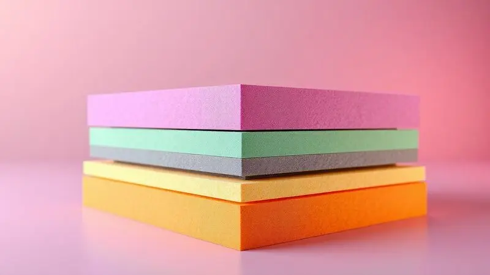
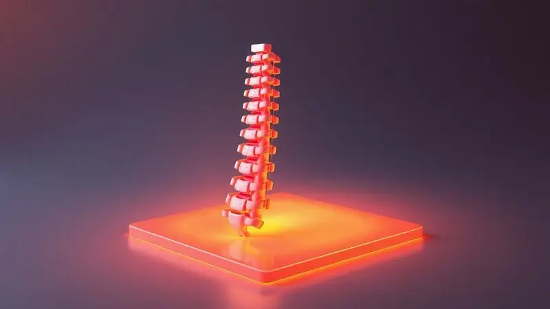

Você já acordou com aquela sensação de que seu corpo não descansou de verdade? O colchão errado pode transformar seu santuário do sono em uma fonte de desconforto diário.

A escolha entre espuma e mola não é apenas uma questão técnica, mas uma decisão que molda como você vive e se recupera. Enquanto as espumas envolvem seu corpo como um abraço personalizado, as molas oferecem aquele suporte firme que mantém sua coluna alinhada.

Qual das duas tecnologias se adapta melhor ao seu jeito de dormir? Vamos descobrir juntos como cada material pode transformar suas noites em momentos verdadeiramente revigorantes.

<SummaryList products={frontmatter.top_products} />

## Fatores essenciais para escolher entre espuma e mola

Imagine deitar em uma superfície que parece ter sido moldada só para você. É essa sensação que os colchões de espuma oferecem, contornando cada curva do seu corpo para aliviar pontos de pressão que causam aquelas dores incômodas ao acordar.

Se você busca alívio imediato para costas tensionadas ou articulações sensíveis, essa tecnologia se adapta como uma segunda pele.

Mas e se sua preferência é por uma base mais sólida, que ofereça resistência quando você se deita? Os colchões de mola são como uma estrutura arquitetônica para seu sono, com firmeza que mantém sua postura natural mesmo durante horas de repouso.

Eles respiram melhor, criando um microclima mais fresco para quem costuma sentir calor durante a noite.

Para casais, essa escolha ganha uma dimensão extra. As espumas são mestres em absorver movimento, criando uma ilha de tranquilidade onde o virar do parceiro não se transforma em uma onda que te acorda.

Já as molas, especialmente as tradicionais, podem compartilhar esse movimento entre os dois lados da cama. Qual desses cenários reflete melhor suas noites?

## Melhores indicações de colchão de espuma e mola

Escolher apenas pela especificação técnica é como comprar um carro sem dirigir. O verdadeiro teste acontece quando seu corpo encontra o colchão, sentindo como ele responde ao seu peso, sua posição favorita e até como se adapta quando você muda de lado durante a noite.

Por isso, sempre que possível, reserve alguns minutos para experimentar pessoalmente.

### Colchão Prorelax Turquesa Espuma D33

<ProductBox 
  title={frontmatter.top_products[0].title} 
  image={frontmatter.top_products[0].image} 
  link={frontmatter.top_products[0].link} 
/>

Você conhece aquela sensação de afundar em um sofá perfeito? O Prorelax Turquesa Espuma D33 oferece essa experiência no quarto, mas com a firmeza necessária para que você não sinta que está dormindo em um pântano.

Sua densidade D33 é o equilíbrio ideal entre suporte e conforto, criando uma base que abraça seu corpo sem perder a estrutura.

Imagine acordar sem aquela coceira no nariz ou espirros matinais. O tratamento especial antimofo, antifungo, antiácaro e antialérgico transforma seu colchão em uma barreira protetora, especialmente importante para quem sofre com alergias respiratórias.

O tecido Stretch que o reveste não é apenas suave ao toque, mas se ajusta perfeitamente aos movimentos, sem tensionar ou criar rugas.

Com medidas que vão do solteiro ao king size, e alturas que se adaptam à estrutura da sua cama, esse colchão é como uma peça de roupa sob medida para seu quarto. A certificação INMETRO é seu selo de garantia, confirmando que cada noite de sono será segura e confiável.

<CaixaProsContras>

**Prós:**

- Conforto firme com suporte adequado.

- Tratamento antimofo e antifungo.

- Diversas opções de medidas e alturas.

- Certificado pelo INMETRO.

**Contras:**

- Falta de recursos adicionais como resfriamento.

- Limite de peso de até 120 kg.

</CaixaProsContras>

### Colchão Bali Molas Ensacadas Double Face

<ProductBox 
  title={frontmatter.top_products[1].title} 
  image={frontmatter.top_products[1].image} 
  link={frontmatter.top_products[1].link} 
/>

Você já se perguntou como seria dormir em um colchão que se adapta exclusivamente ao seu corpo, ignorando completamente o movimento do seu parceiro? O sistema de molas ensacadas do Bali faz exatamente isso.

Cada mola trabalha independentemente, como se tivesse sido programada apenas para você.

A magia do Double Face está na longevidade. Quando um lado começa a mostrar sinais de uso (após anos de serviço leal), você simplesmente vira o colchão e tem uma superfície completamente nova esperando.

É como ter dois colchões pelo preço de um, economizando tempo e dinheiro no longo prazo.

O Pillow Top não é apenas um detalhe estético. É a diferença entre deitar em uma superfície plana e afundar em uma nuvem de conforto que recebe seu corpo com suavidade.

Já o revestimento em malha funciona como um sistema de climatização natural, mantendo a temperatura agradável mesmo nas noites mais quentes.

<CaixaProsContras>

**Prós:**

- Molas ensacadas para melhor adaptação ao corpo

- Uso em ambas as faces aumenta a durabilidade

- Camada extra de conforto com Pillow Top

- Revestimento respirável e elegante

**Contras:**

- Nível de conforto intermediário pode não agradar a todos

- Opcionalmente disponível em alturas limitadas

</CaixaProsContras>

### Conjunto Box Castor Silver Star Air Molas Ensacadas

<ProductBox 
  title={frontmatter.top_products[2].title} 
  image={frontmatter.top_products[2].image} 
  link={frontmatter.top_products[2].link} 
/>

Para casais que têm ritmos de sono diferentes, o sistema de molas Pocket® do Castor Silver Star é um milagre da engenharia do sono. São 230 molas por metro quadrado trabalhando em harmonia, cada uma responsável por uma pequena área do seu corpo.

Quando seu parceiro se vira, apenas as molas do lado dele respondem, deixando seu espaço de descanso completamente imperturbável.

A tecnologia Air vai além do conforto térmico. Ela cria um fluxo constante que evita aquele abafamento característico de colchões mais densos, especialmente importante em climas úmidos onde o mofo pode se tornar um problema.

Você acorda sentindo-se renovado, não suado e desconfortável.

Com espumas de diferentes densidades estrategicamente posicionadas, esse colchão oferece suporte firme onde você mais precisa (região lombar e quadril) e maior adaptabilidade nas áreas que precisam de mais acolhimento (ombros e joelhos).

A opção Double Face é seu seguro de investimento, garantindo que seu conforto dure o dobro do tempo.

<CaixaProsContras>

**Prós:**

- Sistema de molas ensacadas que oferece maior independência de movimento.

- Tecnologia Air que melhora ventilação e controle de temperatura.

- Opção Double Face que aumenta a durabilidade do colchão.

- Disponível em diversos tamanhos para se adequar ao seu espaço.

**Contras:**

- A altura do colchão pode não agradar a todos, dependendo da preferência pessoal.

- O design pode ser mais simples em comparação com outras opções premium do mercado.

</CaixaProsContras>

## Características detalhadas dos colchões de espuma

Quando você deita em uma espuma de qualidade, é como se o material respirasse junto com você, acomodando cada movimento com paciência infinita.

Essa tecnologia vai muito além do simples conforto, criando um ambiente de recuperação personalizado que respeita a anatomia única do seu corpo.

### Tipos de densidade da espuma e suporte ao corpo

A densidade da espuma é como a personalidade do seu colchão. Espumas mais leves (D23 a D28) são como um abraço gentil, perfeitas para quem prefere a sensação de afundar suavemente.

Elas se moldam rapidamente, mas podem precisar de substituição mais cedo, especialmente se você tem um biotipo mais pesado.

Já as espumas de alta densidade (acima de D33) são o equivalente a um terapeuta físico durante a noite. Elas oferecem resistência progressiva, sustentando seu peso de forma consistente sem ceder abruptamente.

Para quem sofre com dores lombares ou precisa de alinhamento postural, essa firmeza inteligente pode ser a diferença entre acordar revigorado ou dolorido.

### Isolamento de movimento e alívio de pressão

Lembra da última vez que seu parceiro se virou na cama e você sentiu como se um pequeno terremoto tivesse acontecido? Os colchões de espuma, especialmente os de memória viscoelástica, transformam esses movimentos em ondulações quase imperceptíveis.

Cada ponto de pressão é distribuído por uma área maior, como se seu peso fosse dividido entre milhares de pequenos suportes.

Esse alívio de pressão é particularmente valioso para dorminhocos laterais, cujos ombros e quadris sofrem impacto direto com o colchão.

Em vez de pontos doloridos, você experimenta uma flutuação suave que permite que seu sangue circule livremente, evitando aquela sensação de formigamento ao acordar.

### Retenção de calor e fluxo de ar na espuma

É verdade que algumas espumas, principalmente as mais densas, podem reter calor. Mas imagine que essa característica pode ser uma vantagem nas noites frias, mantendo você aconchegado naturalmente.

A evolução tecnística trouxe soluções inteligentes como infusões de gel ou canais de ventilação estratégicos.

Esses canais funcionam como pequenos condutores de ar, criando correntes de convecção que dissipam o calor do seu corpo. O resultado é uma temperatura equilibrada, onde você não precisa escolher entre conforto e frescor.

É como dormir com um sistema de climatização embutido, que responde às suas necessidades térmicas em tempo real.

## Características detalhadas dos colchões de mola

Enquanto as espumas abraçam, as molas sustentam. Essa é a filosofia por trás dos colchões de mola, que oferecem uma experiência de sono mais ativa e responsiva.

Cada movimento seu é acompanhado por uma reação imediata da estrutura, criando uma sensação de vivacidade que algumas pessoas preferem.

### O que são colchões de molas ensacadas?

As molas ensacadas são como uma equipe de suporte individualizada para seu corpo. Cada uma delas é envolvida em seu próprio compartimento de tecido, permitindo que trabalhem de forma independente.

Quando você pressiona uma área do colchão, apenas as molas diretamente abaixo respondem, mantendo o restante da superfície intacta.

Essa individualidade tem um benefício extraordinário para casais: o movimento fica contido. Seu parceiro pode se levantar para ir ao banheiro sem que você sinta a cama afundar subitamente ao seu lado.

A adaptação ao contorno do corpo também é mais precisa, com cada mola ajustando sua tensão conforme a pressão recebida.

### Diferenças técnicas entre molas Bonnel e molas Pocket

As molas Bonnel são como uma rede conectada, onde cada ponto está ligado ao outro. Essa interconexão cria uma base uniformemente firme, excelente para quem busca consistência em toda a superfície.

A ventilação é naturalmente melhor, pois os espaços entre as molas permitem que o ar circule livremente.

As molas Pocket, por outro lado, são individualistas. Cada uma opera em seu próprio universo, oferecendo suporte personalizado.

Se você tem ombros mais largos e quadris mais estreitos, as molas sob seus ombros comprimem mais, enquanto as do quadril mantêm sua altura original. Essa customização invisível faz toda a diferença na qualidade do seu sono.

### Ventilação, suporte e responsividade das molas

O espaço entre as molas funciona como um sistema de ar condicionado natural. Enquanto você dorme, o ar circula através desses canais, removendo o calor e a umidade que seu corpo produz.

Para quem tem tendência a suar durante a noite ou mora em regiões quentes, essa ventilação é um alívio constante.

A firmeza das molas não é estática. Ela é dinâmica, respondendo ao seu peso e movimentos com uma resistência elástica que mantém sua coluna alinhada.

Quando você muda de posição, as molas se reajustam instantaneamente, oferecendo suporte contínuo sem períodos de acomodação.

## Durabilidade e manutenção dos diferentes materiais

Um colchão é um investimento de médio prazo, e entender como cada material envelhece pode salvar você de surpresas desagradáveis.

As espumas de alta qualidade mantêm sua forma por 8 a 10 anos, especialmente se você seguir um simples ritual: girá-las de cabeça para os pés a cada três meses.

Esse movimento distribui o desgaste uniformemente, evitando aquelas depressões características onde você costuma deitar.

As molas, com sua estrutura metálica, são as maratonistas do mundo dos colchões, frequentemente ultrapassando a marca dos 12 anos. Elas exigem um cuidado adicional com umidade (evite líquidos!) e se beneficiam enormemente de uma capa protetora.

O peso extra pode tornar a movimentação mais desafiadora, mas essa densidade é justamente o que garante sua longevidade.

## O impacto do colchão ortopédico na saúde da coluna

Se sua coluna pudesse falar, ela lhe diria que dormir em uma superfície inadequada é como caminhar o dia todo com sapatos que não servem.

Os colchões ortopédicos são projetados para conversar com sua anatomia, oferecendo zonas de suporte diferenciadas que correspondem às curvas naturais da sua coluna.

Imagine que suas vértebras são como uma fila de dominós perfeitamente alinhados. Um colchão comum pode inclinar alguns desses dominós, criando tensão em músculos e ligamentos.

O colchão ortopédico mantém cada peça em seu lugar, permitindo que seus discos intervertebrais se reidratem durante a noite, prontos para outro dia de atividades.

## É necessário testar o colchão pessoalmente?

Você compraria um par de sapatos apenas lendo a descrição do tamanho? Provavelmente não. Com colchões, a lógica é a mesma.

Aquele modelo que seu amigo ama pode ser um tormento para suas costas, porque cada corpo tem suas preferências secretas que só se revelam no contato direto.

Reserve pelo menos 10 minutos em uma loja, deitando nas posições que você mais utiliza durante a noite. Preste atenção não apenas no conforto imediato, mas em como o colchão se sente após alguns minutos. Sua coluna está alinhada? Você precisa se ajustar constantemente?

Essas respostas físicas são mais valiosas que qualquer especificação técnica.

## Veredito: Qual tecnologia escolher para o seu perfil?

Se você é um dorminhoco lateral que acorda com ombros doloridos, ou alguém que se mexe constantemente durante a noite, as espumas podem ser seu santuário.

Elas oferecem o abraço que suas articulações precisam, transformando pontos de pressão em áreas de conforto distribuído.

Mas se você prefere a sensação de flutuar em vez de afundar, se seu corpo responde bem a uma base mais firme, ou se o calor noturno é seu inimigo, as molas ensacadas podem ser a revelação que seu sono esperava.

Sua capacidade de ventilação e suporte dinâmico criam um ambiente ativo de descanso.

## Conclusão

A escolha entre espuma e mola é mais íntima do que técnica. É sobre como seu corpo se sente ao despertar, sobre a energia que você carrega ao longo do dia, sobre a quietude que encontra quando as luzes se apagam.

As espumas oferecem um refúgio personalizado, enquanto as molas proporcionam uma base confiável que responde a cada movimento.

Lembre-se que você passa aproximadamente um terço da sua vida dormindo. Esse tempo não é perdido, é investido na sua saúde, no seu humor, na sua capacidade de enfrentar desafios. O colchão certo não é um luxo, é um parceiro silencioso na sua jornada diária.

Antes de decidir, visite uma loja, sinta os materiais, imagine acordar neles. Seu futuro eu, descansado e revitalizado, já está esperando por essa decisão. Qual será a primeira noite da sua nova história de sono?