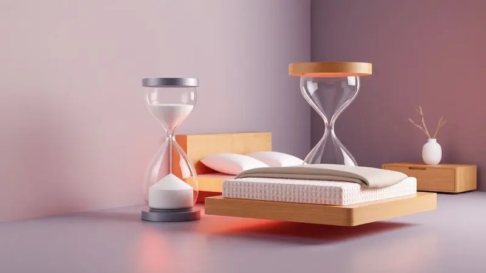

Acordar com a sensação de que passou a noite inteira lutando contra o próprio colchão é uma realidade frustrante para muitos.

Quando o corpo grita de dor ao despertar e você sente que dormiu menos do que quando se deitou, o problema pode estar bem debaixo de suas costas. Se você já se perguntou se o segredo está em um colchão mais duro ou mais macio, saiba que não existe uma resposta única.

Sua colina vertebral, suas preferências de sono e até mesmo seu peso corporam escreveram a receita do colchão ideal para você.

Este guia vai te levar desde os primeiros sinais de alerta até o teste final, mostrando como transformar suas noites em verdadeiras sessões de recuperação.

<SummaryList products={frontmatter.top_products} />

## Por que a Firmeza do Colchão é Crucial para a sua Saúde?

Imagine sua coluna como a estrutura central de uma casa. Durante o dia, você a mantém reta, consciente da postura. Mas à noite, ao se entregar ao sono, essa responsabilidade passa para o colchão.

Se ele for muito duro, será como se você estivesse tentando dormir sobre uma tábua de madeira: pontos de pressão se formam, seus quadris e ombros suportam todo o peso. Se for muito macio, sua coluna afundará como num pântano, perdendo seu alinhamento natural.

A firmeza certa é aquela que conversa com suas curvas, oferecendo resistência onde precisa e acolhimento onde merece.

### O que significa "firmeza" na prática?

A firmeza não é simplesmente uma medida de dureza. É o equilíbrio entre suporte e adaptabilidade.

Um colchão firme o suficiente mantém sua coluna naquela posição neutra que os fisioterapeutas tanto recomendam, prevenindo aquela curvatura exagerada que causa dor lombar ao acordar.

Mas é preciso entender: há uma diferença crucial entre firmeza (suporte) e rigidez (incomodidade). Você não quer um colchão que empurre contra seu corpo, e sim um que o receba mantendo a estrutura alinhada.

### Como o colchão afeta a coluna, ombros e quadril

Seu corpo fala durante o sono, mas precisamos aprender a ouvi-lo. Quando o colchão é inadequado, seus ombros são os primeiros a reclamar. Eles carregam boa parte do peso quando você dorme de lado, e sem o amortecimento certo, acordam doloridos.

O quadril, especialmente para quem dorme nessa posição, pode parecer que foi comprimido a noite toda. A coluna, por sua vez, quando perde seu alinhamento neutral, cria tensão muscular que se acumula dia após dia.

Um bom colchão age como um terapeuta noturno; moldando-se o suficiente para dissipar a pressão, mas firme na missão de manter tudo no lugar.

## Colchão Duro vs. Colchão Macio: Entenda os Extremos

Pense nos extremos como dois mundos diferentes. De um lado, o universo dos colchões duros, onde a sensação de solidez promete manter sua postura impecável. Do outro, o reino dos macios, onde o afundar suave convida ao abandono total.

Sua jornada não é escolher entre um mundo e outro, mas descobrir em qual território seu corpo se sente em casa.

### Sinais de que seu colchão está duro demais

Seu corpo te dá pistas claras quando o colchão se comporta mais como uma laje do que como uma cama. Acordar com a impressão de que alguém trabalhou em suas costas a noite toda é o sinal mais óbvio.

Dificuldade para encontrar uma posição confortável, virando-se constantemente. A sensação de que seus pontos de apoio (quadris, ombros) estão doloridos como se tivessem sido pressionados contra algo rígido.

E o mais revelador: quando você se levanta, o colchão parece exatamente igual, sem qualquer indentoção. Ele não registrou sua presença.

### Sinais de que seu colchão está macio demais

O excesso de maciez disfarça-se de conforto, mas cobra seu preço pela manhã. Você sente que está dormindo dentro do colchão, não sobre ele. Mudar de posição exige um esforço quase nadatorial, como se estivesse se movendo em melaço.

Ao acordar, sua coluna parece ter passado a noite em uma gangorra, com aquela dor surda na região lombar que te lembra que algo não está alinhado.

A impressão de afundar tanto que seus quadris estão mais baixos que seus ombros é um indicador claro de que o suporte não está adequado para seu peso.

### O Mito do Colchão Ortopédico: Duro é sempre o melhor?

A ideia de que um colchão precisa ser duro como pedra para ser bom para a coluna é uma daquelas verdades antigas que não resistem ao conhecimento atual. Um colchão extremamente duro pode, na verdade, piorar o problema ao criar pontos de pressão insuportáveis.

O que a coluna realmente precisa não é de rigidez, mas de suporte inteligente. Um colchão que se adapte às suas curvas, aliviando a pressão nos ombros e quadris enquanto mantém a região lombar apoiada. Firmeza inteligente é diferente de dureza pura.

## Como Escolher o Colchão Ideal: Fatores Determinantes

Escolher um colchão é um exercício de autoconhecimento noturno. É descobrir como seu corpo se comporta quando você não está no comando.

Dois fatores são seus principais guias nessa exploração: a posição em que você naturalmente adormece e o peso que seu colchão precisa receber e distribuir.

### A sua Posição de Dormir (Lado, Costas ou Bruços)

Seu corpo escolhe uma posição dominante por um motivo, e seu colchão precisa respeitar essa eleição. Dormir de lado é um voto pela maciez: seus ombros e quadris precisam de espaço para afundar, criando um corredor para sua coluna permanecer reta.

Dormir de costas pede firmeza: seu corpo está distribuído, e a região lombar precisa de suporte para não ceder.

Dormir de bruços é o desafio maior: ele tende a forçar sua coluna, então um colchão com uma camada macia superficial pode ajudar a acomodar melhor, mas a base precisa ser firme para evitar que seu quadril afunde demais.

### O Impacto do seu Peso Corporal (A Importância da Densidade)

Pense na densidade do colchão como sua capacidade de dizer "até aqui e não mais". Para quem tem um corpo mais pesado, um colchão de baixa densidade se comportará como areia movediça: cederá até que suas articulações suportem o peso que o colchão não consegue.

Densidades mais altas (como D33 ou D45) oferecem resistência progressiva; acolhem seu corpo, mas estabelecem um limite saudável. Para pessoas mais leves, densidades médias já proporcionam o suporte necessário sem a sensação de dormir em um trampolim que não cede.

## Materiais de Colchão e Seus Níveis de Firmeza

Os materiais são a personalidade do colchão. Cada um tem um jeito diferente de interagir com seu corpo, um ritmo próprio de resposta à pressão e ao calor. Conhecê-los é como fazer uma entrevista com seu futuro companheiro de sono.

### Colchões de Espuma e Viscoelástico (Memory Foam)

O viscoelástico tem essa memória que encanta: ele não apenas se molda ao seu corpo, ele o envolve em um abraço lento e calculado. Quando você se deita, ele parece pensar por alguns segundos antes de encontrar o formato perfeito para suas curvas.

Essa adaptação inteligente é um alívio para pontos de pressão, distribuindo seu peso de maneira quase mágica. Para casais, ele é um excelente mediador; seus movimentos não se transformam em ondas que atravessam toda a cama.

O único porém é sua tendência a reter calor; se você já dorme quente, precisa considerar essa característica.

### Colchões de Molas (Ensacadas e Bonnel)

As molas ensacadas funcionam como um exército de pequenos suportes independentes. Cada uma delas reage apenas ao peso que está sobre ela, criando um mapa personalizado do seu corpo. Seu parceiro pode se mover livremente do outro lado sem que você sinta o terremoto.

Já as molas Bonnel, interconectadas, oferecem uma sensação mais uniforme e tradicionalmente mais firme, como um suporte coletivo. A escolha depende do que você busca: personalização extrema ou firmeza consistente.

### Colchões de Látex

O látex natural tem uma resposta viva, elástica. Ele não apenas cede, ele se contrai suavemente, oferecendo um suporte que parece ativo. É como se o colchão trabalhasse junto com seu corpo, empurrando gentilmente de volta onde precisa.

Essa capacidade respiratória faz dele uma ótima opção para quem sofre com calor noturno, além de sua natureza hipoalergênica. O látex é aquele material que envelhece com dignidade, mantendo suas propriedades por anos.

Sua única exigência é que você esteja disposto a lidar com um colchão mais pesado e com um investimento geralmente mais alto.

## Recomendações: Produtos que Ajudam no Alinhamento da Coluna

Depois de entender os conceitos, é hora de conhecer os protagonistas que podem transformar suas noites. Estes produtos não são apenas itens de uma lista; são soluções testadas para problemas reais de quem busca o sono reparador.

### Colchão Emma Original (Equilíbrio entre Suporte e Conforto)

<ProductBox 
  title={frontmatter.top_products[0].title} 
  image={frontmatter.top_products[0].image} 
  link={frontmatter.top_products[0].link} 
/>

O Emma Original é aquele equilíbrio que muitas pessoas buscam: nem tábua, nem nuvem. Com 25 cm de altura, ele combina camadas de espuma Airgocell e viscoelástica sobre uma base de molas ensacadas, criando uma experiência de sono que acolhe sem afundar.

Classificado como médio-firme, ele se torna um aliado especialmente para quem dorme de costas ou de bruços. Seu isolamento de movimento é um presente para casais; o virar noturno do parceiro não precisa ser seu despertador não programado.

Alguns usuários o consideram mais firme do que esperavam, o que pode ser um ajuste inicial para quem tem um biotipo mais leve. Mas essa firmeza é exatamente o que garante o suporte lombar que previne dores.

### Colchões de Espuma D33 e D45 (Alta Firmeza)

<ProductBox 
  title={frontmatter.top_products[1].title} 
  image={frontmatter.top_products[1].image} 
  link={frontmatter.top_products[1].link} 
/>

Se você precisa de firmeza que realmente sustente, a densidade fala mais alto. O D33 oferece suporte firme com um toque de conforto intermediário, perfeito para quem pesa até 100 kg e busca o ponto ideal entre resistência e adaptação.

Já o D45 é o colchão que não negocia; sua densidade superior cria uma superfície que não cede diante do peso, recomendado para quem está acima dos 100 kg ou simplesmente prefere uma base mais rígida.

Sim, ele pode parecer robusto no começo, mas essa robustez é a garantia de que sua coluna não negociará sua postura durante a noite.

### Travesseiro Ortopédico Cervical (O Complemento Indispensável)

<ProductBox 
  title={frontmatter.top_products[2].title} 
  image={frontmatter.top_products[2].image} 
  link={frontmatter.top_products[2].link} 
/>

Um bom colchão sem o travesseiro certo é como um casaco de inverno sem o gorro. O travesseiro ortopédico cervical não é um acessório; é o complemento que completa o sistema de suporte.

Ele preenche o espaço entre seu pescoço e o colchão, mantendo a curvatura cervical em sua posição natural. Feito de espuma viscoelástica ou látex, ele se molda ao contorno da sua nuca, aliviando aquela tensão que se acumula durante o dia.

A adaptação pode levar algumas noites, mas quando seu pescoço para de acordar travado, você entende que ele não é apenas um travesseiro, é um tratamento noturno.

## Guia Prático: Como Testar o Colchão Antes de Comprar

Nenhum artigo substitui a experiência do seu corpo sobre o colchão. Mas testar não é apenas se deitar por dois minutos. É simular uma noite de sono em plena luz do dia, seguindo um ritual que revelará a verdade sobre qualquer modelo.

### Passo a passo para testar na loja física

Primeiro, ignore a vergonha. Tire os sapatos e realmente se deite como se estivesse em sua cama. Fique na sua posição dominante por pelo menos 10 minutos. Seu corpo precisa de tempo para relaxar e mostrar onde dói.

Vire para o lado, sinta como o colchão se adapta ao seu quadril e ombro. Observe se sua coluna parece uma linha reta ou se você sente algum ponto sendo pressionado. Um teste que poucos fazem: simule que está dormindo acompanhado.

Deite-se próximo à borda e peça para alguém se deitar ao seu lado, sentindo como o movimento se transfere. E antes de sair, pergunte claramente sobre a política de trocas e prazos.

### O período de teste em casa (Sleep Trial das marcas)

O sleep trial é seu seguro contra o arrependimento noturno. Entre 30 e 100 noites, você tem a chance de descobrir como o colchão se comporta na realidade do seu quarto, com seu pijama, seu travesseiro, sua rotina.

É durante esse período que você percebe se acorda mais disposto, se as dores diminuem, se o calor aumenta. A maioria das marcas oferece devolução gratuita se não der certo, um sinal de que elas confiam em seu produto o suficiente para dar essa chance ao seu corpo.

Não subestime esse período; ele é o verdadeira teste do sono.

## 5 Sinais Claros de que Chegou a Hora de Trocar o Seu Colchão

Seu colchão não vai chiar "trocame" de repente. Ele dá sinais sutis que vão se intensificando até se tornarem gritos. Primeiro: você acorda com uma dor nas costas que parece ter sido plantada durante a noite.

Segundo: o colchão apresenta depressões profundas onde você dorme, como se tivesse esculpido seu corpo nele. Terceiro: barulhos de molas cansadas ou rangidos a cada movimento. Quarto: alergias que pioram inexplicavelmente, sinal de ácaros se aninhando onde não deveriam.

Quinto: a sensação de que mesmo dormindo 8 horas, você ainda está exausto, como se o sono não tivesse cumprido seu papel reparador.

## Conclusão

Afinal, colchão duro ou macio? O veredito final não está nas etiquetas da loja, mas na conversa silenciosa entre seu corpo e a cama.

Não se trata de escolher entre extremos, mas de encontrar o equilíbrio que permite que sua coluna descanse em sua posição natural, seus ombros sejam aliviados da pressão do dia e suas noites se transformem em verdadeiras estações de recuperação.

A jornada começa reconhecendo os sinais que seu corpo já está enviando. Continua com o autoconhecimento sobre como você dorme e quanto pesa, fatores que determinam o suporte necessário. Desenrola-se na exploração dos materiais, cada um com sua personalidade única.

E culmina no teste prático, seja nas lojas ou no conforto do seu lar durante o período de sleep trial.

Lembre-se: o colchão perfeito não é aquele com mais tecnologia ou o mais caro. É aquele que desaparece durante a noite, permitindo que você apenas durma, sem pensar em dores, ajustes ou desconfortos.

É aquele que, depois de algumas semanas, você simplesmente para de notar, porque ele se tornou uma extensão natural do seu repouso. Essa invisibilidade confortável é o maior sinal de que você fez a escolha certa.

Quando encontrar esse companheiro noturno, você não estará apenas comprando um colchão. Estará investindo em centenas de manhãs mais leves, em dias com menos dor, em um corpo que acorda pronto para o que vier.

E isso, mais do que qualquer especificação técnica, é o que transforma uma simples peça de mobília em um pilar da sua qualidade de vida.

## Perguntas Frequentes (FAQ)

A dúvida principal sempre retorna: um colchão mais duro é sempre melhor para a coluna? A resposta é um não gentil. Um colchão extremamente duro pode criar pontos de pressão insustentáveis nos ombros e quadris, especialmente para quem dorme de lado.

O que sua coluna realmente precisa é de suporte inteligente, não de rigidez pura.

E para quem dorme de lado, o macio é obrigatório? Quem dorme de lado geralmente se beneficia de uma camada superior mais macia que permita aos ombros e quadris afundarem, criando espaço para a coluna se manter alinhada.

Mas a base ainda precisa de firmeza para evitar que todo o corpo afunde.

O material importa mais que a firmeza? Eles são parceiros, não concorrentes. O material determina como o colchão responde ao seu corpo (adaptação, temperatura, durabilidade), enquanto a firmeza define o nível de suporte.

Um viscoelástico de alta densidade pode ser firme e adaptável, enquanto um colchão de molas mais macio pode oferecer suporte uniforme.

Como saber se o colchão realmente é ortopédico? Cuidado com esse termo, pois não há regulamentação específica. Um colchão "ortopédico" deve oferecer suporte adequado para manter o alinhamento natural da coluna durante o sono.

Mais importante que o rótulo é testar e sentir como seu corpo responde.

O período de sleep trial é realmente garantia? Sim, desde que você siga as regras da fabricante (usar protetor, manter o colchão em boas condições). É sua chance de descobrir se o colchão funciona na prática, não apenas na teoria.

Se não se adaptar, use esse direito sem culpa; seu sono agradecerá.