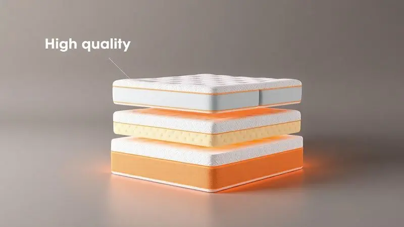

Na hora de escolher um novo colchão para garantir noites de sono reparadoras, a Ecoflex frequentemente surge como uma das marcas mais tradicionais do mercado brasileiro.

No entanto, diante de tantas opções de molas ensacadas, espumas de diferentes densidades e tecnologias variadas, é natural que surja a dúvida: o colchão Ecoflex é bom de verdade?

Neste guia completo, analisamos a fundo a reputação da marca, os diferenciais tecnológicos de seus produtos e sua avaliação no Reclame Aqui.

Além disso, comparamos a marca com as principais alternativas do mercado para ajudar você a decidir se o investimento vale a pena para o seu perfil de sono.

<SummaryList products={frontmatter.top_products} />

## A marca Ecoflex

Imagine uma empresa brasileira que transforma mais de três décadas de experiência em noites de sono verdadeiramente reparadoras. Essa é a Ecoflex, uma marca que não apenas vende colchões, mas cultiva um compromisso com a saúde do sono e o desenvolvimento sustentável.

Sua jornada começou há mais de 30 anos e, desde então, evoluiu para entender que cada corpo tem necessidades únicas de descanso.

Quando você escolhe um colchão Ecoflex, está optando por uma solução que equilibra tecnologia de ponta com um profundo conhecimento do conforto brasileiro. Não é apenas sobre espuma ou molas, trata-se de criar um refúgio noturno que respeita seu ritmo e seus valores.

## Principais características dos colchões Ecoflex

Quando você se deita em um colchão da Ecoflex pela primeira vez, percebe imediatamente a versatilidade que a marca conquistou ao longo dos anos.

O segredo está na adaptação: seja você alguém que prefere a firmeza precisa de espumas de alta densidade ou o abraço suave de modelos mais macios, há um equilíbrio pensado para diferentes perfis de dorminhocos.

O que realmente diferencia esses colchões é o compromisso com a sustentabilidade, que vai além do marketing, transformando cada camada de espuma em uma escolha ecologicamente responsável. E o melhor?

Essa consciência ambiental não sacrifica o conforto, mas sim o potencializa, oferecendo um suporte que alivia a pressão enquanto você descansa profundamente.

## Tamanhos e densidade de espuma dos colchões Ecoflex

Se você já passou horas pesquisando colchões online, sabe que encontrar o tamanho perfeito é apenas metade da batalha. A verdadeira magia acontece quando você descobre a densidade ideal para seu corpo.

A Ecoflex oferece essa combinação perfeita, com opções que vão do solteiro ao king size, acompanhadas de densidades entre 28 e 33 kg/m³. O que esses números significam na prática? A diferença entre acordar revigorado ou com dores nas costas.

Uma densidade mais alta oferece a sustentação firme que sua coluna precisa, enquanto as mais baixas proporcionam aquele acolhimento suave que convida ao relaxamento total. É como ter um consultor de sono personalizado traduzido em camadas de espuma inteligente.

## Tecnologias dos colchões Ecoflex

Imagine uma noite onde o calor não o perturba, onde os ácaros não roubam seu sono, e onde cada ponto de pressão em seu corpo encontra alívio imediato. Essa experiência é possível graças às tecnologias que a Ecoflex integra em seus colchões.

As espumas de alta densidade não são apenas resistentes, elas são projetadas para durar anos mantendo a mesma qualidade do primeiro dia. Os tecidos respiráveis funcionam como um sistema de climatização natural, regulando sua temperatura enquanto você dorme.

E para quem sofre com alergias, a tecnologia antiácaro e antibacteriana cria uma barreira protetora que transforma seu colchão em um santuário de saúde. São detalhes que parecem pequenos, mas fazem toda diferença quando as luzes se apagam.

## Qual a reputação do Ecoflex no Reclame Aqui?

De nada adianta um colchão tecnologicamente avançado se a marca não cuida de quem o compra. Por isso, analisar a reputação da Ecoflex no Reclame Aqui é como espiar os bastidores da experiência real dos clientes. A boa notícia?

A maioria dos usuários elogia não apenas o conforto dos produtos, mas também a agilidade com que a equipe responde às questões. É claro que, como qualquer empresa, há ocasionais queixas sobre prazos de entrega ou pequenas falhas.

No entanto, o que prevalece é um histórico positivo que reforça a confiabilidade da marca. Quando você investe em um colchão Ecoflex, está escolhendo uma empresa que não desaparece após a venda, mas continua presente para garantir sua satisfação.

## Critérios de escolha das melhores alternativas ao colchão Ecoflex

Às vezes, mesmo diante de uma boa opção, nosso instinto nos pede para explorar outras possibilidades. Se você está considerando alternativas ao colchão Ecoflex, comece perguntando-se: como esse produto vai me acompanhar pelos próximos anos?

A resposta está na matéria-prima (látex e espumas de alta densidade prometem maior durabilidade), no equilíbrio entre firmeza e suporte (cada corpo tem suas necessidades), e na capacidade do material de respirar (ninguém merece acordar encharcado).

Mas o critério mais valioso muitas vezes vem dos próprios usuários. Ler avaliações reais é como conversar com amigos que já testaram o produto, revelando detalhes que os catálogos nunca mencionariam.

## TOP 3 Melhores Alternativas ao Colchão Ecoflex

Se sua busca por conforto perfeito o levou além da Ecoflex, conheça três alternativas que conquistaram espaço no mercado por mérito próprio: o Colchão Ortobom, o Castor e o Anjos.

Cada um oferece uma proposta única de descanso, atendendo desde quem busca alívio imediato para dores nas costas até quem prioriza tecnologias inovadoras para um sono mais profundo.

### 1. Colchão Queen Firme Antistress BF Colchões – Melhor Colchão Alternativo

<ProductBox 
  title={frontmatter.top_products[0].title} 
  image={frontmatter.top_products[0].image} 
  link={frontmatter.top_products[0].link} 
/>

Você já imaginou um colchão que não apenas suporta seu corpo, mas também ajuda a dissipar o estresse acumulado durante o dia?

O Colchão Queen Firme Antistress da BF Colchões faz exatamente isso, combinando a firmeza necessária para o alinhamento da coluna com a tecnologia antiestresse que utiliza fios de carbono no tecido.

A sensação é única, pois a espuma "Bf Max Balance® D33" oferece sustentação enquanto a "Bf Hiper Soft®" se adapta delicadamente às suas curvas, aliviando pontos de pressão. É como ter um terapeuta pessoal embutido em seu colchão.

Apenas considere que, com limite de 110 kg por pessoa, ele pode não atender perfis específicos.

<CaixaProsContras>

**Prós:**

- Firmeza ideal para o alinhamento da coluna.

- Tecnologia antiestresse que ajuda na recuperação muscular.

- Adaptação ao corpo, aliviando os pontos de pressão.

- Alta durabilidade e boa reputação da marca.

**Contras:**

- Limite de peso pode ser restritivo para alguns usuários.

- Não é o modelo mais macio disponível no mercado.

</CaixaProsContras>

#### Detalhes do Colchão Queen Firme Antistress BF Colchões

O que realmente diferencia este colchão é sua abordagem dupla para o bem-estar.

Enquanto a construção com espuma de alta densidade garante anos de uso sem perder o formato, a tecnologia antiestresse trabalha silenciosamente para transformar seu sono em uma experiência verdadeiramente reparadora.

A capa em tecido respirável mantém o clima agradável, evitando aquela sensação de abafamento que interrompe o descanso. Se você busca um equilíbrio perfeito entre firmeza terapêutica e conforto acolhedor, este modelo estabelece um padrão difícil de ignorar.

### 2. Colchão Emma Basics Solteiro – Melhor Colchão Alternativo Custo-Benefício

<ProductBox 
  title={frontmatter.top_products[1].title} 
  image={frontmatter.top_products[1].image} 
  link={frontmatter.top_products[1].link} 
/>

Para quem acredita que qualidade não precisa custar uma fortuna, o colchão Emma Basics Solteiro é uma revelação.

Projetado com espuma D28 que se adapta inteligentemente ao seu corpo, ele oferece uma firmeza extra especialmente benéfica para quem sofre com dores nas costas.

Nos primeiros dias, pode parecer um pouco mais duro do que o esperado, mas essa sensação se ajusta naturalmente, revelando um suporte que mantém sua coluna perfeitamente alinhada durante toda a noite.

Como bônus, o material hipoalergênico protege contra alergias, enquanto a construção respirável mantém a temperatura sob controle. Com garantia de 100 noites de teste e até 10 anos de cobertura, é um convite para experimentar sem arrependimentos.

<CaixaProsContras>

**Prós:**

- Conforto e suporte adequados para aliviar dores nas costas.

- Material hipoalergênico, ideal para pessoas sensíveis.

- Boa durabilidade e resistência ao desgaste.

- Garantia de 100 noites de teste e até 10 anos.

**Contras:**

- Inicialmente pode parecer muito firme para alguns usuários.

- É uma opção mais básica em comparação com modelos premium.

</CaixaProsContras>

#### Detalhes do Colchão Emma Basics Solteiro

O designer do Emma Basics compreendeu algo fundamental: às vezes, menos é mais. Este colchão elimina complicações desnecessárias para focar no que realmente importa, uma combinação inteligente de espumas que se moldam ao seu corpo sem exageros tecnológicos.

O resultado é um produto que respira naturalmente, mantendo-se fresco enquanto você dorme, e se adapta a diferentes estilos de decoração com seu visual minimalista.

Para quem valoriza praticidade sem abrir mão do conforto essencial, esta opção representa um dos melhores investimentos em sono do mercado atual.

### 3. Colchão Queen Size Imperatore Eco Bamboo Herval – Melhor Colchão Alternativo Com Preço Similar

<ProductBox 
  title={frontmatter.top_products[2].title} 
  image={frontmatter.top_products[2].image} 
  link={frontmatter.top_products[2].link} 
/>

Imagine afundar em um abraço de nuvem após um dia intenso.

O Colchão Queen Size Imperatore Eco Bamboo Herval transforma essa fantasia em realidade, combinando a suavidade das molas ensacadas (que minimizam a transferência de movimento) com a adaptação perfeita da espuma viscoelástica D33.

O revestimento em tecido de bambu não é apenas um detalhe estético, ele regula ativamente a temperatura, criando um microclima ideal para o sono.

O Pillow Top One Side adiciona uma camada extra de conforto, enquanto os tratamentos antiácaro e antimofo garantem higiene sem esforço. Se você busca maciez acima de tudo, este colchão será seu melhor aliado, mas se prefere firmeza, pode achar o acolhimento excessivo.

<CaixaProsContras>

**Prós:**

- Conforto excepcional com adaptação ao corpo.

- Molas ensacadas que minimizam a transferência de movimento.

- Revestimento em tecido de bambu que melhora a respirabilidade.

- Tratamentos antiácaro e antimofo.

**Contras:**

- Pode ser considerado muito macio para alguns.

- A altura pode ser excessiva para determinados gostos.

</CaixaProsContras>

#### Detalhes do Colchão Queen Size Imperatore Eco Bamboo Herval

Este colchão prova que sustentabilidade e luxo podem coexistir harmoniosamente.

A espuma que se adapta ao seu corpo oferece suporte preciso para a coluna, enquanto o tecido de bambu não apenas proporciona uma sensação aveludada ao toque, mas também age como uma barreira natural contra microrganismos.

A construção foi pensada para durar, reduzindo a necessidade de trocas frequentes e minimizando o impacto ambiental.

Quando você escolhe este modelo, está optando por mais do que um lugar para dormir, está investindo em uma filosofia de descanso que respeita tanto seu bem-estar quanto o planeta que compartilhamos.

## Conclusão

Então, o colchão Ecoflex é bom? A resposta vai além de um simples sim ou não.

Trata-se de uma marca que construiu sua reputação sobre pilares sólidos: mais de 30 anos de experiência, compromisso com sustentabilidade real e uma variedade que reconhece que cada corpo dorme de forma única.

O que você ganha ao escolher a Ecoflex é a tranquilidade de investir em uma empresa que não apenas vende colchões, mas cultiva relacionamentos duradouros com seus clientes, como comprovam suas avaliações positivas no Reclame Aqui.

Se você valoriza durabilidade, tecnologias que realmente fazem diferença (como espumas de alta densidade e tecidos respiráveis) e um suporte que evoluiu com as necessidades brasileiras, a Ecoflex merece sua consideração.

No entanto, como mostramos, há excelentes alternativas como BF Colchões, Emma e Imperatore que oferecem propostas distintas para perfis específicos. O segredo está em ouvir seu corpo: ele sabe melhor do que qualquer catálogo o que precisa para despertar revigorado.

Agora, com todas as informações em mãos, qual colchão fará parte das suas próximas mil noites de sono?

## FAQ: Colchão Ecoflex

Mesmo após entender os detalhes técnicos e emocionais dos colchões Ecoflex, algumas perguntas práticas podem permanecer. Vamos esclarecer as mais frequentes para que sua decisão seja completamente informada.

### Onde fica a Ecoflex?

Quando você compra um colchão Ecoflex, está apoiando uma empresa com raízes profundamente brasileiras. A sede está localizada em São Paulo, mas sua presença se estende por lojas e redes de varejo em todo o país.

Essa distribuição ampla não é apenas sobre logística, representa um compromisso genuíno em tornar o descanso de qualidade acessível a diferentes regiões.

Desde sua base paulista, a Ecoflex desenvolve tecnologias que dialogam com o clima, os hábitos e as necessidades únicas dos brasileiros, criando produtos que entendem nosso jeito de dormir.

### Colchão Ecoflex é confiável?

Confiança se conquista com consistência, e é exatamente isso que a Ecoflex demonstra ano após ano.

A construção em espuma de alta densidade não é um acidente de marketing, mas uma escolha deliberada para oferecer suporte duradouro que realmente alivia a pressão corporal.

Os usuários que compartilham suas experiências frequentemente destacam essa durabilidade, aliada à preocupação ambiental que permeia cada etapa da produção.

Naturalmente, como qualquer escolha pessoal, sua satisfação dependerá de como suas preferências de firmeza e suporte conversam com as opções disponíveis.

Mas se confiabilidade se mede por tempo no mercado e feedback positivo consistente, a Ecoflex tem, sem dúvida, credenciais sólidas.