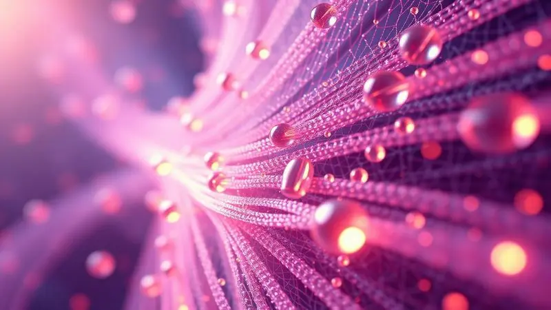
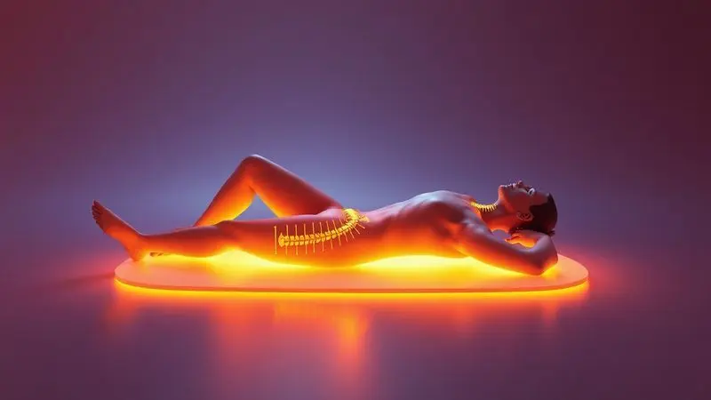

O mercado de colchões terapêuticos tem crescido exponencialmente, prometendo não apenas conforto, mas uma melhora significativa na saúde da coluna e na qualidade do sono. Entre as marcas de destaque, a Eko7 surge como uma referência em alta tecnologia e ortopedia.

Mas será que o colchão Eko7 é bom de verdade? Com promessas de massagem quântica, magnetismo e infravermelho longo, é comum surgirem dúvidas sobre a eficácia real e científica desses benefícios.

Neste artigo, vamos mergulhar nas pesquisas e especificações técnicas para revelar se o investimento nessa marca realmente vale a pena para o seu bem-estar.

<SummaryList products={frontmatter.top_products} />

## Conheça o Grupo Eko7

Imagine encontrar uma empresa que transforma a sua rotina de sono numa experiência terapêutica. O Grupo Eko7 faz exatamente isso: é uma empresa brasileira dedicada a desenvolver colchões terapêuticos e ortopédicos com alta tecnologia.

O que diferencia essa marca não são apenas os materiais que seguem normas rigorosas de qualidade, mas a constante busca por aprimorar suas ofertas através de pesquisa intensiva. O resultado?

Colchões que não apenas melhoram a qualidade do seu sono, mas também contribuem para a saúde postural, transformando seu quarto em um espaço de recuperação genuína.

## Colchão Seven Eko'7 com Massagem e Quântica

<ProductBox 
  title={frontmatter.top_products[0].title} 
  image={frontmatter.top_products[0].image} 
  link={frontmatter.top_products[0].link} 
/>

Se você busca o equilíbrio perfeito entre conforto e terapia, o Colchão Seven Eko'7 pode ser sua resposta.

Com 30 cm de altura e dupla face, ele oferece duas opções de firmeza: Soft e Firm, permitindo que você personalize sua experiência de sono conforme suas necessidades diárias.

Mas o verdadeiro diferencial está na experiência: o sistema de massagem não apenas ajuda na circulação sanguínea, mas proporciona aquela sensação de relaxamento muscular que você só encontra em spas profissionais.

Para quem deseja benefícios além do físico, a tecnologia quântica busca equilibrar as células do corpo, promovendo bem-estar e prevenção ao envelhecimento precoce. Imagine sentir seu corpo se revitalizando enquanto dorme.

As molas ensacadas garantem independência de movimento, ideal para casais que querem paz mesmo quando um se movimenta.

Porém, é importante considerar que o colchão não é recomendado para quem possui marca-passo devido aos magnetos, embora exista uma versão sem essa tecnologia disponível.

No geral, o Seven Eko'7 se destaca pela combinação de conforto e inovação que transforma seu sono em uma jornada terapêutica.

<CaixaProsContras>

**Prós:**

- Sistema de massagem que melhora a circulação.

- Tecnologia quântica para equilíbrio celular.

- Dupla face com opções de firmeza.

- Molas ensacadas para conforto em casal.

**Contras:**

- Não recomendado para portadores de marca-passo.

- Algumas pessoas podem achar muito complexo o uso das tecnologias.

</CaixaProsContras>

## Tecnologias utilizadas nos produtos Eko7

O que permite essas funcionalidades extraordinárias? Os produtos Eko7 utilizam tecnologias inovadoras que visam oferecer conforto e suporte, especialmente em colchões terapêuticos e ortopédicos.

Materiais de alta densidade proporcionam uma melhor adaptação ao corpo, aliviando pontos de pressão como se fosse uma cama inteligente que se ajusta ao seu corpo.

A inclusão de espuma viscoelástica ajuda a contornar a silhueta do usuário, garantindo um sono mais reparador onde você sente cada movimento sendo acompanhado pelo colchão.

A camada respirável também é um diferencial crucial: ela permite a circulação de ar e evita o acúmulo de calor durante a noite, contribuindo para um ambiente de sono mais agradável onde você não precisa trocar de lado porque está 'assando'.

É essa combinação que transforma tecnologia em experiência prática.

## Pesquisa comprova eficácia dos produtos Eko7

Mas todas essas promessas têm fundamento científico? As pesquisas sobre os colchões Eko7 têm mostrado resultados promissores em relação à sua eficácia terapêutica e ortopédica.

Estudos indicam que esses colchões são projetados com modernas tecnologias que visam melhorar a qualidade do sono e proporcionar suporte adequado à coluna.

Além disso, os materiais utilizados na fabricação ajudam a aliviar dores e desconfortos, favorecendo um repouso mais restaurador onde você não apenas dorme, mas se recupera.

O feedback de usuários também ressalta a durabilidade e a adaptabilidade do produto a diferentes tipos de corpo, tornando-o uma opção viável para quem busca conforto sem abrir mão da saúde.

É como ter um profissional de saúde trabalhando silenciosamente enquanto você descansa.

## Pesquisa realizada por especialista em Osteopatia

Para quem enfrenta dores nas costas, a recomendação de um especialista pode ser decisiva.

O colchão Eko7 se destaca por sua proposta terapêutica e ortopédica, sendo desenvolvido com tecnologia avançada que visa proporcionar conforto e suporte ideal para a coluna durante o sono.

Especialistas em osteopatia recomendam esse tipo de colchão para pessoas que sofrem de dores nas costas, pois sua estrutura ajuda a manter a postura correta, aliviando a pressão em pontos críticos do corpo como se fosse um ajuste osteopático constante.

Além disso, o Eko7 é fabricado com materiais que favorecem a respirabilidade e o controle da temperatura, contribuindo para um descanso mais saudável e reparador.

A pesquisa indica que um bom colchão é essencial para a saúde geral, especialmente para quem busca prevenção e tratamento de problemas osteomusculares. Imagine ter um aliado na recuperação de suas dores, trabalhando toda noite.

## Travesseiros Eko7: Tecnologia para o Sono

<ProductBox 
  title={frontmatter.top_products[1].title} 
  image={frontmatter.top_products[1].image} 
  link={frontmatter.top_products[1].link} 
/>

Se o colchão é o corpo da experiência, o travesseiro é a mente.

Os travesseiros Eko7 são projetados com tecnologias inovadoras que visam melhorar a qualidade do sono através do formato anatômico, proporcionando alinhamento e relaxamento da coluna cervical essencial para um descanso reparador.

Entre as tecnologias empregadas, estão os magnetos e o infravermelho longo, que ajudam a ativar as moléculas de água no corpo, melhorando a circulação sanguínea e favorecendo a nutrição celular.

A espuma Nanoex utilizada é antimicrobiana e hidrofóbica, aumentando a durabilidade e conforto do travesseiro enquanto protege seu investimento.

O material viscoelástico se adapta à curvatura da cabeça, promovendo boa postura e aliviando tensões musculares como se fosse uma massagem constante para sua cervical.

Embora algumas pessoas possam achar que a variedade de modelos pode ser um pouco confusa, essa diversidade permite personalização para atender às necessidades individuais, garantindo que você encontre o companheiro perfeito para suas noites.

<CaixaProsContras>

**Prós:**

- Formato anatômico que alinha a coluna cervical

- Tecnologias como magnetos e infravermelho longo

- Material antimicrobiano e hidrofóbico

- Personalização de altura para conforto

**Contras:**

- Variedade de modelos pode ser confusa para alguns

- Um pouco mais caro em relação aos travesseiros tradicionais

</CaixaProsContras>

## Conclusão

Depois de explorar cada aspecto do Grupo Eko7, podemos afirmar que esta marca realmente oferece uma experiência diferenciada para quem busca não apenas dormir, mas recuperar-se durante o sono.

Dos colchões com massagem quântica aos travesseiros anatômicos com tecnologias terapêuticas, a Eko7 transforma seu quarto em um espaço de saúde.

As pesquisas científicas e recomendações de especialistas em osteopatia confirmam que os benefícios não são apenas promessas, mas resultados comprovados.

Se você valoriza investir na qualidade do seu sono como parte fundamental da sua saúde geral, o Eko7 apresenta uma proposta sólida.

Embora o preço possa ser superior ao de opções tradicionais e algumas tecnologias exigem adaptação, o retorno em termos de conforto, suporte postural e bem-estar geral faz deste investimento uma escolha inteligente para quem prioriza a saúde no longo prazo.

Transforme suas horas de sono em momentos de recuperação genuína e descubra como a tecnologia pode trabalhar silenciosamente para sua saúde enquanto você descansa.