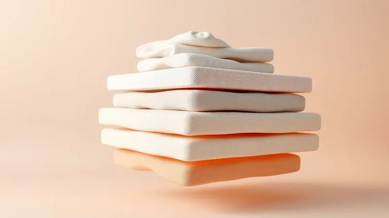

Quando você busca um colchão novo, a dúvida mais comum é: "vale o investimento?" Se você está considerando o Emma Basics, a versão mais acessível da marca europeia mais premiada, essa sensação de hesitação é natural.

Afinal, um bom colchão não é apenas um item de mobília, é a base que vai sustentar sua saúde, suas noites de descanso e seu bem-estar a longo prazo.

Aqui, vamos destrinchar cada aspecto do Emma Basics, não apenas listando características técnicas, mas traduzindo elas para o que realmente importa: como ele vai se comportar ao lado do seu corpo, a cada noite, durante anos.

<SummaryList products={frontmatter.top_products} />

## Guia de Compra: Colchão Emma Basics

Imagine um colchão que chega em uma caixa compacta, se adapta rapidamente ao seu espaço e oferece uma solução prática sem complicações. O Emma Basics é isso: uma entrada de portas abertas para o universo Emma.

Ele não vem com todos os recursos tecnológicos dos modelos mais sofisticados, mas traz o essencial bem executado. Para quem busca uma base sólida, respirável e que respeita o seu bolso, essa pode ser a porta de entrada perfeita para um sono de qualidade.

## Principais características do Colchão Emma Basics

<ProductBox 
  title={frontmatter.top_products[0].title} 
  image={frontmatter.top_products[0].image} 
  link={frontmatter.top_products[0].link} 
/>

O Emma Basics é como aquele amigo confiável: não vai te surpreender com truques mirabolantes, mas vai estar lá firme e forte, cumprindo sua função dia após dia.

Com apenas 17 cm de altura e construído com espuma D28 de alta densidade, ele oferece uma firmeza extra que funciona como uma plataforma segura para a sua coluna.

E essa segurança se traduce em números: suporta até 130 kg por pessoa nas versões padrão, mas pode chegar a impressionantes 260 kg nos tamanhos maiores, ideal para casais que não querem comprometer o espaço individual.

A confiança da marca no produto é materializada na garantia de 5 anos e, mais importante, no período de teste de 100 noites. Isso significa que você pode realmente "viver" com o colchão, sentir como ele se adapta ao seu corpo, sem aquele nervosismo de compra definitiva.

E para quem adora reorganizar o quarto ou mudar a cama de lugar, sua facilidade de manejo é um detalhe prático que faz diferença no dia a dia.

<CaixaProsContras>

**Prós:**

- Firmeza adequada para suporte da coluna.

- Alta durabilidade com espuma D28.

- Garantia de 5 anos e teste de 100 noites.

- Ótimo custo-benefício.

**Contras:**

- Firme demais para quem prefere colchões mais macios.

- Não inclui tecnologia de resfriamento como outros modelos da linha.

</CaixaProsContras>

## Composição e materiais do Colchão Emma Basics

A construção do Emma Basics é como uma receita simples, mas bem feita. A camada de espuma de alta resiliência trabalha para abraçar o contorno do seu corpo, dissipando a pressão nos pontos sensíveis, como ombros e quadril.

Acima dela, uma espuma respirável funciona como um sistema de ventilação discreto, trabalhando para manter a temperatura equilibrada, evitando aquela sensação de "colchão quente" nas noites de verão.

A capa, em tecido respirável e removível, é o toque final de conveniência, permitindo uma limpeza fácil e mantendo o ambiente sempre fresco.

## Nível de firmeza: O colchão Emma Basics é macio?

Não. E essa é uma resposta importante. O Emma Basics não é um colchão macio que "engole" você. Ele oferece uma firmeza média que se traduz em uma sensação de "descansar sobre" uma plataforma segura.

Essa característica é especialmente benéfica para quem dorme de lado ou de costas, porque enquanto a espuma se molda para aliviar pontos de pressão, a base firme mantém a coluna bem alinhada.

Se você é alguém que ama afundar em uma sensação de nuvem ou busca um apoio extremamente sólido, ele pode não ser o ponto de equilíbrio ideal.

## Tamanhos disponíveis e medidas do Emma Basics

O Emma Basics se adapta ao seu espaço, literalmente. Desde o solteiro compacto (88x188 cm) até o king size majestoso (193x203 cm), ele oferece uma grade completa para que você não tenha que se preocupar com medidas incompatíveis.

Essa flexibilidade é crucial, especialmente para quem tem dormitórios menores ou precisa de um colchão que se integre a um layout específico.

## Qual a melhor posição para dormir no Emma Basics?

A resposta está na sua postura favorita. Para os dorminhocos de lado, o Emma Basics trabalha para ceder nos pontos de impacto, dando espaço para ombros e quadril.

Para quem dorme de costas ou de barriga para baixo, a firmeza média oferece o apoio necessário para manter a postura natural, sem curvas exageradas.

### Conforto e suporte personalizados para a coluna

O Emma Basics não tenta reinventar a ergonomia, mas respeita ela. A tecnologia de espumas não apenas se adapta ao seu formato, mas distribui o peso de forma inteligente, minimizando a concentração de pressão em áreas específicas.

Essa combinação é um aliado silencioso para quem enfrenta dores nas costas, oferecendo suporte estrutural sem sacrificar o aconchego necessário para um descanso verdadeiro.

### Durabilidade e garantia de 5 anos oferecida pela marca

A garantia de 5 anos não é apenas um documento, é um testemunho da confiança que a Emma deposita na robustez do Basics. Uma construção projetada para resistir ao uso diário, mantendo suas características de conforto e apoio através dos anos.

Isso significa que você não está apenas comprando um colchão para hoje, está investindo em uma base para o seu sono que promete permanecer firme e funcional.

### Período de teste: 100 noites em casa

A política de 100 noites de teste é onde a teoria se torna experiência prática. Você não precisa decidir baseado apenas em especificações técnicas. Pode realmente dormir, se adaptar, sentir como o seu corpo responde após semanas de uso.

E se, depois desse período de convivência, ele não se tornar o parceiro ideal do seu sono, a devolução é uma etapa descomplicada, sem custos extras ou dramas.

### Impacto positivo na saúde e qualidade do sono

Um colchão como o Emma Basics opera como uma ferramenta de saúde preventiva. O suporte adequado para a coluna pode ser o divisor de águas entre acordar renovado ou com aquela dor residual nas costas.

Um sono reparador, facilitado por um ambiente fresco e ergonômico, se traduz em mais disposição durante o dia, melhor concentração e um humor mais equilibrado.

### Entrega e política de devolução gratuita

O processo de aquisição do Emma Basics é pensado para ser sem estresse. A entrega geralmente é rápida e direta, com frete gratuito para muitas regiões, eliminando custos surpresa.

E todo esse caminho é protegido pela política de devolução, que transforma a compra em um teste de convivência real, sem risco.

## Avaliações reais sobre o Colchão Emma Basics

Nas palavras dos usuários, o Emma Basics aparece como um equilíbrio confiável. A maioria celebra a adaptabilidade que molda ao corpo sem perder a estrutura firme, além da circulação de ar que evita o calor excessivo.

A durabilidade é um ponto frequentemente mencionado, com relatos de que as qualidades se mantêm mesmo após meses de uso intenso.

As discordâncias aparecem na firmeza, uma divisão natural entre quem ama a sensação de apoio sólido e quem ainda sonha com um pouco mais de maciez.

## Critérios de escolha das melhores alternativas ao Emma Basics

Se o Emma Basics não parece ser o ajuste perfeito, sua busca por alternativas deve considerar alguns pilares. A firmeza precisa conversar com sua posição de sono. A respirabilidade do material vai definir se você vai dormir fresco ou sentir calor.

O suporte de borda influencia na durabilidade e na estabilidade quando você se aproxima das extremidades. E, finalmente, as garantias e políticas de teste são seu seguro contra decisões precipitadas.

## Top 4 Melhores Alternativas Emma ao Colchão Emma Basics

O universo Emma oferece caminhos diferentes se o Basics não é sua rota.

O ZenSleep, Ortobom Light, Castor Sleep e Protège Comfort são opções com características distintas, mas vamos focar nas alternativas dentro da própria família Emma, que mantém a qualidade da marca com perfis variados.

### 1. Colchão Emma One Light – Melhor custo-benefício de entrada

<ProductBox 
  title={frontmatter.top_products[1].title} 
  image={frontmatter.top_products[1].image} 
  link={frontmatter.top_products[1].link} 
/>

Se o Basics é a porta de entrada, o One Light é a sala de estar mais completa. Com 18 cm de altura e duas camadas tecnológicas, ele incorpora a espuma Airgocell® para uma sensação de frescor mais perceptível e uma espuma de suporte que distribui o peso com inteligência.

Sua firmeza (8.0) é pronunciada, ideal para quem precisa de um alinhamento da coluna mais assertivo.

Disponível em vários tamanhos, com capa de poliéster e elastano, ele oferece um toque suave e a mesma segurança de 100 noites de teste com devolução gratuita. A garantia de 10 anos é um voto de confiança mais longo.

Ele tem uma camada a menos que o One Plus, mas essa simplificação não rouba a qualidade essencial.

<CaixaProsContras>

**Prós:**

- Conforto firme que garante bom suporte.

- Capa respirável que ajuda na frescura durante o sono.

- Ótimo custo-benefício, acessível dentro da linha Emma.

- 100 noites de teste com devolução gratuita.

**Contras:**

- Tem uma camada a menos que o modelo superior, o Emma One Plus.

- Pode não ser ideal para quem prefere colchões mais macios.

</CaixaProsContras>

#### Detalhes técnicos do colchão Emma One Light

O Emma One Light é uma sinfonia de camadas. A espuma viscoelástica se adapta como uma segunda pele, aliviando pressões, enquanto a espuma de suporte trabalha como uma fundação estável.

O revestimento respirável é o regulador de temperatura, prevenindo o superaquecimento. E seu design leve é um detalhe prático para quem precisa movimentar o colchão com facilidade.

### 2. Colchão Emma Duo Comfort – Melhor alternativa reversível

<ProductBox 
  title={frontmatter.top_products[2].title} 
  image={frontmatter.top_products[2].image} 
  link={frontmatter.top_products[2].link} 
/>

O Duo Comfort é o colchão que se adapta às mudanças da sua vida. Uma face mais firme oferece suporte ortopédico robusto. A outra, com uma leve suavidade, traz um conforto mais acolhedor.

Essa dualidade é um seguro contra mudanças de preferência ou a necessidade de acomodar hóspedes com expectativas diferentes.

A capa removível e lavável é um aliado da higiene, mantendo o ambiente sempre saudável. É importante entender que ambos os lados são firmes em essência, não são opções macias.

Para pessoas entre 50 a 70 kg, o lado mais firme pode exigir um período de adaptação, mas a qualidade dos materiais garante que esse investimento seja duradouro.

<CaixaProsContras>

**Prós:**

- Versatilidade com dois níveis de firmeza.

- Bom suporte à coluna, prevenindo dores nas costas.

- Capa hipoalergênica e lavável.

- Boa relação custo-benefício pela flexibilidade.

**Contras:**

- Ambos os lados são firmes, não agradando aos que preferem colchões macios.

- A capa pode ter um toque plástico em um dos lados, desconfortável sem lençol.

</CaixaProsContras>

#### Detalhes técnicos do Colchão Emma Duo Comfort

A construção do Duo Comfort é uma arquitetura de camadas pensada para versatilidade. A espuma de memória da camada superior molda ao contorno do corpo. A camada intermediária reforça o suporte. A base de espuma de alta densidade é a garantia de durabilidade.

O tecido respirável mantena a ventilação, e o formato compacto na caixa simplifica o transporte.

### 3. Colchão Emma Original Classic – Melhor alternativa para suporte lombar

<ProductBox 
  title={frontmatter.top_products[3].title} 
  image={frontmatter.top_products[3].image} 
  link={frontmatter.top_products[3].link} 
/>

O Original Classic é a resposta para quem precisa de um suporte lombar claro sem comprometer o conforto geral. Com 25 cm de espessura e três camadas de espuma, incluindo a base HRX fria, ele trabalha para manter a coluna no lugar ideal.

A camada viscoelástica alivia os pontos de pressão.

Para casais, sua independência de leitos é uma virtude silenciosa, minimizando a transferência de movimento. Hipoalergênico e com capa termorreguladora, ele é um aliado nas noites quentes.

O apoio nas extremidades pode ser menos pronunciado, mas sua durabilidade reforçada pela garantia de 10 anos compensa essa nuance.

<CaixaProsContras>

**Prós:**

- Ótimo suporte lombar.

- Independência de leitos eficaz.

- Conforto equilibrado entre firmeza e maciez.

- Hipoalergênico e eco-friendly.

**Contras:**

- Apoio limitado nas extremidades.

- Pode ser firme demais para pessoas mais leves.

</CaixaProsContras>

#### Detalhes técnicos do colchão Emma Original

O Emma Original é uma fusão de espuma viscoelástica e látex, criando um equilíbrio entre suporte e adaptação. A espuma de alta resiliência na base garante durabilidade e estabilidade. A cobertura respirável e removível facilita a manutenção.

Com tratamento antialérgico, ele é seguro para pessoas sensíveis. E sua tecnologia de distribuição de peso minimiza os movimentos, favorece um sono tranquilo para casais.

### 4. Colchão Emma Premium Hybrid – Melhor alternativa premium macia

<ProductBox 
  title={frontmatter.top_products[4].title} 
  image={frontmatter.top_products[4].image} 
  link={frontmatter.top_products[4].link} 
/>

O Premium Hybrid é onde a tradição das molas ensacadas encontra a modernidade das espumas. Oferece uma firmeza média que permite dormir "sobre" o colchão, sem afundar excessivamente.

Suas 7 zonas de suporte são pensadas para aliviar pressão em partes específicas do corpo.

A respirabilidade é um ponto forte, mantendo o frescor. Hipoalergênico e com capa removível, é fácil de manter.

Alguns usuários podem sentir que a firmeza é excessiva ou que há retenção de calor, mas para quem prioriza qualidade e conforto estrutural, ele representa um investimento sólido.

<CaixaProsContras>

**Prós:**

- Conforto com suporte ortopédico

- Boa respirabilidade

- Propriedades hipoalergênicas

- Capa removível e lavável

**Contras:**

- Pode ser considerado firme por alguns usuários

- Possibilidade de retenção de calor

</CaixaProsContras>

#### Detalhes técnicos do Colchão Emma Premium Hybrid

O Premium Hybrid é uma junção de tecnologias. As molas ensacadas adaptam ao corpo para alinhamento preciso. As camadas de espuma de memória e látex trabalham para reduzir pontos de pressão e melhorar ventilação. A capa removível e lavável simplifica a limpeza.

É um equilíbrio calculado entre firmeza e maciez, projetado para um sono reparador.

## FAQ: Perguntas Frequentes sobre o Emma Basics

As dúvidas mais comuns sobre o Emma Basics revelam o que realmente importa para os dorminhocos. Vamos responder não apenas com dados, mas com o contexto que ajuda você a decidir.

### Qual modelo da Emma é o mais firme?

Se você busca a firmeza máxima dentro da linha Emma, o Original Classic geralmente é a referência. Ele combina camadas de espuma que criam uma superfície mais rígida, oferecendo suporte robusto para a coluna e alívio de pressão.

É a escolha para quem dorme de costas ou de lado, mas deseja sentir uma base sólida e constante.

### O colchão Emma Basics é bom para quem tem dor nas costas?

O Emma Basics foi pensado com suporte e conforto em mente. A combinação de espuma de alta densidade com camadas adaptativas trabalha para alinhar a coluna durante o sono. A tecnologia de respiração mantena a temperatura agradável.

A percepção final de conforto é pessoal, mas a estrutura oferece os elementos necessários para um ambiente potencialmente benéfico para quem enfrenta dores nas costas.

### Quanto tempo dura o Colchão Emma?

Um colchão Emma pode acompanhar você por cerca de 10 anos, dependendo do uso e dos cuidados. A qualidade dos materiais é a base dessa resistência. Rotatividade periódica e uso de protetores podem maximizar essa vida útil.

Escolher um Emma é investir em um produto que une conforto e durabilidade, uma base sólida para anos de sono de qualidade.

## Conclusão

O Emma Basics não é um colchão que promete revolucionar sua vida. Ele é a opção consciente, a escolha que equilibra qualidade técnica com um preço mais acessível, dentro da confiança de uma marca premiada.

Para quem busca uma solução prática, firme e respirável, sem os recursos tecnológicos mais avançados, ele representa um ponto de entrada seguro no universo do bom sono. A garantia de 5 anos e o teste de 100 noites são seu seguro contra a dúvida.

Se você valoriza uma base sólida, durabilidade clara e uma proposta sem complicações, o Emma Basics pode ser o parceiro discreto e confiável para suas noites.

Se, após essa análise, você sente que precisa de mais tecnologia, diferentes níveis de firmeza ou um suporte lombar especializado, as alternativas dentro da linha Emma oferecem caminhos distintos, mantendo a mesma filosofia de qualidade. O seu sono merece essa atenção.