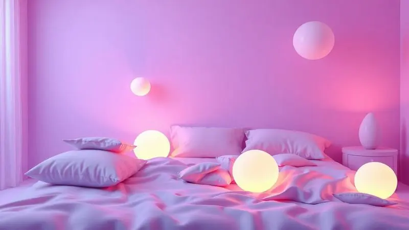

Imagine aquela dúvida que surge quando você está quase decidindo sobre um novo colchão: "será que escolho o macio ou o firme?". Essa indecisão pode fazer você perder semanas pesquisando, comparando modelos, ou até comprar algo que não será ideal depois de alguns meses.

O Colchão Emma Duo Comfort surge como uma resposta inteligente para esse dilema, oferecendo ambos os mundos em um único produto.

Mas além da proposta interessante, ele realmente garante que você tenha apoio lateral suficiente, não superaqueça nas noites de verão e dure anos sem perder sua forma?

Nesta análise, vamos explorar cada camada dessa solução e comparar com outras opções da marca para você entender se ele é o investimento certo para seu sono em 2025.

<SummaryList products={frontmatter.top_products} />

## O que é o Colchão Emma Duo Comfort?

<ProductBox 
  title={frontmatter.top_products[0].title} 
  image={frontmatter.top_products[0].image} 
  link={frontmatter.top_products[0].link} 
/>

Você já teve a experiência de comprar um colchão que, depois de algumas semanas, percebeu que não era tão confortável quanto imaginou? O Emma Duo Comfort elimina esse risco. Ele é essencialmente um "colchão para indecisos" ou para casais com preferências opostas.

Um lado oferece a firmeza que muitos buscam para alívio de dores nas costas, enquanto o outro lado é o acolhimento macio que faz você sentir-se envolto.

Essa dualidade transforma o produto em uma solução especialmente útil para quartos de hóspedes ou para adolescentes que ainda estão descobrando qual firmeza preferem.

A construção pensada para apoio ortopédico significa que, independentemente do lado escolhido, sua coluna será mantida em posição adequada.

E quando pensamos na praticidade do dia a dia, a capa removível responde àquela preocupação: "como vou limpar isso se algo acontecer?". Sim, ela é lavável.

A única observação é que o lado firme, por seu material específico, pode ter uma sensação menos acolhedora quando você está apenas sobre o tecido, sem lençol. É algo que vale testar pessoalmente se você é sensível a texturas.

<CaixaProsContras>

**Prós:**

- Possui dois níveis de conforto em um só colchão.

- Apoio ortopédico que ajuda a aliviar dores nas costas.

- Capa removível e lavável, facilitando a limpeza.

- Indicado para diversas faixas etárias e preferências de sono.

**Contras:**

- O lado firme pode ser desconfortável sem o uso de lençóis.

- Pode não ser a melhor escolha para quem prefere colchões exclusivamente macios.

</CaixaProsContras>

## Principais características do Colchão Emma Duo Comfort

O que realmente faz o Duo Comfort funcionar não é apenas a ideia de dois lados, mas a combinação cuidadosa de materiais que trabalham em conjunto.

Cada camada foi escolhida para uma função específica, criando um equilíbrio entre adaptabilidade ao corpo e sustentação estrutural.

### Tecnologia Dupla Face 2 em 1: Lado Firme e Lado Macio

Pense em uma situação comum: você e seu parceiro têm preferências completamente diferentes para firmeza do colchão. Ou talvez você mesmo oscila entre dias em que quer mais apoio e outros em que busca o aconchego.

A tecnologia dupla face do Emma resolve isso sem exigir que você compre dois produtos. O lado firme é desenvolvido para quem precisa de uma base sólida, especialmente para manter a postura durante o sono.

O lado macio, por outro lado, cria aquela sensação de "ninho" que muitas pessoas associam ao descanso profundo.

Essa flexibilidade permite que você ajuste não apenas conforme sua necessidade atual, mas também conforme mudanças no seu corpo ou preferências ao longo dos anos.

### Camadas de Espuma: Alto Conforto vs Alto Suporte

Aqui está onde a ciência do produto entra: a espuma de memória não apenas se adapta ao seu corpo, ela alivia pontos de pressão como ombros e quadril, distribuindo o peso de forma inteligente. Imagine dormir sem aquela sensação de "peso" em áreas específicas.

Paralelamente, a camada de suporte funciona como uma estrutura que mantém tudo no lugar, garantindo que sua coluna não curve ou se torça durante a noite.

Para casais, essa dualidade é especialmente valiosa porque enquanto uma pessoa pode precisar mais do alívio de pressão, a outra pode valorizar mais o alinhamento postural. O resultado é um equilíbrio que não sacrifica nenhum dos dois aspectos.

### Capa Protetora e Respirável que não esquenta

Você já acordou no meio da noite porque estava superaquecido? A capa do Emma Duo Comfort foi projetada para prevenir essa experiência frustrante. Os materiais permitem que o ar circule, dissipando o calor corporal acumulado.

Isso significa que mesmo em dias mais quentes, você tende a manter uma temperatura constante e agradável. A respirabilidade também contribui para a saúde do colchão ao longo do tempo, evitando acúmulo de humidade.

E quando se trata de manutenção, a praticidade da capa lavável resolve aquela ansiedade sobre alergias, acidentes ou simplesmente a necessidade de uma limpeza periódica. É uma característica que parece pequena, mas impacta diretamente a sua tranquilidade diária.

## Para quem o Emma Duo Comfort é recomendado?

Se você está na dúvida se este colchão é para você, pense nos seguintes cenários: você compartilha a cama com alguém que tem preferência oposta de firmeza; você tem um quarto de hóspedes onde diferentes pessoas usarão o espaço; você está em uma fase de vida onde suas necessidades podem mudar (como recuperação de uma lesão); ou você simplesmente valoriza a possibilidade de experimentar ambas as sensações antes de se decidir.

Para quem tem alergias, os materiais hipoalergênicos oferecem um adicional de segurança.

Mas se você já identificou que o Duo Comfort pode ser sua solução, a próxima questão natural é: ele resistirá ao uso?

## Durabilidade e Suporte Lateral: Quantos quilos ele suporta?

A construção em camadas de alta densidade dá ao colchão uma resistência que suporta até 150 quilos por lado.

Isso não é apenas um número técnico, é a garantia que você precisa se você ou seu parceiro têm um peso mais elevado, ou se você simplesmente quer um produto que não mostrará sinais de deterioração rápido.

O suporte lateral é especialmente pensado para manter a borda firme, evitando aquela sensação de "rolar para fora" quando você se aproxima dos limites da cama.

A distribuição uniforme do peso significa que pontos de pressão não se concentram, contribuindo tanto para a durabilidade do produto quanto para a qualidade do seu sono ao longo dos anos.

## Qual a diferença do Emma Duo Comfort para o Colchão Emma Original?

<ProductBox 
  title={frontmatter.top_products[1].title} 
  image={frontmatter.top_products[1].image} 
  link={frontmatter.top_products[1].link} 
/>

Essa comparação é crucial porque ambos são produtos da mesma marca, mas atendem necessidades diferentes.

O Emma Original é como um "equilibrista" perfeito: oferece uma firmeza intermediária que funciona bem para a maioria das pessoas, com isolamento de movimento e resfriamento eficiente. É a escolha segura quando você já sabe que prefere uma sensação média.

O Duo Comfort, por outro lado, é o "adaptável": ele dá a você o poder de escolher entre macio e firme, suportando até 130kg por pessoa. A capa removível é um diferencial prático importante.

A única troca é que alguns usuários percebem que o tecido do lado firme pode ser menos confortável diretamente sobre a pele, e o Original pode ter uma performance de resfriamento um pouco superior.

A decisão, então, depende do que você valoriza mais: a certeza de um ponto ótimo intermediário ou a flexibilidade de ter duas opções à sua disposição.

<CaixaProsContras>

**Prós:**

- Dupla face oferece opções de firmeza para diferentes preferências.

- Capa removível e lavável facilita a higienização.

- Suporta até 130kg por pessoa, ideal para diversos biotipos.

- Versatilidade torna-o adequado para quartos de hóspedes ou Airbnb.

**Contras:**

- Tecido do lado firme pode ser menos confortável sem lençol.

- Emma Original pode oferecer melhor resfriamento durante a noite.

</CaixaProsContras>

## Experiência de Compra: 100 noites de testes e 10 anos de garantia

Comprar um colchão online pode gerar aquela insegurança: "será que vou gostar quando ele chegar?". A Emma resolve isso com 100 noites de teste. Você pode dormir no produto, experimentar ambos os lados, adaptar-se e só decidir depois de vivenciar.

Se não for o ideal, a devolução é simples. A garantia de 10 anos, por outro lado, é um compromisso da marca com a durabilidade. É a confirmação que eles esperam que esse colchão acompanhe você por uma década, dando tranquilidade sobre o investimento.

## Melhores Colchões Alternativos ao Emma Duo

Se após toda essa análise você ainda não está completamente convencido que o Duo Comfort é sua escolha final, existem alternativas robustas que também podem resolver seu problema de conforto. Vamos explorar duas opções que representam caminhos diferentes.

### Colchão Emma Premium Hybrid

<ProductBox 
  title={frontmatter.top_products[2].title} 
  image={frontmatter.top_products[2].image} 
  link={frontmatter.top_products[2].link} 
/>

Quando você busca não apenas firmeza ou maciez, mas um sistema de suporte que integra tecnologias, o Premium Hybrid é uma evolução. Ele combina espuma e molas pocket, criando uma base onde cada elemento trabalha para alívio de dores e regulação térmica.

As camadas Airgocell e ComfortFlex, junto com as molens AirFlex, são projetadas para oferecer aquela sensação de "sustentação inteligente": o corpo é acomodado sem perder o apoio estrutural.

Se o preço é um ponto de consideração, pense que o investimento aqui é justificado pela integração de tecnologias e pela garantia extensa.

O período de teste de 100 noites permite que você valide pessoalmente se esse equilíbrio entre firmeza e maciez é o que seu corpo precisa.

<CaixaProsContras>

**Prós:**

- Conforto ideal, com equilíbrio entre firmeza e maciez.

- Alívio de dores nas costas relatado por usuários.

- Materiais respiráveis que ajudam na regulação da temperatura.

- Garantia de 10 anos e período de teste de 100 noites.

**Contras:**

- Preço pode ser considerado mais alto em relação a colchões apenas de espuma.

- Pode ser mais firme do que alguns usuários preferem.

</CaixaProsContras>

### Colchão Castor Silver Star: Alternativa Dupla Face

<ProductBox 
  title={frontmatter.top_products[3].title} 
  image={frontmatter.top_products[3].image} 
  link={frontmatter.top_products[3].link} 
/>

Para quem valoriza especialmente a característica dupla face, mas quer uma construção com molas pocket, o Castor Silver Star é uma alternativa sólida.

Sua capacidade de uso dos dois lados aumenta a vida útil prática, e as molas pocket garantem que movimentos do parceiro não se transmitam pela cama. Imagine dormir sem ser perturbado quando alguém se levanta.

A combinação de espumas D24 e D28 cria um gradiente de conforto que pode ser mais sutil que a diferença abrupta entre os lados do Emma Duo. A altura entre 32cm e 34cm também proporciona um acolhimento mais profundo.

O peso maior é uma consequência dessa construção robusta, mas é uma troca aceitável pelo isolamento de movimento e suporte individualizado que você recebe.

<CaixaProsContras>

**Prós:**

- Design de dupla face que aumenta a durabilidade.

- Molas Pocket® para suporte individualizado.

- Composição de espumas que equilibra firmeza e conforto.

- Altura adequada para bom acolhimento.

**Contras:**

- Pode ser um pouco mais pesado para manusear.

- Algumas versões podem ter variações de densidade que não agradam a todos.

</CaixaProsContras>

## Perguntas Frequentes sobre o Emma Duo Comfort

Algumas dúvidas persistem mesmo após entender as características. Abaixo, as respostas para questões que podem surgir na sua decisão.

### Qual a densidade do colchão Emma Duo?

As densidades diferentes são o segredo da dualidade: 28 kg/m³ no lado de equilíbrio (conforto médio) e 33 kg/m³ no lado firme. Essa diferença não é apenas numérica, ela se traduz na sensação física que você experimenta.

Para casais com gostos distintos, essa variação permite que cada pessoa escolha a densidade que melhor responde às suas necessidades de apoio.

### Quanto tempo dura o colchão Emma Comfort Duo?

A expectativa de vida útil gira em torno de 10 anos, mas isso depende diretamente de como você cuida do produto. Girar o colchão periodicamente (para distribuir o uso) e usar protetores são ações simples que prolongam significativamente essa durabilidade.

O tecido respirável ajuda a manter a integridade interna, prevenindo degradação por humidade ou calor. Com atenção básica, você pode esperar que ele mantenha seu conforto e suporte por todo esse período.

## Conclusão

O Colchão Emma Duo Comfort é mais que uma opção com dois lados, é uma solução para dilemas reales: indecisão pessoal, diferenças entre casais, necessidade de flexibilidade para hóspedes.

Ele traduz características técnicas como densidade variada, capa lavável e suporte lateral em benefícios emocionais: tranquilidade na escolha, facilidade na manutenção e confiança na durabilidade.

A comparação com o Emma Original mostra que a decisão depende do que você prioriza. Se você quer a segurança de uma firmeza intermediária bem executada, o Original é excelente.

Se você valoriza a capacidade de alternar entre macio e firme conforme suas necessidades mudam, o Duo Comfort oferece essa adaptabilidade.

Com 100 noites para testar e 10 anos de garantia, a experiência de compra remove o risco tradicional de escolher um colchão online.

Se você está naquele momento de hesitação entre firmeza e maciez, ou se divide a cama com alguém que tem preferência oposta, o Duo Comfort pode ser a resposta que elimina essa indecisão.

Experimente ambos os lados, descubra qual se adapta melhor ao seu corpo, e decida com a certeza de que você teve a oportunidade de validar pessoalmente antes de comprometer-se definitivamente.