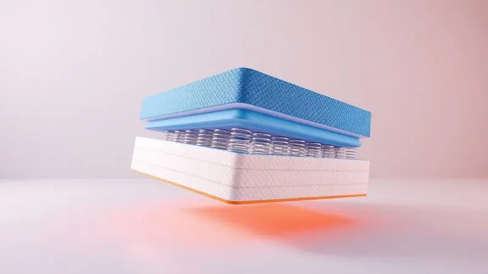
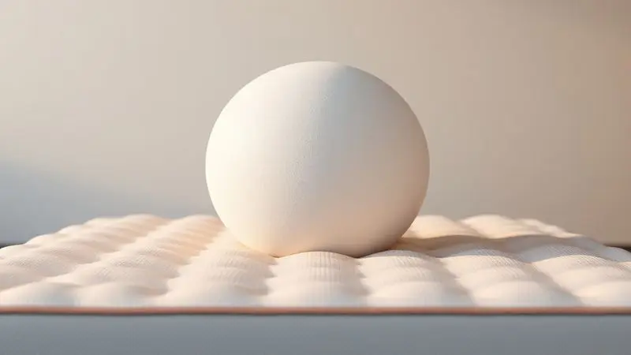

Imagine encontrar um equilíbrio perfeito entre o suporte firme que sua coluna precisa e o abraço macio que seu corpo deseja.

É exatamente essa promessa que o Colchão Emma Premium Hybrid traz ao mercado brasileiro, combinando a tradição das molas ensacadas com a inovação das espumas de alta tecnologia. Mas será que esse investimento realmente transforma suas noites de sono?

Aqui vamos além das especificações técnicas para descobrir se esse colchão é a solução para suas dores, inquietações ou simplesmente para aquela sensação de não ter descansado o suficiente.

<SummaryList products={frontmatter.top_products} />

## Principais características do Colchão Emma Premium Hybrid

<ProductBox 
  title={frontmatter.top_products[0].title} 
  image={frontmatter.top_products[0].image} 
  link={frontmatter.top_products[0].link} 
/>

O segredo do Emma Premium Hybrid 2.0 está na sua inteligente combinação híbrida. Enquanto as molas ensacadas trabalham para sustentar sua coluna com precisão cirúrgica, as espumas de alta performance abraçam seus contornos para dissipar a pressão.

Imagine dividir seu corpo em 7 zonas estratégicas, cada uma recebendo exatamente o suporte que precisa, dos ombros que afundam ao dormir de lado até os quadris que pedem estabilidade.

Essa atenção aos detalhes se traduz em uma experiência prática: você se mexe ou seu parceiro se vira, e o movimento praticamente desaparece, preservando o sono profundo de ambos.

A sensação de frescor vem da tecnologia Airgocell, que mantém o ar circulando como uma brisa suave através das camadas.

Sim, o investimento é significativo, mas quando você fecha os olhos e sente que finalmente encontrou a posição perfeita, aquela que não exige mais ajustes, o custo começa a fazer sentido.

<CaixaProsContras>

**Prós:**

- Tecnologia híbrida que equilibra conforto e suporte.

- 7 zonas de suporte para melhor alinhamento corporal.

- Excelente absorção de movimento.

- Boa ventilação para noites mais frescas.

**Contras:**

- Custo pode ser considerado elevado por alguns.

- Apesar da durabilidade, é preciso investir em cuidados para manter suas propriedades.

</CaixaProsContras>

## Composição do Colchão Emma Premium Hybrid: Molas e espumas

O que realmente diferencia esse colchão não é apenas o que ele tem, mas como cada camada conversa com a próxima. É uma sinfonia de materiais onde cada componente tem uma função específica, trabalhando em harmonia para transformar seu sono.

### 1) Espuma Airgocell ultra respirável

Pense naquela noite de verão quando o calor simplesmente não deixa você dormir. A espuma Airgocell foi criada para acabar com esse problema. Sua estrutura aberta age como um sistema de ventilação integrado, permitindo que o ar circule livremente entre as camadas.

O resultado é uma regulação de temperatura quase imperceptível, você simplesmente não sente calor. Mas não se engane pensando que é apenas sobre frescor.

Essa espuma também oferece um suporte inteligente que se adapta ao seu corpo sem comprometer a respirabilidade, aliviando pontos de pressão enquanto mantém tudo arejado.

### 2) Espuma de memória (Viscoelástica)

Esta é a camada que parece conhecer você. A espuma viscoelástica responde ao calor e peso do seu corpo com uma precisão quase personalizada, moldando-se aos seus contornos como se tivesse sido feita sob medida. Aquele ombro que sempre dói quando você dorme de lado?

A espuma de memória cria um espaço perfeito para ele afundar sem pressionar.

E para casais, essa tecnologia tem um benefício quase mágico: ela absorve movimentos de forma tão eficiente que o giro noturno do seu parceiro se transforma em um leve balanço, não em um susto que interrompe seu sono.

### 3) Espuma HRX de alta densidade

Enquanto as camadas superiores cuidam do conforto imediato, a espuma HRX trabalha nos bastidores como a base de tudo. Sua alta densidade oferece a estrutura sólida que mantém sua coluna alinhada durante horas de sono.

Pense nela como o alicerce de um prédio, invisível para quem olha de fora, mas essencial para que tudo se mantenha firme.

Essa camada também contribui para a redução de movimentos indesejados, criando uma estabilidade que transforma sua cama em um refúgio contra as perturbações noturnas.

### 4) Molas Ensacadas AirFlex com zoneamento otimizado

Cada uma das molas ensacadas AirFlex trabalha de forma independente, como se tivessem consciência própria. Quando seus quadris pressionam mais, as molas nessa área respondem com firmeza extra. Seus ombros precisam de mais maciez? As molas ali cedem um pouco mais.

Esse zoneamento inteligente significa que seu corpo encontra apoio exatamente onde precisa, não onde o colchão decide que deve oferecer. Para quem dorme de lado, isso se traduz em um alívio real da pressão nos pontos mais sensíveis.

### 5) Base de apoio 5G e Capa Premium à prova d’água

A base 5G é o que transforma todas essas camadas em uma unidade coesa, garantindo que cada movimento seja suportado de forma uniforme.

Já a capa premium à prova d'água é o guardião silencioso, protege seu investimento contra acidentes noturnos, respingos ou simplesmente o desgaste do tempo, estendendo a vida útil do colchão sem que você precise se preocupar.

## Qual a firmeza do colchão Emma Premium Hybrid?

O termo 'média' pode parecer vago, mas aqui ele descreve uma experiência de sono equilibrada que acerta em cheio na maioria das preferências. A firmeza é suficiente para manter sua coluna alinhada, aquela dor lombar que surgia ao acordar simplesmente desaparece.

Ao mesmo tempo, há flexibilidade suficiente para que seus quadris afundem levemente quando você dorme de lado, evitando que seus ombros carreguem todo o peso. É como caminhar na linha tênue entre suporte terapêutico e conforto aconchegante.

O resultado é um colchão que não impõe uma firmeza, mas se adapta à sua.

## O colchão Emma Premium Hybrid é quente? Respirabilidade e temperatura

Para quem tem a temperatura corporal elevada durante a noite, esta pode ser a resposta para noites mais tranquilas. A combinação estratégica das camadas cria um sistema de fluxo de ar que dissipa o calor natural do corpo.

A espuma Airgocell na superfície trabalha como uma primeira linha de defesa, enquanto as passagens entre as molas permitem que o ar circule livremente pelas camadas inferiores.

Você não sente uma brisa artificial, simplesmente não sente aquela sufocante sensação de calor que o faz virar o travesseiro repetidamente.

## Absorção de movimentos para noites sem interrupções

Quantas vezes você já foi acordado pelo simples fato de seu parceiro mudar de posição? Essa interrupção sutil pode fragmentar seu sono de forma mais prejudicial do que um despertador. A beleza do sistema híbrido está justamente em como ele isola movimentos.

As molas ensacadas absorvem impactos localmente, enquanto as espumas superiores amortecem qualquer vibração residual.

O resultado é quase contraintuitivo: mesmo compartilhando a cama, você experimenta uma sensação de privacidade no sono, como se tivesse seu próprio espaço ininterrupto.

## Como é a entrega e o período de teste de 100 noites da Emma?

A experiência começa antes mesmo de você dormir a primeira noite. O colchão chega em uma embalagem compacta que descomplica a logística, sem precisar de uma equipe para subir escadas ou manobrar em corredores estreitos.

Mas a verdadeira segurança vem dos 100 dias de teste. Não são apenas três meses para ver se você gosta da cor; é tempo suficiente para que seu corpo se adapte, para que você passe por diferentes estações, para que experimente noites boas e ruins.

Se depois desse período completo algo ainda não estiver certo, o processo de devolução é ativado. É um voto de confiança da marca na própria qualidade.

## Melhores Alternativas ao Colchão Emma Premium Hybrid

Se o Premium Hybrid não parece se encaixar perfeitamente no que você procura, ou se seu orçamento pede outras opções, o universo Emma oferece alternativas que atendem a necessidades específicas. Cada modelo tem sua personalidade, descubra qual conversa com a sua.

### 1. Colchão Emma Original Classic – Melhor Colchão de Espuma

<ProductBox 
  title={frontmatter.top_products[1].title} 
  image={frontmatter.top_products[1].image} 
  link={frontmatter.top_products[1].link} 
/>

Para quem busca o puro abraço da espuma viscoelástica, o Original Classic é uma experiência de imersão total. A tecnologia MemoryAdapt não apenas se adapta ao seu corpo, ela parece memorizar suas posições favoritas.

Quando você dorme de lado, há um alívio perceptível nos ombros e quadris, como se o colchão criasse nichos perfeitos para cada articulação. A independência de movimento é impressionante para um colchão sem molas, criando um ambiente harmonioso para casais.

A única ressalva vem para pessoas acima de 100kg, que podem sentir que o suporte poderia ser um pouco mais robusto.

<CaixaProsContras>

**Prós:**

- Ótimo alívio de pressão para quem dorme de lado.

- Boa independência de movimento, minimizando transferências.

- Design respirável que ajuda na regulação da temperatura.

- Capa removível e lavável, facilitando a manutenção.

**Contras:**

- Firmeza pode não ser ideal para pessoas muito pesadas.

- Pode exigir um período de adaptação para alguns usuários.

</CaixaProsContras>

### 2. Colchão Emma One Light – Melhor Opção Firme e Econômica

<ProductBox 
  title={frontmatter.top_products[2].title} 
  image={frontmatter.top_products[2].image} 
  link={frontmatter.top_products[2].link} 
/>

Quando a prioridade é suporte ortopédico sem complicações, o One Light fala a linguagem da firmeza assertiva. Suas duas camadas trabalham em sintonia para criar uma superfície que praticamente guia sua coluna para a posição correta.

Se você acorda com tensões inexplicáveis nas costas, essa firmeza pode ser a solução que faltava. A construção hipoalergênica oferece paz mental para quem sofre com alergias, enquanto os 10 anos de garantia são um testemunho silencioso da durabilidade. A troca?

Alguns usuários sentem falta daquela camada extra de maciez que transforma o deitar em um momento de prazer, não apenas de correção postural.

<CaixaProsContras>

**Prós:**

- Suporte firme e ortopédico para melhor alinhamento da coluna.

- Hipoalergênico e feito com materiais duráveis.

- 100 noites de teste com devolução gratuita.

- Garantia de 10 anos, garantindo qualidade.

**Contras:**

- A firmeza pode não agradar a todos os usuários.

- Pode faltar um pouco de maciez para quem prefere colchões mais suaves.

</CaixaProsContras>

### 3. Colchão Emma Basics – O Melhor Custo-Benefício de Solteiro

<ProductBox 
  title={frontmatter.top_products[3].title} 
  image={frontmatter.top_products[3].image} 
  link={frontmatter.top_products[3].link} 
/>

Para quem busca qualidade Emma sem o investimento premium, o Basics é uma demonstração de que essencial não precisa ser básico. A espuma D28 oferece uma firmeza honesta, não é aquele colchão que finge ser macio só para agradar na primeira noite.

Ele é firme desde o início, e com o tempo, essa firmeza se transforma em um suporte que conhece seu corpo. A regulação de temperatura funciona surpreendentemente bem para o preço, e a capacidade de suportar até 130kg por pessoa faz dele uma opção inclusiva.

Sim, há um período de adaptação, mas é aquele tipo de adaptação que termina com você se perguntando como dormiu tanto tempo sem esse suporte.

<CaixaProsContras>

**Prós:**

- Boa relação custo-benefício.

- Suporte firme que mantém a coluna alinhada.

- Tecido respirável que regula a temperatura.

- Adaptabilidade ao corpo após um período de uso.

**Contras:**

- Firmeza pode exigir um período de adaptação.

- Não é tão macio quanto outros modelos mais caros.

</CaixaProsContras>

### 4. Colchão Luuna Original King – Alternativa Premium de Outra Marca

<ProductBox 
  title={frontmatter.top_products[4].title} 
  image={frontmatter.top_products[4].image} 
  link={frontmatter.top_products[4].link} 
/>

Quando você quer sair do ecossistema Emma sem abrir mão da sofisticação, o Luuna Original King apresenta seu próprio conceito de luxo.

As quatro camadas de espumas trabalham em uma dança de densidades diferentes, com a viscoelástica com gel atuando como o elemento refrescante que torna as noites de verão suportáveis.

A redução de transferência de movimento é quase teatral, você vê seu parceiro se mexendo, mas não sente nada. A tecnologia Aircell mantém um fluxo de ar constante que evita aquela sensação de superaquecimento que algumas espumas de memória produzem.

A recomendação específica de peso é um detalhe importante: ele foi calibrado para oferecer o melhor desempenho dentro de uma faixa, não para ser tudo para todos.

<CaixaProsContras>

**Prós:**

- Conforto excepcional com suporte equilibrado.

- Redução da transferência de movimento entre parceiros.

- Tecnologia de resfriamento que evita superaquecimento.

- Capa removível e lavável para fácil manutenção.

**Contras:**

- Recomenda-se para pessoas com determinadas faixas de peso.

- Pode não se adaptar para aqueles que preferem colchões ultra-macios.

</CaixaProsContras>

### 5. Colchão Original Guldi Mola Ensacada – Opção Macia e Acessível

<ProductBox 
  title={frontmatter.top_products[5].title} 
  image={frontmatter.top_products[5].image} 
  link={frontmatter.top_products[5].link} 
/>

Para quem busca a sensação clássica das molas ensacadas sem o preço premium, o Guldi oferece uma experiência honesta e reconfortante. A combinação de molas individuais com espuma de poliuretano cria uma superfície que responde aos movimentos de forma quase intuitiva.

A sensação térmica agradável vem do tecido de malha, que age como uma segunda pele respirável. A embalagem a vácuo facilita a logística, mas exige paciência, o colchão precisa de tempo para respirar e recuperar sua forma plena.

A escolha entre versões macia e firme permite que você personalize a experiência, embora quem busca firmeza extrema possa encontrar opções mais assertivas.

<CaixaProsContras>

**Prós:**

- Conforto personalizado com molas ensacadas.

- Boa ventilação e sensação térmica agradável.

- Processo de entrega facilitado com embalagem a vácuo.

- Ótimo custo-benefício.

**Contras:**

- Pode não ser ideal para quem prefere colchões bem firmes.

- A espuma pode perder um pouco da firmeza com o tempo.

</CaixaProsContras>

## Avaliação final: O Colchão Emma Premium Hybrid vale a pena?

Quando o silêncio da noite chega e você se deita após um dia longo, o que realmente importa? É esse momento que o Emma Premium Hybrid foi projetado para transformar.

O investimento não é apenas em um produto, mas em uma experiência de sono que respeita sua individualidade. As 7 zonas de suporte não são números em uma ficha técnica, são a resposta para aquela dor no ombro que sempre aparecia quando você dormia de lado.

A absorção de movimento não é apenas tecnologia, é a garantia de que você não será roubado do sono profundo pelas reviravoltas noturnas do parceiro.

A ventilação inteligente significa acordar sem aquela sensação pegajosa que estraga as manhãs de verão. Mas a decisão final é íntima como o próprio sono.

Se você busca um equilíbrio genuíno entre conforto e suporte, se valoriza noites ininterruptas, e se está disposto a investir em algo que vai acompanhar seus sonhos pelos próximos anos, então sim, o Premium Hybrid merece sua consideração séria.

Se sua prioridade é orçamento apertado ou firmeza extrema, as alternativas Emma podem falar mais diretamente com suas necessidades.

## Conclusão

Escolher um colchão é uma das decisões mais pessoais que fazemos sobre nosso bem-estar. Não se trata apenas de especificações técnicas ou preços, mas de como nos sentimos ao fechar os olhos após um dia intenso.

O Emma Premium Hybrid representa uma filosofia de sono que equilibra ciência e sensibilidade, oferece o suporte preciso que sua coluna precisa enquanto abraça seus contornos com uma maciez que parece feita sob medida.

Depois de explorar cada camada, testemunhar a inteligência do zoneamento e compreender como as tecnologias trabalham em harmonia, fica claro que este não é apenas mais um colchão híbrido.

É uma resposta bem projetada para quem está cansado de concessões: não precisa escolher entre firmeza e conforto, entre frescor e aconchego, entre noites solitárias e compartilhadas.

As 100 noites de teste são o convite final, não para julgar pelas primeiras horas, mas para permitir que seu corpo descubra, no ritmo próprio do sono, se encontrou seu lugar ideal.

## FAQ: Dúvidas Frequentes sobre o Emma Premium Hybrid

As perguntas mais comuns revelam o que realmente importa para quem está considerando este investimento. Aqui estão respostas que vão além dos manuais técnicos.

### Quantos quilos o Emma Premium Hybrid suporta?

Com uma capacidade de até 150 quilos por pessoa, o Emma Premium Hybrid foi projetado para ser inclusivo. Essa robustez não significa apenas que ele aguenta mais peso, significa que mantém suas propriedades de suporte e conforto independentemente do perfil do usuário.

A combinação híbrida distribui a carga de forma inteligente, garantindo que tanto quem precisa de suporte extra quanto quem busca conforto leve encontrem a mesma qualidade de experiência.

### Qual a altura e densidade do modelo Hybrid?

Os 30 centímetros de altura não são apenas uma medida, são uma declaração de conforto. Essa estatura permite uma jornada de camadas que transforma o simples ato de deitar em uma experiência estratificada.

A densidade variada das espumas trabalha em conjunto com as molas, criando um gradiente de firmeza que vai do suporte estrutural na base ao alívio de pressão na superfície.

O resultado é um colchão que entende que diferentes partes do seu corpo precisam de tratamentos diferentes.

### Um colchão de molas não danifica vindo enrolado na caixa?

Parece contraintuitivo, mas a embalagem compacta é fruto de engenharia, não de improviso. Quando enrolado, o colchão experimenta uma pressão uniforme que as molas ensacadas são projetadas para resistir.

Após ser desenrolado, elas não apenas retomam sua posição original, elas 'aprendem' sua forma ideal através do processo de expansão. Nas primeiras horas você pode notar uma firmeza ligeiramente diferente, mas isso é o sistema respirando e se acomodando, não um defeito.

### Quanto tempo dura o colchão Emma Premium Hybrid?

Os 10 a 15 anos de vida útil não são uma promessa vaga, mas uma projeção baseada na qualidade dos materiais e na inteligência da construção. Cada camada foi selecionada não apenas pelo conforto imediato, mas por como envelhece.

Com cuidados simples como rotação periódica e uma base adequada, esse colchão pode se tornar o companheiro silencioso de milhares de noites, testemunhando sonhos, descansos e renovações ano após ano.