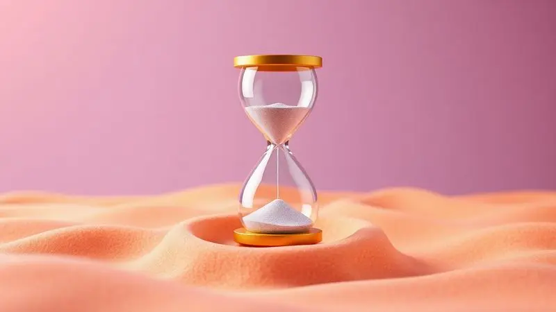

Imagine acordar sem aquela dor nas costas que acompanha você há meses. A verdade é que a maioria das pessoas não percebe que o segredo para noites tranquilas está em três letrinhas e dois números: D23 ou D26.

Essas siglas não são apenas números técnicos, mas a chave para entender como seu corpo se relaciona com o colchão durante horas de repouso.

Escolher entre elas significa muito mais que comparar especificações, significa alinhar suas necessidades físicas e emocionais com o apoio perfeito.

<SummaryList products={frontmatter.top_products} />

## Diferença entre colchão D23 e D26: descubra tudo antes de comprar

Você já se perguntou por que algumas pessoas dormem como anjos enquanto outras vivem virando na cama? A resposta pode estar na densidade do seu colchão.

O D23, com seus 23 kg/m³, abraça suavemente corpos até 70 kg, oferecendo uma sensação acolhedora que convida ao relaxamento.

Já o D26, com 26 kg/m³, é como um parceiro de treino para sua coluna, proporcionando suporte extra para quem precisa de mais estrutura, especialmente acima de 70 kg.

Essa diferença de 3 kg/m³ não é apenas numérica, mas define quem terá um sono que realmente recupera as energias.

## O que significa D23 e D26? Entenda a densidade dos colchões

Pense na densidade como a "personalidade" da espuma. O número que acompanha o "D" revela quanta matéria-prima está compactada em cada metro cúbico. Um D23 significa 23 kg por metro cúbico, enquanto o D26 carrega 26 kg.

Isso não é apenas sobre peso, mas sobre como o material mantém sua forma ao longo do tempo. O D26, sendo mais compacto, é como um amigo que nunca cancela um compromisso, sempre presente para oferecer suporte consistente.

## Principais diferenças entre colchão D23 e D26

Enquanto o D23 oferece um acolhimento gentil que se molda ao seu corpo, o D26 proporciona uma sensação de estabilidade que mantém sua postura alinhada durante toda a noite. A diferença vai além da sensação na hora de deitar, alcançando o despertar com mais disposição.

O D23 costuma ser mais acessível, ideal para quem quer qualidade sem investir muito, já o D26 é para quem encara o colchão como um investimento em saúde.

### O que é um colchão Densidade 23?

Imagine deitar em uma nuvem que respeita seus contornos, mas ainda mantém um suporte essencial. Assim é o D23, projetado principalmente para camas de solteiro e espaços de uso ocasional, ele suporta até aproximadamente 60 kg por pessoa.

Perfeito para quartos de hóspedes ou para quem procura uma opção econômica sem abrir mão do conforto. No entanto, se você compartilha a cama ou precisa de apoio intensivo noite após noite, pode sentir que ele falta um pouco de "resiliência" com o passar dos anos.

### O que é um colchão Densidade 26?

Aqui está o colchão que entende que seu corpo merece um suporte que não cede sob pressão. A densidade 26 é construída para quem precisa de uma base firme, seja por peso corporal mais elevado ou simplesmente por preferir sentir que está sendo sustentado.

Ele é como aquele amigo forte que sempre tem as costas para você, mantendo suas propriedades por muito mais tempo. Ideal para quem não quer substituir o colchão frequentemente, ele representa durabilidade que se converte em economia a médio prazo.

## Qual colchão dura mais: D23 ou D26?

Pense na densidade como os anos de experiência de um profissional. Enquanto o D23 traz 23 kg/m³ de conhecimento, o D26 acumula 26 kg/m³.

Essa diferença de 3 pontos faz com que o D26 seja mais resiliente ao desgaste, especialmente em situações de uso intensivo ou com peso maior.

Se sua prioridade é um companheiro de sono que permaneça fiel por muitos anos, o D26 geralmente cumpre essa promessa de longevidade. Para uso familiar ou em quartos principais, ele se mostra como a escolha que valoriza o amanhã.

## Como escolher entre colchão D23 e D26 para o seu biotipo

A escolha entre D23 e D26 começa com um simples questionário interno: como seu corpo se sente ao despertar? O D23 abraça delicadamente quem pesa menos, oferecendo conforto sem excesso de firmeza.

Já o D26 entrega suporte extra para corpos que demandam mais estrutura, transformando a noite em uma verdadeira sessão de recuperação. Pense no seu peso não como um limite, mas como o guia para encontrar o equilíbrio perfeito entre acolhimento e sustentação.

### Existe colchão D23 para casal?

Sim, e ele se adapta especialmente bem a casais cujo peso combinado não ultrapassa certos limites. Esses modelos são projetados com inteligência para até 90 kg por pessoa, criando um espaço compartilhado de conforto.

Para parceiros que buscam um meio-termo entre economia e qualidade, o D23 pode ser a solução ideal. Apenas considere que, se alguém do casal tem necessidades de suporte mais elevadas, o D26 conversa melhor com a ideia de "investir na saúde de ambos".

## Exemplos de Modelos com Densidade D23 e D26

Você encontra o D23 principalmente em modelos ortopédicos simples e espumas tradicionais, enquanto o D26 brilha em viscoelásticos e molas ensacadas que prometem tecnologia a serviço do conforto.

### Colchão Casal Espuma D23 Super Resistente Probel

<ProductBox 
  title={frontmatter.top_products[0].title} 
  image={frontmatter.top_products[0].image} 
  link={frontmatter.top_products[0].link} 
/>

Este colchão da Probel é como descobrir o ponto exato entre conforto e durabilidade. Com sua espuma D23, ele oferece abraço que alinha sua coluna sem ser excessivamente firme.

O diferencial do pillow duplo significa que você pode alternar os lides, estendendo significativamente o prazer de dormir nele. Com limite de 60 kg por pessoa, ele conversa especialmente bem com quem busca firmeza intermediária que alivia pontos de pressão sensíveis.

O tecido em poliéster de 120 g/m² não apenas facilita a limpeza, mas adiciona um toque moderno ao seu quarto.

<CaixaProsContras>

**Prós:**

- Conforto e suporte equilibrados

- Pillow duplo para maior durabilidade

- Indicado para diferentes biotipos

- Fácil manutenção devido ao tecido poliéster

**Contras:**

- Limite de peso que pode não atender a todos

- Pode não ser suficiente para quem prefere colchões mais firmes

</CaixaProsContras>

### Colchão de Berço D-23 Soft Moldespuma

<ProductBox 
  title={frontmatter.top_products[1].title} 
  image={frontmatter.top_products[1].image} 
  link={frontmatter.top_products[1].link} 
/>

Quando se trata do sono do seu bebê, cada detalhe importa. Este colchão combina a suavidade necessária com o suporte essencial para o desenvolvimento saudável.

A camada "Soft" é como um carinho constante, enquanto a espuma D23 garante firmeza suficiente para a coluna em formação.

A proteção contra líquidos é um alívio para qualquer pai, e os tratamentos antiácaro, antialérgico e antimofo transformam preocupações em tranquilidade.

Perfeito para berços americanos padrão, ele entende que segurança e conforto devem caminhar juntos nos primeiros anos de vida.

<CaixaProsContras>

**Prós:**

- Confortável devido à camada Soft.

- Revestimento impermeável facilita a limpeza.

- Tratamentos antiácaro e antialérgico aumentam a segurança.

- Disponível em medidas padrão de berço.

**Contras:**

- A densidade D23 pode não ser tão durável a longo prazo.

- Pode não atender a quem busca maior firmeza.

</CaixaProsContras>

## Dicas para aumentar a vida útil do colchão

Seu colchão também precisa de cuidados para retribuir todas as noites de sono que ele oferece. Comece protegendo-o com capas adequadas, prevenindo manchas que podem envelhecê-lo prematuramente.

Virar e girar o colchão a cada três meses garante que o desgaste seja uniforme, como rotacionar os pneus de um carro. Mantenha o ambiente ventilado e aproveite dias de sol para arejá-lo, afastando a umidade que pode trazer problemas.

Evite transformá-lo em trampolim ou sentar sempre na mesma borda, ações que comprometem sua estrutura interna. Esses pequenos gestos podem prolongar significativamente a vida do seu companheiro noturno.

## FAQ: Perguntas Frequentes sobre Densidade de Colchão

A densidade é o coração do conforto e da durabilidade. Enquanto o D26 ergue com força, o D23 acolhe com carinho, cada um atendendo a necessidades específicas.

### 1. Qual densidade é ideal para quem tem dor nas costas?

Para quem convive com dores nas costas, o D26 muitas vezes se apresenta como o aliado ideal. Sua maior firmeza ajuda a manter a coluna em uma posição neutra durante toda a noite, reduzindo pontos de tensão.

O D23, embora confortável, pode não oferecer suporte suficiente para quem precisa de apoio mais consistente. Considere seu peso e posição de dormir como guias, mas sempre priorize o que faz sua coluna acordar mais leve pela manhã.

### 2. Quem dorme de lado deve usar colchão mais firme ou mais macio?

Quem dorme de lado precisa de um colchão que entenda os pontos de pressão nos ombros e quadris. Geralmente, uma opção mais macia permite que essas áreas afundem suavemente, alinhando a coluna naturalmente.

No entanto, "mais macio" não significa "sem suporte", procure o equilíbrio que permita contorno sem comprometer a postura. O conforto não deve vir à custa do alinhamento, mas sim em parceria com ele.

### 3. Um colchão de densidade alta é sempre mais duro?

Nem sempre. A densidade alta, como no D26, fala sobre resiliência e durabilidade, não necessariamente sobre rigidez. Muitos modelos combinam bases firmes com camadas superiores macias, criando uma experiência que sustenta e acolhe simultaneamente.

A sensação final depende da construção completa do colchão. Por isso, ao experimentar, preste atenção em como seu corpo responde, não apenas à primeira impressão, mas à sensação que permanece.

## Conclusão

Escolher entre D23 e D26 é mais que comparar números, é entender como seu corpo conversa com o descanso. O D23 oferece economia inteligente para quem busca conforto sem complicações, perfeito para uso individual ou ocasional.

O D26, por sua vez, apresenta-se como um investimento em qualidade de vida para quem valoriza suporte consistente e durabilidade.

Lembre-se que a densidade certa é aquela que transforma sua noite de sono em um ritual de recuperação. Teste, sinta e confie nas sensações que seu corpo transmite.

Se você ainda hesita, considere que o colchão perfeito é aquele que você não sente pela manhã, apenas os benefícios que ele deixou. Seu descanso merece essa atenção, porque cada noite bem dormida é um dia mais bem vivido.