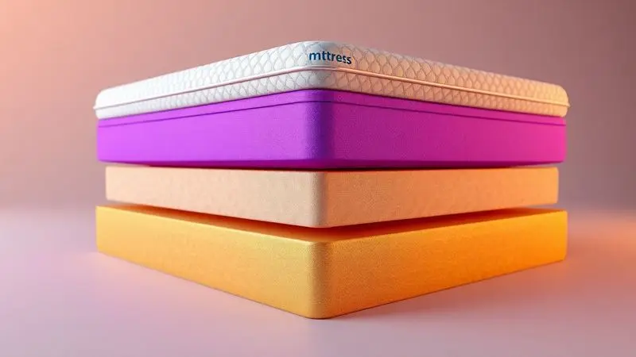
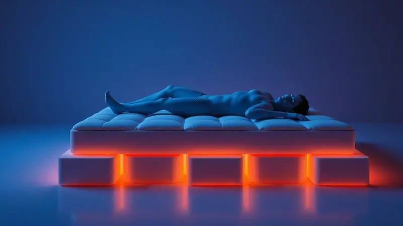
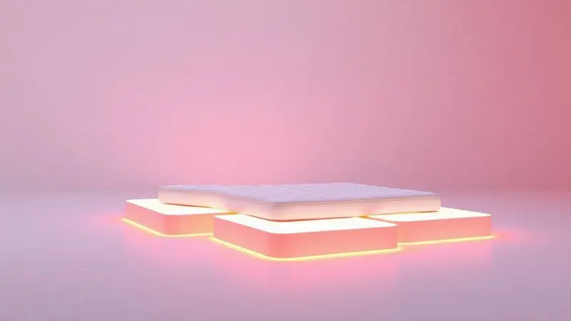

Escolher um novo colchão é uma das decisões mais pessoais que você pode tomar. Afinal, ele será seu refúgio todas as noites, o lugar onde seu corpo se regenera. Entre tantas marcas no mercado, a Ortobom conquistou gerações de brasileiros com sua tradição e qualidade.

Mas quando você se depara com dezenas de modelos, do Exclusive Sleep à linha Visco Freedom, como saber qual é o parceiro perfeito para seu sono? Aqui, vamos além das especificações técnicas para mostrar exatamente como cada colchão Ortobom pode transformar suas noites.

<SummaryList products={frontmatter.top_products} />

## Diferencial dos colchões ortobom

O que faz da Ortobom uma marca tão especial não é apenas um produto, mas uma filosofia: equilibrar inovação tecnológica com um entendimento genuíno do que seu corpo precisa para descansar.

Pense em marcas que apenas vendem colchões, e outras que se preocupam com sua recuperação diária. A Ortobom pertence ao segundo grupo.

Imagine acordar sem aquela dor nas costas que persiste há semanas, ou dividir a cama sem que cada movimento do parceiro interrompa seu sono profundo.

Para isso, a marca desenvolveu soluções como as molas ensacadas individualmente que isolam movimentos, e espumas viscoelásticas que abraçam suas curvas naturais.

Tudo isso envolto em tratamentos que criam uma barreira invisível contra ácaros e fungos, para que você respire um ar mais puro enquanto dorme.

Mas o diferencial mais emocionante está na personalização. Você não precisa se encaixar em um modelo único, pode encontrar sua combinação perfeita de firmeza e aconchego.

## Análise Detalhada: Colchão Exclusive Sleep Ortobom

<ProductBox 
  title={frontmatter.top_products[0].title} 
  image={frontmatter.top_products[0].image} 
  link={frontmatter.top_products[0].link} 
/>

Para entender o nível premium da Ortobom, o Exclusive Sleep é o ponto de partida ideal. Este é o colchão que transforma noites comuns em experiências de regeneração plena.

As molas Superpocket são o segredo para relações mais pacíficas na cama. Cada mola age independentemente, então quando seu parceiro se vira ou levanta, seu lado permanece completamente inalterado. É como ter duas camas separadas no conforto de uma só. O resultado?

Sono ininterrupto para os dois.

Camadas de espuma D26 e High Resilience (HR) trabalham juntas em uma dança perfeita: firmeza para sustentar sua coluna e maciez para acolher seus pontos de pressão. Isso significa que você pode dormir em qualquer posição sem sacrificar o alinhamento postural.

E aqui está um alívio para sua rotina: a tecnologia No Turn elimina a necessidade de virar o colchão periodicamente. Sem peso extra para carregar, sem calendário para lembrar.

Enquanto isso, os tratamentos antiácaro, antialérgico e antifungo cuidam silenciosamente da sua saúde respiratória, criando um santuário de higiene onde você recarrega suas energias.

<CaixaProsContras>

**Prós:**

- Conforto superior com molas ensacadas que garantem movimento independente.

- Camadas de espuma que proporcionam suporte firme e toque macio.

- Tratamento antiácaro, antialérgico e antifungo para maior higiene.

- Tecnologia "No Turn" que facilita a manutenção.

**Contras:**

- Pode ser considerado mais pesado em comparação com modelos mais simples.

- O tamanho maior pode não caber em quartos pequenos.

</CaixaProsContras>

## Quais os Top 10 Melhores Colchões Da Ortobom?

Do exclusivo ao acessível, cada modelo da Ortobom conta uma história diferente de conforto. Esta seleção não é sobre ranking técnico, mas sobre encontrar qual narrativa combina com sua jornada pessoal de sono.

### 1. Colchão Molas Ensacadas Visco Freedom OrtoPillow Ortobom

<ProductBox 
  title={frontmatter.top_products[1].title} 
  image={frontmatter.top_products[1].image} 
  link={frontmatter.top_products[1].link} 
/>

Acordar sem marcas no corpo e sentir que cada ponto de pressão foi cuidadosamente aliviado. Esta é a promessa do Visco Freedom OrtoPillow.

A espuma viscoelástica não apenas se adapta ao seu corpo, ela memoriza seus contornos, criando um molde personalizado que muda quando você muda de posição.

As molas ensacadas realizam a mágica do isolamento de movimento, perfeitas para quem divide a cama com um parceiro inquieto. Já o Pillow Top não é apenas uma camada extra, é como um abraço aconchegante que recebe você todas as noites.

A tecnologia No Turn simplifica sua vida de uma forma prática, enquanto o investimento se justifica ano após ano na durabilidade que sentirá literalmente apoiando seu descanso.

<CaixaProsContras>

**Prós:**

- Molas ensacadas que evitam a transferência de movimento.

- Espuma viscoelástica que se adapta ao corpo e alivia pressão.

- Camada Pillow Top para maior conforto.

- Facilidade na manutenção com a tecnologia No Turn.

**Contras:**

- Não é o modelo mais barato disponível.

- Pode ser considerado um pouco pesado para manusear.

</CaixaProsContras>

### 2. Colchão Molas Ensacadas Elegant OrtoPillow Ortobom

<ProductBox 
  title={frontmatter.top_products[2].title} 
  image={frontmatter.top_products[2].image} 
  link={frontmatter.top_products[2].link} 
/>

Se o elegancia tivesse uma sensação física, seria esta: o equilíbrio perfeito entre sofisticação e funcionalidade. As molas SuperPocket não apenas isolam movimento, elas criam zonas específicas de apoio que respondem individualmente ao peso de cada região do seu corpo.

O Ortopillow é aquele detalhe que faz toda a diferença ao final de um dia cansativo. Enquanto você se entrega ao conforto, os tratamentos antialérgicos trabalham como guardiões invisíveis, criando um ambiente onde seus pulmões agradecem a cada manhã.

Sim, o investimento é premium, mas como colocar preço em acordar renovado todos os dias?

<CaixaProsContras>

**Prós:**

- Molas ensacadas reduzem a transferência de movimento.

- Camada Ortopillow proporciona conforto adicional.

- Tratamento antialérgico e antiácaro melhora a saúde do sono.

- Tecnologia No Turn facilita a manutenção.

**Contras:**

- Pode não ser a opção mais acessível.

- Tamanhos variados podem não atender a todos os gostos.

</CaixaProsContras>

### 3. Colchão Molas Nanolastic Physical Spring Ortopillow Ortobom

<ProductBox 
  title={frontmatter.top_products[3].title} 
  image={frontmatter.top_products[3].image} 
  link={frontmatter.top_products[3].link} 
/>

Algumas pessoas não procuram apenas conforto, buscam uma base sólida. Para elas, o Nanolastic Physical Spring oferece uma estrutura que não cede, com molas de aço de 2mm que garantem segurança em cada movimento.

O Pillow Top Ortopillow suaviza essa firmeza com um toque acolhedor, enquanto o tecido com tratamento antialérgico significa que você pode respirar profundamente sem preocupações. Imagine suportar até 200kg total sem sentir que está comprometendo a qualidade do apoio.

A classificação como firme é, na verdade, um convite para quem precisa de estrutura definida, não apenas uma superfície macia.

<CaixaProsContras>

**Prós:**

- Estrutura robusta com molas de aço.

- Camada de conforto adicional com Pillow Top Ortopillow.

- Tratamento antialérgico e antiácaro no tecido.

- Variedade de tamanhos disponíveis.

**Contras:**

- Classificado como firme, o que pode não agradar a todos.

- Pode ser um pouco pesado para movimentar.

</CaixaProsContras>

### 4. Colchão Ortopédico Wood Light OrtoPillow Ortobom

<ProductBox 
  title={frontmatter.top_products[4].title} 
  image={frontmatter.top_products[4].image} 
  link={frontmatter.top_products[4].link} 
/>

Para quem convive com dores nas costas, a firmeza não é uma preferência, é uma necessidade. O Wood Light OrtoPillow entende essa linguagem. Sua estrutura com madeira de reflorestamento oferece o suporte extra firme que colunas exigentes precisam.

Mas não pense que é apenas uma tábua rígida. O Pillow Top Europeu insere aconchego exatamente onde seu corpo precisa, criando um paradoxo delicioso: firmeza que sustenta, maciez que acolhe.

Os tratamentos antiácaro e antifungo transformam cada noite em um ritual de purificação.

O sistema One Side significa liberdade daquela tarefa mensal de virar o colchão, dando mais tempo para o que realmente importa: seu descanso.

<CaixaProsContras>

**Prós:**

- Estrutura ortopédica que oferece suporte firme.

- Pillow Top Europeu para maior conforto.

- Tratamento antiácaro e antifungo.

- Feito com madeira de reflorestamento.

**Contras:**

- Pode ser muito firme para algumas pessoas.

- Não é adequado para quem prefere colchões mais macios.

</CaixaProsContras>

### 5. Colchão Molas Nanolastic Orthotel Spring Ortopillow Ortobom

<ProductBox 
  title={frontmatter.top_products[5].title} 
  image={frontmatter.top_products[5].image} 
  link={frontmatter.top_products[5].link} 
/>

Algumas promessas são feitas para durar, como a garantia digital de 60 meses deste modelo. Ele não apenas promete qualidade excelente, ele a entrega com uma construção que suporta até 150kg por pessoa.

A firmeza extra firme funciona como um abraço seguro para seu corpo, enquanto o Pillow Top Americano adiciona camadas de conforto estrategicamente distribuídas.

O tecido Jacquard importado não é apenas bonito, é funcional, com tratamentos que protegem sua saúde enquanto você dorme profundamente.

O fato de ser Double Side é como ter dois colchões em um, estendendo sua vida útil sem comprometer a experiência.

<CaixaProsContras>

**Prós:**

- Firmeza extra firme para melhor suporte.

- Pillow Top Americano para conforto adicional.

- Tecido com tratamento antiácaro e antifungo.

- Garantia digital de 60 meses.

**Contras:**

- Pode ser um pouco pesado para manusear.

- Não é tão macio quanto modelos mais simples, mas isso garante maior suporte.

</CaixaProsContras>

### 6. Colchão Molas Ensacadas Airtech Spring OrtoPillow Ortobom

<ProductBox 
  title={frontmatter.top_products[6].title} 
  image={frontmatter.top_products[6].image} 
  link={frontmatter.top_products[6].link} 
/>

O ar que respiramos enquanto dormimos pode fazer toda diferença. O Airtech Spring utiliza molas Superpocket que não apenas isolam movimento, mas criam um sistema de ventilação natural.

Enquanto isso, a camada Ortopillow trabalha como um terapeuta noturno, aliviando pontos de pressão que você nem sabia que existiam.

Os tratamentos antialérgicos são sua primeira defesa contra espirros matinais, criando um microclima saudável em seu santuário do sono.

Embora a faixa de peso tenha seus limites, para quem se encaixa nela, é uma experiência de suporte personalizada que se renova a cada noite.

<CaixaProsContras>

**Prós:**

- Molas ensacadas que oferecem suporte personalizado.

- Camada adicional de conforto com Ortopillow.

- Tratamentos antialérgicos, antiácaros e antifungo.

- Tecnologia No Turn que facilita a manutenção.

**Contras:**

- A faixa de peso suportada pode não atender a todos.

- O preço pode ser mais elevado se comparado a modelos básicos.

</CaixaProsContras>

### 7. Colchão Molas Nanolastic Light Ortopillow Ortobom

<ProductBox 
  title={frontmatter.top_products[7].title} 
  image={frontmatter.top_products[7].image} 
  link={frontmatter.top_products[7].link} 
/>

Para quem busca o meio-termo perfeito entre firmeza e adaptabilidade, o Light Ortopillow é uma revelação. Suas molas ensacadas se ajustam como parceiras de dança ao seu corpo, minimizando transferência de movimento sem perder a responsividade.

A espuma de poliol vegetal é um convite ao sono sustentável, enquanto o sistema Polyframe nas bordas garante que mesmo quando você rola até a beirada, sente-se seguro e apoiado. A capacidade para 130kg por pessoa oferece um equilíbrio interessante para muitos casais.

É aquele colchão que não pede adaptação dramática, apenas aceita você como você é.

<CaixaProsContras>

**Prós:**

- Sistema de molas ensacadas que evita a transferência de movimento.

- Camada Ortopillow proporciona conforto adicional.

- Espuma com propriedades antiácaros.

- Estrutura robusta com reforço nas bordas.

**Contras:**

- Suporta até 130 kg por pessoa, o que pode ser limitante.

- Pode exigir adaptação inicial para quem está acostumado a colchões mais firmes.

</CaixaProsContras>

### 8. Colchão Molas Ensacadas Visco Gel Gold Ultra OrtoPillow Ortobom

<ProductBox 
  title={frontmatter.top_products[8].title} 
  image={frontmatter.top_products[8].image} 
  link={frontmatter.top_products[8].link} 
/>

Imagine a sensação de afundar levemente em um abraço que sabe exatamente onde aliviar sua tensão. A espuma visco gel realiza este pequeno milagre noturno, trabalhando em conjunto com molas que respeitam seu espaço pessoal mesmo durante o sono compartilhado.

A espuma D33 é como um anfitrião generoso que recebe diferentes biotipos com igual conforto, suportando até 150kg por pessoa. O OrtoPillow europeu é o toque final de luxo, enquanto o Polyframe expande literalmente sua área útil.

Sim, ele pede cuidados periódicos com girações, mas pense nisso como um pequeno ritual para manter a excelência do seu refúgio noturno.

<CaixaProsContras>

**Prós:**

- Conforto excepcional devido à tecnologia visco gel.

- Molas ensacadas que reduzem a transferência de movimento.

- Revestimento com tratamento antiácaro e antifungo.

- Camada adicional de conforto no topo.

**Contras:**

- Necessita de girações periódicas para manutenção.

- O preço pode ser um pouco elevado em comparação com outros modelos.

</CaixaProsContras>

### 9. Colchão Espuma D20 Physical Ortobom

<ProductBox 
  title={frontmatter.top_products[9].title} 
  image={frontmatter.top_products[9].image} 
  link={frontmatter.top_products[9].link} 
/>

Às vezes, menos é mais. Para quem busca simplicidade inteligente, o D20 Physical oferece exatamente isso. Sua densidade D20 cria um colchão que acolhe sem afundar excessivamente, perfeito para quem dorme de lado e precisa aliviar pontos de pressão nos ombros e quadril.

O Poliol vegetal é mais do que uma escolha ecológica, é um compromisso com sua saúde a longo prazo. Enquanto o tratamento Actguard trabalha silenciosamente como um escudo contra microorganismos.

A tecnologia Double Side é um presente para sua praticidade, estendendo significativamente a vida útil do produto.

Para usuários mais leves, é uma combinação perfeita de conforto e funcionalidade.

<CaixaProsContras>

**Prós:**

- Conforto macio ideal para dormidas laterais.

- Tratamento contra alérgenos para maior saúde.

- Sustentável com uso de Poliol vegetal.

- Tecnologia Double Side para prolongar a vida útil.

**Contras:**

- Suporte de peso limitado a usuários mais leves.

- Pode não ser ideal para quem prefere superfícies mais firmes.

</CaixaProsContras>

### 10. Colchão Anatômico ISO 150 Ortobom

<ProductBox 
  title={frontmatter.top_products[10].title} 
  image={frontmatter.top_products[10].image} 
  link={frontmatter.top_products[10].link} 
/>

Quando você precisa de uma base que não negocia sua firmeza, o ISO 150 é sua resposta. A classificação mega firme não é um exagero, é um compromisso com quem precisa de suporte absoluto.

A placa de EPS oferece sustentação uniforme que desafia o tempo, enquanto a espuma D45 acrescenta toques de conforto exatamente onde necessário.

Com capacidade para até 120kg por lado, este é o colchão que não se intimida, apenas oferece. Os tratamentos antialérgicos garantem que cada respiração noturna seja limpa, enquanto as opções de tamanho se adaptam a diferentes espaços e necessidades.

Para quem valoriza robustez acima de tudo, é um companheiro para anos de sono reparador.

<CaixaProsContras>

**Prós:**

- Suporte firme ideal para quem gosta de colchões mais duros.

- Feito com materiais de alta durabilidade.

- Tratamento antialérgico e antiácaro que melhora a qualidade do sono.

- Opções de tamanhos variados para diferentes necessidades.

**Contras:**

- O nível de firmeza pode não ser confortável para todos.

- Pode ser considerado pesado para manusear devido à sua estrutura robusta.

</CaixaProsContras>

## Qual é o melhor colchão para a coluna?

Pergunte para sua coluna o que ela precisa, não apenas para suas preferências momentâneas. O melhor colchão para suas costas é aquele que conversa com sua curvatura natural, oferecendo apoio onde você precisa e flexibilidade onde sua mobilidade exige.

Colchões ortopédicos e viscoelásticos não são apenas termos de marketing, são tecnologias que entendem a linguagem do seu corpo.

A firmeza adequada alinha vertentes que tendem a se desconectar durante o sono, enquanto o ponto certo de adaptabilidade alivia pressões em lombar e ombros que acumulam nossas tensões diárias.

Mas aqui está a verdade mais importante: o melhor colchão para sua coluna é aquele que você experimenta. Cada corpo tem sua história, suas dores específicas, seus padrões de movimento.

Por isso, mais do que ler especificações, permita-se sentir como cada modelo responde ao seu peso, como se adapta aos seus contornos.

## Como escolher o colchão ideal para pessoas com mais de 100 kg?

Quando você carrega mais peso, seu colchão precisa ser mais do que confortável, precisa ser estrategicamente inteligente. Primeiro, pense na firmeza como sua aliada, não como um castigo.

Colchões mais firmes distribuem peso uniformemente, evitando que você afunde em áreas específicas que podem comprometer seu alinhamento postural.

Materiais como espuma viscoelástica ou látex são particularmente generosos com corpos acima de 100kg, porque se moldam sem perder a capacidade de retorno. Eles entendem que suporte não significa rigidez, mas sustentação consciente.

A densidade torna-se sua linguagem secreta. Maior densidade significa maior resistência ao desgaste, garantindo que seu investimento não se desfaça antes do tempo.

A garantia é sua rede de segurança, e o período de teste sua oportunidade de confirmar se a teoria se traduz em conforto real.

Escolher para peso acima de 100kg é buscar um equilíbrio delicado: firmeza que sustenta, adaptabilidade que acolhe, e durabilidade que respeita seu investimento.

## Diferença entre o tamanho dos colchões

O tamanho do seu colchão determina mais do que espaço físico, define sua liberdade noturna. Um colchão solteiro de 88x188cm é seu refúgio pessoal, enquanto o casal de 138cm de largura inicia a dança do compartilhamento.

Os queen e king size não são apenas números maiores, são convites à expansão, onde cada movimento não precisa ser negociado.

Mas o tamanho certo também conversa com suas dimensões pessoais. Pessoas mais altas agradecem comprimentos generosos, enquanto quem se movimenta muito durante o sono encontra nas larguras amplas sua zona de conforto.

E não esqueça: seu quarto também precisa respirar. O colchão ideal preenche seu espaço sem dominá-lo, deixando margem para movimentação, para mobiliário, para vida. É a arte de encontrar a proporção perfeita entre seu refúgio noturno e seu santuário diurno.

## Conclusão

Escolher um colchão Ortobom não é sobre comprar um produto, é sobre selecionar um parceiro para um terço da sua vida.

Cada modelo que exploramos conta uma história diferente: das molas que respeitam seu espaço pessoal às espumas que abraçam suas curvas, dos tratamentos que protegem sua saúde às tecnologias que simplificam sua rotina.

Lembre-se que o melhor colchão não é necessariamente o mais caro ou o mais tecnológico, mas aquele que dialoga com suas necessidades específicas. Sua coluna tem suas exigências, seu peso tem seus requisitos, seu sono tem seus rituais.

A Ortobom oferece este vocabulário técnico traduzido em experiências sensoriais.

A jornada agora é sua. Use estas informações não como um manual técnico, mas como um mapa emocional para encontrar onde seu corpo finalmente pode dizer: "Aqui estou em casa".

Quando encontrar aquele colchão que faz você suspirar de alívio ao se deitar, saberá que encontrou mais do que um móvel, encontrou seu santuário pessoal de regeneração. Boa noite, em todos os sentidos da palavra.