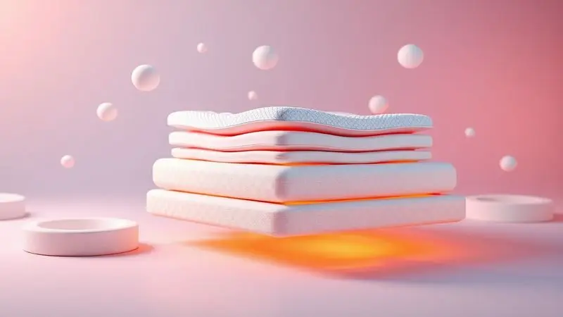
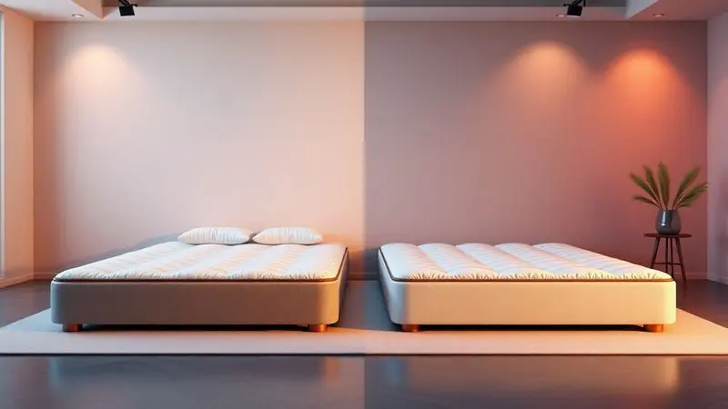

Escolher um novo colchão vai muito além de uma compra - é um investimento na sua saúde, no seu descanso e na qualidade das suas manhãs. Quando você passa cerca de um terço da vida dormindo, esse objeto ganha importância existencial.

A Ortobom, com sua trajetória de mais de 30 anos no mercado brasileiro, entende isso profundamente e desenvolveu um portfólio tão diversificado que pode, paradoxalmente, gerar dúvidas. Afinal, qual a diferença real entre molas ensacadas e espuma de alta densidade?

O famoso Freedom justifica sua reputação? Vamos desvendar essas questões, analisando cada modelo como se estivéssemos ajudando um amigo a encontrar a cama perfeita.

<SummaryList products={frontmatter.top_products} />

## Sobre a Ortobom

Imagine uma marca que nasceu com o propósito simples de melhorar o sono dos brasileiros e, três décadas depois, se tornou sinônimo de confiabilidade no setor.

A Ortobom construiu sua reputação não apenas com marketing, mas com inovação constante e um compromisso genuíno com a ergonomia.

Enquanto muitas empresas cortam custos com materiais, a Ortobom investe em tecnologias que realmente fazem diferença: desde sistemas de molas que isolam movimentos até espumas inteligentes que se moldam ao seu corpo.

O resultado é um catálogo que dialoga com necessidades específicas - se você precisa de suporte ortopédico, conforto premium ou soluções para alergias, há uma opção pensada para você.

Essa abordagem centrada no usuário explica por que gerações de famílias brasileiras continuam escolhendo a marca.

## 1. Colchão Ortobom Freedom de Molas Ensacadas

<ProductBox 
  title={frontmatter.top_products[0].title} 
  image={frontmatter.top_products[0].image} 
  link={frontmatter.top_products[0].link} 
/>

Você já acordou porque seu parceiro virou de lado? Ou sentiu aquela pontada no ombro depois de uma noite de sono? O Freedom foi desenvolvido para resolver exatamente esses problemas.

Sua tecnologia de molas ensacadas individualmente cria zonas de apoio independentes, como se cada pessoa tivesse seu próprio colchão dentro da mesma cama. Os movimentos ficam contidos, preservando o sono de ambos.

Mas o segredo não está apenas nas molas. A camada de espuma viscoelástica age como uma segunda pele, distribuindo seu peso de maneira uniforme e aliviando pontos de pressão em ombros, quadris e lombar.

É aquela sensação de afundar levemente, mas com suporte firme na base.

Para completar, os revestimentos em malha de bambu ou Ecobambu oferecem um toque fresco e natural, com propriedades que combatem ácaros e bactérias - um alívio para quem sofre com alergias respiratórias ou cutâneas.

<CaixaProsContras>

**Prós:**

- Conforto superior com molas ensacadas.

- Redução da transferência de movimento entre usuários.

- Espuma viscoelástica que alivia pontos de pressão.

- Materiais hipoalergênicos e antimicrobianos.

**Contras:**

- Peso elevado, o que pode dificultar a movimentação.

- Alguns modelos podem não ser tão acessíveis financeiramente.

</CaixaProsContras>

### O que é o colchão Freedom?

Pense no Freedom como o equilibrista perfeito entre conforto e suporte. Enquanto muitas marcas escolhem um lado - extremamente macio ou excessivamente firme - a Ortobom desenvolveu este modelo para oferecer o melhor dos dois mundos.

As molas ensacadas garantem a firmeza necessária para a saúde da sua coluna, enquanto as camadas superiores de espuma proporcionam o acolhimento que seu corpo busca ao deitar.

Essa construção em camadas é estrategicamente pensada: quanto mais próximo do corpo, mais adaptável o material; quanto mais profundo, mais suporte estrutural.

### Ficha Técnica e Diferenciais

O que realmente diferencia o Freedom não são apenas especificações técnicas, mas como elas se traduzem no seu dia a dia.

As molas são ensacadas em tecido não-tecido, um detalhe que parece pequeno mas prolonga significativamente a vida útil do colchão, prevenindo o atrito entre as molas que causa ruídos e desgaste precoce.

A densidade da espuma viscoelástica é calculada para responder ao calor do corpo, ficando mais maleável onde há mais pressão e mais firme onde há menos.

Dispõe nos tamanhos solteiro, casal, queen e king, com uma altura generosa que varia entre 30 e 35 cm dependendo da configuração. Essa altura não é apenas estética - permite uma camada mais espessa de conforto sem comprometer a firmeza da base.

A capa removível (em alguns modelos) facilita a limpeza, e os respiros laterais garantem que a umidade não se acumule, mantendo o colchão fresco por mais tempo.

## 2. Colchão Ortobom Ultra Gel de Molas Pocket

<ProductBox 
  title={frontmatter.top_products[1].title} 
  image={frontmatter.top_products[1].image} 
  link={frontmatter.top_products[1].link} 
/>

Se o Freedom é o equilíbrio perfeito, o Ultra Gel é o luxo que se justifica. Imagine deitar em uma superfície que parece esfriar nos pontos onde seu corpo esquenta.

A tecnologia Viscogel D45 faz exatamente isso: uma espuma sensível à temperatura que distribui o calor, evitando aquela sensação abafada em noites quentes.

Combinada com as molas pocket - ainda mais refinadas que as ensacadas do Freedom - o resultado é um isolamento de movimento quase absoluto.

A experiência sensorial vai além do tato. O tratamento com Óleo de Jojoba e Vitamina E não é apenas um detalhe de marketing; essas substâncias penetram nas fibras do tecido, criando uma barreira ativa contra ácaros enquanto cuida da sua pele durante o sono.

Você acorda não apenas descansado, mas com a sensação de ter passado a noite em um spa. Claro, essa sofisticação tem seu preço, mas para quem valoriza cada detalhe do descanso, o investimento se paga a cada manhã revigorada.

<CaixaProsContras>

**Prós:**

- Conceito de molas pocket para maior isolamento de movimento

- Camada de espuma Viscogel D45 que se adapta ao corpo

- Tratamento antiácaro e antialérgico

- Design sofisticado com materiais premium

**Contras:**

- Pode ser considerado um investimento alto

- Altura significativa pode não ser ideal para todos os tipos de cama

</CaixaProsContras>

## 3. Colchão Ortobom Viscomemory "NASA" - Apollo II

Lembra quando criança você brincava de afundar a mão naquela espuma que mantinha a marca dos dedos?

A tecnologia viscoelástica do Apollo II é a versão adulta e ultra-avançada dessa sensação, originalmente desenvolvida pela NASA para amortecer o impacto nos assentos de astronautas.

No seu quarto, essa mesma tecnologia se transforma em um abraço personalizado: a espuma se molda ao contorno exato do seu corpo, distribuindo o peso de maneira tão uniforme que a sensação de pressão desaparece.

O tratamento Evo Care Vital com óleo de jojoba e vitamina E age como um cuidado noturno para sua pele, enquanto o tecido de malha respirável mantém a temperatura agradável.

Os acabamentos laterais em linho ou suede dão um toque de elegância que transforma o colchão em peça de decoração.

Uma consideração importante: por não precisar ser virado (graças à sua construção unidirecional), você ganha praticidade mas deve estar atento à ventilação, especialmente em ambientes muito úmidos.

<CaixaProsContras>

**Prós:**

- Adaptação excelente ao corpo com a espuma viscoelástica.

- Tratamentos antialérgicos e antiácaros inclusos.

- Design atraente com acabamentos em linho ou suede.

- Tecnologia que prolonga a durabilidade do colchão.

**Contras:**

- Não precisa ser virado, o que pode não favorecer a ventilação.

- Espuma pode ser sensível ao calor, alterando a sensação em climas quentes.

</CaixaProsContras>

## 4. Colchão Ortobom Hight Foam - Qualidade Certificada Inmetro

<ProductBox 
  title={frontmatter.top_products[3].title} 
  image={frontmatter.top_products[3].image} 
  link={frontmatter.top_products[3].link} 
/>

Para quem acorda com dores nas costas e suspeita que seu colchão atual é muito macio, o Hight Foam chega como uma solução direta.

Sua espuma de alta resiliência (HR) oferece o que os ortopedistas chamam de "suporte ativo": em vez de apenas ceder ao peso do corpo, ela responde com uma força contrária que mantém a coluna alinhada.

As densidades D33 a D45 garantem que, mesmo após anos de uso, o colchão retorne à sua forma original, sem criar aqueles "buracos" que distorcem sua postura.

Com aproximadamente 28 a 30 cm de altura e capacidade para suportar até 150 kg por lado, este modelo é a escolha segura para quem prioriza durabilidade e firmeza. O tecido com eucalipto oferece uma frescura natural e propriedades antifúngicas.

A firmeza pode surpreender nos primeiros dias, mas é exatamente essa característica que seu corpo agradecerá a longo prazo, especialmente se você passa o dia em pé ou sentado.

<CaixaProsContras>

**Prós:**

- Boa durabilidade e resistência.

- Alta capacidade de suporte de peso.

- Tratamento antiácaro e antifungo.

- Estrutura firme que favorece a postura.

**Contras:**

- A firmeza pode não agradar a todos os gostos.

- Alguns modelos podem ser mais pesados para manuseio.

</CaixaProsContras>

## 5. Colchão Ortobom de Molas Pocket Personalité Látex Europillow

<ProductBox 
  title={frontmatter.top_products[4].title} 
  image={frontmatter.top_products[4].image} 
  link={frontmatter.top_products[4].link} 
/>

Imagine um colchão que entende que você e seu parceiro têm necessidades diferentes de conforto.

O Personalité Látex Europillow oferece exatamente essa personalização através de seu sistema de molas Pocket independentes, garantindo que o movimento de um lado não se torne um terremoto no outro.

Mas o verdadeiro charme está na camada Europillow: uma superfície levemente acolchoada que proporciona aquela sensação de nuvem sem comprometer o suporte da base.

A combinação é inteligente: as molas garantem a firmeza necessária para a saúde da coluna, enquanto o Europillow oferece o conforto imediato que torna o adormecer mais prazeroso.

O revestimento em malha de poliéster e viscose garante respirabilidade, e os tratamentos antiácaro criam um ambiente saudável. Se você busca firmeza com um toque de maciez - não maciez com um toque de firmeza - esta é sua opção.

<CaixaProsContras>

**Prós:**

- Sistema de molas Pocket que minimiza a transferência de movimento.

- Camada Europillow para maior conforto e maciez.

- Tratamento antiácaro e antifungo para um sono saudável.

- Ventilação adequada com respiros laterais.

**Contras:**

- Conforto pode ser considerado firme demais para alguns.

- A descrição do uso de látex não é muito detalhada.

</CaixaProsContras>

## 6. Cama Box Baú Ortobom

<ProductBox 
  title={frontmatter.top_products[5].title} 
  image={frontmatter.top_products[5].image} 
  link={frontmatter.top_products[5].link} 
/>

Em apartamentos onde cada centímetro conta, a Cama Box Baú da Ortobom é mais que um móvel - é uma solução de inteligência espacial.

O sistema basculante transforma o espaço morto sob o colchão em um compartimento organizado para edredons, travesseiros extras ou roupas de cama sazonais. A abertura é suave e controlada, sem aqueles sustos de baús que caem bruscamente.

Disponível em tamanhos que vão do solteiro ao queen, com revestimentos em corino ou suede em diversas cores, ela se adapta ao seu estilo decorativo.

A verdadeira vantagem, porém, é que você não precisa sacrificar qualidade do sono por funcionalidade: ela pode ser adquirida com colchões das linhas Freedom, Hight Foam ou outras, mantendo todas as tecnologias de conforto que analisamos.

A única ressalva é medir o que você pretende armazenar - enquanto guarda facilmente roupas de cama, pode ser apertada para malas grandes.

<CaixaProsContras>

**Prós:**

- Sistema basculante que facilita o acesso ao armazenamento.

- Vários tamanhos disponíveis para atender diferentes ambientes.

- Diversidade de revestimentos e cores para personalização.

- Pode incluir colchões de qualidade com várias densidades.

**Contras:**

- Profundidade do baú pode ser limitada para algumas pessoas.

- O peso da cama pode dificultar o manuseio ao limpar.

</CaixaProsContras>

## Qual a Melhor Marca de Colchão: Ortobom ou Castor?

Comparar Ortobom e Castor é como escolher entre dois bons restaurantes - ambos oferecem qualidade, mas com assinaturas diferentes.

A Ortobom tende a investir mais em tecnologias de adaptação ao corpo e isolamento de movimento, com um portfólio que varia do básico de qualidade ao premium sofisticado.

Já a Castor frequentemente aposta em uma abordagem mais tradicional, com foco em firmeza ortopédica e durabilidade robusta.

A escolha depende do que seu corpo pede: se você valoriza sensações personalizadas de conforto, adaptação térmica e detalhes como tratamentos para a pele, a Ortobom tem uma vantagem clara.

Se sua prioridade é uma firmeza consistente ano após ano, com menos camadas de tecnologia intermediária, a Castor pode ser mais atraente.

O conselho mais valioso, porém, é universal: visite uma loja, deite-se por pelo menos 10 minutos em cada modelo que considerar e escute o que sua coluna tem a dizer.

## Qual a garantia do colchão Freedom da Ortobom?

Doze anos. Esse número não é apenas uma promessa no papel - é a confiança materializada de uma marca que conhece a durabilidade de seus produtos.

A garantia do Freedom cobre defeitos de fabricação que comprometam sua estrutura ou funcionalidade, dando a você a tranquilidade de que este é um investimento de longo prazo.

É importante entender que essa garantia protege contra problemas como afundamento anormal (não o acomodamento natural das espumas), ruptura de molas ou defeitos nos materiais.

Essa política reflete um entendimento profundo: um colchão não é um produto descartável, mas parte fundamental do seu bem-estar diário.

Ao oferecer uma das garantias mais extensas do mercado, a Ortobom não apenas vende um produto, mas estabelece um compromisso com suas próximas 4.380 noites de sono.

## Conclusão

Escolher um colchão Ortobom é, em essência, escolher uma filosofia sobre o que o descanso significa para você.

Seja a tecnologia de molas ensacadas do Freedom que transforma noites agitadas em sono tranquilo para casais, a adaptação inteligente do Ultra Gel que regula sua temperatura corporal, ou o suporte ortopédico firme do Hight Foam que alinha sua coluna - cada modelo conversa com uma necessidade específica.

O que une toda a linha é uma compreensão rara no mercado: conforto não é luxo, é necessidade.

Os tratamentos com óleo de jojoba e vitamina E, as tecnologias antiácaro, as espumas que respiram - tudo converge para a mesma ideia de que dormir bem é investir na sua saúde integral.

A garantia de 12 anos no Freedom não é acidente, mas consequência de uma construção cuidadosa.

Antes de decidir, pergunte-se: você acorda com dores? Seu parceiro mexe muito? Sente calor à noite? Suas respostas guiarão você para o modelo certo.

E quando encontrar aquele que parece feito para seu corpo, você entenderá que um bom colchão não é gasto, mas um dos investimentos mais inteligentes que pode fazer em si mesmo. Suas próximas manhãs agradecerão.