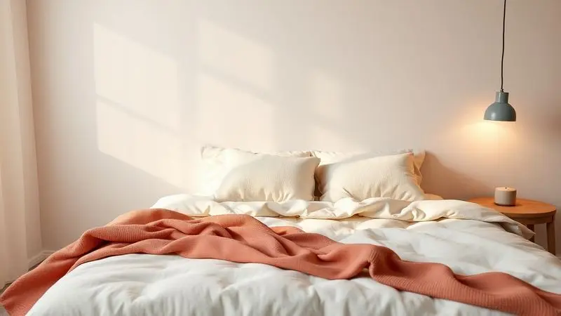

Na hora de renovar o quarto, é natural se perguntar se escolher o colchão Gazin vale mesmo o investimento.

Com tantos modelos à disposição, desde as tradicionais molas ensacadas até espumas de alta densidade, a marca brasileira promete aliar conforto e durabilidade com um orçamento que não assusta. Mas será que essas promessas se sustentam na prática?

Nesta análise, investigamos a fundo o que realmente importa: qualidade, tecnologia e, acima de tudo, a experiência de sono que cada modelo pode te oferecer.

<SummaryList products={frontmatter.top_products} />

## Colchão Gazin é Bom? Uma Visão Geral da Marca

Mais do que uma simples fabricante, a Gazin é um nome que você provavelmente já cruzou em lojas ou conversas sobre móveis.

A marca brasileira conquistou espaço oferecendo uma variedade que tenta agradar a (quase) todo mundo: do solteiro que precisa de um colchão compacto ao casal que busca isolamento de movimento. O ponto mais interessante dessa proposta?

Eles tentam unir materiais de qualidade, desde espumas densas até sistemas de molas inteligentes, com um preço que cabe no bolso.

Se você está avaliando opções, entender o que a Gazin realmente oferece, além do preço atrativo, é o primeiro passo para uma compra mais segura.

## Principais Características dos Colchões Gazin

Essa diversidade da marca se materializa em algumas características-chave que se repetem em seus modelos. Pense neles como o DNA dos colchões Gazin: elementos que ditam não apenas o conforto imediato, mas também como o produto vai se comportar ao longo dos anos.

São essas escolhas de materiais e tecnologia que fazem a diferença entre um colchão que você troca em poucos anos e um que se torna seu parceiro de descanso por uma década.

### Diversas densidades de espuma

Imagine escolher um travesseiro: você não pegaria o mesmo modelo se fosse extremamente pesado ou se preferisse algo mais macio, certo? A filosofia dos colchões Gazin segue essa lógica. Eles oferecem uma gama de densidades que funciona como um menu de personalização.

Para quem busca aquela sensação de acolhimento macio, que envolve o corpo, as densidades mais baixas são ideais.

Já se você precisa de firmeza para manter a coluna alinhada ou se seu peso demanda mais suporte, as opções D28, D33 ou superiores entregam uma base sólida que não cede com o tempo.

É uma forma inteligente de garantir que cada pessoa encontre o equilíbrio perfeito entre afundar e suportar.

### Molas Diferenciadas e Tecnologia de Ponta

Mas a tecnologia Gazin vai muito além da espuma. Nos modelos com molas, a especialidade está nos sistemas ensacados. Cada mola trabalha de forma independente, como se fosse um píxel de suporte moldando-se apenas ao seu corpo. O resultado prático?

Dois em um: primeiro, o conforto personalizado; segundo, a redução quase mágica da transferência de movimento. Para casais com ciclos de sono diferentes, isso significa poder se virar à noite sem despertar quem está ao lado.

Alguns modelos ainda incorporam camadas de gel ou espumas específicas que ajudam a dissipar o calor, criando um microclima mais fresco durante toda a noite.

### Fibra Siliconada no Matelassê

Você já passou por aquelas noites em que acorda com a sensação de estar abraçado a um aquecedor? A Gazin tenta combater isso no nível do tecido. A fibra siliconada, muito usada nos revestimentos, é o segredo por trás de um toque macio que não retém calor.

Ela permite que o ar circule entre as fibras, ajudando seu corpo a respirar e a regular sua temperatura naturalmente.

É um detalhe que parece pequeno, mas que transforma completamente a sensação ao deitar: mais frescor, menos umidade e uma higiene natural que afasta ácaros e alergias.

## Lista dos Melhores Colchões da Gazin em 2025

Diante de tantas opções, quais modelos realmente merecem sua atenção? Analisamos os mais recomendados, aqueles que equilibram tecnologia, conforto e um preço justo.

Esta lista não é apenas um ranking, mas um guia para entender qual Gazin conversa com suas necessidades específicas.

### 1. Colchão Casal Molas Ensacadas Tower Gazin 138x34x188

<ProductBox 
  title={frontmatter.top_products[0].title} 
  image={frontmatter.top_products[0].image} 
  link={frontmatter.top_products[0].link} 
/>

Pense no conforto de deitar em uma nuvem, mas com todo o suporte que sua coluna precisa. O Gazin Tower tenta entregar exatamente isso com sua camada Pillow Top, que oferece um abraço macio logo no primeiro contato.

Por baixo dessa fofura, as molas ensacadas individualmente trabalham em silêncio, absorvendo seus movimentos para que seu parceiro não perceba. É a tecnologia a serviço da harmonia do casal.

As espumas de alta densidade (D33 e D26) garantem que esse conforto seja duradouro, não apenas uma sensação passageira. E o revestimento em Malha Cashmere?

Ele age como um climatizador natural, equilibrando temperatura e umidade para que você não precise escolher entre aconchego e frescor.

Sim, nos primeiros dias ele pode parecer firme demais, nossos corpos estranham mudanças, mas é uma firmeza que se adapta, moldando-se ao seu formato com o tempo.

<CaixaProsContras>

**Prós:**

- Conforto com Pillow Top

- Molas ensacadas que evitam a transmissão de movimento

- Espumas de alta densidade para durabilidade

- Revestimento que regula temperatura e umidade

**Contras:**

- Pode parecer firme no início

- Necessidade de lençóis mais profundos devido à altura

</CaixaProsContras>

#### Informações técnicas do modelo Tower

O coração do Tower é a combinação de espuma D33 e camada viscoelástica, que trabalham juntas para distribuir seu peso uniformemente e aliviar pontos de pressão. O tecido na superfície é antiácaro e hipoalergênico, pensado para que seu respiro noturno seja sempre limpo.

E não subestime as bordas reforçadas. Elas são a garantia de que seu colchão não vai deformar ou ceder nas laterais, mesmo que você precise usar toda a superfície ao se deitar.

### 2. Colchão Casal Queen Molas Ensacadas Euro Top Rubi Gazin

<ProductBox 
  title={frontmatter.top_products[1].title} 
  image={frontmatter.top_products[1].image} 
  link={frontmatter.top_products[1].link} 
/>

Se a ideia de um colchão que acolhe sem sufocar te atrai, o Rubi merece sua atenção. Seu diferencial é a camada Euro Top, uma espessura extra de conforto que envolve o corpo delicadamente, sem comprometer o suporte das molas ensacadas por baixo.

O resultado é uma sensação de maciez que não é mole.

Para casais, o sistema de molas independentes age como uma barreira invisível contra os movimentos noturnos. Cada um mantém sua liberdade, sem interferência. Um alerta: se você busca aquela firmeza rígida que praticamente não cede, o Rubi pode ser suave demais.

Mas se seu objetivo é dormir envolvido em conforto, sem abandonar a sustentação da coluna, ele acerta em cheio.

<CaixaProsContras>

**Prós:**

- Molas ensacadas oferecem excelente suporte.

- Camada Euro Top para máximo conforto.

- Design que minimiza a transferência de movimento.

- Tecido de revestimento macio e agradável ao toque.

**Contras:**

- Pode não ser a escolha ideal para quem prefere colchões mais firmes.

- Necessita de cuidados com ventilação e posicionamento.

</CaixaProsContras>

#### Informações técnicas do modelo Rubi

Tecnicamente, o Rubi utiliza espuma de alta densidade com uma camada de viscoelástico que mapeia seu corpo, aliviando ombros e quadris. O tecido de malha que o reveste é respirável, permitindo que o ar circule para manter o colchão seco e fresco.

As bordas reforçadas são um plus de durabilidade, dando estabilidade para que você use toda a superfície sem medo de rolar para fora.

### 3. Colchão De Molas Pocket Love Story Gazin Casal

<ProductBox 
  title={frontmatter.top_products[2].title} 
  image={frontmatter.top_products[2].image} 
  link={frontmatter.top_products[2].link} 
/>

Qual é a história de amor perfeita? Para muitos casais, é aquela onde cada um dorme bem, sem ser acordado pelo movimento do outro.

O Love Story tem as molas ensacadas como personagem principal nesse enredo, oferecendo suporte localizado que isola completamente os movimentos.

Sobre esse sistema, uma camada pillow top adiciona a dose extra de aconchego, enquanto o revestimento em malha garante que a ventilação seja constante. Ele tem uma firmeza que chamamos de média, não é duro, mas também não é aquele afundar total.

Essa escolha inteligente oferece suporte para a maioria dos biotipos, e o tratamento antiácaro torna o ambiente seguro para quem sofre com alergias.

<CaixaProsContras>

**Prós:**

- Molas ensacadas proporcionam suporte localizado.

- Reduz a transferência de movimento entre os parceiros.

- Pillow top aumenta o conforto.

- Tratamento hipoalergênico é ideal para alérgicos.

**Contras:**

- Firmeza média pode não agradar a todos.

- Pode não ser tão macio para quem busca superconforto.

</CaixaProsContras>

#### Informações técnicas do modelo Love Story

A construção do Love Story utiliza espuma de alta resiliência, material famoso por voltar à forma original rapidamente, garantindo que o suporte não se perca com o tempo. O tecido em malha não é apenas uma capa.

É um sistema de respiração ativa que controla a temperatura. As laterais reforçadas garantem que, mesmo se você dormir nas bordas, terá estabilidade total.

### 4. Colchão Casal Molas Ensacadas Pillow Top Maximus Gazin

<ProductBox 
  title={frontmatter.top_products[3].title} 
  image={frontmatter.top_products[3].image} 
  link={frontmatter.top_products[3].link} 
/>

O Maximus é para quem não quer abrir mão de nada: conforto extremo com pillow top, isolamento perfeito de movimento com molas ensacadas e uma construção que promete durar.

Ele foi projetado para ser generoso em todas as dimensões, inclusive no suporte, que chega a 120 kg por pessoa.

A malha matelassê com fibra siliconada do revestimento significa um toque suave que não esquenta. É como ter um colchão respirável que se adapta às estações do ano.

A espuma D28 no coração do produto é o que garante que essa sensação fofinha não se transforme em um amassado permanente com o tempo. Sim, sua altura exige lençóis específicos, mas é o preço de ter tantas camadas de conforto.

<CaixaProsContras>

**Prós:**

- Sistema de molas ensacadas que minimiza o movimento.

- Camada de pillow top para conforto adicional.

- Revestimento macio e ventilado.

- Durabilidade garantida pela espuma D28.

**Contras:**

- Pode não ser a melhor opção para quem prefere colchões firmes.

- O tamanho deve ser verificado para garantir ajuste no espaço disponível.

</CaixaProsContras>

#### Informações técnicas do modelo Maximus

Na prática, o sistema de molas ensacadas do Maximus cria zonas de apoio independentes que se ajustam aos seus contornos específicos. A capa não é apenas bonita: sua tecnologia de respirabilidade atua como um termostato natural, ajudando a dissecar o calor e a umidade.

É uma engenharia pensada para manter a qualidade do sono estável, independentemente do clima lá fora.

### 5. Colchão Casal Molas Caribe 138x188x20cm Gazin

<ProductBox 
  title={frontmatter.top_products[4].title} 
  image={frontmatter.top_products[4].image} 
  link={frontmatter.top_products[4].link} 
/>

Às vezes, a busca não é pelo colchão mais tecnológico, mas pelo que oferece o melhor equilíbrio entre o que é necessário e o que o orçamento permite. O Caribe segue essa filosofia com simplicidade inteligente.

Suas molas Bonnel, o sistema tradicional, oferecem suporte adequado, e o Euro Pillow adiciona um agrado extra de conforto sem complicações.

O tecido jacquard na superfície é macio ao toque, e o fundo antiderrapante evite aquela dança do colchão pela cama. O ponto central aqui é a relação custo-benefício.

Sim, a durabilidade não compete com modelos topo de linha, e ele suporta até 100 kg por pessoa, mas para quem precisa de um colchão bom sem estourar a conta, ele entrega exatamente o prometido.

<CaixaProsContras>

**Prós:**

- Conforto adicional com o Euro Pillow.

- Estrutura de molas Bonnel para bom suporte.

- Tecido jacquard macio ao toque.

- Ótima relação custo-benefício.

**Contras:**

- Suporta até 100kg por pessoa, o que pode ser uma limitação para alguns.

- A durabilidade poderia ser melhor em comparação a modelos mais caros.

</CaixaProsContras>

#### Informações técnicas do modelo Caribe

Tecnicamente, o Caribe utiliza espuma viscoelástica em sua composição, que alivia a pressão ao moldar-se ao corpo. O revestimento antialérgico protege contra agentes irritantes, importante para quem sofre com alergias.

Com 25 cm de altura, é compatível com quase qualquer tipo de cama, e sua ventilação interna trabalha para evitar o acúmulo de umidade.

### 6. Colchão Casal 138X188cm Espuma D28 Confort Soft Liso Gazin

<ProductBox 
  title={frontmatter.top_products[5].title} 
  image={frontmatter.top_products[5].image} 
  link={frontmatter.top_products[5].link} 
/>

Quando o orçamento é apertado, mas o conforto não pode ser negociado, o modelo em espuma D28 aparece como uma solução prática. Sua espuma de poliuretano oferece firmeza e suporte adequados para até 90 kg por lado, tornando-o uma escolha acertada para casais.

O revestimento em poliéster liso tem uma vantagem pragmática: é fácil de limpar e não acumula poeira facilmente. É importante ter clareza: ele não é classificado como ortopédico, e a garantia de apenas 3 meses pode gerar insegurança.

No entanto, para quem busca um colchão que preste um bom serviço a um preço extremamente acessível, ele cumpre sua função com eficiência.

<CaixaProsContras>

**Prós:**

- Conforto proporcionado pela espuma D28.

- Revestimento fácil de limpar e higienizar.

- Bom suporte de peso para casais.

- Custo-benefício atrativo.

**Contras:**

- Garantia limitada de 3 meses.

- Não é classificado como ortopédico.

</CaixaProsContras>

### 7. Colchão Solteiro Supreme D33 Gazin 88x15x188

<ProductBox 
  title={frontmatter.top_products[6].title} 
  image={frontmatter.top_products[6].image} 
  link={frontmatter.top_products[6].link} 
/>

Para solteiros que valorizam firmeza, o Supreme D33 é um candidato forte. A densidade D33 da espuma promete ser o equilíbrio ideal: firme o suficiente para sustentar a coluna, mas sem ser desconfortavelmente rígido.

O revestimento em poliéster facilita demais a limpeza, uma praticidade que quem mora sozinho sabe valorizar.

Ele suporta até 90 kg e tem dimensões padrão para camas de solteiro (88x188 cm). Alguns usuários notam que o acabamento poderia ser mais refinado, mas a satisfação geral gira em torno da durabilidade e da qualidade pelo preço.

A garantia de 12 meses oferece um respiro de tranquilidade para o investimento.

<CaixaProsContras>

**Prós:**

- Bom custo-benefício.

- Boa firmeza, ideal para quem prefere colchões mais rígidos.

- Revestimento fácil de limpar e hipoalergênico.

- Construção durável com espuma de qualidade.

**Contras:**

- Acabamento pode deixar a desejar para alguns usuários.

- Suporta até 90kg, o que pode ser limitado para usuários mais pesados.

</CaixaProsContras>

### 8. Colchão Solteiro Espuma D20 88cmx188cm Supreme Gazin

<ProductBox 
  title={frontmatter.top_products[7].title} 
  image={frontmatter.top_products[7].image} 
  link={frontmatter.top_products[7].link} 
/>

Pense no colchão ideal para o quarto do seu filho ou para aquele dormitório de visitas que precisa ser prático. O Supreme D20 foi desenhado para esse papel. Sua espuma D20 oferece um conforto médio adequado, não muito mole para crianças, nem muito duro.

O grande trunfo são os tratamentos aplicados: antialérgico, antiácaro e antifungo, criando uma barreira protetora importante para alérgicos. A limitação de 50 kg deixa claro o público-alvo.

Não é um colchão para adultos pesados, mas para crianças, adolescentes ou como solução de custo-benefício em situações temporárias, ele entrega exatamente o necessário.

<CaixaProsContras>

**Prós:**

- Tratamento antialérgico, antiácaro e antifungo.

- Conforto médio ideal para crianças.

- Compacto e fácil de transportar.

- Boa relação custo-benefício.

**Contras:**

- Limitação de peso para adultos (máximo de 50 kg).

- Pode não ser o ideal para pessoas que preferem colchões mais firmes.

</CaixaProsContras>

## Análise de Outros Modelos de Destaque: Primeline Relax e Royal Blue

<ProductBox 
  title={frontmatter.top_products[8].title} 
  image={frontmatter.top_products[8].image} 
  link={frontmatter.top_products[8].link} 
/>

Quando a Gazin decide mirar no topo da gama, os resultados são linhas como Primeline Relax e Royal Blue.

Aqui, a tecnologia BlueWave de molas ensacadas trabalha com uma precisão cirúrgica, ajustando-se ao seu corpo de forma tão individual que praticamente elimina qualquer transferência de movimento perceptível.

As espumas Hiper Soft e HR 50 adicionam camadas de adaptabilidade e amortecimento que transformam o deitar em uma experiência premium. O revestimento em malha mantém essa sofisticação respirável. O preço, naturalmente, reflete esse salto tecnológico.

Se você enxerga o sono como um investimento em saúde e bem-estar, e o orçamento permite esse nível, essas linhas oferecem um retorno palpável em conforto e durabilidade.

<CaixaProsContras>

**Prós:**

- Tecnologia de molas ensacadas que evita a transferência de movimento.

- Camadas de espuma de alta qualidade para conforto superior.

- Revestimento em malha melhora a ventilação.

- Sustentabilidade na fabricação com uso de madeira de reflorestamento.

**Contras:**

- Pode ser mais caro do que modelos simples.

- A variedade pode causar confusão em qual modelo escolher.

</CaixaProsContras>

## O Colchão Gazin Diamond Blue é Bom? Análise Técnica

<ProductBox 
  title={frontmatter.top_products[9].title} 
  image={frontmatter.top_products[9].image} 
  link={frontmatter.top_products[9].link} 
/>

O Diamond Blue é o exemplo do que a Gazin pode fazer quando combina suas melhores tecnologias. As molas ensacadas oferecem estabilidade e isolamento, enquanto a densidade HR50+D26 garante uma base que não cede.

A verdadeira estrela, porém, pode ser o tecido 'blue-gazin' com controle térmico, que tenta ativamente manter sua temperatura corporal em equilíbrio.

Um apoio que chega a 120 kg por pessoa e dimensões variadas oferecem versatilidade. O ponto de atenção fica no preço, mais elevado, e na garantia de 1 ano, que pode parecer curta para um investimento nesse patamar.

Mas se você procura o melhor que a marca oferece em termos de conforto regulado e suporte inteligente, o Diamond Blue representa esse degrau superior.

<CaixaProsContras>

**Prós:**

- Conforto superior devido ao material e construção.

- Boa regulação de temperatura com tecnologia especial.

- Estrutura de molas que oferece suporte adequado à coluna.

- Durabilidade projetada para uso prolongado.

**Contras:**

- Preço pode ser elevado em comparação a opções básicas.

- Garantia de apenas 1 ano, o que pode levantar preocupações para alguns.

</CaixaProsContras>

## Dúvidas Frequentes sobre a Qualidade Gazin

Com tantas opções, é natural que perguntas sobre durabilidade, tecnologia e o equilíbrio entre custo e benefício surjam. Separamos as questões mais comuns para ajudar a clarear sua decisão.

### Colchão Gazin molas ensacadas é realmente bom?

A resposta curta: sim, especialmente se você prioriza duas coisas. Primeiro, o isolamento de movimento. As molas ensacadas funcionam como isolantes acústicos do movimento, ideais para casais com padrões de sono diferentes. Segundo, o apoio personalizado.

Como cada mola trabalha independentemente, seu corpo recebe suporte exatamente onde precisa, não apenas uma firmeza uniforme. É uma tecnologia que entrega o que promete: sono individual de qualidade, mesmo dividindo a cama.

### Colchão Gazin D33 é bom para quem tem dor nas costas?

Pode ser uma boa aliada. A densidade D33 fornece uma firmeza que ajuda a manter a coluna alinhada, evitando aquela curvatura excessiva que agrava dores. A ventilação do modelo também contribui, pois mantém as condições ideais para o descanso muscular.

Um alerta importante: cada corpo responde de forma única. Algumas pessoas com dores específicas podem precisar de firmeza ainda maior ou, paradoxalmente, de mais amortecimento. Sempre que possível, teste antes de comprar.

## Reputação da Gazin no Reclame Aqui e Atendimento ao Cliente

No Reclame Aqui, a Gazin apresenta um panorama que mistura pontos fortes e fracos. A marca responde a grande parte das reclamações, demonstrando um compromisso com a resolução.

As queixas mais frequentes giram em torno de prazos de entrega e, em menor escala, defeitos específicos em produtos.

No atendimento direto, a avaliação tende a ser mais positiva. Muitos clientes destacam a cordialidade e a disposição dos atendentes em ajudar, um fator que traz tranquilidade no momento da compra.

Esse cenário sugere que, enquanto pode haver percalços logísticos, a marca busca manter um relacionamento ativo com seus consumidores.

## FAQ: Perguntas Frequentes sobre a Marca

### O que é a tecnologia de um colchão Gazin?

É a combinação inteligente de materiais projetados para trabalhar em conjunto.

Não se trata de um único elemento mirabolante, mas da sinergia entre espumas de alta densidade para resistência, sistemas de molas inteligentes para suporte individualizado e tecidos que regulam o microclima da cama.

Tudo pensado para transformar características técnicas em benefícios tangíveis: alívio de pressão, sono fresco e durabilidade.

### Qual a densidade ideal do colchão Gazin?

Não existe uma resposta universal, e isso é positivo. Para a maioria dos adultos em busca de equilíbrio, densidades entre 28 e 33 kg/m³ (D28, D33) oferecem suporte consistente sem rigidez excessiva.

Para quem tem dores mais acentuadas ou maior peso corporal, densidades acima de 33 garantem uma base mais firme para a coluna. Considere seu peso e sua preferência pessoal por firmeza como os principais guias.

### Qual a garantia oferecida pela Gazin?

A cobertura varia de 1 a 3 anos, dependendo do modelo. Essa garantia protege contra defeitos de fabricação, mas não cobre desgaste normal ou danos por mau uso (derramamentos, cortes, etc.).

Seguir as instruções de manutenção, como girar o colchão periodicamente, é crucial para garantir que você aproveite toda a vida útil prometida pelo produto.

### Quem é o fabricante do colchão Gazin?

O Grupo Gazin, uma empresa brasileira com mais de meio século de experiência no mercado de móveis e eletrodomésticos.

Fundada em 1966, a marca construiu seu nome alinhando conforto e tecnologia a preços acessíveis, expandindo de uma simples loja para uma presença nacional. É uma fabricante com histórico, não uma novata no segmento.

## Conclusão

Investir em um colchão Gazin é, na maioria dos casos, uma decisão que equilibra bem custo e benefício.

A marca acerta ao oferecer um leque tão amplo que cobre desde necessidades básicas e orçamentos modestos até demandas tecnológicas de quem busca a melhor experiência de sono.

Onde eles realmente brilham é na variedade de espumas e sistemas de molas que permitem uma personalização real, e na construção que, na média, entrega durabilidade adequada ao preço cobrado.

Se há um ponto que merece atenção, é justamente entender onde você se encaixa nesse espectro. O Gazin Supreme D20 não serve para um adulto de 90 kg, assim como o Diamond Blue pode ser exagero para um dormitório de visitas.

A chave está em encaixar o modelo certo na sua realidade. Avalie seu peso, sua preferência por firmeza, seu orçamento e, se possível, teste pessoalmente.

Quando a escolha é feita com critério, um colchão Gazin pode ser muito mais que um móvel, pode ser o início de noites de sono verdadeiramente reparadoras.