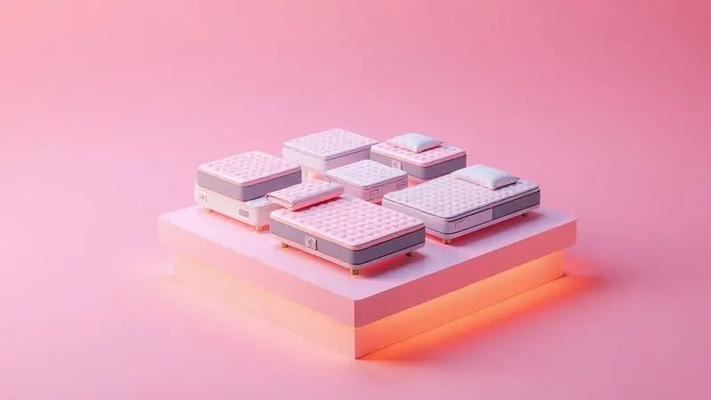

Escolher um novo colchão vai muito além de uma simples compra: é um investimento na sua saúde, no seu descanso e na qualidade de suas noites. Você já se pegou perguntando se o colchão Hellen é realmente uma escolha que vale o investimento?

Essa dúvida é mais comum do que se imagina em um mercado repleto de opções.

A Hellen é uma marca brasileira que construiu sua reputação ao longo dos anos, oferecendo uma gama diversificada que vai desde espumas de diferentes densidades até sofisticados sistemas de molas ensacadas.

Vamos decifrar juntos se o que a marca promete realmente se transforma em noites de sono mais tranquilas e reparadoras para você.

<SummaryList products={frontmatter.top_products} />

## A Marca Hellen Colchões e Estofados é Boa?

Quando você coloca sua confiança em uma marca, quer saber se está investindo em qualidade e durabilidade.

A Hellen Colchões e Estofados não é uma novata nesse mercado; é uma empresa brasileira que conquistou seu espaço pela combinação entre atenção ao design e compromisso com o conforto. O que significa isso na prática?

Significa que você não precisa escolher entre um produto que se encaixa na sua decoração e outro que oferece o suporte necessário para sua coluna.

A marca entende que o sono é um ritual sagrado e, por isso, investe em tecnologias que visam exatamente isso: transformar suas horas na cama em momentos verdadeiramente reparadores.

A confiabilidade de uma fabricante se mede não apenas pelas palavras, mas pela experiência dos que já dormem sobre seus produtos. A reputação da Hellen se sustenta em avaliações positivas que frequentemente elogiam a durabilidade e a variedade oferecida.

Ter opções é essencial, pois cada corpo tem suas necessidades específicas. Imagine encontrar exatamente o nível de firmeza e a sensação de aconchego que seu corpo pede após um longo dia.

Essa é a proposta: uma jornada personalizada até o colchão perfeito, com um suporte ao cliente que busca tornar essa escolha o mais tranquila possível.

Claro, como em qualquer decisão importante, vale a pena conferir opiniões recentes para alinhar expectativas, mas a trajetória da marca indica um caminho sólido.

### Qual a reputação de Hellen estofados e colchões?

A reputação é construída ao longo do tempo, e a Hellen possui uma história que fala por si.

Reconhecida no mercado por não economizar na qualidade dos materiais, a marca se tornou sinônimo de um equilíbrio interessante: produtos que duram, mas que também priorizam o bem-estar imediato.

Os consumidores não apenas comentam sobre a resistência, mas também sobre o cuidado estético. Em um mundo onde o quarto é um refúgio, ter um colchão que complementa a decoração, oferecendo conforto e estilo, faz toda a diferença.

Essa atenção aos detalhes, somada a um serviço pós-venda comprometido, solidifica uma imagem de marca que se importa com a experiência completa, da compra ao sono.

### 1. Colchão Casal Molas Ensacadas Ômega 138x32cm

<ProductBox 
  title={frontmatter.top_products[0].title} 
  image={frontmatter.top_products[0].image} 
  link={frontmatter.top_products[0].link} 
/>

Para casais, a harmonia noturna muitas vezes depende de um detalhe crucial: a independência de movimento. É frustrante acordar toda vez que seu parceiro se vira. O Colchão Ômega foi pensado para eliminar essa preocupação.

Sua estrutura de molas ensacadas individualmente age como um sistema de suporte personalizado para cada lado da cama, garantindo que os movimentos de um não perturbem o descanso do outro.

Com capacidade para 110 kg por pessoa, ele oferece a firmeza e estabilidade que sua coluna precisa, enquanto o revestimento em tecido jacquard proporciona um toque macio e fácil de cuidar, ideal para quem busca praticidade sem abrir mão do aconchego.

Perfeito para quem aprecia uma sensação mais suave ao deitar.

<CaixaProsContras>

**Prós:**

- Estrutura em molas ensacadas que proporciona conforto e suporte.

- Revestimento em tecido jacquard macio e fácil de higienizar.

- Ideal para pessoas que preferem um colchão mais macio.

- Tratamento antiderrapante para maior segurança.

**Contras:**

- Classificação como colchão macio pode não agradar a quem prefere firmerza.

- Limitação no suporte de peso de até 110 kg por pessoa.

</CaixaProsContras>

### 2. Colchão Casal Espuma D33 Pillow Top New Millenium

<ProductBox 
  title={frontmatter.top_products[1].title} 
  image={frontmatter.top_products[1].image} 
  link={frontmatter.top_products[1].link} 
/>

Se seu corpo pede aquele abraço reconfortante no momento de descansar, o New Millenium pode ser a resposta.

A combinação da espuma de densidade D33 com a camada extra de Pillow Top cria uma experiência única: o suporte adequado para a coluna que alivia pontos de pressão, envolvido por uma maciez que acolhe.

Feito de poliuretano de qualidade, ele promete acompanhar você por muitas noites, suportando até 120 kg por pessoa.

O revestimento em tecido Granite com matelassê de espuma D20 é o toque final que une durabilidade a um visual sofisticado, provando que conforto e elegância podem, sim, compartilhar o mesmo espaço.

<CaixaProsContras>

**Prós:**

- Conforto proporcionado pela camada de Pillow Top.

- Boa densidade (D33) para suporte da coluna.

- Durabilidade garantida pelo material de poliuretano.

- Design atrativo com revestimento de qualidade.

**Contras:**

- Pode ser muito macio para quem prefere colchões firmes.

- Limite de peso pode restringir alguns usuários.

</CaixaProsContras>

### 3. Colchão Casal Espuma D33 Pillow Top Van Gogh

<ProductBox 
  title={frontmatter.top_products[2].title} 
  image={frontmatter.top_products[2].image} 
  link={frontmatter.top_products[2].link} 
/>

Para quem valoriza um ambiente que inspire tranquilidade, o Van Gogh vai além do conforto funcional. Ele carrega uma personalidade.

A espuma D33 trabalha para manter seu alinhamento postural, enquanto a camada Pillow Top oferece o colo suave que dissolve a tensão acumulada no dia.

Além do suporte para até 120 kg por pessoa, ele traz um cuidado especial: a proteção contra ácaros e um revestimento hipoalergênico, uma benção para quem sofre com alergias.

A estampa floral bordada no tecido malha é um convite para transformar seu quarto em um refúgio ainda mais pessoal e acolhedor.

<CaixaProsContras>

**Prós:**

- Conforto proporcionado pela camada Pillow Top.

- Boa firmeza para suporte postural.

- Material hipoalergênico, ideal para alérgicos.

- Design estético com estampa floral.

**Contras:**

- Pode ser percebido como pesado para transporte.

- Disponibilidade limitada em conjuntos com cama box.

</CaixaProsContras>

### 4. Colchão Casal Espuma D45 Pillow Top Strong (Suporta até 150kg)

<ProductBox 
  title={frontmatter.top_products[3].title} 
  image={frontmatter.top_products[3].image} 
  link={frontmatter.top_products[3].link} 
/>

Precisa de uma base sólida e confiável? O Pillow Top Strong é a definição de robustez aconchegante.

Desenvolvido com espuma de alta densidade D45, ele oferece um suporte ortopédico firme para quem precisa de mais estabilidade ou possui um biótipo mais avantajado, suportando com tranquilidade até 150 kg por pessoa. Mas a firmeza não significa rigidez.

A camada de Pillow Top adiciona justamente a dose necessária de suavidade para que o abraço ao deitar não seja sacrificado. Disponível em diferentes revestimentos e cores, ele se adapta ao seu gosto, garantindo que força e conforto andem sempre juntos.

<CaixaProsContras>

**Prós:**

- Suporte adequado para até 150kg.

- Espuma D45 de alta densidade para conforto ortopédico.

- Camada de Pillow Top para maior maciez.

- Variedade de revestimentos e cores disponíveis.

**Contras:**

- Montagem não inclusa na entrega.

- Transporte limitado apenas até a porta.

</CaixaProsContras>

### 5. Colchão Casal Pro Confort Havana Espuma D20

<ProductBox 
  title={frontmatter.top_products[4].title} 
  image={frontmatter.top_products[4].image} 
  link={frontmatter.top_products[4].link} 
/>

Se você ou seu parceiro possuem uma estrutura mais leve, buscando um colchão que ofereça conforto sem firmeza excessiva, o Havana apresenta uma proposta de valor inteligente.

Com espuma densidade D20, ele é especialmente indicado para pessoas de até 50 kg, proporcionando o suporte adequado para esse perfil.

O revestimento em poliéster e jacquard garante noites agradáveis com um toque macio, enquanto suas dimensões padrão se encaixam perfeitamente na maioria das camas de casal.

É a prova de que um bom descanso pode ter um custo-benefício equilibrado quando escolhido para o perfil certo.

<CaixaProsContras>

**Prós:**

- Conforto adequado para usuários leves

- Revestimento macio em poliéster e jacquard

- Durabilidade esperada pelo uso da espuma D20

- Tamanho padrão para camas de casal

**Contras:**

- Limitação na capacidade de peso (ideal até 50kg por pessoa)

- Não é ideal para usuários mais pesados

</CaixaProsContras>

### 6. Colchão Casal Queen Molas Ensacadas City Pillow Top

<ProductBox 
  title={frontmatter.top_products[5].title} 
  image={frontmatter.top_products[5].image} 
  link={frontmatter.top_products[5].link} 
/>

O equilíbrio perfeito entre tecnologia e aconchego. As molas ensacadas do City são o segredo para a paz conjugal, isolando os movimentos e garantindo que cada um tenha seu espaço de descanso ininterrupto.

Já o Pillow Top é o responsável por aquele afago extra que faz você suspirar de alívio ao se deitar.

Não é à toa que muitos usuários relatam um alívio significativo de dores nas costas: é o suporte inteligente das molas trabalhando em harmonia com a maciez reconfortante. Um investimento que se paga em qualidade de sono renovada a cada amanhecer.

<CaixaProsContras>

**Prós:**

- Molas ensacadas que oferecem suporte e conforto.

- Pillow top proporciona uma camada extra de suavidade.

- Ideal para casais devido à minimização da transferência de movimento.

- Altas avaliações por aliviar dores nas costas.

**Contras:**

- O pillow top pode não agradar a todos os gostos.

- Algumas críticas sobre a durabilidade da base em camas box.

</CaixaProsContras>

### 7. Colchão Solteiro Espuma D45 Lazio Pillow Top

<ProductBox 
  title={frontmatter.top_products[6].title} 
  image={frontmatter.top_products[6].image} 
  link={frontmatter.top_products[6].link} 
/>

Para quem dorme sozinho mas não abre mão de um suporte firme e de qualidade, o Lazio é um companheiro noturno de primeira linha.

A espuma D45 proporciona a base sólida que sua coluna precisa para um alinhamento correto, ideal se você prefere a sensação de segurança que uma superfície mais consistente oferece.

O diferencial fica por conta do Pillow Top, que adiciona uma camada tátil de maciez, evitando que a firmeza se torne desconforto. O revestimento em Jacquard assegura ventilação, mantendo o frescor durante toda a noite.

Uma escolha certeira para quem busca firmeza sem abrir mão do conforto tátil.

<CaixaProsContras>

**Prós:**

- Proporciona bom suporte para a coluna.

- Camada Pillow Top oferece conforto adicional.

- Revestimento em tecido Jacquard facilita a ventilação.

- Ideal para pessoas que preferem colchões mais firmes.

**Contras:**

- Pode ser considerado firme demais para quem busca suavidade extrema.

- Peso suportado pode não ser suficiente para todos os biotipos.

</CaixaProsContras>

### 8. Colchão Casal Molas Ensacadas Florida

<ProductBox 
  title={frontmatter.top_products[7].title} 
  image={frontmatter.top_products[7].image} 
  link={frontmatter.top_products[7].link} 
/>

O Florida é a escolha inteligente para quem quer a tecnologia das molas ensacadas com um toque de praticidade.

O sistema individualizado de molas garante que você e seu parceiro tenham suporte personalizado, enquanto a camada de espuma D20 adiciona estabilidade ao conjunto.

A grande vantagem está no revestimento de poliéster, projetado para maximizar a ventilação e facilitar imensamente a limpeza, um detalhe valioso para o dia a dia.

Sua durabilidade, como a de qualquer colchão de qualidade, pede cuidados regulares, mas a recompensa são noites frescas e aconchegantes com mínimo esforço de manutenção.

<CaixaProsContras>

**Prós:**

- Conforto individualizado devido às molas ensacadas.

- Alta ventilação proporcionada pelo revestimento em poliéster.

- Camada de espuma D20 que garante estabilidade.

- Suporta até 110 kg por pessoa.

**Contras:**

- Durabilidade depende dos cuidados com o colchão.

- Pode não ter o toque extra de maciez de modelos com Pillow Top.

</CaixaProsContras>

## Instruções sobre a Assistência Técnica da Marca Hellen Colchões e Estofados

A tranquilidade de uma compra também está no suporte que vem depois. A Hellen mantém uma assistência técnica dedicada para garantir que qualquer eventualidade seja resolvida com agilidade.

O processo foi pensado para ser simples: entre em contato através do site oficial ou pelo telefone disponível no manual do produto. Ter informações como número do modelo e data da compra em mãos acelera todo o atendimento.

A empresa se propõe a oferecer um serviço personalizado, seja para questões de garantia, manutenção ou reparos. Seguir essas orientações é o caminho mais rápido para resolver qualquer imprevisto e retomar suas noites de descanso perfeito.

## Melhor Escolha: Qual Colchão Hellen Comprar?

A resposta para qual colchão comprar mora nas suas necessidades específicas. Olhe para o seu corpo e para seus hábitos. Você precisa do isolamento de movimento das molas ensacadas?

Prioriza a firmeza ortopédica de uma espuma de alta densidade ou o abraço suave de um Pillow Top? Talvez a proteção hipoalergênica seja seu critério principal.

Revisite os modelos que apresentamos: do Ômega, com sua suavidade ideal para quem ama aconchego, ao Lazio, com sua firmeza reconfortante para quem busca suporte sólido. Cada um foi desenvolvido para um perfil.

A melhor escolha será aquela que conversa diretamente com o que seu sono pede.

## Conclusão

Então, o colchão Hellen é bom? A jornada que fizemos mostra que a pergunta certa talvez seja outra: qual colchão Hellen é bom para você?

A marca demonstra consistência ao oferecer produtos que unem durabilidade, tecnologia confortável e um design que respeita seu espaço.

Do sistema de molas ensacadas que promove a harmonia entre casais às espumas densas que garantem suporte para diferentes biótipos, há uma opção pensada para necessidades reais. Escolher um colchão é escolher como você vai recarregar suas energias todas as noites.

Analise seu peso, sua preferência por firmeza e quais aspectos do conforto são não negociáveis para você. Com essas informações em mãos, você estará pronto para selecionar o modelo Hellen que vai transformar suas expectativas em noites verdadeiramente reparadoras.

O investimento em um bom sono é um investimento em você mesmo.