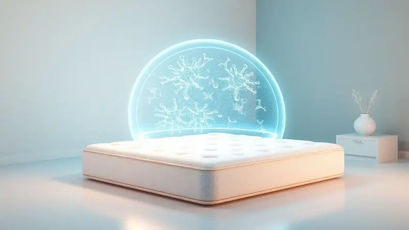

Imagine investir em algo que você passa um terço da vida utilizando. O colchão certo não é apenas um móvel - é um aliado silencioso da sua saúde, do seu humor e da sua energia para enfrentar cada dia.

Quando o assunto é Herval, o Big Class se destaca na prateleira, prometendo unir sustentação avançada com a frescura das fibras de bambu. Mas será que ele realmente transforma promessas em noites revigorantes?

Vamos além das especificações técnicas para descobrir como cada camada desse colchão conversa com o seu corpo.

<SummaryList products={frontmatter.top_products} />

## Análise do Colchão Big Class Herval Eco Bamboo

<ProductBox 
  title={frontmatter.top_products[0].title} 
  image={frontmatter.top_products[0].image} 
  link={frontmatter.top_products[0].link} 
/>

O Herval Big Class Eco Bamboo é como aquele parceiro confiável: firme quando você precisa de apoio, mas inteligente o suficiente para se adaptar.

Seu coração é um sistema de molas Confort Class que não apenas suporta seu peso, mas distribui ele como um mestre de equilíbrio, garantindo que sua coluna encontre seu alinhamento natural. E aqui está o segredo da longevidade: o Pillow Top Double Side.

Você não está comprando um colchão, está investindo em dois. Quando um lado mostrar sinais de cansaço, basta virá-lo para descobrir um apoio renovado.

O toque? É onde o bambu entra em cena. Enquanto você dorme, esse revestimento respira com você, regulando a temperatura para evitar aquela sensação de calor abafado no meio da madrugada.

E tem mais: suas propriedades antimicrobianas criam uma barreira invisível contra ácaros, ideal para quem acorda com coceira no nariz ou espirros.

Sim, sua estrutura tem uma personalidade firme. Se você sonha afundar em uma nuvem, pode estranhar no início. Mas é justamente essa determinação que proporciona o suporte que muitas costas cansadas anseiam.

Com 32 centímetros de altura e um design que dialoga com qualquer decoração, ele se impõe não apenas como um colchão, mas como um elemento de bem-estar no seu quarto.

<CaixaProsContras>

**Prós:**

- Firmeza e alta sustentação com molas Confortclass

- Pillow Top Double Side para maior durabilidade

- Revestimento com viscose de bambu que regula a temperatura

- Design clássico e elegante

**Contras:**

- Estrutura firme pode não agradar todos os gostos

- Peso máximo suportado pode ser limitado para alguns usuários

</CaixaProsContras>

### Tecnologia de Molas Confort Class

Já tentou dormir em um colchão onde cada movimento do parceiro vira um terremoto? As molas Confort Class foram projetadas para acabar com essa dança noturna.

Elas trabalham em uníssono, como uma equipe perfeitamente sincronizada, para absorver impactos e isolar movimentos. O resultado é que você finalmente pode se virar para a posição favorita sem acordar quem está ao seu lado.

Mas a verdadeira magia acontece na forma como elas dialogam com sua coluna. Em vez de simplesmente ceder ao peso, essas molas oferecem uma resistência inteligente que mantém suas curvas naturais protegidas.

É como ter um fisioterapeuta silencioso trabalhando a noite toda para que você acorde sem aquela rigidez matinal que estraga o café da manhã.

### Camada de Espuma Viscoelástica D33

Se as molas são o esqueleto, a espuma D33 é o abraço. Ela não apenas recebe seu corpo, ela se lembra dele. Essa memória viscoelástica significa que seus ombros, quadris e lombar encontram covinhas personalizadas que aliviam a pressão exatamente onde mais dói.

Imagine finalmente dormir de lado sem que seu braço adormeça. Ou deitar de costas sem sentir que está flutuando em uma tábua.

A espuma D33 tem um retorno lento e deliberado - ela não te empurra de volta, ela te acompanha em cada movimento, como se dissesse: "Vamos juntos".

Essa adaptação constante melhora a circulação sanguínea, transformando horas de repouso em verdadeira recuperação muscular.

### Benefícios do Tecido com Fibras de Bambu

Você já acordou com a camiseta grudada nas costas em uma noite de verão? O tecido de bambu entende esse drama. Suas fibras microscópicas criam canais naturais de ventilação que expulsam o calor e a umidade, mantendo sua pele respirando livremente durante toda a noite.

Para quem convive com alergias, essa capa é um santuário. As propriedades antimicrobianas do bambu criam um ambiente inóspito para ácaros e bactérias, reduzindo significativamente os espirros matinais e a coceira nos olhos. E o toque?

É aquele tipo de maciez que faz você querer passar a mão repetidamente, suave como seda mas resistente como algodão premium.

Há também uma consciência tranquila nessa escolha. Optar por bambu é apoiar um recurso renovável que cresce rapidamente sem pesticidas agressivos. Seu sono não apenas repara seu corpo, mas respeita o planeta.

## Especificações Técnicas e Materiais

Por trás do conforto aparente existe uma engenharia cuidadosa.

O Big Class é uma sanduíche de tecnologia: na base, molas ensacadas que trabalham independentemente para suporte preciso; no meio, espuma de alta densidade que resiste ao afundamento prematuro; na superfície, uma capa que respira e protege.

Cada camada tem uma função específica, mas trabalham em harmonia. É como uma orquestra onde cada instrumento conhece sua partitura, criando uma sinfonia de descanso que se repete noite após noite.

### Pillow Top One Side e Acabamento Premium

A primeira impressão ao deitar no Big Class é a de ser recebido por uma nuvem estratégica. O Pillow Top One Side não é apenas um extra de espuma - é uma zona de aterrissagem suave que ameniza o contato inicial, especialmente para quem tem pontos de pressão sensíveis.

Seus cantos arredondados não são apenas estética. Eles demonstram um cuidado com o acabamento que previne desgastes precoces e garantem que o colchão se encaixe perfeitamente em bases e cabeceiras.

As costuras são quase invisíveis, reforçadas para resistir aos movimentos noturnos mais intensos. Este é um produto que não esconde sua qualidade - ela salta aos olhos e, mais importante, ao toque.

### Tratamentos Especiais: Antiácaro e Antimofo

Para o Big Class, proteção é proatividade. O tratamento antiácaro não espera os invasores chegarem - ele cria uma barreira química que torna a superfície hostil para esses micro-organismos.

Já o antimofo age como um guardião contra a umidade, especialmente valioso em cidades litorâneas ou quartos com ventilação limitada.

Essas defesas invisíveis são particularmente importantes para crianças, idosos ou qualquer pessoa com sistema respiratório sensível.

Elas transformam o colchão em uma fortaleza noturna onde você pode respirar profundamente sem preocupações, sabendo que cada inspiração é mais pura do que em um colchão comum.

## Fabricante e Garantia Herval

Quando você compra um Herval, está adquirindo mais de setenta anos de expertise brasileira em repouso.

Esta não é uma empresa que apenas fabrica colchões - ela estuda o sono, entende as particularidades do corpo brasileiro e investe continuamente em pesquisas que traduzem ciência em conforto.

A garantia de 7 anos não é apenas um papel. É um compromisso audacioso que diz: "Acreditamos tanto na qualidade deste produto que cobrimos seu desempenho por quase uma década". Durante esse período, qualquer defeito de fabricação é responsabilidade da marca.

Essa segurança permite que você durma tranquilo sabendo que seu investimento está protegido contra falhas prematuras.

## Conclusão

O Colchão Herval Big Class é para quem entende que dormir bem é um ato de autocuidado, não um luxo.

Ele não promete milagres, mas oferece uma proposta honesta: firmeza inteligente que respeita sua coluna, tecnologia que isola movimentos para noites compartilhadas mais pacíficas, e materiais que respiram com você em vez de contra você.

Sua personalidade firme pode exigir um período de adaptação, especialmente para quem está acostumado a colchões mais macios. Mas essa mesma firmeza é o que proporciona o suporte que transforma sono em recuperação genuína.

O sistema Pillow Top Double Side é um golpe de mestre em durabilidade, essencialmente dando a você dois colchões pelo preço de um.

Se você busca um aliado noturno que une tradição brasileira com tecnologias modernas, que oferece garantia robusta e um compromisso com a saúde do seu sono, o Big Class merece seu teste.

Experimente em uma loja, deite por pelo menos quinze minutos em sua posição habitual. Seu corpo dirá se essa é a parceria que suas noites estavam esperando.