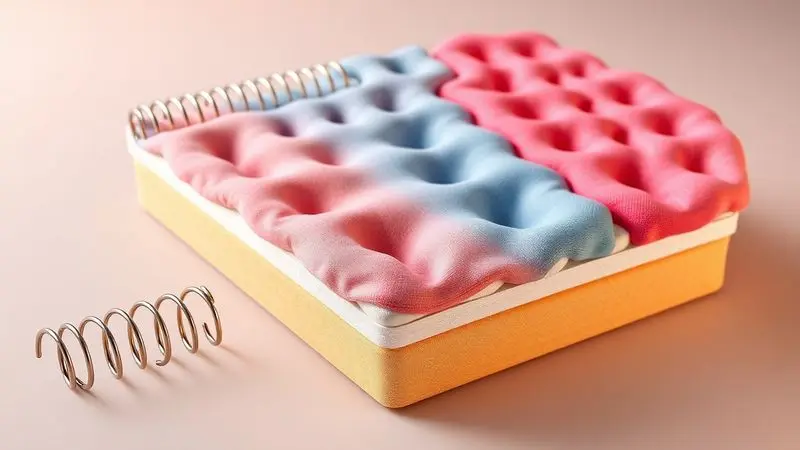

Escolher um colchão novo é uma decisão que impacta diretamente na sua saúde e qualidade de vida, e a Herval se destaca como uma das marcas mais tradicionais do mercado brasileiro. Mas será que o colchão Herval é bom mesmo?

Com uma vasta linha que vai desde as exclusivas molas Maxspring até modelos em espuma de alta densidade, a marca promete durabilidade e conforto superior.

Neste guia, analisamos profundamente as tecnologias, os materiais e os modelos mais vendidos para ajudar você a decidir se a Herval é a escolha certa para suas noites de sono.

<SummaryList products={frontmatter.top_products} />

## A Marca Herval é Confiável?

Imagine confiar em uma marca que conhece o sono brasileiro há décadas. A Herval não é apenas mais uma empresa no mercado.

É uma tradição que evoluiu junto com nossa necessidade de descanso, investindo continuamente em pesquisas para transformar noites agitadas em sono reparador.

Quando você compra um Herval, está adquirindo mais que um colchão, está trazendo para casa a experiência acumulada de anos entendendo o que realmente importa quando apagamos as luzes: suporte que respeita sua coluna, materiais que respiram com seu corpo e uma assistência que não desaparece após a instalação.

É essa trajetória que transforma uma simples marca em uma escolha confiável para quem valoriza a qualidade do sono.

## Principais Tecnologias dos Colchões Herval

Por trás de cada noite tranquila existe uma combinação inteligente de tecnologias. A Herval não apenas utiliza materiais de qualidade, mas os combina de forma estratégica.

Espumas que conversam com seu corpo, sistemas de molas que isolam movimentos e revestimentos que criam um ambiente saudável. Cada tecnologia tem uma personalidade, um propósito específico que se traduz em benefícios tangíveis para sua rotina de descanso.

### Molas Maxspring vs. Molas Ensacadas (Pocket)

Pense nas molas como a personalidade do seu colchão. As molas Maxspring são aquela amiga firme e confiável que sempre mantém a postura correta.

Elas oferecem uma base estável que distribui o peso de forma uniforme, perfeita para quem sente que afunda demais em colchões convencionais ou precisa de apoio extra para a região lombar.

Já as molas ensacadas são como ninhos individuais para cada parte do seu corpo. Cada uma trabalha independentemente, moldando-se aos seus contornos específicos enquanto isola completamente os movimentos do seu parceiro.

É a tecnologia que transforma um simples virar na cama em um gesto discreto, sem perturbar o sono de quem está ao seu lado.

### Espuma EcoSpuma e Viscogel

Imagine um material que se molda ao seu corpo como argila quente, mas sem perder a capacidade de voltar à forma original. A EcoSpuma faz exatamente isso, com o bônus de ser feita de retalhos reciclados que dariam destino ao lixo.

Ela não apenas acolhe seus pontos de pressão, mas faz isso com consciência ambiental.

O Viscogel é onde a ciência encontra o conforto. Combinando a adaptação do viscoelástico com a sensação refrescante do gel, ele cria uma experiência térmica inteligente. Seu corpo esquenta? O material dissipa o calor. Você busca aconchego? Ele retém o calor necessário.

É como ter um termostato embutido que trabalha silenciosamente enquanto você dorme.

### Pillow Top One Side e Double Side

Alguns dias você quer um abraço macio, outros precisa de apoio firme. O Pillow Top One Side é aquele conforto constante, uma camada extra de aconchego que elimina a necessidade de virar o colchão. Simplicidade que se traduz em praticidade no dia a dia.

O Double Side, por sua vez, é o colchão que cresce com você. Um lado mais macio para quando o corpo pede carinho, outro mais firme para quando a postura precisa de disciplina.

Virá-lo periodicamente não é apenas uma manutenção, é uma renovação da experiência de sono, como ter dois colchões em um.

## Análise do Colchão Herval Scotland Maxspring

<ProductBox 
  title={frontmatter.top_products[0].title} 
  image={frontmatter.top_products[0].image} 
  link={frontmatter.top_products[0].link} 
/>

Acordar sem aquela dorzinha nas costas que parece fazer parte da rotina. É essa promessa que o Scotland Maxspring cumpre com elegância. As molas Maxspring trabalham como uma rede de apoio invisível, sustentando cada vértebra enquanto você descansa.

A sensação é de segurança estrutural, como se seu corpo estivesse sendo cuidadosamente posicionado durante toda a noite.

O Pillow Top One Side adiciona um toque de gentileza sobre essa firmeza, criando uma transição suave entre o suporte e o conforto superficial. E enquanto você dorme, o tecido malha com tratamento antiácaro e antifungo cria um santuário livre de alergias.

A tecnologia Ultrassom 3D nas laterais funciona como os pulmões do colchão, garantindo que o ar circule livremente e mantenha a frescura mesmo nas noites mais quentes.

Sim, ele conversa de forma mais direta com quem prefere firmeza. Mas essa honestidade é justamente seu maior trunfo para quem busca alívio para dores lombares ou simplesmente se sente perdido em colchões excessivamente macios.

<CaixaProsContras>

**Prós:**

- Firmeza e suporte estável com molas Maxspring.

- Conforto adicional com o Pillow Top One Side.

- Tecido malha com tratamento antiácaro e antifungo.

- Ecoespuma sustentável e resistente.

**Contras:**

- Pode ser firme demais para quem prefere um colchão mais macio.

- Requer girar periodicamente para manter a estrutura.

</CaixaProsContras>

### Especificações Técnicas do Scotland

O segredo do Scotland está na sua construção em camadas inteligentes.

Começando pela base de molas pocket que atuam como milhares de amortecedores individuais, passando pelas espumas de alta densidade que garantem que essa estrutura perdure por anos, até chegar ao tecido antimicrobiano que protege não apenas sua saúde, mas a do próprio colchão.

A profundidade generosa não é um acaso, é o espaço necessário para que seu corpo encontre seu lugar ideal sem comprometer o suporte da coluna. Cada milímetro foi pensado para transformar especificações técnicas em noites concretas de descanso.

## Análise do Colchão Herval Imperatore Eco Bamboo

<ProductBox 
  title={frontmatter.top_products[1].title} 
  image={frontmatter.top_products[1].image} 
  link={frontmatter.top_products[1].link} 
/>

Para casais, o silêncio entre um movimento e outro vale ouro. O Imperatore Eco Bamboo entende isso profundamente. Suas molas ensacadas individualmente criam territórios independentes na mesma cama, onde um virar não se transforma em tsunami para o parceiro.

É a tecnologia que preserva a intimidade do sono de cada um, mesmo quando dividem o mesmo espaço.

A espuma viscoelástica (aquela mesma desenvolvida pela NASA) funciona como uma memória corporal. Ela aprende onde você mais precisa de alívio e cria zonas personalizadas de conforto, melhorando a circulação sanguínea enquanto você descansa.

Já o revestimento em viscose de bambu é mais que um tecido macio, é um escudo natural contra bactérias e fungos que transforma seu colchão em um ecossistema saudável.

Sim, o fato de ser "one side" significa que você não terá a opção de virá-lo para renovar a superfície. Mas essa escolha estratégica permite que toda a tecnologia seja otimizada em uma única direção, criando uma experiência de sono mais consistente e especializada.

<CaixaProsContras>

**Prós:**

- Molas ensacadas que oferecem conforto e isolam movimentos.

- Espuma viscoelástica que se adapta ao corpo, aliviando pressão.

- Revestimento em viscose de bambu com propriedades anti-bacterianas.

- Avaliação excelente em custo-benefício.

**Contras:**

- É um modelo "one side", limitando a rotação.

- Suporte de peso individual é até 120 kg por pessoa.

</CaixaProsContras>

### Luxo e Conforto com Fibras de Bambu

O bambu não é apenas um material, é uma filosofia de conforto. Suas fibras respiram de forma natural, criando um fluxo de ar constante que regula a temperatura de forma orgânica.

Imagine dormir em um local onde o calor não se acumula, onde cada fibra trabalha como um micro-condicionador de ar. Para quem tem alergias, essa característica hipoalergênica significa noites sem espirros ou coceiras, um alívio que vai além do conforto físico.

E o melhor? Essa experiência luxuosa vem com a consciência tranquila de escolher uma matéria-prima renovável que cresce rapidamente e exige poucos recursos. É conforto que respeita tanto seu corpo quanto o planeta.

## Análise do Colchão Herval Toledo

<ProductBox 
  title={frontmatter.top_products[2].title} 
  image={frontmatter.top_products[2].image} 
  link={frontmatter.top_products[2].link} 
/>

Às vezes, o equilíbrio perfeito está no meio termo. O Toledo é a prova disso. Seu sistema de molas pocket oferece a adaptação personalizada que seu corpo merece, enquanto minimiza aquela dança noturna de movimentos entre casais.

A camada de Pillow Top é como um sorriso de boas-vindas todas as noites, um aconchego imediato que prepara seu corpo para o descanso.

A EcoSpuma® por trás dessa experiência não é apenas durável, ela carrega a história sustentável da marca.

E enquanto você descansa, as proteções contra ácaros, fungos e bactérias trabalham silenciosamente, criando uma barreira invisível que protege sua saúde respiratória.

O fato de ser "one side" exige atenção na rotação, mas essa característica também permite uma otimização mais focada dos materiais.

E embora o suporte de peso tenha seu limite, ele é cuidadosamente calculado para oferecer a melhor relação entre conforto e durabilidade para a maioria dos usuários.

<CaixaProsContras>

**Prós:**

- Conforto com sistema de molas ensacadas

- Camada adicional de Pillow Top

- Proteção contra ácaros e fungos

- Alta durabilidade e resistência

**Contras:**

- Somente um lado utilizável

- Limitação no suporte de peso

</CaixaProsContras>

### Conforto Intermediário com Tecnologia Premium

O conforto intermediário é onde a maioria de nós encontra nosso lar noturno. Não tão firme a ponto de sentir-se numa tábua, não tão macio que nos perdemos em seu abraço.

É o ponto ideal que a Herval domina com maestria, utilizando tecnologias premium que normalmente reservamos para extremos.

A espuma viscoelástica e o látex não são usados para criar sensações exageradas, mas para oferecer uma adaptação precisa que respeita a anatomia sem compensações.

A respiração superior desses materiais significa noites sem aquela sensação abafada que nos faz revirar na cama. É a tecnologia trabalhando a serviço do equilíbrio, provando que o meio termo pode ser, sim, o lugar mais sofisticado para se estar.

## Análise do Colchão Herval Meditare

<ProductBox 
  title={frontmatter.top_products[3].title} 
  image={frontmatter.top_products[3].image} 
  link={frontmatter.top_products[3].link} 
/>

O Meditare é para quem busca o silêncio interno. Seu sistema de molas ensacadas individualmente cria uma barreira de som contra movimentos, perfeito para quem divide a cama com um parceiro agitado ou simplesmente valoriza a imobilidade durante o sono.

O tecido Jacquard que o reveste não é apenas uma escolha estética, é um compromisso com a durabilidade que se mantém bonito mesmo após anos de uso.

As camadas de espuma de alta densidade são a espinha dorsal invisível desse colchão, garantindo que o conforto não seja passageiro, mas uma constante em sua vida. Sim, ele conversa mais com quem aprecia uma firmeza educada.

Mas essa é justamente sua virtude: oferecer um suporte que orienta sem comandar, que acomoda sem afundar. Para alguns, a adaptação pode levar algumas noites, mas é o tempo necessário para que seu corpo aprenda a confiar nesse novo aliado do sono.

<CaixaProsContras>

**Prós:**

- Excelente sistema de molas ensacadas que proporciona conforto e reduz movimentos.

- Camadas de espuma de alta densidade para maior durabilidade.

- Tecido Jacquard que agrega sofisticação e resistência.

- Tratamentos antiácaro que tornam o ambiente de sono mais saudável.

**Contras:**

- Pode ser considerado firme demais para quem prefere um colchão bem macio.

- A adaptação pode demorar para alguns usuários mais leves.

</CaixaProsContras>

### Sustentabilidade e Suporte de Peso

Hoje, conforto e consciência ambiental não são mais opostos. A Herval prova isso ao transformar retalhos recicláveis em espumas de alta performance e utilizar tecidos que respeitam o ciclo natural dos materiais.

Essa sustentabilidade não é um acessório de marketing, é parte estrutural de como os colchões são concebidos.

E essa filosofia se estende ao suporte de peso, onde a engenharia cuidadosa garante que, independentemente do biotipo, o corpo encontre o equilíbrio perfeito entre acomodação e firmeza.

É a demonstração de que responsabilidade ambiental e suporte corporal podem, sim, dormir na mesma cama.

## Análise do Colchão Herval Frontier (Espuma D45)

<ProductBox 
  title={frontmatter.top_products[4].title} 
  image={frontmatter.top_products[4].image} 
  link={frontmatter.top_products[4].link} 
/>

Para quem carrega o peso do dia nas costas, literalmente, o Frontier com Espuma D45 oferece o abraço firme que a coluna pede. Sua alta densidade não é apenas um número técnico, é a promessa de que o suporte não vai ceder quando mais precisamos dele.

A possibilidade de incorporar a EcoSpuma® transforma essa robustez em uma escolha consciente, enquanto o revestimento Jacquard envolve toda essa estrutura em um visual que não precisa esconder-se sob lençóis.

Alguns usuários mais leves relatam que o colchão pode amolecer mais rapidamente do que o esperado. É importante entender que essa firmeza generosa foi desenhada para corpos que demandam suporte consistente, e como qualquer relacionamento, requer compatibilidade.

As especificações detalhadas são seu melhor guia para garantir que essa força encontre o corpo certo para abraçar.

<CaixaProsContras>

**Prós:**

- Firmeza ideal para suporte durante o sono.

- Alta durabilidade com espumas compactadas.

- Design atraente com tecido Jacquard.

- Opções de Pillow Top para maior conforto.

**Contras:**

- Pode apresentar amolecimento em curto prazo para algumas pessoas.

- Especificações de composição podem ser confusas na hora da compra.

</CaixaProsContras>

## Análise do Colchão Herval Tower Maxspring

<ProductBox 
  title={frontmatter.top_products[5].title} 
  image={frontmatter.top_products[5].image} 
  link={frontmatter.top_products[5].link} 
/>

O Tower Maxspring é a fortaleza do sono. Suas molas Maxspring criam uma base tão estável que parece desafiar a gravidade, oferecendo suporte progressivo que se adapta ao peso sem jamais ceder.

O Pillow Top Double Side é como ter duas personalidades em um só colchão, permitindo que você renove a experiência simplesmente virando-o, prolongando sua vida útil de forma inteligente.

A EcoSpuma® utilizada aqui é um testemunho do compromisso sustentável da marca, transformando o que seria desperdício em matéria-prima de qualidade.

E enquanto você descansa, o tratamento antiácaro, antifúngico e antialérgico trabalha como um guardião silencioso da sua saúde respiratória.

Essa firmeza acentuada é uma declaração de propósito. Ela não tenta agradar a todos, mas oferece exatamente o que promete para quem busca um suporte que não negocia com a postura. O peso ao virar é o preço dessa robustez, mas também a prova de sua construção sólida.

<CaixaProsContras>

**Prós:**

- Conforto firme e estável

- Sistema de molas Maxspring para maior durabilidade

- Camada Pillow Top em ambos os lados

- Tecnologia EcoSpuma® sustentável

**Contras:**

- Firmeza acentuada pode não agradar a todos

- Pode ser pesado para manusear ao virar

</CaixaProsContras>

## Análise do Colchão Herval C1624

<ProductBox 
  title={frontmatter.top_products[6].title} 
  image={frontmatter.top_products[6].image} 
  link={frontmatter.top_products[6].link} 
/>

O C1624 é onde a tecnologia encontra a praticidade. Suas molas ensacadas oferecem o conforto uniforme que seu corpo merece, enquanto a EcoSpuma® garante que essa experiência perdure por anos.

O Pillow Top One Side é a simplificação inteligente que elimina a complicação de virar o colchão, focando toda a tecnologia em uma única direção de conforto.

O tecido Jacquard com camada de espuma D20 não é apenas um revestimento bonito, é uma declaração de resistência que mantém sua aparência elegante mesmo após anos de uso.

E com capacidade para suportar até 130 kg por pessoa, ele conversa com uma variedade de biotipos sem fazer concessões na qualidade.

Sim, o investimento pode ser superior ao de modelos básicos, mas essa diferença se traduz em anos de sono tranquilo sem necessidade de substituição precoce.

E o design One Side, longe de ser uma limitação, é uma opção consciente por quem valoriza a simplicidade na manutenção.

<CaixaProsContras>

**Prós:**

- Molas ensacadas que proporcionam conforto uniforme.

- Construído com materiais sustentáveis.

- Pillow Top que elimina a necessidade de virar o colchão.

- Diversas opções de tamanho disponíveis.

**Contras:**

- Pode ter um preço mais alto em comparação a modelos básicos.

- Não é possível virar o colchão devido ao design One Side.

</CaixaProsContras>

## Diferenciais: Lateral Ultrassom 3D e Tecido Jacquard

Imagine um colchão que respira com você. A lateral Ultrassom 3D é exatamente isso: milhares de microtúneis que permitem que o ar circule livremente, regulando a temperatura de forma natural.

É a tecnologia que impede que o calor se acumule, transformando noites abafadas em sono fresco e renovador. Não é um detalhe, é uma revolução na forma como o colchão interage com o ambiente.

Já o tecido Jacquard é a pele inteligente desse organismo. Mais que uma textura agradável, é uma estrutura tecida com precisão que resiste ao tempo e ao uso, mantendo sua beleza e funcionalidade.

Juntos, esses diferenciais criam uma experiência completa onde cada aspecto, do interno ao externo, foi pensado para transformar o ato de dormir em um ritual de verdadeiro descanso.

## Cuidados e Manutenção para seu Colchão Herval

Seu colchão Herval é um investimento no seu descanso, e como todo investimento de valor, merece cuidados.

Rotacioná-lo a cada três meses não é uma tarefa chata, é um ato de carinho que distribui o desgaste de forma inteligente, garantindo que cada centímetro ofereça o mesmo conforto por anos.

Um protetor não é apenas uma capa, é um escudo contra acidentes do dia a dia que preserva a integridade dos materiais.

Na limpeza, a gentileza é a regra. Um pano levemente umedecido é suficiente para manter a frescura, sem agredir os tratamentos especiais do tecido. E lembre-se: seu colchão é um aliado do descanso, não um trampolim.

Respeitar sua capacidade de suporte é garantir que ele continue sendo esse aliado por muito tempo. São gestos simples que transformam um produto durável em um companheiro de longo prazo do seu sono.

## Conclusão

Após mergulharmos nas tecnologias, modelos e detalhes que fazem da Herval uma marca tão respeitada, uma coisa fica clara: escolher um colchão vai muito além de selecionar um produto. É escolher como você quer acordar todas as manhãs.

A Herval oferece essa escolha com honestidade, apresentando não apenas um catálogo, mas um espectro de possibilidades para diferentes corpos, necessidades e preferências.

Se você busca a firmeza confiável das molas Maxspring, a adaptação inteligente das molas ensacadas, o conforto sustentável da EcoSpuma ou a frescura natural das fibras de bambu, existe um Herval que fala sua linguagem do sono.

Cada tecnologia foi desenvolvida não para impressionar com termos técnicos, mas para traduzir ciência em noites concretas de descanso reparador.

O verdadeiro teste, no entanto, acontece no seu quarto. A experiência pessoal é o último e mais importante capítulo dessa jornada. Por isso, antes de decidir, permita-se sentir. Deite-se, respire, sinta como seu corpo responde ao suporte oferecido.

Porque um bom colchão não se escolhe apenas com a razão, mas com a sensação de estar finalmente em casa, mesmo quando seus olhos estão fechados. A Herval pode ser essa casa noturna que seu sono procura.