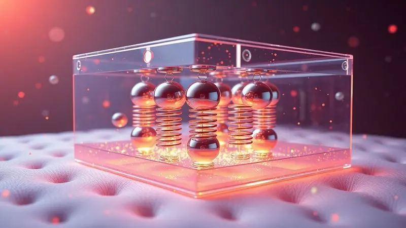

Em busca de noites de sono perfeitas, muitos consumidores se deparam com uma dúvida frequente: o Colchão Herval Imperatore Eco Bamboo é bom?

Este modelo é um dos mais prestigiados da marca Herval, prometendo uma experiência de descanso digna de realeza com sua combinação de luxo e tecnologia.

Mas será que o investimento em molas ensacadas e espuma viscoelástica realmente se traduz em qualidade e durabilidade para o seu dia a dia?

Neste artigo, analisamos profundamente as especificações técnicas e os diferenciais deste colchão para entregar uma resposta sincera e detalhada, ajudando você a decidir se ele é a escolha certa para o seu quarto.

<SummaryList products={frontmatter.top_products} />

## O que é o Colchão Herval Imperatore Eco Bamboo?

Imagine acordar sentindo que seu corpo realmente descansou, não apenas dormiu. É essa sensação que o Imperatore Eco Bamboo busca proporcionar através de uma combinação inteligente de materiais.

As fibras de bambu trabalham silenciosamente durante a noite para controlar a temperatura do seu corpo, enquanto a estrutura oferece aquele equilíbrio delicado entre firmeza que apoia e maciez que acolhe.

Se você já se viu virando na cama tentando encontrar uma posição confortável, esse colchão foi pensado justamente para oferecer suporte personalizado, independentemente de você dormir de lado, de costas ou de barriga para baixo.

## Especificações Técnicas e Diferenciais do Colchão Herval Imperatore

<ProductBox 
  title={frontmatter.top_products[0].title} 
  image={frontmatter.top_products[0].image} 
  link={frontmatter.top_products[0].link} 
/>

O segredo por trás do conforto excepcional do Imperatore Eco Bamboo está em como cada elemento técnico conversa com os outros.

Não se trata apenas de uma lista de materiais premium, mas de uma orquestração cuidadosa onde cada componente tem um papel específico no seu bem-estar noturno.

Desde as molas que dançam ao ritmo do seu corpo até o tecido que respira com você, tudo foi projetado para transformar o ato de dormir em uma experiência verdadeiramente reparadora.

<CaixaProsContras>

**Prós:**

- Sistema de molas ensacadas que reduz movimentos.

- Espuma viscoelástica que melhora o conforto.

- Revestimento em bambu com propriedades antimicrobianas.

- Design sofisticado com Pillow Top.

**Contras:**

- Preço mais elevado em comparação a colchões comuns.

- Pode ter peso maior devido à sua estrutura robusta.

</CaixaProsContras>

### Tecnologia de Molas Ensacadas Pocket

Você já se irritou ao sentir seu parceiro se mexer do outro lado da cama? Essa tecnologia existe para acabar com essa pequena guerra noturna.

Cada mola trabalha independentemente dentro do seu próprio compartimento, como se estivesse dando um abraço personalizado apenas para você.

O resultado é quase mágico: seu corpo encontra apoio exatamente onde precisa, enquanto o movimento do lado oposto simplesmente desaparece.

Pense nisso como ter sua própria ilha de conforto dentro da cama de casal, onde você pode se aconchegar sem medo de perturbar ou ser perturbado.

### Conforto da Espuma Viscoelástica D33

Lembra daquela dor no ombro que sempre aparece quando você dorme de lado? A espuma D33 foi criada para conversar diretamente com essas áreas sensíveis.

Ela não apenas se molda ao contorno do seu corpo, mas faz isso de forma inteligente, distribuindo o peso de maneira que suas articulações não precisem trabalhar tanto durante a noite.

Imagine a sensação de afundar levemente em uma nuvem que ainda mantém sua coluna perfeitamente alinhada. A ventilação integrada garante que você não acorde aquecido, mas sim revigorado, como se tivesse dormido com uma brisa suave acompanhando cada movimento.

### Benefícios do Tecido Eco Bamboo e Fibras Naturais

Acordar com aquele cheiro abafado que algumas camas desenvolvem ao longo do tempo é coisa do passado. As fibras de bambu possuem uma capacidade natural de regular a umidade e inibir o crescimento de bactérias, criando um ambiente noturno mais puro e fresco.

Para quem sofre com alergias ou sensibilidade respiratória, essa característica pode significar a diferença entre noites de espirros e noites de sono contínuo.

Além do benefício imediato para sua saúde, há uma gratificação adicional em saber que está descansando sobre materiais biodegradáveis, que respeitam tanto o seu corpo quanto o planeta.

## Design e Acabamento: Luxo e Tecnologia em um só Conjunto

Olhar para o Imperatore Eco Bamboo é entender que beleza e funcionalidade podem coexistir sem concessões. Cada costura, cada detalhe do acabamento foi pensado para oferecer não apenas um produto durável, mas uma peça que eleva a estética do seu quarto.

O luxo aqui não é ostentação vazia, mas a materialização do cuidado que você dedica ao seu próprio descanso.

### Pillow Top One Side e Revestimento Premium

O toque inicial na superfície do colchão já conta uma história de conforto. O Pillow Top One Side não é um simples acréscimo, mas uma camada estratégica que recebe seu corpo com uma maciez que se adapta instantaneamente.

Enquanto isso, o revestimento premium em bambu trabalha como uma segunda pele, respirando com você e mantendo a temperatura ideal independentemente da estação do ano.

Essa dupla atuação transforma o ato de deitar-se em um ritual de relaxamento, onde cada detalhe conspira para que você abandone as tensões do dia.

## Suporte de Peso e Dimensões Disponíveis (Casal, Queen e King)

Um colchão que promete luxo precisa se adaptar à sua realidade, não o contrário. Por isso, o Imperatore Eco Bamboo está disponível em três tamanhos que conversam com diferentes configurações de espaço e necessidade.

Seja para um quarto compacto onde cada centímetro conta, ou para um ambiente espaçoso que pede a majestosidade de um modelo King, a qualidade de construção permanece inalterada.

A robustez da estrutura garante que, independentemente do tamanho escolhido, o suporte oferecido será consistente e duradouro, como uma base sólida para seus sonhos.

## Saúde e Durabilidade: Proteção Antiácaro e Antimofo

Investir em um colchão premium vai além do conforto imediato. É também uma aposta na qualidade do ar que você respira durante um terço da sua vida.

A proteção antiácaro e antimofo não é um recurso secundário, mas uma linha de defesa ativa que trabalha noite após noite para manter seu ambiente de sono saudável.

Para quem luta contra alergias ou simplesmente valoriza um espaço livre de irritantes, essa característica transforma o colchão de um móvel em um aliado da sua saúde.

A durabilidade dos materiais naturais garante que essa proteção não seja temporária, mas uma constante ao longo de anos de uso.

## Conclusão

O Colchão Herval Imperatore Eco Bamboo não é simplesmente um produto, mas uma proposta de transformação na sua relação com o descanso.

Cada elemento, das molas ensacadas que dançam com seu movimento ao tecido de bambu que respira com você, foi pensado para criar uma sinergia onde tecnologia serve ao conforto, e sustentabilidade caminha lado a lado com durabilidade.

O investimento aqui não se mede apenas em reais, mas na qualidade das manhãs que você vai despertar, na ausência de dores que antes eram companheiras noturnas, e na serenidade de saber que cada noite será uma experiência genuinamente reparadora.

Se você busca mais do que uma simples superfície para dormir, se valoriza detalhes que fazem diferença no cotidiano e acredita que o sono de qualidade é um pilar fundamental do bem-estar, o Imperatore Eco Bamboo apresenta argumentos convincentes.

Ele é para quem entende que uma boa noite de sono não é luxo, mas necessidade, e está disposto a investir em um aliado que honrará essa decisão por muitos anos.

A escolha final, como sempre, é sua, mas agora você tem todas as informações para fazê-la com a tranquilidade de quem conhece cada detalhe daquilo que está levando para casa.