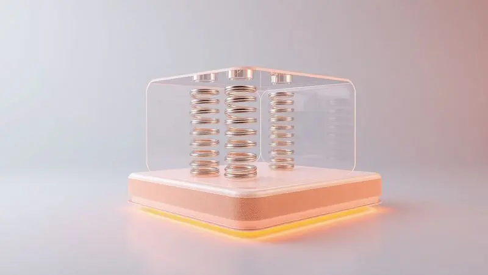
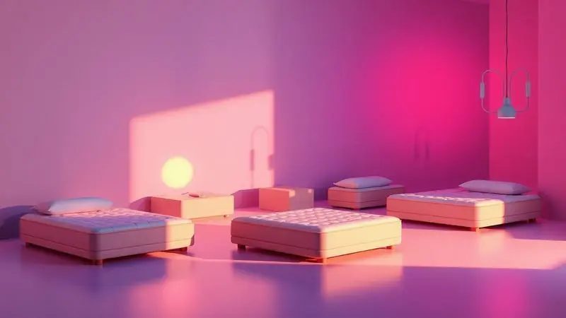

Escolher o colchão ideal transforma sua relação com o sono. Você passa cerca de um terço da vida dormindo, então essa decisão não é apenas sobre um móvel, mas sobre qualidade de vida.

Quando a Inducol entra em cena com sua linha de molas ensacadas, a pergunta que persiste é: vale mesmo a confiança? Analisamos cada camada, da tecnologia à experiência real, para que você descubra se esse colchão é o parceiro perfeito para noites realmente reparadoras.

<SummaryList products={frontmatter.top_products} />

## Conheça a Inducol

Mais do que uma marca, a Inducol é uma história de décadas contada em cada detalhe dos seus produtos. Ela constrói sua reputação não apenas sobre materiais, mas sobre uma compreensão profunda do que significa descansar bem.

A obsessão com inovação levou à adoção do sistema de molas ensacadas, uma tecnologia que trata cada corpo como único, não como parte de uma massa. Essa dedicação ao conforto personalizado explica por que tantas pessoas confiam seu sono à marca.

## O que são colchões de molas ensacadas?

Imagine um exército de pequenas molas, cada uma com sua própria capa de tecido. Agora entenda que esse exército trabalha para você, não como um grupo, mas como indivíduos. Essa é a magia das molas ensacadas.

Quando você se deita, apenas as molas sob pressão cedem, enquanto as demais mantêm sua firmeza. O resultado? Seu parceiro não sente quando você se vira às 3 da manhã. Suas costas encontram apoio exatamente onde precisam.

Seu corpo não é uma prancha de surf, então por que dormir em uma?

## Reputação da Inducol no Reclame Aqui

Para qualquer produto que promete transformar suas noites, a prova está na experiência real de quem já comprou. Ao navegar pelo Reclame Aqui, você encontra um diálogo entre expectativa e realidade.

A Inducol, como qualquer marca consolidada, tem seu histórico de desafios atendidos. O que importa não é a ausência de reclamações, mas como a empresa responde a elas.

A transparência nas resoluções e o compromisso com o cliente falam mais alto do que qualquer promessa de marketing. Essa abertura para ouvir e corrigir é o que transforma consumidores em defensores da marca.

## O colchão Inducol Molas Ensacadas é bom?

A resposta está menos na especificação técnica e mais na sensação que ele cria. Quando seus ombros e quadris afundam suavemente enquanto sua coluna permanece perfeitamente alinhada, você não está apenas deitado em um colchão.

Está experimentando a física trabalhando a seu favor. A tecnologia de molas ensacadas tem esse poder. Para casais, significa dormir juntos sem viver os movimentos um do outro.

Para quem acorda com dores, representa o alívio que vem quando o suporte chega exatamente nos pontos certos, não em todo lugar igualmente.

A respirabilidade não é apenas um termo técnico. É a diferença entre acordar suando e despertar renovado. As molas ensacadas criam canais naturais de ventilação que mantêm o frescor durante a noite toda.

Combine isso com materiais que respeitam seu tempo e orçamento, e você tem um produto que não apenas promete durabilidade, mas a entrega com consistência.

## Quais são os melhores colchões de molas ensacadas da Inducol?

Dentro da linha Inducol, alguns nomes se destacam não por acaso. O modelo Comfort e o Premium representam diferentes interpretações do mesmo princípio. O segredo está em descobrir qual versão do conforto faz mais sentido para seu corpo e seu modo de descansar.

### Colchão Inducol Real Pillow

<ProductBox 
  title={frontmatter.top_products[0].title} 
  image={frontmatter.top_products[0].image} 
  link={frontmatter.top_products[0].link} 
/>

Para quem procura o abraço perfeito antes de dormir, o Real Pillow entrega exatamente essa sensação. A camada extra de pillow top não é apenas um detalhe estético. É a primeira saudação quando você se deita, a promessa de que a noite será macia e aconchegante.

Por baixo dessa carícia inicial, as molas ensacadas fazem seu trabalho silencioso, adaptando-se aos seus contornos enquanto garantem que o parceiro ao lado permaneça em paz.

A espuma de alta densidade é o que transforma uma noite confortável em anos de sono de qualidade. Ela não amortece com o tempo, mantendo sua capacidade de suporte intacta.

Para quem convive com alergias, respirar fundo antes de dormir sem preocupações com ácaros não tem preço. A altura de 27 cm pode exigir lençóis específicos, mas essa é uma pequena adaptação para ganhar uma experiência de descanso que respeita seus limites pessoais.

<CaixaProsContras>

**Prós:**

- Conforto excepcional com adaptação ao corpo.

- Redução da transferência de movimento entre parceiros.

- Hipoalergênico e com proteção contra ácaros.

- Boa durabilidade e suporte de peso.

**Contras:**

- Altura pode ser considerada elevada por alguns usuários.

- A sensação de maciez pode não agradar a todos.

</CaixaProsContras>

#### Ficha Técnica

O coração do Real Pillow bate com tecnologia de molas ensacadas individualmente, criando uma resposta personalizada para cada zona do seu corpo. A camada de espuma de alta densidade existe para garantir que o conforto de hoje seja o mesmo de daqui a cinco anos.

O revestimento antialérgico não é um acessório, mas uma barreira ativa contra agentes que roubam a qualidade do seu sono. Com opções de firmeza que se adaptam às suas preferências, ele transforma especificações técnicas em noites realmente recuperadoras.

### Colchão Inducol Qatar

<ProductBox 
  title={frontmatter.top_products[1].title} 
  image={frontmatter.top_products[1].image} 
  link={frontmatter.top_products[1].link} 
/>

Quando o suporte precisa ser robusto mas nunca agressivo, o Qatar encontra o equilíbrio perfeito. Suas molas Pocket sabem onde ceder e onde resistir, aliviando pontos de pressão sem sacrificar a estabilidade da coluna.

A combinação estratégica de densidades de espuma cria uma experiência em camadas, onde cada uma tem sua função no processo de descanso.

A capacidade de suportar até 200 kg por pessoa não é apenas um número em uma ficha técnica. É a segurança de que o colchão cresce com você, adaptando-se a mudanças de peso ou estilo de vida sem perder sua essência.

O revestimento hipoalergênico mantém o ambiente de sono saudável, porque verdadeiro descanso começa com a tranquilidade de saber que você está protegido. A verdade sobre qualquer colchão é que ele precisa de tempo para conversar com seu corpo.

Algumas preferências são universais, outras íntimas. O Qatar oferece o vocabulário, mas a sintaxe do conforto é pessoal.

<CaixaProsContras>

**Prós:**

- Excelente suporte e conforto com molas ensacadas.

- Combinação de diferentes densidades de espuma.

- Durabilidade garantida, suportando até 200 kg por pessoa.

- Revestimento hipoalergênico que promove um ambiente saudável.

**Contras:**

- Algumas opiniões divergem quanto ao conforto.

- Pode não se adaptar ao gosto pessoal de todos os usuários.

</CaixaProsContras>

#### Ficha Técnica

Cada detalhe do colchão Qatar foi pensado para transformar física em conforto. O sistema de suporte adaptativo funciona como um mapa do seu corpo, identificando onde a pressão deve ser aliviada e onde a estrutura deve ser mantida.

As camadas de espuma de alta qualidade não são apenas materiais, são reguladores naturais de temperatura que trabalham em silêncio durante toda a noite.

A capa removível e lavável representa a liberdade de manter seu espaço de descanso tão puro quanto o sono que ele proporciona.

## Conclusão

O verdadeiro teste de um colchão não acontece na loja, mas nas centenas de noites que se seguem após a compra. A linha de molas ensacadas da Inducol oferece mais do que tecnologia. Oferece uma nova forma de relacionamento com seu descanso.

As molas trabalhando independentemente, a adaptação aos seus contornos únicos, o silêncio que permite ao seu parceiro dormir em paz, tudo isso converge em uma experiência que respeita sua individualidade biológica.

Para quem busca alívio de dores nas costas, a resposta está na precisão do suporte. Para casais que desejam proximidade sem interferência, a solução está na independência das molas.

A durabilidade não é um acidente, mas resultado de materiais escolhidos para honrar seu investimento ao longo do tempo.

Cada corpo tem sua linguagem de conforto. A Inducol fornece o vocabulário, mas você é quem escreve a história do seu sono. Experimente, sinta, permita-se descobrir se essa conversa entre tecnologia e descanso é a que seu corpo estava esperando.

Suas próximas mil noites agradecem.