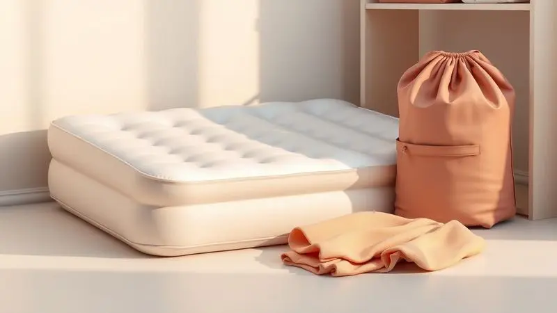

Aquela ligação inesperada: um amigo avisa que chega em poucas horas, ou a família toda decide acampar no fim de semana. De repente, você precisa de uma cama extra, e a dúvida surge: será que um colchão inflável é bom mesmo? Ele vai furar na primeira noite?

E qual marca escolher entre tantas opções? Vamos desvendar essas questões, mostrando como a tecnologia transformou esses produtos em aliados do conforto improvisado.

<SummaryList products={frontmatter.top_products} />

## Guia Completo: Colchão Inflável é Bom Mesmo? Vale a Pena?

Para entender se vale a pena, precisamos ir além da ideia de que é apenas 'ar dentro de um plástico'. Pense na sensação de liberdade: ter uma cama completa que cabe na sua mochila, pronta para qualquer situação.

O segredo está em como as diferentes tecnologias e materiais trabalham juntos para criar uma experiência que, sim, pode ser surpreendentemente confortável.

### O Que É um Colchão Inflável e Para Que Serve?

Imagine transformar qualquer cantinho da sua casa ou da natureza em um quarto completo em minutos. É isso que um colchão inflável faz.

Mais do que uma solução de emergência, ele é um convite à flexibilidade, permitindo que você receba visitas sem estresse ou acampe sem sacrificar o descanso. A magia está na portabilidade: depois do uso, ele some em um armário, liberando espaço precioso.

### Como Escolher o Colchão Inflável Ideal?

A escolha certa começa com uma pergunta simples: qual história você quer escrever com ele? Cada uso pede características diferentes, e entender isso faz toda diferença entre uma noite reparadora e um desconforto desnecessário.

#### Para Que Você Vai Usar: Camping ou Casa?

Se a aventura chama, você precisa de um companheiro leve que não pese na caminhada até o acampamento. Agora, se o objetivo é receber sua avó por alguns dias, o foco muda para a altura, o suporte lombar e a sensação de estar em uma cama 'de verdade'.

O mesmo produto tem personalidades diferentes conforme o cenário.

#### Tamanho e Capacidade de Peso Suportado

Aqui vai um segredo que evita frustrações: nunca subestime o peso. Um colchão que promete 'suporta até 200kg' pode te deixar na mão se não considerar que você, seu parceiro e os movimentos durante a noite criam uma dinâmica muito diferente.

Sempre procure modelos com margem de segurança acima do que você imagina precisar. A altura também importa: quanto mais alto, mais fácil será levantar pela manhã, sem aquela sensação de estar saindo do chão.

#### Material e Durabilidade: O que o PVC Aveludado Oferece

Toque o material. Sinta a diferença entre um plástico comum e o PVC aveludado: este último não é apenas macio, ele é estratégico. Cria uma superfície que segura o lençol no lugar, evitando aquela batalha matinal para recolocar a roupa de cama.

Mais que isso, é uma barreira inteligente contra pequenos rasgos e muito mais fácil de limpar quando a aventura deixa marcas.

#### Tipo de Inflador: Bomba Elétrica Embutida vs. Fole

Pense no seu contexto: se você tem tomada por perto, a bomba embutida é como ter um mordomo particular que prepara sua cama em 3 minutos. Um luxo de praticidade.

Já o fole é para os verdadeiros desbravadores, para quem a independência da eletricidade vale o esforço extra. Não é sobre qual é melhor, é sobre qual se encaixa no seu estilo de vida.

#### Tecnologias de Conforto: Dura-Beam e Fiber-Tech

Esses nomes técnicos escondem uma promessa simples: que você esqueça que está sobre ar.

A Dura-Beam cria camadas de suporte que imitam a sensação firme de um colchão tradicional, enquanto a Fiber-Tech usa uma rede de fibras que distribui seu peso uniformemente, sem aqueles pontos de pressão desconfortáveis.

Juntas, elas transformam uma superfície inflável em um verdadeiro refúgio para o descanso.

## Melhores Marcas de Colchão Inflável no Mercado

No universo dos colchões infláveis, algumas marcas escreveram sua história com inovação e confiabilidade. INTEX, Bestway e Coleman não são apenas nomes, são diferentes filosofias sobre como trazer conforto para situações improvisadas.

### Colchão Inflável INTEX é bom?

A INTEX praticamente reinventou o conceito de colchão inflável doméstico. Seu grande trunfo é entender que conforto temporário não precisa ser desconfortável.

Suas tecnologias como Fiber-Tech e sistemas de bomba integrada transformam a experiência de montar uma cama extra de um trabalho braçal para uma tarefa simples. É a escolha de quem quer praticidade sem abrir mão de uma boa noite de sono.

### Colchão Inflável COLEMAN é bom?

Enquanto algumas marcas focam na casa, a Coleman tem o DNA do acampamento em cada costura. Seus produtos são projetados para resistir ao que a natureza oferece: umidade, terrenos irregulares, temperaturas variáveis.

O sistema AirTight e as construções reforçadas falam diretamente com quem precisa de confiança acima de tudo. É o colchão para quem não quer preocupações quando está longe da civilização.

### Colchão Inflável NAUTIKA é bom?

A Nautika encontrou um equilíbrio interessante entre consciência ambiental e funcionalidade. Usar materiais reciclados não é apenas um discurso, é parte da proposta de valor. Seus produtos mostram que ser sustentável não significa ser frágil.

Para quem quer fazer escolhas mais conscientes sem perder em conforto e durabilidade.

### Colchão Inflável da MOR é bom?

A MOR domina o território do custo-benefício inteligente. Entende que muitas pessoas precisam de uma solução prática para situações esporádicas, sem investir fortunas.

Seus produtos com fole acoplado são um exemplo de simplicidade que funciona: tudo que você precisa vem numa embalagem só. Perfeito para quem quer estar preparado sem complicações.

Mas teoria é uma coisa. Vamos ver na prática como essas filosofias se materializam nos modelos que realmente conquistaram os usuários em 2024.

## Análise dos Melhores Colchões Infláveis de 2024

Este ano trouxe consolidação das melhores tecnologias em produtos que entendem que cada pessoa busca algo diferente. Desde o luxo da conveniência total até a simplicidade eficiente, esta seleção mostra que há um colchão inflável para cada tipo de necessidade.

### 1. Colchão Inflável Casal Dura-Beam - INTEX

<ProductBox 
  title={frontmatter.top_products[0].title} 
  image={frontmatter.top_products[0].image} 
  link={frontmatter.top_products[0].link} 
/>

Imagine deitar em uma superfície que parece um colchão tradicional, mas que em 5 minutos você consegue guardar no armário. Essa é a magia do Dura-Beam da INTEX.

A tecnologia Fiber-Tech trabalha silenciosamente sob você, criando uma base tão estável que faz esquecer que há ar dentro. A bomba embutida é o toque mestre: pressione um botão e veja sua cama nascer do nada.

A experiência é tão próxima de um colchão convencional que algumas pessoas relatam uma leve perda de ar durante a noite, algo quase imperceptível para a maioria, mas que vale mencionar para os mais sensíveis.

Para visitas em casa ou acampamentos com acesso à energia, ele redefine o que significa 'prático'.

<CaixaProsContras>

**Prós:**

- Conforto comparável ao de um colchão tradicional.

- Boa durabilidade graças à tecnologia Fiber-Tech™.

- Bomba embutida para inflar rapidamente.

- Design elevado que facilita o acesso.

**Contras:**

- Pode perder um pouco de ar durante a noite.

- Dependendo do uso, requer cuidados para evitar furos.

</CaixaProsContras>

#### Estrutura Fiber Tech para Maior Estabilidade

O que parece um simples emaranhado de fibras é na verdade uma rede inteligente que imita o suporte das molas tradicionais. Cada movimento seu encontra resistência organizada, não apenas ar se movendo de um lado para outro.

É essa estrutura que permite que duas pessoas durmam juntas sem criar um 'vale' no meio, mantendo a independência de apoio para cada corpo.

### 2. Colchão Inflável Casal com Bomba Embutida - Coleman

<ProductBox 
  title={frontmatter.top_products[1].title} 
  image={frontmatter.top_products[1].image} 
  link={frontmatter.top_products[1].link} 
/>

A Coleman traz para dentro de casa a robustez que consagrou suas barracas. Este modelo com bomba embutida é para quem quer 'pronto para usar' sem rodeios.

O sistema AirTight é um seguro contra pequenos vazamentos, enquanto o ComfortStrong cria zonas de apoio que se adaptam ao seu corpo.

O material flocado não é apenas macio, é tático: segura seus lençóis no lugar, evitando aquela bagunça matinal. Sim, modelos mais avançados existem, mas este encontra o ponto ideal entre recursos suficientes e preço acessível.

Para quem não quer pensar muito, apenas dormir bem.

<CaixaProsContras>

**Prós:**

- Bomba embutida para fácil enchimento e esvaziamento.

- Material confortável com superfície aveludada.

- Sistema AirTight® para evitar vazamentos.

- Compacto e fácil de armazenar quando desinflado.

**Contras:**

- Modelos mais avançados podem ter mais recursos.

- Alguns usuários podem achar necessário um pouco mais de suporte ao usar por períodos longos.

</CaixaProsContras>

#### Conforto e Segurança Garantidas para Casa

Ter um colchão inflável em casa não é mais sobre 'fazer do limão uma limonada'. É sobre ter uma solução elegante para imprevistos. A segurança vem dos materiais testados e da construção que respeita os limites do corpo humano.

A durabilidade não é acidental: é resultado de escolhas que priorizam sua tranquilidade a longo prazo.

### 3. Colchão Inflável Casal Star - Nautika (NTK)

<ProductBox 
  title={frontmatter.top_products[2].title} 
  image={frontmatter.top_products[2].image} 
  link={frontmatter.top_products[2].link} 
/>

A Nautika prova que ser ecológico não é inimigo do conforto. Este modelo utiliza PVC reciclado sem perder um pingo de qualidade.

A superfície aveludada tem um toque que convida ao descanso, enquanto as dimensões generosas garantem espaço para se movimentar durante a noite.

A ausência de inflador embutido pode parecer uma desvantagem, mas na verdade oferece flexibilidade: use qualquer bomba que tenha, manual ou elétrica. E atenção à capacidade de peso: verifique especificamente o modelo, pois varia entre 200kg e 300kg.

Para quem valoriza sustentabilidade sem abrir mão do desempenho.

<CaixaProsContras>

**Prós:**

- Superfície aveludada que proporciona conforto e evita deslizamento de lençóis.

- Leve e fácil de transportar.

- Fabricado com materiais sustentáveis, incluindo PVC reciclado.

- Válvula de enchimento e esvaziamento rápido.

**Contras:**

- Não acompanha inflador embutido.

- Capacidade de peso varia conforme o modelo.

</CaixaProsContras>

#### Especializado para Camping e Atividades ao Ar Livre

Quando o chão é irregular e o orvalho da madrugada chega, cada detalhe conta. Estes colchões são projetados com uma espessura que isola do frio do solo, enquanto materiais resistentes à água protegem da umidade.

A leveza não é apenas conveniência: é liberdade para caminhar mais, explorar mais, sem carregar peso desnecessário.

### 4. Colchão Multiuso Casal com Fole - Mor Life

<ProductBox 
  title={frontmatter.top_products[3].title} 
  image={frontmatter.top_products[3].image} 
  link={frontmatter.top_products[3].link} 
/>

Simplicidade que funciona. O colchão da Mor Life é aquele amigo confiável que não promete milagres, apenas entrega o combinado. O fole acoplado elimina a necessidade de qualquer acessório extra: tudo que você precisa está ali, integrado.

O kit de reparo que acompanha não é um extra, é um gesto de honestidade sobre a natureza do produto.

O material inflável tem suas limitações, sim, mas quando você entende e respeita essas fronteiras, descobre um produto surpreendentemente competente pelo preço. Para quem precisa de uma solução 'bota, tira, guarda' sem complicações.

<CaixaProsContras>

**Prós:**

- Confortável e macio ao toque

- Inflador acoplado facilita o uso

- Compacto e fácil de guardar

- Acompanha kit de reparo para pequenos consertos

**Contras:**

- Material inflável pode ser suscetível a furos

- Durabilidade inferior em comparação a colchões convencionais

</CaixaProsContras>

#### Excelente Custo-Benefício com Inflador Acoplado

Aqui a economia é dupla: no preço inicial e na praticidade diária. Não precisar comprar uma bomba separada já é uma economia, mas a verdadeira vantagem é não ter que procurar por acessórios perdidos quando surge a necessidade.

É a definição de 'pronto para emergências', embalado em um produto que não pesa no bolso.

### 5. Colchão Inflável Casal Double Flocked - Bestway

<ProductBox 
  title={frontmatter.top_products[4].title} 
  image={frontmatter.top_products[4].image} 
  link={frontmatter.top_products[4].link} 
/>

A Bestway trouxe para o mundo inflável uma experiência próxima dos colchões tradicionais. A estrutura interna que imita molas é o segredo: cria uma sensação de firmeza que muitos acham superior até a alguns colchões convencionais.

A superfície flocada tem um toque premium que surpreende quem ainda associa colchões infláveis a plástico barato.

A necessidade de uma bomba externa pode ser vista como inconveniente, mas também como liberdade: escolha o inflador que preferir, conforme sua necessidade. A perda de ar noturna é comum na categoria, mas aqui é minimizada pela construção de qualidade.

Para quem não quer sentir que está fazendo concessões ao optar por um inflável.

<CaixaProsContras>

**Prós:**

- Confortável e estável, imitando colchões tradicionais.

- Superfície flocada que impede deslizamento de lençóis.

- Fácil de inflar e desinflar rapidamente.

- Compacto e portátil quando esvaziado.

**Contras:**

- Pode perder ar com o tempo.

- Necessita de bomba para inflagem (não inclusa).

</CaixaProsContras>

#### Superfície em Vinil Flocado e Resistência

Este material é uma aula de engenharia inteligente. O flocking (aquela camada felpuda) não é apenas estética: aumenta a durabilidade da superfície, absorve pequenos impactos e cria uma barreira térmica.

A resistência à água não significa que você pode nadar nele, mas que respingos ou orvalho não vão arruinar seu descanso. Fácil de limpar com um pano úmido, mantém-se como novo com mínimo esforço.

### 6. Colchão Inflável Solteiro Deluxe Comfort - Bel

<ProductBox 
  title={frontmatter.top_products[5].title} 
  image={frontmatter.top_products[5].image} 
  link={frontmatter.top_products[5].link} 
/>

Para quem viaja sozinho ou precisa de uma cama extra individual, a Bel oferece uma proposta direta e eficiente. As dimensões são perfeitas para uma pessoa se movimentar confortavelmente, enquanto os 150kg de capacidade dão margem de segurança generosa.

O toque aveludado faz diferença na sensação ao deitar, criando um ambiente convidativo.

A garantia curta de 3 meses pede cuidado no manuseio inicial, mas o material resistente responde bem quando tratado com atenção. Para viagens de negócios, estudantes ou quem precisa de uma solução compacta sem comprometer totalmente o conforto.

<CaixaProsContras>

**Prós:**

- Versátil e prático para várias situações.

- Superfície aveludada para maior conforto.

- Leve e fácil de transportar.

- Suporta até 150 kg.

**Contras:**

- Garantia limitada de apenas 3 meses.

- Pode não ser tão resistente a danos se não for manuseado com cuidado.

</CaixaProsContras>

## Dúvidas Frequentes sobre Uso e Manutenção

As perguntas que sempre ficam depois da compra são tão importantes quanto as especificações técnicas. Vamos responder as que mais causam preocupação.

### Colchão Inflável Murcha no Frio?

Sim, e isso é física pura, não defeito. O ar se contrai com o frio, então em noites geladas seu colchão pode parecer menos cheio ao amanhecer. A solução é simples: inflar um pouco a mais antes de dormir, criando uma reserva para essa contração natural.

Um protetor ou cobertor extra não só aquecem, como ajudam a manter a temperatura mais estável dentro do colchão.

### Como Garantir que o Colchão não Fure no Camping?

O segredo está na preparação do terreno. Nunca coloque direto no chão: uma lona ou tapete específico para camping é seu melhor seguro. Ao inflar, resista à tentação de 'estourar' o colchão: a pressão excessiva tensiona as costuras.

Dentro da barraca, levante para reposicionar, nunca arraste. E tenha sempre o kit de reparo à mão: não é pessimismo, é realismo de quem conhece a natureza.

### Cuidados e Manutenção para Aumentar a Vida Útil

Trate seu colchão inflável como um investimento, não como descartável. Após o uso, limpe com um pano úmido e sabão neutro, deixe secar completamente antes de guardar. Armazene em local seco, protegido da luz direta que envelhece o material.

Verifique periodicamente por pequenos vazamentos: muitas vezes, um reparo simples feito a tempo evita problemas maiores depois.

### Diferenças Entre Colchão Inflável e Colchonete Inflável

Pense assim: o colchão é para dormir, o colchonete é para descansar rapidamente. O colchão tem estrutura interna, maior espessura e foco total no conforto noturno.

O colchonete é essencialmente uma barreira contra o frio do chão, mais fina, mais leve, para quem prioriza peso mínimo na mochila. Um não substitui o outro: são ferramentas para necessidades diferentes.

## Conclusão

Então, colchão inflável é bom mesmo? A resposta não é um simples sim ou não. É um 'depende do que você espera'.

Se você busca a praticidade mágica de ter uma cama completa que cabe em uma mochila, aceitando que não será exatamente igual ao seu colchão de casa, então sim, pode ser uma das melhores aquisições que você fará.

Os modelos atuais deixaram para trás a época do desconforto inevitável. Tecnologias como Fiber-Tech, bombas embutidas e materiais aveludados criaram uma nova geração de produtos que entendem que 'temporário' não precisa ser 'ruim'.

A chave está em escolher com inteligência: para camping, priorize leveza e resistência; para casa, foque em conforto e facilidade de uso.

O verdadeiro valor de um colchão inflável vai além do preço. Está na liberdade de receber amigos sem estresse, na aventura de acampar sem dores nas costas, na segurança de ter uma solução para imprevistos.

É sobre expandir suas possibilidades de hospitalidade e aventura, sabendo que o conforto não ficou para trás.

Escolha o modelo que conversa com sua realidade, cuide bem dele, e descubra como ar inteligentemente embalado pode transformar noites improvisadas em memórias confortáveis.

Qual será sua próxima história com um colchão inflável?