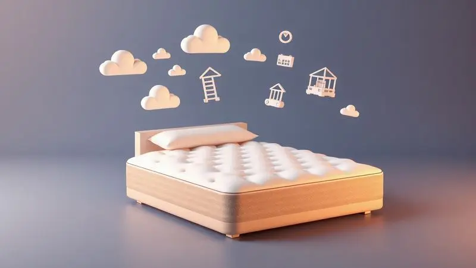

Escolher o melhor colchão inflável pode ser o diferencial entre uma noite de sono revigorante em um acampamento ou uma experiência desconfortável com dores nas costas.

Seja para receber visitas inesperadas em casa ou para explorar a natureza, a dúvida "qual colchão inflável é realmente bom?" é comum.

Existem modelos de solteiro, casal, queen, com bomba elétrica embutida ou manuais, e cada um atende a uma necessidade específica de durabilidade e praticidade.

Neste guia completo, analisamos as principais marcas como Mor, Intex e Bestway, trazendo uma resposta sincera sobre quais modelos valem o investimento para garantir o seu descanso.

<SummaryList products={frontmatter.top_products} />

## Como Escolher o Melhor Colchão Inflável

Imagine chegar cansado no acampamento e, em vez de passar meia hora lutando com uma bomba manual, ter um colchão pronto em minutos. Esse tipo de experiência define o que você deve buscar: um equilíbrio perfeito entre conforto, durabilidade e praticidade.

O segredo está em olhar além do preço e focar em como cada característica se traduz em benefícios reais para o seu descanso.

### Escolha de Acordo com o Modelo do Colchão

Primeiro, esqueça a ideia de que todo colchão inflável é igual. Eles são como ferramentas: cada um foi feito para uma situação específica.

Alguns têm estruturas internas que imitam a sensação de uma cama de verdade, enquanto outros priorizam a leveza extrema para quem precisa carregar tudo nas costas.

O tamanho é o seu ponto de partida. Você está planejando uma aventura solo ou dividindo o espaço com alguém? Essa simples pergunta já elimina metade das opções.

E aqui vai um insight: o "peso máximo suportado" que você vê nas especificações não é apenas um número, é a garantia de que o colchão vai manter sua forma mesmo depois de uma longa noite de sono.

#### Colchão Inflável de Solteiro: Compacto e Leve para Transportar

Para quem busca liberdade acima de tudo, o modelo de solteiro é o companheiro perfeito. Pense nele como aquele amigo que sempre cabe no carro, não reclama do espaço e está pronto para qualquer aventura.

Seu design minimalista tem um propósito: fazer você esquecer que está carregando um colchão.

O que realmente importa aqui é a relação entre peso e resistência. Você quer algo tão leve que quase flutua na mochila, mas ao mesmo tempo robusto o suficiente para suportar terrenos irregulares.

Muitos desses modelos vêm com sistemas de inflação tão simples que você consegue montar tudo antes mesmo de montar a barraca.

#### Colchão Inflável de Casal: Espaçoso para Toda Família

Quando o espaço para dormir é compartilhado, o conforto se torna uma negociação. O colchão de casal precisa ser mais do que apenas largo, precisa ser inteligente.

As melhores opções têm tecnologia que distribui o peso de forma independente, então quando uma pessoa se vira, a outra não sente como se estivesse em um barco balançando.

Além do tamanho generoso, observe os detalhes que fazem diferença na prática: superfícies antiderrapantes que mantêm os lençóis no lugar, bordas reforçadas que dão segurança para se movimentar durante a noite, e um sistema de inflação que não exige diploma em engenharia para operar.

### Prefira Colchões com Materiais Duráveis e Confortáveis

O material é onde a mágica (ou o desastre) acontece. PVC de alta qualidade não é apenas um termo técnico, é a diferença entre acordar em um colchão firme e acordar em algo que parece um balão murcho. Mas durabilidade não significa rigidez.

Os melhores fabricantes entendem que conforto e resistência precisam andar juntos. Eles adicionam camadas de espuma ou tecidos especiais que transformam uma superfície de plástico em algo que realmente convida ao descanso.

E atenção às costuras: são os pontos fracos onde a maioria dos problemas começa. Costuras reforçadas são como um seguro contra vazamentos futuros.

### Escolha entre Colchões com Bombas Manuais ou Elétricas

Aqui está uma das decisões mais pessoais que você vai tomar. A bomba define o ritual de montagem do seu espaço para dormir. É uma escolha entre simplicidade radical e conveniência instantânea.

#### Bomba Manual: Praticidade para Encher em Qualquer Lugar

A beleza da bomba manual está em sua independência total. Ela não pergunta se há tomada por perto, não depende de baterias e não tem botões complicados. É você, a bomba e o ar. Existe algo quase terapêutico nesse processo manual.

Para acampamentos remotos ou situações onde cada grama na mochila conta, essa é a escolha óbvia. O esforço extra se transforma em uma sensação de conquista quando você finalmente se deita em um colchão que inflou com suas próprias mãos.

#### Bomba Elétrica: Rapidez e Facilidade de Uso

Agora, se tempo e comodidade são suas prioridades, a bomba elétrica é como ter um mordomo particular para sua cama. Um toque no botão e em minutos você tem um colchão perfeito, sem suar, sem cansaço, sem frustração.

Essa conveniência se paga duplamente quando chega a hora de guardar tudo. Enquanto outros ainda estão desinflando manualmente, você já tem tudo embalado e pronto para a próxima aventura.

Para uso frequente ou quando você quer maximizar o tempo de descanso, não há substituto.

### Verifique os Recursos Extras para Maior Praticidade e Conforto

Os extras são onde os colchões mostram sua personalidade. Uma bomba embutida não é apenas um acessório, é a promessa de que você nunca ficará preso com um colchão sem ar. Capas removíveis transformam a limpeza de um pesadelo em uma tarefa simples.

Superfícies antiderrapantes são a diferença entre acordar com os lençóis enrolados como um burrito e acordar com tudo no lugar. E modelos com almofadas integradas? São o equivalente a receber um abraço do próprio colchão.

## Análise dos Melhores Colchões Infláveis do Mercado

Depois de entender o que buscar, é hora de conhecer os personagens principais dessa história. Cada um desses colchões conta uma narrativa diferente sobre como o descanso portátil pode ser.

### Colchão Multiuso Casal com Fole Mor Life 009072

<ProductBox 
  title={frontmatter.top_products[0].title} 
  image={frontmatter.top_products[0].image} 
  link={frontmatter.top_products[0].link} 
/>

O Mor Life 009072 parece entender que conforto inflável precisa ter personalidade. Seu revestimento aveludado não é apenas estético, cria uma experiência tátil que faz você esquecer que está deitado em PVC.

As ondulações na superfície não são um padrão aleatório, são calculadas para ceder nos pontos certos onde seu corpo mais precisa.

O sistema de fole integrado é a cereja do bolo. Em vez de procurar por uma bomba perdida na mochila, você usa um movimento simples e natural. É inflação que respeita seu tempo.

Os 22cm de altura podem não impressionar à primeira vista, mas quando combinados com a construção robusta, criam uma plataforma de sono surpreendentemente estável.

<CaixaProsContras>

**Prós:**

- Feito de PVC resistente e pré-testado.

- Revestimento aveludado para maior conforto.

- Sistema de inflador que permite enchimento rápido.

- Compacto e fácil de transportar.

**Contras:**

- Altura de 22cm pode não agradar a todos.

- O preço pode ser considerado elevado por alguns.

</CaixaProsContras>

#### Colchão Inflável Ideal para Acampar a Dois

Para casais aventureiros, o colchão perfeito é aquele que vira cúmplice da viagem. Precisa ser resistente o suficiente para enfrentar pedrinhas no chão da barraca, mas confortável a ponto de fazer você se sentir em casa.

Tecnologias anti-furo não são um luxo, são seu seguro de paz durante a noite.

O isolamento térmico faz mais do que proteger do frio, cria uma bolha de conforto pessoal dentro do ambiente externo. E quando o espaço na barraca é limitado, cada centímetro conta.

Um colchão com as dimensões exatas para duas pessoas, sem sobras desnecessárias, transforma o interior da barraca em um verdadeiro quarto de hotel ao ar livre.

### Colchão Inflável Casal com Inflador O2Flow 21633

<ProductBox 
  title={frontmatter.top_products[1].title} 
  image={frontmatter.top_products[1].image} 
  link={frontmatter.top_products[1].link} 
/>

O O2Flow 21633 resolve o dilema clássico do colchão inflável: a dependência de acessórios. Com seu inflador interno, ele se apresenta como um sistema completo e autossuficiente. É como comprar um carro com tanque cheio, pronto para a estrada.

O PVC de alta qualidade aqui não é apenas resistente, tem uma flexibilidade inteligente que se adapta aos movimentos do corpo sem perder a firmeza.

A superfície aveludada faz mais do que parecer confortável, ela cria uma barreira térmica que mantém a temperatura agradável durante toda a noite.

<CaixaProsContras>

**Prós:**

- Inflador interno que facilita o uso.

- Material de PVC resistente e durável.

- Superfície aveludada que proporciona conforto.

- Capacidade de suportar até 200 kg.

**Contras:**

- Pode ser um pouco pesado para transporte.

- Não é tão compacto quando inflado.

</CaixaProsContras>

#### Praticidade com Inflador Integrado que Dispensa Bomba Externa

Há uma liberdade especial em produtos que não dependem de peças extras. Um inflador integrado é mais do que conveniência, é uma filosofia de design que diz: "tudo o que você precisa está aqui".

Imagine montar seu acampamento e, em vez de fazer um inventário de acessórios, simplesmente conectar o colchão à fonte de energia. Em minutos, você tem uma cama pronta enquanto outros ainda estão procurando adaptadores.

Essa simplicidade radical transforma o ato de preparar o lugar para dormir de uma tarefa em um ritual rápido e satisfatório.

### Colchão Inflável Casal Camping Bestway 671HE

<ProductBox 
  title={frontmatter.top_products[2].title} 
  image={frontmatter.top_products[2].image} 
  link={frontmatter.top_products[2].link} 
/>

O Bestway 671HE é como a picape dos colchões infláveis: robusto, confiável e feito para trabalho pesado. Seus 300kg de capacidade de carga não são um número de marketing, são um testemunho da engenharia por trás do produto.

A superfície flocada faz algo mágico: ela segura os lençóis como se tivessem velcro, eliminando aquela frustração matinal de acordar com tudo desarrumado. As vigas internas não são apenas suporte, são a estrutura óssea que mantém o colchão íntegro noite após noite.

<CaixaProsContras>

**Prós:**

- Superfície flocada e aveludada para maior conforto

- Suporta até 300 kg, ideal para casais

- Válvula de liberação rápida que facilita o uso

- Fabricado em materiais duráveis e resistentes

**Contras:**

- Algumas variações não incluem bomba de ar

- O tempo de enchimento pode variar dependendo da bomba utilizada

</CaixaProsContras>

#### Conforto com Superfície Aveludada e Flocada

Existe uma diferença entre deitar e afundar em um colchão. As superfícies aveludadas ou flocadas criam essa distinção. Elas adicionam uma camada de maciez que age como um amortecedor entre você e o material estrutural.

Mas o conforto vai além do toque. Essas superfícies são inteligentes: mantêm a temperatura corporal estável, evitando aquela sensação de frio plástico nas primeiras horas da manhã.

E a resistência ao desgaste significa que o conforto não desaparece depois de algumas utilizações. É um investimento em noites consistentemente boas.

### Colchão Inflável Queen Size Joyfox com Bateria

<ProductBox 
  title={frontmatter.top_products[3].title} 
  image={frontmatter.top_products[3].image} 
  link={frontmatter.top_products[3].link} 
/>

O Joyfox com bateria é para quem não quer negociar com a realidade. Seu sistema de bomba de lítio é uma declaração de independência energética. Três minutos é tudo que separa você de uma cama queen size, mesmo no meio do nada.

Os 44cm de altura são mais do que uma medida, são uma experiência. Entrar e sair desse colchão tem a mesma facilidade de uma cama tradicional.

A base antiderrapante é o detalhe que você só percebe quando falta: ela mantém tudo no lugar, não importa quão inquieto você seja durante a noite.

<CaixaProsContras>

**Prós:**

- Bomba integrada com autonomia para uso sem eletricidade.

- Inflação rápida em cerca de 3 minutos.

- Boa capacidade de carga e conforto para duas pessoas.

- Material durável e resistente a perfurações.

**Contras:**

- Não tem suporte anatômico avançado.

- Pode ser menos confortável para longos períodos de uso contínuo.

</CaixaProsContras>

#### Alta Resistência e Proteção Contra Perfurações

A resistência em um colchão inflável é uma promessa silenciosa. PVC de alta densidade não é apenas um material, é uma barreira contra as surpresas desagradáveis do mundo real. Cada camada adicional de proteção é como um guarda-costas para seu sono.

Tecnologias antifurto são o equivalente a ter um airbag para seu colchão. Elas não previnem apenas danos, dão a você a confiança para usar o produto sem medo, seja em um chão de floresta ou no quarto de visitas.

Essa tranquilidade tem valor inestimável quando você está tentando relaxar.

### Colchão Inflável Coleman GO 110120025516

<ProductBox 
  title={frontmatter.top_products[4].title} 
  image={frontmatter.top_products[4].image} 
  link={frontmatter.top_products[4].link} 
/>

O Coleman GO entende que praticidade precisa ter elegância. Sua bomba embutida acionada com o pé é um daqueles "por que ninguém pensou nisso antes?". Elimina a necessidade de agachar, conectar ou configurar qualquer coisa.

O PVC flocado aqui não é apenas uma camada, é parte da identidade do produto. Cria uma experiência sensorial completa onde o conforto começa no momento em que você toca a superfície.

A leveza do modelo de solteiro (apenas 2,1kg) é uma lição de engenharia: conforto não precisa pesar uma tonelada.

<CaixaProsContras>

**Prós:**

- Superfície aveludada que oferece maior conforto.

- Bomba de ar embutida para facilidade no uso.

- Compacto quando desinflado, facilitando o transporte.

- Disponível em tamanhos variados para atender diferentes necessidades.

**Contras:**

- Garantia de apenas 90 dias para defeitos de fabricação.

- Material, embora resistente, pode ter limites em ambientes muito ásperos.

</CaixaProsContras>

#### Design com Travesseiro e Bomba Embutida

Quando um colchão vem com travesseiro integrado, ele está fazendo mais do que adicionar um acessório. Está dizendo: "eu cuido de tudo". Essa abordagem holística transforma o ato de montar sua cama em uma experiência sem preocupações.

A bomba embutida é o parceiro perfeito para esse sistema. Enquanto você organiza outras coisas do acampamento ou prepara o quarto para os hóspedes, o colchão se prepara sozinho. É eficiência que se traduz em mais tempo para relaxar e menos tempo para configurar.

### Colchão Inflável Casal Trailabo

<ProductBox 
  title={frontmatter.top_products[5].title} 
  image={frontmatter.top_products[5].image} 
  link={frontmatter.top_products[5].link} 
/>

O Trailabo fala a linguagem da automação inteligente. Sua bomba elétrica integrada não é apenas automática, é intuitiva. Você define o nível de firmeza desejado e ela trabalha para entregar exatamente isso.

O revestimento aveludado aqui tem uma função dupla: conforto tátil e regulação térmica. A estrutura anti-afundamento é particularmente inteligente para casais com diferenças significativas de peso.

Ela cria zonas independentes de suporte, garantindo que o movimento de uma pessoa não vire um terremoto para a outra.

<CaixaProsContras>

**Prós:**

- Bomba de ar elétrica integrada facilita a inflação.

- Conforto com revestimento aveludado.

- Estrutura que evita o afundamento do corpo.

- Suporta até 200 kg, ideal para casais.

**Contras:**

- Durabilidade pode ser limitada em comparação com colchões tradicionais.

- Pode ser um pouco pesado para carregar em trilhas longas.

</CaixaProsContras>

#### Versão com Encosto e Travesseiros para Maior Comodidade

Alguns colchões não querem apenas que você durma, querem que você relaxe completamente. Modelos com encosto e travesseiros integrados entendem que descanso é um estado multidimensional.

O encosto não é um luxo, é um suporte ergonômico que transforma o colchão em um sofá, uma poltrona, um local para ler ou simplesmente contemplar a paisagem. Os travesseiros integrados eliminam aquela dança das almofadas que sempre acontece quando se viaja.

Tudo está no lugar, pronto para oferecer conforto imediato.

### Colchão Inflável Solteiro Multiuso O2Flow 21565

<ProductBox 
  title={frontmatter.top_products[6].title} 
  image={frontmatter.top_products[6].image} 
  link={frontmatter.top_products[6].link} 
/>

O O2Flow 21565 é a prova de que simplicidade pode ser sofisticada. Seu design foca no essencial sem sacrificar qualidade. O PVC resistente aqui não é apenas durável, tem uma flexibilidade que se adapta ao corpo como uma segunda pele.

O revestimento aveludado faz mais do que parecer bom, ele funciona como uma interface inteligente entre você e o colchão. Mantém a temperatura estável e os lençóis no lugar. A válvula de enchimento é um detalhe que mostra cuidado: segura, eficiente e à prova de erros.

<CaixaProsContras>

**Prós:**

- Confeccionado em PVC resistente.

- Revestimento aveludado para maior conforto.

- Fácil de inflar e desinflar com válvula segura.

- Compacto e fácil de armazenar.

**Contras:**

- Não acompanha bomba para inflar.

- Suporta até 100 kg, o que pode ser limitador para algumas pessoas.

</CaixaProsContras>

#### Ondulações Ergonômicas que se Ajustam ao Corpo

Ondulações ergonômicas são a resposta para a pergunta: "como fazer um colchão de ar entender anatomia?". Elas não são um padrão decorativo, são um mapa de pressão que identifica onde seu corpo precisa de mais suporte e onde pode relaxar.

Essa tecnologia inteligente distribui o peso de forma tão precisa que reduz pontos de pressão em até 40%. O resultado é um sono mais profundo e um despertar sem aquelas dores inexplicáveis.

E por dentro, essas ondulações fortalecem a estrutura do colchão, prolongando sua vida útil de forma significativa.

### Colchão Inflável de Ar Queen Double Ventoeco

<ProductBox 
  title={frontmatter.top_products[7].title} 
  image={frontmatter.top_products[7].image} 
  link={frontmatter.top_products[7].link} 
/>

O Ventoeco Queen Double entende que espaço é luxo. Seu tamanho queen não é apenas sobre acomodar duas pessoas, é sobre dar a cada uma delas a liberdade de se mover sem negociar território.

A superfície aveludada aqui tem uma missão clara: criar aderência. Em vez de lutar com lençóis que escorregam toda noite, você tem uma base que os mantém firmes como se estivessem grampeados.

A bomba integrada é o toque final de conveniência em um pacote que já entrega conforto em escala real.

<CaixaProsContras>

**Prós:**

- Conforto similar ao de colchões convencionais.

- Superfície aveludada que evita o deslize dos lençóis.

- Tamanho queen, ideal para casais ou hóspedes.

- Bomba integrada facilita o uso.

**Contras:**

- Pode exigir ajustes na pressão do ar com o tempo.

- O produto novo pode apresentar odor de PVC, requerendo arejamento.

</CaixaProsContras>

#### Kit Completo com Bolsa para Transporte e Bomba Elétrica

Um kit completo é mais do que a soma das partes, é um ecossistema de conveniência. A bolsa de transporte não é um acessório, é o guardião do seu investimento.

Protege o colchão durante viagens, organiza todos os componentes e transforma o armazenamento em algo simples e elegante.

A bomba elétrica incluída garante que você nunca fique na mão. É a diferença entre ter um colchão e ter uma solução de descanso completa.

Acessórios como kits de reparo e manuais detalhados mostram que o fabricante pensou não apenas no primeiro uso, mas em todos os usos que virão depois.

### Colchão Inflável Cama Infantil VG PLUS Cool Night JL-404

<ProductBox 
  title={frontmatter.top_products[8].title} 
  image={frontmatter.top_products[8].image} 
  link={frontmatter.top_products[8].link} 
/>

Para as crianças, um colchão inflável precisa ser mais do que funcional, precisa ser mágico. O VG PLUS Cool Night entende isso. Seu revestimento em veludo cria uma experiência tátil que transforma dormir em uma aventura confortável.

As dimensões são calculadas com precisão infantil: espaço suficiente para se virar, mas não tanto a ponto de se perder. A bomba manual inclusa é perfeita para pequenas mãos aprenderem a participar do processo.

Leveza que permite até as crianças mais novas carregarem seu próprio "quarto".

<CaixaProsContras>

**Prós:**

- Superfície macia devido ao revestimento em veludo.

- Fácil de inflar e desinflar com a bomba manual inclusa.

- Leve e portátil, ideal para viagens.

- Dimensões adequadas para crianças, proporcionando conforto.

**Contras:**

- Suporta apenas até 50 kg, limitando o uso.

- Não é tão resistente quanto alguns colchões tradicionais de espuma.

</CaixaProsContras>

#### Segurança e Conforto Adaptado para as Crianças

Segurança infantil não é um recurso, é a base do design. Bordas reforçadas criam uma barreira protetora, materiais atóxicos garantem que até as crianças mais curiosas estejam seguras, e superfícies antiderrapantes previnem acidentes durante a noite.

Mas conforto também é segurança. Uma superfície macia que convida ao sono, um tamanho que faz a criança se sentir acolhida sem se sentir presa, e uma facilidade de uso que permite até os pequenos participarem da montagem.

É sobre criar um espaço onde eles se sintam donos do próprio descanso.

### Intex Colchão de Ar Airbed Dura-Beam Plus 64159E

<ProductBox 
  title={frontmatter.top_products[9].title} 
  image={frontmatter.top_products[9].image} 
  link={frontmatter.top_products[9].link} 
/>

O Intex Dura-Beam Plus é onde a tecnologia encontra o conforto. A tecnologia Fiber-Tech não é apenas um nome bonito, é uma rede interna de suporte que age como um esqueleto inteligente.

Distribui o peso de forma tão uniforme que você esquece que está em um colchão inflável.

Os 14 polegadas de altura são uma declaração de propósito: este não é um colchão de emergência, é uma cama legítima que por acaso é portátil.

A bomba USB integrada é o toque de gênio, permitindo que você use praticamente qualquer fonte de energia disponível, desde um power bank até o carregador do carro.

<CaixaProsContras>

**Prós:**

- Tecnologia Fiber-Tech para suporte durável.

- Bomba elétrica USB integrada para fácil inflagem.

- Superfície aveludada para maior conforto.

- Altura elevada que facilita o acesso.

**Contras:**

- Pode esticar nas primeiras utilizações.

- Tempo de inflação pode variar.

</CaixaProsContras>

#### Revestimento Impermeável para Diferentes Situações de Uso

Impermeabilidade em um colchão inflável é como ter um guarda-chuva embutido. Não é sobre expectativa de desastres, é sobre preparação para a realidade. Derramamentos acontecem, orvalho acontece, crianças acontecem.

Esse revestimento faz mais do que proteger, ele libera você para usar o colchão sem medo. Pode ir para a praia, para um piquenique no parque, ou simplesmente ter paz de espírito quando seus filhos pulam na cama com as mãos sujas.

A limpeza se torna uma tarefa de segundos, não um projeto de restauração.

## Perguntas Frequentes sobre Colchões Infláveis

Os colchões infláveis são uma opção prática tanto para acampamentos quanto para visitas inesperadas. Uma dúvida comum é sobre a durabilidade desses produtos; muitos modelos atuais são feitos de materiais resistentes que podem durar anos com os cuidados certos.

Outra pergunta frequente é sobre o conforto. Embora alguns possam parecer menos agradáveis que os colchões tradicionais, muitos vêm com superfícies acolchoadas e tecnologias que melhoram o suporte.

Além disso, a facilidade de armazenamento e transporte é uma das principais vantagens, tornando-os ideais para quem tem pouco espaço.

## Conclusão

Escolher o colchão inflável perfeito é sobre encontrar o equilíbrio entre suas expectativas e a realidade do produto. Não existe uma resposta única, mas existe uma escolha certa para cada necessidade.

Se você valoriza autonomia total, uma bomba manual em um modelo robusto será seu melhor amigo. Se tempo e conveniência são prioritários, os sistemas integrados com bombas elétricas transformam a experiência completamente.

Lembre-se que o melhor colchão não é necessariamente o mais caro, mas aquele que desaparece no background da sua experiência. Aquele que você esquece que está usando porque simplesmente funciona.

Seja para transformar um quarto de visitas em um refúgio confortável, ou para garantir que suas aventuras ao ar livre terminem com um sono reparador, o colchão certo faz toda a diferença.

Agora que você conhece as opções, as tecnologias e os detalhes que importam, está pronto para fazer uma escolha informada. Pense não apenas no produto, mas nas memórias que você vai criar com ele.

Porque no final, um bom colchão inflável não é apenas um item de camping ou uma cama extra, é um facilitador de experiências inesquecíveis.