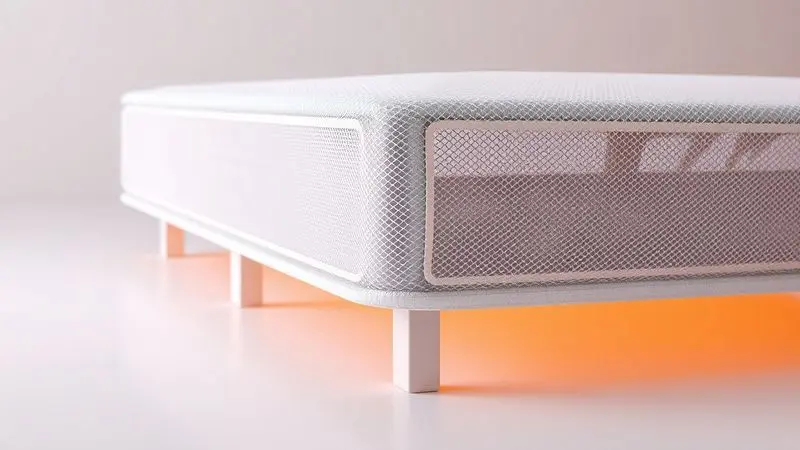

A busca pelo colchão ideal ou pelo móvel perfeito para a sala de estar frequentemente nos leva a lojas como a Casa do Conforto.

Com uma vasta gama de produtos que vai desde os renomados colchões Herval e Kappesberg até sofás e acessórios ergonômicos, surge a dúvida inevitável: os produtos da Casa do Conforto são realmente bons e a loja é confiável?

Neste artigo, realizamos uma análise profunda do portfólio da marca, explorando não apenas especificações técnicas, mas como essas tecnologias se traduzem em noites de sono reparadoras e dias mais confortáveis.

Descubra se o investimento vale a pena para transformar seu descanso e seu lar.

<SummaryList products={frontmatter.top_products} />

## A Casa do Conforto e a Qualidade de seu Portfólio

O que realmente diferencia a Casa do Conforto não é apenas a variedade de produtos, mas como cada item é pensado para ir além do básico.

Imagine encontrar soluções que não apenas preenchem espaço no seu quarto ou sala, mas que genuinamente melhoram sua qualidade de vida.

É isso que a marca busca oferecer: desde colchões que utilizam espumas memory foam que abraçam seus contornos corporais até móveis que equilibram estética e funcionalidade de forma inteligente.

A reputação da empresa não vem de slogans vazios, mas de avaliações consistentemente positivas de consumidores que encontraram nesses produtos o equilíbrio perfeito entre conforto duradouro e design prático.

## Colchão Herval Imperatore Eco Bamboo: Luxo e Tecnologia Eco-Friendly

<ProductBox 
  title={frontmatter.top_products[0].title} 
  image={frontmatter.top_products[0].image} 
  link={frontmatter.top_products[0].link} 
/>

Se você busca o ponto onde sustentabilidade encontra conforto de alto padrão, o Imperatore Eco Bamboo é aquele colchão que faz sentido em todos os aspectos.

Pense em acordar após uma noite de sono perfeito, com seu corpo perfeitamente apoiado por uma combinação de molas ensacadas individualmente e espuma viscoelástica que se adapta como uma segunda pele.

Agora adicione a essa experiência um revestimento em fibras de bambu que não apenas é macio ao toque, mas que trabalha silenciosamente durante a noite para regular sua temperatura e criar uma barreira natural contra bactérias e fungos.

O sistema de pillow top é como a cereja do bolo: uma camada extra de suavidade que faz você sentir que está dormindo em nuvens, mesmo com o suporte robusto necessário (até 120 kg por pessoa).

Para casais, a combinação é especialmente interessante, pois enquanto um se move, o outro praticamente não percebe. E a melhor parte? Esse luxo não exige manutenção complicada.

A tecnologia "No Turn, One-Side" significa que você só precisa girá-lo periodicamente, sem aquela luta semestral para virar um colchão pesado.

<CaixaProsContras>

**Prós:**

- Sistema de molas ensacadas reduz a transferência de movimento.

- Espuma viscoelástica melhora a circulação e conforto.

- Revestimento em fibras de bambu proporciona textura agradável e propriedades antibacterianas.

- Tecnologia "No Turn" facilita a manutenção.

**Contras:**

- O preço pode ser elevado comparado a modelos básicos.

- A altura pode ser um desafio para algumas camas ou bases.

</CaixaProsContras>

### Tecnologia de Molas Ensacadas e Espuma Viscoelástica D33

Vamos entender melhor o que torna essa experiência possível. As molas ensacadas funcionam como pequenos suportes independentes: cada uma responde apenas ao peso exatamente sobre ela. O resultado prático?

Quando seu parceiro se vira na cama às 3h da manhã, você continua imerso no seu sono, sem aqueles solavancos que parecem mini-terremotos.

Já a espuma viscoelástica D33 é a verdadeira mágica do conforto: ela não apenas cede sob seu peso, mas se molda exatamente aos seus contornos, aliviando pontos de pressão nos ombros, quadris e costas que normalmente causam aquela sensação de rigidez matinal.

Juntas, essas tecnologias criam um ecossistema de descanso onde seu corpo encontra o apoio exato de que precisa, permitindo que seus músculos realmente relaxem durante a noite.

## Colchão Herval Toronto: Conforto e Firmeza com Molas Pocket

<ProductBox 
  title={frontmatter.top_products[1].title} 
  image={frontmatter.top_products[1].image} 
  link={frontmatter.top_products[1].link} 
/>

Se o Imperatore oferece luxo sustentável, o Toronto apresenta uma abordagem diferente: firmeza inteligente que não sacrifica o conforto.

Aqui, as molas pocket ensacadas individualmente são a estrela principal, criando uma base de suporte tão personalizada que parece ter sido feita sob medida para sua espinha dorsal.

Para casais, essa tecnologia se traduz em uma experiência noturna mais harmoniosa: cada um tem seu "território" de conforto que responde independentemente, minimizando aquela sensação de balanço compartilhado.

O Pillow Top Europeu adiciona um toque de sofisticação: é como ter um edredom incorporado ao colchão, oferecendo aquela camada inicial de maciez antes que a firmeza estrutural entre em ação.

E enquanto você desfruta desse conforto, o revestimento em tecido Jacquard ou Malha trabalha nos bastidores com tratamentos antiácaro e antifungo, criando um ambiente mais saudável para suas noites de descanso.

<CaixaProsContras>

**Prós:**

- Molas pocket proporcionam conforto e redução da transferência de movimento.

- Pillow Top aumenta a suavidade e conforto ao dormir.

- Revestimento com tratamento antiácaro e antifungo.

- Certificações de qualidade garantem um bom investimento.

**Contras:**

- Modelo "One Side" pode não agradar quem prefere colchões com duas faces.

- Pode ser um pouco mais firme do que alguns usuários preferem.

</CaixaProsContras>

### Estrutura Polyframe e Lateral Ultrassom 3D

Por trás dessa experiência de firmeza confortável está uma engenharia inteligente.

A estrutura Polyframe atua como um esqueleto adicional que dá ao colchão uma estabilidade excepcional, distribuindo o peso de forma tão uniforme que previne aquelas depressões laterais que aparecem após alguns anos de uso.

Enquanto isso, a lateral Ultrassom 3D funciona como o sistema respiratório do colchão: pequenos orifícios estrategicamente posicionados permitem que o ar circule livremente, dissipando o calor corporal e a umidade que se acumulam durante a noite.

O resultado é um colchão que não apenas mantém sua forma ao longo do tempo, mas também oferece uma sensação de frescor que transforma noites abafadas em momentos de descanso realmente revigorantes.

## Colchão Herval Toledo: Conforto Intermediário Macio

<ProductBox 
  title={frontmatter.top_products[2].title} 
  image={frontmatter.top_products[2].image} 
  link={frontmatter.top_products[2].link} 
/>

Para quem busca o ponto ideal entre afundar em nuvens e ter apoio suficiente, o Toledo apresenta um conceito fascinante: o conforto intermediário macio.

Imagine deitar-se em uma superfície que inicialmente acolhe seu corpo com suavidade, mas que revela uma camada de suporte consistente conforme você se acomoda.

É essa dualidade que torna esse modelo tão especial para quem não se encaixa nos extremos "muito firme" ou "muito macio".

O sistema de molas ensacadas continua presente, garantindo que cada movimento noturno seja isolado em sua própria zona, enquanto o Pillow Top One Side oferece aquele abraço inicial que faz toda a diferença nos primeiros minutos após deitar.

Mas o verdadeiro diferencial está nos detalhes: a tecnologia Ultrassom 3D nas laterais age como um sistema de climatização passivo, renovando constantemente o ar interno do colchão, enquanto a EcoEspuma®, feita de materiais reciclados, proporciona uma sustentação uniforme que desafia o tempo.

<CaixaProsContras>

**Prós:**

- Conforto intermediário que equilibra maciez e suporte.

- Sistema de molas ensacadas que reduz a movimentação.

- Camada Pillow Top para um toque extra de conforto.

- Tecnologia Ultrassom 3D que melhora a ventilação.

**Contras:**

- Suporte de peso limitado a 90 kg por pessoa.

- Pode não ser ideal para quem busca um colchão muito firme.

</CaixaProsContras>

## Colchão Kappesberg Inverno & Verão: Conforto em Todas as Estações

<ProductBox 
  title={frontmatter.top_products[3].title} 
  image={frontmatter.top_products[3].image} 
  link={frontmatter.top_products[3].link} 
/>

Algumas soluções são tão inteligentes que nos perguntamos: "Por que ninguém pensou nisso antes?" O Kappesberg Inverno & Verão é exatamente isso.

Em vez de lutar contra as estações, ele as abraça com um design "double face" que transforma a mudança de clima em uma oportunidade para renovar seu conforto. No inverno, você simplesmente vira para o lado com tecidos mais quentes e aconchegantes.

No verão, gira para o lado fresco que parece respirar junto com você.

As molas ensacadas individualmente garantem que, independente da estação, o suporte permaneça impecável, enquanto o pillow top duplo adiciona uma generosidade de conforto que faz você querer passar mais tempo na cama.

A densidade D28 da espuma oferece um equilíbrio cuidadoso: suporte suficiente para alinhar sua coluna, mas flexibilidade para acomodar seus pontos de pressão. É como ter dois colchões em um, sem precisar trocar de lugar ou fazer investimentos extras.

<CaixaProsContras>

**Prós:**

- Design "double face" para conforto em todas as estações.

- Molas ensacadas que oferecem bom suporte e diminuem a transferência de movimento.

- Pillow top duplo que proporciona uma camada extra de conforto.

- Proteções contra ácaros e fungos em alguns modelos.

**Contras:**

- A densidade D28 pode não ser suficiente para quem prefere um suporte mais firme.

- Pode ser considerado um pouco volumoso, dificultando a movimentação ao arrumar a cama.

</CaixaProsContras>

## Colchão Ortobom Airtech: Excelência e Suporte em Molas Ensacadas

<ProductBox 
  title={frontmatter.top_products[4].title} 
  image={frontmatter.top_products[4].image} 
  link={frontmatter.top_products[4].link} 
/>

Quando o assunto é suporte ortopédico sem sacrificar o conforto inicial, o Airtech da Ortobom estabelece um padrão notável.

A primeira impressão é de maciez convidativa, mas conforme seu corpo se acomoda, revela-se uma estrutura firme que trabalha ativamente para alinhar sua coluna.

As molas ensacadas individualmente funcionam como uma rede de suportes personalizados: cada uma responde exatamente à pressão que recebe, criando uma superfície que parece entender as necessidades específicas de cada parte do seu corpo.

O sistema Ortopillow e a espuma D26 trabalham em harmonia para oferecer performance consistente noite após noite, enquanto o tecido de malha com tratamento antialérgico cria uma barreira invisível contra agentes que poderiam comprometer sua qualidade de sono.

E para completar, a tecnologia "No Turn" elimina uma das tarefas mais tediosas da manutenção doméstica, permitindo que você dedique esse tempo extra ao que realmente importa: descansar.

<CaixaProsContras>

**Prós:**

- Estrutura de molas ensacadas garante bom suporte e conforto.

- Tecnologia hipoalergênica contribui para melhores noites de sono.

- Não requer viradas frequentes devido à tecnologia "No Turn".

- Disponível em diferentes tamanhos para atender diversas necessidades.

**Contras:**

- Suporte de peso pode não ser suficiente para todos os usuários.

- Pode ser considerado firme demais para quem prefere colchões mais macios.

</CaixaProsContras>

## Colchão Castor Silver Star Air: Tecnologia Aria 3D e Durabilidade

<ProductBox 
  title={frontmatter.top_products[5].title} 
  image={frontmatter.top_products[5].image} 
  link={frontmatter.top_products[5].link} 
/>

Para quem já acordou com aquela sensação de calor abafado ou umidade desagradável, o Silver Star Air apresenta uma solução engenhosa.

A tecnologia Aria 3D não é apenas um nome bonito: é um sistema de ventilação ativa que funciona como um climatizador integrado, mantendo a temperatura e umidade em níveis ideais durante toda a noite.

Imagine dormir em um ambiente que parece sempre ter sido recém-arejado, não importa a estação do ano.

O sistema Pocket System complementa essa experiência com molas ensacadas que oferecem não apenas suporte, mas uma resistência projetada para durar.

A opção entre versões "One Face" e "Double Face" dá a você o controle sobre como deseja estender a vida útil do produto, enquanto a certificação Pró-Espuma (INER) funciona como um selo de garantia de que cada componente atende a rigorosos padrões de qualidade.

<CaixaProsContras>

**Prós:**

- Tecnologia Aria 3D para ventilação e conforto.

- Sistema Pocket System para maior suporte e durabilidade.

- Versões One Face e Double Face para flexibilidade de uso.

- Certificação Pró-Espuma que comprova a qualidade do produto.

**Contras:**

- Pode ser considerado mais pesado devido ao uso de tecnologia avançada.

- A versão One Face limita o uso a um lado, podendo não agradar quem prefere colchões que podem ser virados.

</CaixaProsContras>

## Colchão King Koil Smooth: Maciez Sofisticada com Suporte de Látex Natural

<ProductBox 
  title={frontmatter.top_products[6].title} 
  image={frontmatter.top_products[6].image} 
  link={frontmatter.top_products[6].link} 
/>

Há colchões que prometem conforto, e há aqueles que realmente entregam uma experiência sensorial diferenciada. O King Koil Smooth pertence à segunda categoria.

Ao deitar-se, você é recebido por uma combinação de molas ensacadas com reforço no terço central (especialmente projetado para a área lombar) e camadas de conforto que incluem espuma Ultrasoft e Látex Natural.

Este último não é apenas um material premium: é um regulador natural de temperatura que mantém o frescor mesmo nas noites mais quentes.

Classificado como "Extra Macio", este modelo é para quem busca o tipo de acolhimento que faz esquecer as preocupações do dia.

O látex natural adapta-se aos seus contornos com uma precisão quase orgânica, enquanto as molas garantem que essa maciez não se transforme em falta de suporte. É a escolha ideal para quem prioriza o conforto absoluto, mas sem abrir mão da saúde postural.

<CaixaProsContras>

**Prós:**

- Conforto excepcional com materiais de alta qualidade.

- Suporte adequado com tecnologia de molas ensacadas.

- Ventilação aprimorada devido ao uso de látex natural.

- Reconhecimento mundial pela durabilidade e tradição da marca.

**Contras:**

- Pode ser considerado muito macio para quem prefere firmeza.

- Garantia limitada a 12 meses.

</CaixaProsContras>

## Colchão Herval Scotland: Robustez com Molas Maxspring

<ProductBox 
  title={frontmatter.top_products[7].title} 
  image={frontmatter.top_products[7].image} 
  link={frontmatter.top_products[7].link} 
/>

Algumas pessoas não procuram apenas conforto: buscam a solidez que transmite segurança durante o sono. Para esses perfis, o Scotland com molas Maxspring oferece exatamente isso: uma base firme e consistente que não cede diante do tempo ou do uso.

As molas contínuas criam uma superfície uniforme que distribui o peso de forma equilibrada, enquanto as camadas de Ecoespuma atuam como um amortecedor inteligente que prolonga a vida útil do colchão sem comprometer a firmeza característica.

As versões com Pillow Top adicionam um toque de generosidade à experiência, oferecendo uma camada inicial de conforto antes que a firmeza estrutural se revele.

E enquanto você desfruta desse suporte robusto, o tecido malha de alta elasticidade com tratamento antiácaro e antifungo trabalha nos bastidores para criar um ambiente mais saudável. É a escolha para quem valoriza sensação de estabilidade acima de tudo.

<CaixaProsContras>

**Prós:**

- Estrutura robusta com molas contínuas que garantem suporte uniforme.

- Camadas de espuma que aumentam a durabilidade e conforto.

- Tecido malha com tratamento antiácaro para um sono higiênico.

- Opção com Pillow Top para maior conforto na superfície.

**Contras:**

- Nível de firmeza pode ser excessivo para quem prefere colchões mais macios.

- Limitações de peso variam entre as versões, podendo não atender todos os usuários.

</CaixaProsContras>

## Colchão Herval Meditare: Sustentabilidade com EcoSpuma

<ProductBox 
  title={frontmatter.top_products[8].title} 
  image={frontmatter.top_products[8].image} 
  link={frontmatter.top_products[8].link} 
/>

Cada vez mais, buscamos produtos que não apenas nos servem, mas que refletem nossos valores. O Meditare EcoSpuma atende exatamente a essa necessidade dupla: oferece conforto de qualidade enquanto incorpora uma filosofia sustentável.

A espuma EcoSpuma® utiliza cerca de 90% de materiais reaproveitados, mas não pense que isso significa comprometer a performance. Pelo contrário: a alta densidade resultante garante sustentação uniforme e durabilidade que desafia o tempo.

As molas ensacadas continuam presentes, garantindo o isolamento de movimento tão apreciado por casais, enquanto o Pillow Top e o design "one side" criam uma experiência de uso simplificada.

O conforto é classificado como intermediário, criando um equilíbrio cuidadoso que agrada uma ampla gama de perfis. É o tipo de investimento que faz sentido tanto para seu descanso quanto para sua consciência ambiental.

<CaixaProsContras>

**Prós:**

- Conforto intermediário ideal para diferentes perfis.

- Tecnologia de molas que reduz a transferência de movimento.

- Sustentabilidade com espuma EcoSpuma®.

- Estrutura reforçada que aumenta a durabilidade.

**Contras:**

- Preço pode ser mais alto em relação a outros modelos.

- Necessidade de girar periodicamente para manter a forma.

</CaixaProsContras>

## Sofá Herval Aspen: Sofisticação para Ambientes Amplos

<ProductBox 
  title={frontmatter.top_products[9].title} 
  image={frontmatter.top_products[9].image} 
  link={frontmatter.top_products[9].link} 
/>

Mudando do quarto para a sala, o Sofá Aspen da Herval demonstra como a mesma atenção ao detalhe se aplica aos móveis. Este não é apenas um lugar para sentar: é um convite ao relaxamento inteligente.

A estrutura em madeira maciça não é apenas uma escolha estética: é a garantia de que anos de uso não resultarão em folgas ou rangidos desagradáveis. O assento retrátil e encosto reclinável transformam momentos comuns em experiências de conforto personalizadas.

Imagine assistir a um filme com a possibilidade de ajustar cada ângulo conforme sua necessidade do momento, ou simplesmente relaxar após um dia intenso com apoio lombar perfeito.

Os detalhes práticos, como o carregador USB embutido, mostram como o design contemporâneo pode ser funcional, enquanto a variedade de acabamentos (incluindo linho e veludo) permite que o móvel dialogue perfeitamente com sua decoração existente.

<CaixaProsContras>

**Prós:**

- Estrutura robusta em madeira maciça.

- Assento retrátil e encosto reclinável.

- Disponível em diversos acabamentos.

- Design contemporâneo com opções práticas.

**Contras:**

- Preço pode ser elevado em comparação a modelos básicos.

- Tamanho grande pode não ser adequado para ambientes pequenos.

</CaixaProsContras>

## Travesseiro Antirrefluxo Fibrasca: Alívio e Proteção Avançada

<ProductBox 
  title={frontmatter.top_products[10].title} 
  image={frontmatter.top_products[10].image} 
  link={frontmatter.top_products[10].link} 
/>

Para quem convive com refluxo gastroesofágico, a noite pode se transformar em uma batalha silenciosa. O travesseiro antirrefluxo da Fibrasca propõe uma trégua inteligente através de um design angulado que eleva sutilmente a cabeça e o tronco.

Não se trata apenas de inclinação: é sobre criar um ângulo anatômico que trabalha com a gravidade para minimizar os sintomas enquanto você dorme.

A espuma de alta densidade oferece o suporte firme necessário para manter essa posição terapêutica durante toda a noite, enquanto alguns modelos adicionam uma curvatura que proporciona um leve efeito massageador.

As capas em malha jacquard ou microfibra não são apenas bonitas: são funcionais, com zíperes para fácil remoção e, em muitos casos, tratamento impermeável que facilita a limpeza.

É uma solução que entende que conforto e saúde não são conceitos separados, mas complementares.

<CaixaProsContras>

**Prós:**

- Design angulado que ajuda a aliviar o refluxo.

- Conforto proporcionado por espuma de alta densidade.

- Capas fáceis de higienizar com opções impermeáveis.

- Efeito massageador em alguns modelos, aumentando o conforto.

**Contras:**

- A altura pode não ser ideal para todos os usuários.

- O suporte firme pode não agradar quem prefere travesseiros mais macios.

</CaixaProsContras>

## Cama Box Baú: Praticidade e Organização para o Quarto

<ProductBox 
  title={frontmatter.top_products[11].title} 
  image={frontmatter.top_products[11].image} 
  link={frontmatter.top_products[11].link} 
/>

Em ambientes onde cada centímetro conta, a cama box baú revela-se uma aliada estratégica.

Imagine transformar o espaço sob seu colchão em um compartimento organizado para guardar aqueles itens sazonais que ocupam armários inteiros: edredons de inverno, cobertores extras, roupas de cama reserva.

Ao levantar a parte superior com o sistema de amortecedores a gás, você acessa não apenas armazenamento, mas a possibilidade de manter seu quarto visualmente limpo e funcional.

Disponível em diversos tamanhos, essa solução adapta-se a diferentes necessidades espaciais, enquanto seu design moderno integra-se harmoniosamente a vários estilos de decoração.

A estrutura robusta garante que essa praticidade não comprometa a durabilidade, criando um móvel que serve a múltiplas funções sem parecer sobrecarregado. É para quem entende que organização inteligente é uma forma de criar serenidade no ambiente.

<CaixaProsContras>

**Prós:**

- Ótima otimização de espaço.

- Ajuda na organização do quarto.

- Design moderno que combina com diversos estilos.

- Estrutura robusta e durável.

**Contras:**

- Pode ocupar mais espaço no quarto.

- Mecanismo de elevação pode apresentar desgaste ao longo do tempo.

</CaixaProsContras>

## Conclusão

Ao percorrer este universo de produtos da Casa do Conforto, fica claro que a marca vai além de simplesmente vender colchões e móveis: ela oferece soluções pensadas para transformar a experiência do descanso e do convívio doméstico.

Cada produto analisado demonstra um cuidado meticuloso em equilibrar tecnologias avançadas com benefícios emocionais reais - não se trata apenas de densidade de espuma ou tipo de mola, mas de como essas especificações se traduzem em noites de sono mais reparadoras, dias com menos dores e ambientes que realmente funcionam para sua rotina.

A variedade impressiona não pela quantidade, mas pela intencionalidade: há opções para quem busca firmeza ortopédica, maciez acolhedora, sustentabilidade consciente ou simplesmente praticidade inteligente.

Os preços refletem essa qualidade, posicionando-se como investimentos em bem-estar a médio e longo prazo.

Se você valoriza produtos que compreendem que conforto é uma ciência e uma arte simultaneamente, explorar o portfólio da Casa do Conforto pode ser o primeiro passo para transformar sua relação com o descanso e com seu lar.

A decisão final, é claro, depende de suas necessidades específicas, mas uma coisa é certa: aqui, cada detalhe foi pensado para fazer diferença na sua qualidade de vida.