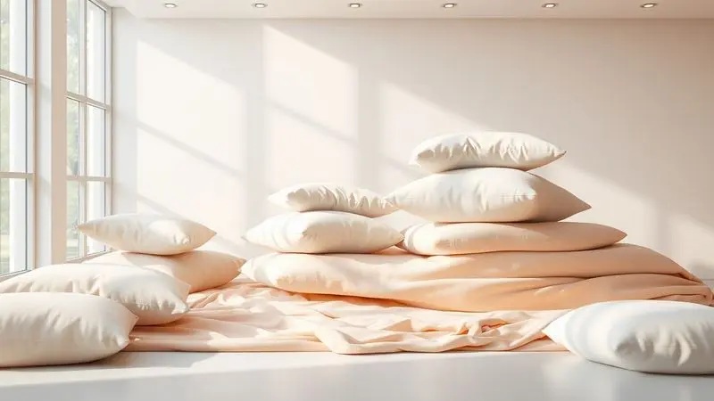
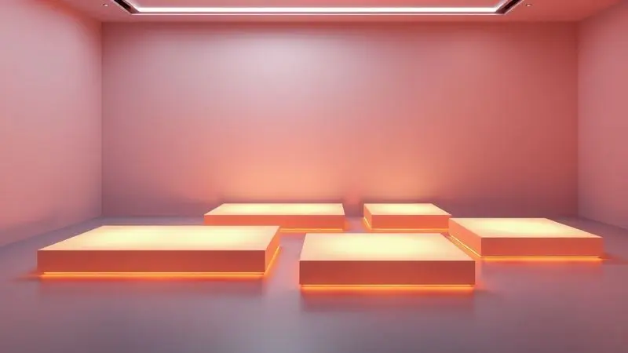

Escolher um novo colchão vai muito além de uma simples compra, é uma decisão que define a qualidade das suas próximas milhares de noites.

Se você está se perguntando "Colchão King House é bom?", saiba que essa dúvida compartilhada por tantos brasileiros tem uma resposta que merece ser explorada em detalhes.

Com um portfólio que vai desde as clássicas molas ensacadas até tecnologias magnéticas, a marca se apresenta como um universo de possibilidades para quem busca o equilíbrio perfeito entre conforto e suporte.

Vamos decifrar juntos o que faz desta marca uma escolha tão popular e, mais importante, descobrir se algum desses modelos tem seu nome escrito nele.

<SummaryList products={frontmatter.top_products} />

## Como saber se o colchão King House é bom?

A verdade sobre um bom colchão não está apenas nas especificações técnicas, mas na forma como ele dialoga com seu corpo e seu estilo de vida. Para avaliar se um King House é para você, comece escutando seu próprio organismo. Sente dores ao acordar?

Acorda cansado mesmo depois de horas na cama? Essas são pistas que o material do colchão, seja espuma, mola ou látex, precisa atender. Mas não pare por aí: mergulhe nas avaliações de quem já deitou naquele modelo que você está de olho.

São essas experiências reais que revelam se a promessa de conforto se sustenta no dia a dia. A garantia oferecida pela marca é outro termômetro importante, ela fala sobre a confiança que a King House deposita na durabilidade de seus produtos.

E se tiver a oportunidade, nada substitui o teste físico. Sentir a firmeza, perceber como o colchão recebe seu peso, é uma conversa silenciosa entre seu corpo e o produto que nenhuma descrição online pode substituir.

## Análise dos Principais Modelos de Colchão King House

O verdadeiro teste de um colchão acontece quando fechamos os olhos. Para ajudar nessa descoberta, vamos explorar os modelos que fazem a King House ser tão comentada, entendendo não apenas o que eles têm, mas como cada tecnologia se traduz na prática do seu sono.

### Colchão King House Lagras (Molas Ensacadas)

<ProductBox 
  title={frontmatter.top_products[0].title} 
  image={frontmatter.top_products[0].image} 
  link={frontmatter.top_products[0].link} 
/>

Imagine deitar em uma superfície que parece entender exatamente onde seu corpo precisa de mais apoio. É essa sensação que o Lagras oferece com suas molas ensacadas individualmente.

Cada movimento seu é absorvido sem ecoar para o outro lado da cama, criando um universo particular de descanso mesmo quando dividimos o espaço.

Os 28 cm de altura abrigam uma camada de espuma D26 que trabalha silenciosamente para manter sua coluna alinhada, enquanto o pillow top extra macio recebe você como um abraço aconchegante.

Disponível em várias medidas e suportando entre 110 kg e 120 kg por pessoa, ele é um convite ao sono reparador, ainda que alguns possam desejar uma garantia mais extensa como prova adicional de sua durabilidade.

<CaixaProsContras>

**Prós:**

- Molas ensacadas que reduzem a transferência de movimento.

- Boa adaptação ao corpo, proporcionando conforto.

- Espuma D26 que alinha a coluna e alivia dores.

- Várias opções de medidas para diferentes necessidades.

**Contras:**

- Garantia poderia ser mais extensa.

- Não é a opção mais econômica do mercado.

</CaixaProsContras>

### Colchão King House Sheffield (Molas Ensacadas)

<ProductBox 
  title={frontmatter.top_products[1].title} 
  image={frontmatter.top_products[1].image} 
  link={frontmatter.top_products[1].link} 
/>

Para quem busca a harmonia perfeita entre suporte e aconchego, o Sheffield apresenta uma proposta interessante.

Suas molas ensacadas individualmente funcionam como uma rede de apoio personalizada, contornando seus quadris e ombros sem transferir cada movimento para o parceiro.

A espuma D28 atua como uma segunda pele que se adapta, oferecendo aquele suporte que parece feito sob medida. Visualmente, seu design moderno não passa despercebido, integrando-se a ambientes que valorizam estética e conforto.

É importante considerar que, com suporte para até 120 kg por pessoa, ele estabelece um limite claro, mas para quem está dentro dessa faixa, o investimento se transforma em noites de sono que realmente reparam as energias.

<CaixaProsContras>

**Prós:**

- Molas ensacadas reduzem a transferência de movimento.

- Espuma D28 oferece bom suporte e conforto.

- Design moderno que se adapta a diferentes ambientes.

- Disponível em várias dimensões para atender diferentes necessidades.

**Contras:**

- Suporta até 120 kg por pessoa, podendo ser uma limitação para alguns.

- A instalação e montagem não estão inclusas no preço.

</CaixaProsContras>

### Colchão King House San Diego (Espuma D33)

<ProductBox 
  title={frontmatter.top_products[2].title} 
  image={frontmatter.top_products[2].image} 
  link={frontmatter.top_products[2].link} 
/>

Às vezes, o que buscamos não é apenas maciez, mas a certeza de um suporte que não cede. O San Diego responde a essa necessidade com sua espuma de alta densidade D33, que oferece firmeza sem sacrificar o conforto.

Pense em deitar em uma superfície que distribui seu peso de forma uniforme, alinhando a coluna quase que por instinto. Com aproximadamente 29 cm de altura e revestimento em tecido Granitê, ele une elegância visual à sensação tátil de suavidade.

O puff top é a cereja do bolo, adicionando aquela camada extra de aconchego que faz você suspirar ao deitar.

Para quem dorme em diferentes posições e pesa até 120 kg, ele é um aliado do descanso profundo, ainda que aqueles que preferem superfícies extremamente firmes possam sentir falta de uma opção mais rígida.

<CaixaProsContras>

**Prós:**

- Excelente suporte e alinhamento da coluna.

- Conforto macio com adaptação ao corpo.

- Design elegante que combina com diversos estilos.

- Garantia de 1 ano nas espumas.

**Contras:**

- Pode não atender a quem prefere colchões mais firmes.

- Altura pode ser um ponto a considerar em camas baixas.

</CaixaProsContras>

### Colchão King House Alpine (Molas Ensacadas)

<ProductBox 
  title={frontmatter.top_products[3].title} 
  image={frontmatter.top_products[3].image} 
  link={frontmatter.top_products[3].link} 
/>

Se seu conceito de sono perfeito envolve afundar suavemente em um abraço aconchegante, o Alpine pode ser seu encontro marcado.

Suas molas ensacadas trabalham em conjunto com uma camada de espuma que oferece uma maciez quase acolhedora, diminuindo a pressão em pontos sensíveis como ombros e quadris.

O tecido jacquard bordado completa a experiência com sua respirabilidade, garantindo que o conforto não seja comprometido pelo calor.

É importante notar, porém, que para aqueles com sensibilidades alérgicas específicas, a ausência de certificação hipoalergênica pode ser um fator decisivo.

Para os demais, ele se apresenta como uma opção que equilibra durabilidade com aquele conforto que convida a dormir até um pouco mais.

<CaixaProsContras>

**Prós:**

- Molas ensacadas oferecem bom suporte e isolamento de movimento.

- Conforto macio devido à camada de espuma soft.

- Tecido respirável que contribui para uma melhor experiência de sono.

- Disponível em vários tamanhos e dimensões.

**Contras:**

- Não é considerado um produto hipoalergênico.

- Pode não atender quem prefere colchões mais firmes.

</CaixaProsContras>

### Colchão King House New Moon (Molas Ensacadas)

<ProductBox 
  title={frontmatter.top_products[4].title} 
  image={frontmatter.top_products[4].image} 
  link={frontmatter.top_products[4].link} 
/>

Há colchões que parecem entender que sono de qualidade é investimento, não gasto. O New Moon se enquadra nessa categoria com suas molas ensacadas que criam uma barreira silenciosa entre os movimentos noturnos dos parceiros.

A densidade D26 da espuma encontra o ponto ideal entre firmeza e maciez, enquanto o Pillow Top integrado (em alguns modelos) funciona como um convite extra ao relaxamento.

Sim, o preço pode fazer você pensar duas vezes, mas quando colocado na balança contra a perspectiva de acordar renovado dia após dia, ele se revela como um compromisso com seu próprio bem-estar, especialmente para quem valoriza designs modernos e medidas que vão até o king size.

<CaixaProsContras>

**Prós:**

- Molas ensacadas que reduzem a transferência de movimento.

- Espuma D26 que oferece bom suporte e conforto.

- Design moderno e elegante.

- Disponível em várias medidas, incluindo opções King Size.

**Contras:**

- O preço pode ser elevado em comparação a colchões convencionais.

- Algumas pessoas podem preferir colchões mais firmes.

</CaixaProsContras>

### Colchão King House Sirius (Molas Ensacadas)

<ProductBox 
  title={frontmatter.top_products[5].title} 
  image={frontmatter.top_products[5].image} 
  link={frontmatter.top_products[5].link} 
/>

O Sirius parece ter sido projetado para quem não aceita meio-termo quando o assunto é descanso. Com 201 molas por metro quadrado, cada uma ensacada individualmente, ele oferece um suporte tão preciso que parece mapear seu corpo.

A espuma D28 trabalha em conjunto para manter a coluna alinhada, enquanto sua altura variável (de 27 cm a 71 cm) se adapta a diferentes preferências e camas.

Seu apelo eco-friendly agrega valores que vão além do conforto, e a garantia de 1 ano para molas e espumas oferece aquela tranquilidade adicional na hora da decisão.

Apenas mantenha expectativas realistas quanto à alegação de ser hipoalergênico, pois essa característica pode variar.

<CaixaProsContras>

**Prós:**

- Conforto excepcional devido às molas ensacadas.

- Suporte adequado para diferentes biotipos.

- Design moderno que combina com diversos estilos de quarto.

- Garantia que oferece mais segurança na aquisição.

**Contras:**

- Pode não ser ideal para quem busca um colchão mais firme.

- A afirmação sobre ser hipoalergênico não é totalmente confirmada.

</CaixaProsContras>

### Colchão King House Venice (Molas Ensacadas)

<ProductBox 
  title={frontmatter.top_products[6].title} 
  image={frontmatter.top_products[6].image} 
  link={frontmatter.top_products[6].link} 
/>

Às vezes, menos é mais, e o Venice prova isso com seus 22 cm de altura que concentram tecnologia e conforto.

Sua combinação de espuma D26 com molas ensacadas cria um ambiente onde a transferência de movimento é mínima, permitindo que cada um no casal tenha seu espaço de descanso particular.

O alívio nas áreas de pressão (quadris e ombros) não é acidental, mas resultado de um design pensado para quem convive com dores. Suporte para até 120 kg por pessoa e certificação INMETRO são selos de segurança e qualidade que ajudam a justificar o investimento.

Sim, o preço pode ser uma consideração, mas quando medido contra a perspectiva de noites realmente reparadoras, ele ganha outra dimensão.

<CaixaProsContras>

**Prós:**

- Conforto excepcional com molas ensacadas

- Redução na transferência de movimento

- Alívio de dores nas articulações

- Certificado pelo INMETRO

**Contras:**

- Pode ter um preço mais elevado

- Disponibilidade limitada de cores para o colchão

</CaixaProsContras>

### Colchão King House Toronto (Molas Ensacadas)

<ProductBox 
  title={frontmatter.top_products[7].title} 
  image={frontmatter.top_products[7].image} 
  link={frontmatter.top_products[7].link} 
/>

Precisão é a palavra que define o Toronto. Com 201 molas ensacadas por metro quadrado, ele se adapta ao seu corpo como uma luva, minimizando a transferência de movimento de forma tão eficaz que você quase esquece que há alguém ao seu lado.

A espuma D26 trabalha em sintonia para garantir o alinhamento da coluna, enquanto as medidas variáveis (do solteiro ao king size) garantem que você encontrará o tamanho ideal.

É verdade que ele não oferece personalização em termos de firmeza, mas cumpre com excelência sua promessa principal: proporcionar conforto e bem-estar que se renovam a cada noite.

<CaixaProsContras>

**Prós:**

- Adaptação individual ao corpo graças às molas ensacadas.

- Minimiza a transferência de movimento entre parceiros.

- Boa durabilidade com a espuma D26.

- Disponível em várias medidas e formatos.

**Contras:**

- Sem opções de personalização em firmeza.

- O preço pode ser um pouco elevado para alguns orçamentos.

</CaixaProsContras>

Agora que você já conhece os personagens principais do portfólio King House, surge uma pergunta natural: qual tecnologia realmente combina com seu jeito de dormir? Vamos além dos modelos específicos e exploramos as categorias que definem essas experiências.

## Qual é o melhor tipo de colchão para dormir?

Essa pergunta tem uma resposta tão pessoal quanto sua impressão digital. O "melhor" colchão é aquele que conversa com suas preferências de firmeza, se adapta ao seu corpo e respeita sua forma de dormir.

Enquanto alguns se encontram na adaptabilidade da espuma viscoelástica e do látex, outros descobrem seu lugar no suporte estruturado das molas. A verdade está no diálogo entre o que você precisa e o que cada tecnologia oferece.

### Colchão de molas ensacadas: equilíbrio entre firmeza e conforto

Imagine um sistema de apoio onde cada ponto do seu corpo recebe atenção individual. É assim que funcionam as molas ensacadas, envoltas separadamente, elas respondem à sua pressão sem comprometer o lado ao lado.

Esse equilíbrio entre firmeza e conforto não é casual: é resultado de uma tecnologia que mantém sua coluna alinhada enquanto isola seus movimentos dos do parceiro.

Para casais com ritmos de sono diferentes ou para quem simplesmente valoriza a liberdade de se mexer sem consequências, essa opção se revela como um investimento em harmonia noturna e durabilidade.

### Colchão de espuma: sensação de aconchego para as suas noites de sono

Há algo de quase maternal na forma como um colchão de espuma recebe seu corpo. Ele se molda, contorna, abraça, aliviando pontos de pressão que você nem sabia que existiam.

Essa capacidade de adaptação garante o alinhamento da coluna quase por osmose, independentemente da posição que você escolher durante a noite.

Seja dormindo de lado, com os joelhos levemente flexionados, ou de costas, em total entrega, a espuma oferece aquele aconchego que transforma o dormir em um ritual de renovação. Para quem prioriza a sensação de ser envolvido pelo descanso, essa pode ser a chave.

### Colchões magnéticos: tecnologia e conforto

E se seu colchão pudesse fazer mais do que apenas oferecer uma superfície confortável? É essa proposta que os colchões magnéticos trazem, unindo a física dos campos magnéticos ao bem-estar do sono.

A magnetoterapia integrada promete não apenas aliviar dores e melhorar a circulação, mas criar um ambiente de equilíbrio que favorece o relaxamento profundo.

Combinada com materiais que priorizam ventilação e durabilidade, essa tecnologia se apresenta como uma opção para quem busca inovação que vá além do convencional, transformando as horas de descanso em uma experiência terapêutica.

Mas conhecer a tecnologia é apenas metade do caminho. A outra metade envolve uma decisão bem mais prática: o tamanho. Assim como um sapato muito apertado ou muito folgado, um colchão na medida errada pode comprometer toda a experiência.

## Guia de Tamanhos: Do Solteiro ao King Size

Escolher o tamanho do colchão é como encontrar o par de sapatos perfeito, precisa caber no espaço, mas principalmente precisa caber no seu conceito de conforto.

Das opções mais compactas às mais generosas, cada medida atende a uma necessidade específica de espaço, convivência e liberdade de movimento.

### Qual é o maior tamanho: king ou queen?

Quando o espaço permite sonhar grande, a dúvida entre king e queen surge naturalmente. O king oferece 193 cm de largura por 203 cm de comprimento, enquanto o queen apresenta 158 cm de largura por 198 cm de comprimento.

A diferença de 35 cm de largura pode parecer um detalhe no papel, mas na cama se transforma em território valioso, especialmente para casais que valorizam espaço pessoal ou para quem tem o hábito de se movimentar bastante durante o sono.

Se seu quarto abraça a generosidade, o king é o convite para esticar os braços sem encontrar limites.

### Qual o tamanho da cama de solteiro?

A cama de solteiro é a prova de que conforto não precisa de exageros. Com suas medidas padrão de 0,90 cm de largura por 1,90 cm de comprimento, ela se encaixa perfeitamente em quartos que precisam de praticidade sem abrir mão do descanso de qualidade.

É o espaço ideal para uma pessoa dormir, se virar e encontrar sua posição favorita.

Para quem busca um pouco mais de folga, existem as versões extra-largas (1,00 cm de largura) que mantêm a essência compacta enquanto oferecem aqueles centímetros extras que fazem toda a diferença na madrugada.

### Qual a diferença entre cama de solteiro e cama de viúva?

Às vezes, a linha entre "suficiente" e "confortável" é medida em centímetros.

A cama de solteiro tradicional (88 cm de largura) atende perfeitamente ao básico, enquanto a cama de viúva (1 metro de largura) oferece aquela margem extra que transforma o dormir em uma experiência mais generosa.

Mais do que números, essa diferença representa a possibilidade de ter um espaço pessoal ampliado sem ocupar o território de uma cama de casal.

Para quem dorme sozinho mas gosta de liberdade, ou para casais que preferem proximidade com opção de distanciamento, a viúva apresenta uma solução inteligente.

### Qual a medida da cama para viúva?

A cama viúva parece ter sido criada para quem recusa a ideia de que conforto é luxo desnecessário. Com 1,20 metros de largura por 1,90 metros de comprimento, ela ocupa um lugar interessante entre o solteiro tradicional e as opções de casal.

É a escolha perfeita para quartos de hóspedes que desejam receber bem, para quem vive sozinho mas gosta de espaço para esticar, ou para qualquer situação onde "um pouco mais" faz toda a diferença.

Sua versatilidade de encaixe em ambientes menores é apenas um dos seus trunfos.

### Qual é a maior cama de casal?

Quando o assunto é maximizar o conforto a dois, o título de maior cama de casal pertence ao King Size (193 cm de largura por 203 cm de comprimento).

Essa medida não é apenas sobre espaço físico, mas sobre a liberdade de criar territórios individuais dentro de um território compartilhado.

Existem variações como a King Size Americana e Europeia, mas o princípio permanece: oferecer amplitude suficiente para que o sono de um não seja ditado pelos movimentos do outro.

Para quartos que comportam essa generosidade, é a declaração definitiva de que conforto não conhece limites.

### Como escolher o tamanho ideal de cama?

Essa decisão começa com uma fita métrica na mão e uma pergunta na cabeça: "Como eu realmente durmo?" Meça o espaço disponível no quarto, mas também meça seus hábitos noturnos. Você se mexe muito? Prefere proximidade ou espaço pessoal? Dorme sozinho ou a dois?

Para casais, as opções queen ou king oferecem o equilíbrio entre convivência e individualidade. Para solteiros, o solteiro ou viúva atendem perfeitamente.

O truque está em enxergar além das dimensões e visualizar como seu corpo vai habitar aquele espaço noite após noite.

## Conclusão

Ao final dessa jornada pelos colchões King House, uma coisa fica clara: a pergunta "é bom?" só encontra resposta quando cruzada com outra pergunta: "bom para quem?"

Cada modelo que analisamos, do Lagras ao Toronto, do Sheffield ao Sirius, conta uma história diferente sobre conforto, suporte e tecnologia. As molas ensacadas falam da liberdade de se mover sem consequências.

As espumas de alta densidade contam sobre abraços que sustentam. Os tamanhos variáveis são capítulos sobre como ocupamos nosso espaço de descanso.

A King House se apresenta não como uma marca com uma única resposta, mas como um catálogo de possibilidades onde diferentes corpos, diferentes formas de dormir e diferentes necessidades podem encontrar seu lugar.

Seja você quem prioriza o isolamento de movimento, quem busca o alinhamento perfeito da coluna ou quem simplesmente deseja afundar em aconchego depois de um dia longo, há um diálogo possível.

O investimento em um colchão é, no fundo, um investimento em você mesmo, nas suas próximas milhares de noites, na qualidade do seu despertar, na energia que você terá para enfrentar os dias.

A King House oferece opções que tentam honrar essa responsabilidade, com tecnologias que traduzem especificações técnicas em experiências reais de descanso.

Agora, com todas essas informações em mãos, o próximo passo é seu: escute seu corpo, visualize suas noites, e permita-se encontrar o colchão que não apenas cabe no seu quarto, mas principalmente, no seu conceito de sono perfeito.

Por que escolher a King House? Porque ela entende que dormir bem não é luxo, é necessidade, e oferece múltiplos caminhos para chegar lá.