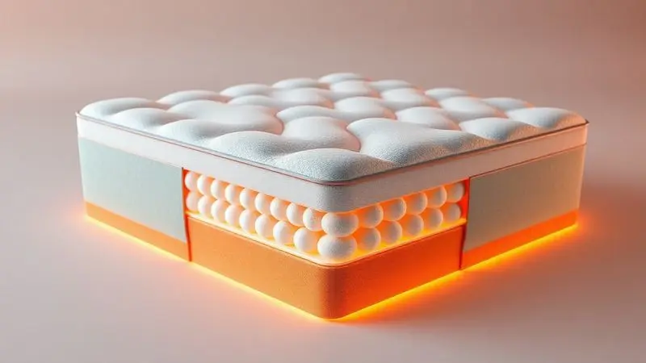

Escolher um colchão novo é uma decisão que vai muito além do simples conforto - é um investimento na sua saúde e na qualidade das suas noites. Quando você acorda renovado, o dia inteiro ganha outro ritmo.

É por isso que os colchões com tecnologia de bambu têm chamado tanta atenção no Brasil, prometendo um equilíbrio entre suporte avançado e frescor natural.

Mas será que o Colchão Casal Molas Ensacadas Bamboo da BF Colchões realmente entrega essa experiência transformadora? Vamos além das especificações técnicas para descobrir como ele se comporta no seu dia a dia - ou melhor, na sua noite a noite.

<SummaryList products={frontmatter.top_products} />

## Tecnologias de conforto e os benefícios do Bamboo

Imagine um sistema de suporte que parece conhecer cada curva do seu corpo, adaptando-se perfeitamente ao seu peso e posição.

É assim que funcionam as molas ensacadas individualmente: cada uma trabalha de forma independente, garantindo que seu movimento não perturbe quem está ao lado. Para casais, isso significa finalmente dormir em paz, mesmo quando um é mais agitado que o outro.

Agora, combine isso com a sensação de deitar-se sobre um tecido que respira com você. O bambu não é apenas uma fibra natural - é um regulador térmico inteligente.

Nos dias mais quentes, ele dissipa o calor e a umidade, evitando aquela sensação pegajosa que te faz revirar na cama. Nos mais frios, mantém um aconchego suave.

E aqui está o que realmente importa: suas propriedades antimicrobianas naturais criam um ambiente hostil para ácaros e outros alérgenos. Se você acorda com espirros ou coceira nos olhos, essa pode ser a mudança que estava esperando.

## Análise do Colchão Casal Molas Ensacadas Bamboo BF Colchões

<ProductBox 
  title={frontmatter.top_products[0].title} 
  image={frontmatter.top_products[0].image} 
  link={frontmatter.top_products[0].link} 
/>

Com todas essas tecnologias em mente, como elas se materializam no produto real? O Colchão Casal Molas Ensacadas Bamboo da BF Colchões chega com a missão de traduzir conceitos avançados em noites de sono concretas.

Suas medidas - 138 cm de largura por 188 cm de comprimento - oferecem espaço generoso para dois, enquanto os 21 cm de altura garantem presença visual sem ser excessiva.

O que você vai sentir ao deitar pela primeira vez? Primeiro, a acomodação inteligente das molas ensacadas, que cedem exatamente onde seu corpo pressiona, mantendo o alinhamento da coluna. Depois, a suavidade fresca do tecido de bambu contra a pele.

É uma experiência que equilibra firmeza e acolhimento de maneira notável.

<CaixaProsContras>

**Prós:**

- Sistema de molas ensacadas para menor transferência de movimento.

- Revestimento em fibras de bambu, que proporciona frescor e conforto.

- Certificações de qualidade reconhecidas.

- Boa durabilidade com materiais resistentes.

**Contras:**

- Suporte máximo pode ser insuficiente para pessoas mais pesadas.

- Pode não ser a melhor escolha para quem prefere colchões mais firmes.

</CaixaProsContras>

### Descrição detalhada do produto e especificações

Vamos nos aprofundar na construção deste colchão para entender exatamente no que você está investindo. O núcleo é composto por centenas de molas ensacadas individualmente, cada uma protegida por um tecido resistente que evita atrito e ruído.

Essa não é apenas uma questão de conforto - é sobre durabilidade. Enquanto colchões com molas tradicionais podem começar a ceder após alguns anos, este sistema mantém sua integridade por muito mais tempo.

Sobre essa base tecnológica, repousa a camada de conforto em tecido de bambu.

Com 21 cm de altura total, o colchão apresenta uma densidade equilibrada: firme o suficiente para oferecer suporte adequado à coluna, mas com a maciez necessária para pontos de pressão como ombros e quadris.

E aqui está um detalhe crucial: ele é projetado para suportar até 100 kg por pessoa. Se você ou seu parceiro têm constituição mais robusta, essa especificação ajuda a entender se este é o produto ideal para suas necessidades.

## O que diferencia esta tecnologia no mercado

Diante de tantas opções disponíveis, por que escolher especificamente um colchão com essa combinação de tecnologias? A resposta está na experiência integrada.

Muitos produtos oferecem ou o sistema de molas ensacadas ou o revestimento especial, mas raramente os dois trabalhando em harmonia.

Pense na sua rotina: após um dia cansativo, você merece mais do que apenas uma superfície para deitar. Merece um ambiente que respeite suas particularidades físicas e suas sensibilidades.

As molas ensacadas cuidam da biomecânica - do alinhamento que previne dores nas costas e no pescoço. O bambu cuida do ambiente - da qualidade do ar que você respira enquanto dorme e da temperatura que regula seu conforto térmico.

<CaixaProsContras>

**Prós:**

- Sistema de molas ensacadas para maior isolamento de movimento.

- Fibras de bambu que oferecem conforto térmico e propriedades bactericidas.

- Tecido Jacquard Italiano que garante durabilidade e resistência.

- Certificações de qualidade que atestam a segurança do produto.

**Contras:**

- Nível de conforto intermediário pode não ser ideal para todos.

- Suporta até 100 kg por pessoa, limitando usuários mais pesados.

</CaixaProsContras>

## Avaliações do produto e opinião de compradores

A teoria é convincente, mas o que dizem as pessoas que realmente dormem sobre este colchão todas as noites? As avaliações revelam padrões interessantes que vão além das expectativas técnicas.

Muitos compradores destacam uma melhoria gradual na qualidade do sono. Não é apenas sobre "dormir bem" - é sobre acordar com mais energia, com menos dores musculares, especialmente para quem passa o dia sentado ou em pé.

Casais relatam a diferença que o isolamento de movimento faz na dinâmica noturna: finalmente conseguem horários de sono diferentes sem perturbar um ao outro.

O aspecto térmico também recebe elogios consistentes. Em regiões mais quentes do Brasil, a sensação de frescor é frequentemente mencionada como um divisor de águas.

E para quem sofre com alergias, a redução nos sintomas após a troca para este colchão aparece como um benefício quase terapêutico.

Mas as avaliações também trazem realismo. Alguns usuários que preferem colchões extremamente macios ou extremamente firmes notam que o nível intermediário pode exigir um período de adaptação.

E aqueles com peso acima de 100 kg geralmente recomendam considerar modelos com especificações mais robustas.

## Conclusão

Escolher um colchão é escolher como você vai recarregar suas energias para enfrentar cada novo dia. O Colchão Casal Molas Ensacadas Bamboo da BF Colchões não é apenas um produto, mas uma proposta de bem-estar noturno que une tecnologia inteligente e materiais naturais.

Se você busca um equilíbrio entre suporte anatômico e conforto respirável, se valoriza noites de sono sem interrupções mesmo dividindo a cama, e se procura uma solução que respeite suas sensibilidades alérgicas, este colchão merece sua consideração séria.

Ele fala uma linguagem que vai além das especificações técnicas: fala de renovação, de intimidade preservada, de manhãs mais leves.

O investimento em um bom sono é o único que você faz todos os dias e colhe os benefícios todos os dias. Antes de decidir, imagine-se daqui a seis meses: acordando mais disposto, com menos dores, aproveitando cada noite como um verdadeiro ritual de autocuidado.

Essa pode ser a sua nova realidade a partir da próxima vez que se deitar.