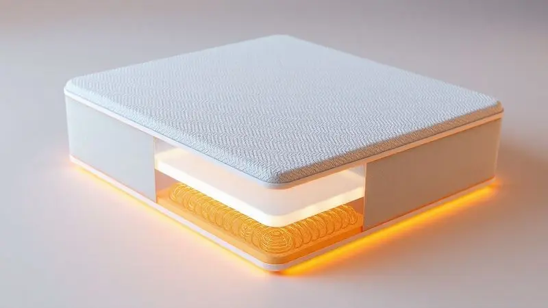

A busca por uma noite de sono reparadora começa pela escolha do colchão ideal, e o Conjunto Master Spring da Ortobom aparece como uma das opções mais robustas do mercado brasileiro. Mas será que esse modelo realmente atende às expectativas de conforto e durabilidade?

Com um sistema de molas diferenciado e certificações rigorosas, o Master Spring promete transformar o seu descanso.

Imagine acordar sem dores nas costas, sentir que seu corpo está realmente sustentado, e não apenas acomodado. O Conjunto Master Spring foi pensado para entregar essa experiência.

Sua estrutura de molas de fios contínuos entrelaçados oferece um suporte progressivo, que se adapta ao seu peso, garantindo um descanso mais profundo.

A espuma firme de alta performance complementa essa sustentação, enquanto o revestimento em malha 100% poliéster traz um toque suave e aumenta a durabilidade.

Uma das características mais práticas é o sistema No Turn. Você não precisa virar o colchão, apenas inverter sua posição, simplificando a manutenção. Com 25 cm de altura e design elegante, ele se destaca visualmente no quarto.

Porém, essa altura pode ser um ponto de atenção para quem prefere colchões mais baixos.

<CaixaProsContras>

**Prós:**

- Estrutura robusta com molas de alta qualidade.

- Espuma firme que garante boa sustentação.

- Tecido resistente e agradável ao toque.

- Sistema No Turn que facilita a manutenção.

**Contras:**

- Altura considerável que pode não agradar a todos.

- Necessidade de inverter as posições de uso com frequência.

</CaixaProsContras>

#<SummaryList products={frontmatter.top_products} />

## Tecnologias do Produto

O que diferencia o Conjunto Master Spring são as tecnologias pensadas para o conforto real, não apenas para especificações técnicas. As springs pocket, molas individualmente ensacadas, são o grande destaque.

Elas permitem que o colchão se adapte melhor ao seu corpo, como se fosse feito especialmente para você. Mais importante, elas reduzem drasticamente a transferência de movimento.

Se você dorme com alguém, não vai sentir quando seu parceiro se move ou levanta, mantendo a privacidade e continuidade do seu sono.

O sistema de ventilação é outra inteligência incorporada. Ele promove uma circulação de ar constante, ajudando a manter a temperatura ideal durante toda a noite. Você não ficará aquecendo nem sentirá aquela sensação de abafamento que compromete o descanso.

### Inmetro: Certificação de Qualidade

Quando você investe em um colchão, quer certeza de que está comprando algo seguro e duradouro. A certificação do Inmetro traz essa tranquilidade. Para o Conjunto Master Spring, isso significa que ele passou por testes rigorosos de segurança, conforto e durabilidade.

Você pode dormir com a confiança de que o produto não apenas cumpre padrões técnicos, mas também foi avaliado para garantir sua saúde e bem-estar. É como um selo de aprovação que facilita sua decisão, eliminando dúvidas sobre qualidade.

## Vídeos do produto

Para entender como o Master Spring realmente funciona no dia a dia, os vídeos do produto são aliados indispensáveis. Eles mostram detalhes que fotos não captam, como a qualidade dos materiais, a flexibilidade das molas e o conforto na prática.

Depoimentos de usuários que já experimentaram o colchão trazem relatos honestos sobre como ele se comporta após meses de uso.

Alguns vídeos também fazem comparações com outros modelos da Ortobom, ajudando você a visualizar claramente as diferenças e benefícios específicos.

Assistir a esses conteúdos é como fazer uma visita guiada ao produto antes da compra, esclarecendo dúvidas que podem surgir apenas na teoria.

## Protetor de Colchão Ortobom: Um complemento essencial

Se você já decidiu investir no Master Spring, pensar na sua preservação é um passo natural. O Protetor de Colchão Ortobom funciona como um guardião da sua higiene e durabilidade. Ele protege contra ácaros, fungos e bactérias, mantendo o ambiente de dormir saudável.

Além disso, é fácil de lavar e ajusta-se bem ao colchão, evitando deslizamentos que podem interromper seu sono. É um investimento simples que prolonga a vida do seu colchão e traz mais tranquilidade para suas noites.

## Saia Babado para Base Sommier: Elegância com praticidade

A estética do seu quarto também merece atenção, e a saia babado para base sommier é a solução para quem busca unir funcionalidade com estilo.

Com design charmoso e disponível em diversas cores, ela não apenas esconde a base do colchão, mas também contribui para criar um visual harmonioso e organizado. O material utilizado geralmente é de fácil manutenção, tornando a limpeza uma tarefa simples.

Se você quer um quarto que seja tanto confortável quanto bonito, essa saia é o detalhe que completa o cenário.

## Base Sommier Cori White: O fundamento do seu conforto

A Base Sommier Cori White é mais que uma simples estrutura, ela é o fundamento que potencializa o conforto do seu colchão. Com design elegante e estrutura robusta, ela oferece a base ideal para diferentes tipos de colchões, incluindo o Master Spring.

Sua altura e firmeza ajudam a prolongar a vida útil do colchão, distribuindo o peso adequadamente. É versátil, combinando com diversos estilos de decoração, e fácil de limpar.

Se você valoriza estilo e funcionalidade em um único produto, a Cori White é a escolha que completa o conjunto de descanso.

## Conclusão

O Conjunto Colchão Master Spring da Ortobom representa uma proposta sólida para quem busca conforto genuíno e durabilidade.

Suas tecnologias, como as springs pocket e o sistema de ventilação, são pensadas para traduzir especificações técnicas em benefícios emocionais concretos: privacidade no sono com parceiro, temperatura equilibrada e adaptação personalizada ao seu corpo.

A certificação Inmetro oferece a segurança de que você está investindo em um produto testado e aprovado.

Complementado pelo Protetor de Colchão, pela Saia Babado e pela Base Sommier Cori White, você cria um ecossistema de descanso completo, onde cada elemento trabalha para sua saúde, estética e tranquilidade.

A decisão final depende das suas preferências pessoais, especialmente sobre a altura do colchão, mas para quem valoriza estrutura robusta, conforto adaptativo e facilidade de manutenção, o Master Spring se apresenta como uma opção que pode verdadeiramente transformar suas noites.

Agora é hora de considerar não apenas um colchão, mas um investimento no seu bem-estar diário.