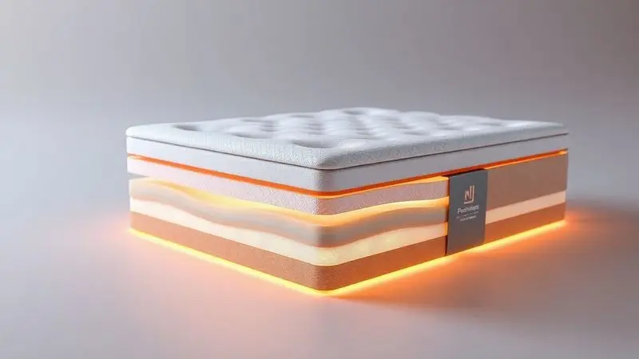
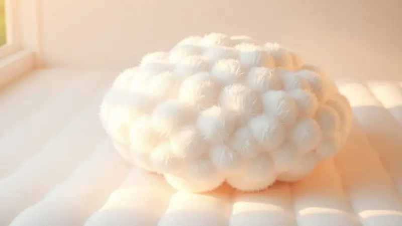

Escolher o colchão ideal é um passo decisivo para garantir a saúde da coluna e a qualidade do sono, especialmente para quem dorme acompanhado.

O colchão de casal com molas ensacadas e pillow top tornou-se o favorito do mercado brasileiro por combinar duas tecnologias essenciais: a individualidade das molas, que não transmitem movimento para o parceiro, e a camada extra de conforto superior que proporciona aquela sensação de "hotel cinco estrelas".

Mas com tantas opções de densidade, marcas e tamanhos, como saber qual é o melhor para o seu perfil? Neste guia, analisamos as opções mais bem avaliadas para ajudar você a decidir se o investimento realmente vale a pena.

<SummaryList products={frontmatter.top_products} />

## O Que Considerar ao Escolher um Colchão de Casal?

Imagine que você está investindo em um companheiro que vai acompanhar suas noites por anos. O primeiro critério é a firmeza. Você busca um suporte firme para a coluna ou aquele abraço macio que parece um nuvem? Cada corpo tem sua preferência.

O material define como esse companheiro responde a você. As molas ensacadas, por exemplo, conversam diretamente com seu corpo, ajustando-se a cada movimento sem perturbar quem está ao lado.

O tamanho precisa ser uma extensão natural do seu espaço de descanso, permitindo que você se movimente livremente durante o sono. E a durabilidade?

É a garantia que esse companheiro não vai desistir de você após poucos anos, oferecendo um descanso consistente no longo prazo.

## Molas Ensacadas vs. Molas Bonnel: Qual a Melhor Opção?

O sistema de molas define como o colchão "conversa" com seu corpo. As molas Bonnel são como uma equipe que trabalha juntas, oferecendo um suporte firme e uniforme.

As molas ensacadas, por outro lado, são como uma rede de amigos individuais: cada uma se adapta independentemente ao seu peso e movimento. Para casais, essa independência é o que transforma a experiência.

Se um se movimenta, o outro continua imerso em seu próprio universo de conforto, sem sentir qualquer tremor.

Quando você busca personalização no sono, onde cada curva do corpo encontra seu próprio suporte, as molas ensacadas são a escolha que respeita sua individualidade.

## A Importância do Pillow Top para o Conforto do Sono

O pillow top é aquela capa extra de aconchego que transforma o simples descanso em uma experiência premium. Não é apenas uma camada extra de espuma; é um abraço inicial que absorve a pressão nos pontos sensíveis antes mesmo que as molas comecem seu trabalho.

Essa primeira impressão de maciez pode definir como você se sente ao cair na cama após um dia cansativo. Seu corpo não encontra resistência, apenas um terreno suave que prepara o caminho para um sono verdadeiramente reparador.

### 1. Colchão Casal Real Pillow Top

<ProductBox 
  title={frontmatter.top_products[0].title} 
  image={frontmatter.top_products[0].image} 
  link={frontmatter.top_products[0].link} 
/>

Quando o pillow top se une ao sistema de molas ensacadas, você tem a combinação que muitos comparam a uma estadia em resort.

Cada mola trabalha com independência, aliviando pontos de pressão e criando uma barreira invisível contra a transferência de movimentos entre parceiros. A camada de pillow top intensifica essa experiência, oferecendo um abraço inicial que parece quase luxuoso.

Para quem tem sensibilidades, essa combinação traz ainda um cuidado adicional: muitos modelos incorporam materiais antialérgicos e antiácaros, transformando o colchão em um ambiente protegido.

As dimensões se adaptam naturalmente a camas de casal e queen, integrando-se ao espaço como uma peça essencial.

A robustez que vem com esse conforto pode significar um peso maior para movimentar, mas essa mesma robustez é o sinal de uma durabilidade que resiste ao tempo.

<CaixaProsContras>

**Prós:**

- Conforto superior devido à camada de pillow top.

- Molas ensacadas que oferecem suporte individualizado.

- Opções antialérgicas e antiácaros disponíveis.

- Durabilidade geralmente superior em relação a colchões comuns.

**Contras:**

- Pode ser pesado para movimentar.

- Preço pode ser um pouco elevado para alguns orçamentos.

</CaixaProsContras>

### 2. Colchão Martino Pillow Top 138x188x25cm

<ProductBox 
  title={frontmatter.top_products[1].title} 
  image={frontmatter.top_products[1].image} 
  link={frontmatter.top_products[1].link} 
/>

Se você busca ainda mais adaptabilidade, onde o colchão parece moldar-se ao seu corpo em cada movimento, este modelo responde com precisão. As molas ensacadas trabalham como sensores individuais, minimizando qualquer tremor que possa atravessar para o lado do parceiro.

A camada de pillow top oferece essa suavidade extra que transforma o momento de descanso em algo quase terapêutico.

O cuidado com alergias aparece através do revestimento antiácaro e antifúngico, criando um ambiente seguro para quem precisa dessa proteção. Com capacidade para até 120kg por pessoa, ele oferece a robustez necessária para acolhar diferentes tipos de corpo.

A garantia de 12 meses pode parecer breve, mas a qualidade da construção faz que muitos usuários encontram uma durabilidade que transcende esse período.

<CaixaProsContras>

**Prós:**

- Molas ensacadas que se adaptam ao corpo.

- Camada de pillow top para maior conforto.

- Revestimento antiácaro e antifúngico.

- Suporta até 120kg por pessoa.

**Contras:**

- Garantia de apenas 12 meses.

- Pode ser considerado pesado em comparação a outros modelos.

</CaixaProsContras>

### 3. Kit Colchão de Molas Ensacadas e Pillow Top Casal D33 SDB Colchões

<ProductBox 
  title={frontmatter.top_products[2].title} 
  image={frontmatter.top_products[2].image} 
  link={frontmatter.top_products[2].link} 
/>

Para quem prioriza a adaptabilidade com uma dose extra de sustentação, este kit redefine o significado de suporte personalizado.

As molas ensacadas respondem individualmente ao corpo, aliviando pressão nos ombros e quadris enquanto o pillow top de 4cm adiciona aquela camada inicial de conforto que parece um convite ao relaxamento.

O sistema "No Turn" oferece uma paz na manutenção, eliminando a necessidade de virar o colchão regularmente. Suportando até 160kg por pessoa, ele traz uma robustez que acolha qualquer tipo de corpo.

A entrega enrolada reduz a pegada de carbono, e as várias opções de cores permitem que você personalize o estilo do seu espaço de descanso. A altura adicional do pillow top pode criar uma sensação de maior conforto, ideal para quem prefere sentir-se elevado.

<CaixaProsContras>

**Prós:**

- Molas ensacadas que se adaptam ao corpo.

- Sistema "No Turn" para menos manutenção.

- Suporte robusto, suportando até 160 kg por pessoa.

- Estilo personalizável com várias opções de cores.

**Contras:**

- Pode ser um pouco mais alto do que colchões convencionais.

- A entrega enrolada pode levar algum tempo para recuperar a forma ideal.

</CaixaProsContras>

### 4. Colchão Maximus 138x188x24cm Gazin

<ProductBox 
  title={frontmatter.top_products[3].title} 
  image={frontmatter.top_products[3].image} 
  link={frontmatter.top_products[3].link} 
/>

O toque que define este modelo começa com o revestimento superior em malha matelassê com fibra siliconada. Ele oferece uma ventilação que mantém a temperatura ideal, combinada com um toque suave que parece quase delicado.

As molas ensacadas individualmente garantem que cada parceiro tenha seu universo de suporte, minimizando qualquer impacto dos movimentos do outro.

A camada de espuma D28 proporciona uma maciez que não sacrifica a durabilidade, enquanto o tratamento antiácaro cria um ambiente seguro para alérgicos.

A altura de 24cm pode exigir atenção com alguns tipos de camas ou camas box, mas essa mesma altura é parte do que oferece o conforto diferenciado que muitos buscam.

<CaixaProsContras>

**Prós:**

- Molas ensacadas que oferecem suporte individual.

- Camada adicional Euro Pillow para maior conforto.

- Revestimento antiácaro, ideal para alérgicos.

- Garantia de 12 meses pelo fabricante.

**Contras:**

- Altura de 24 cm pode não ser adequada para todas as camas.

- Pode levar algum tempo para se acostumar, se você vem de um colchão muito diferente.

</CaixaProsContras>

### 5. Colchão Queen Inducol Pillow Top 158x198x27cm

<ProductBox 
  title={frontmatter.top_products[4].title} 
  image={frontmatter.top_products[4].image} 
  link={frontmatter.top_products[4].link} 
/>

Quando o pillow top encontra dimensões generosas, o resultado é um espaço de descanso que parece expandir-se sob você.

As molas ensacadas individualmente adaptam-se ao corpo com precisão, reduzindo a transferência de movimentos entre parceiros como se cada um estivesse em seu próprio mundo. A espuma D65 traz a durabilidade que sustenta essa experiência por anos.

O revestimento em malha proporciona um toque suave que acompanha uma ventilação inteligente, evitando o acúmulo de calor durante a noite. Com capacidade para suportar até 130kg por pessoa, ele oferece a robustez necessária para diferentes tipos de corpo.

As dimensões generosas pedem uma verificação antes da compra para garantir que passam por portas e corredores, mas essa mesma generosidade é o que torna o descanso tão amplo.

<CaixaProsContras>

**Prós:**

- Suporte personalizado com molas ensacadas

- Conforto extra devido ao Pillow Top

- Boa ventilação no revestimento em malha

- Durabilidade garantida pela espuma D65

**Contras:**

- Pode ser um pouco pesado para manusear

- Altura de 27 cm pode não caber em alguns estrados

</CaixaProsContras>

### 6. Cama Box Gazin Maximus 138x188x62cm

<ProductBox 
  title={frontmatter.top_products[5].title} 
  image={frontmatter.top_products[5].image} 
  link={frontmatter.top_products[5].link} 
/>

A solução que redefine o espaço completo do seu quarto combina o conforto das molas ensacadas com a estrutura de uma cama box. Cada mola trabalha independentemente, adaptando-se ao corpo enquanto minimiza qualquer tremor que possa cruzar para o lado do parceiro.

O revestimento em malha bordada oferece um toque agradável que parece quase elegante.

A estrutura de madeira de Eucalipto Pinus traz a robustez necessária para sustentar essa experiência diária, enquanto o suporte de peso limitado a 120kg por pessoa pede atenção para quem busca capacidades maiores.

A altura considerável pode não agradar todos os estilos, mas para quem busca uma presença marcante no quarto, ela se torna parte da experiência.

<CaixaProsContras>

**Prós:**

- Molas ensacadas que se adaptam ao corpo

- Redução da transferência de movimentos

- Revestimento macio e ventilado

- Estrutura robusta e durável

**Contras:**

- Suporte de peso limitado a 120 kg por pessoa

- Altura considerável, pode não agradar a todos

</CaixaProsContras>

### 7. Colchão City Pillow Top 138x188x23cm Hellen

<ProductBox 
  title={frontmatter.top_products[6].title} 
  image={frontmatter.top_products[6].image} 
  link={frontmatter.top_products[6].link} 
/>

A atenção ao detalhe que começa com o sistema de molas ensacadas individualmente cria um suporte que parece moldar-se ao seu corpo em cada movimento.

A camada de pillow top adiciona aquela sensação inicial de maciez que transforma o momento de descanso em algo quase luxuoso.

Suportando até 110kg por pessoa, ele oferece a estabilidade necessária, enquanto o revestimento em poliéster permite uma ventilação que mantém o conforto térmico equilibrado.

O tecido antiderrapante na parte inferior evita deslizamentos, garantindo que o colchão permaneça onde você precisa. A durabilidade requer cuidados como girar periodicamente, mas essa atenção regular é o que mantém a experiência consistente ao longo do tempo.

<CaixaProsContras>

**Prós:**

- Sistema de molas ensacadas para melhor suporte.

- Camada pillow top para maior conforto.

- Revestimento em poliéster que permite boa ventilação.

- Tecido antiderrapante que previne deslizes.

**Contras:**

- A durabilidade requer manutenção regular.

- Pode não agradar quem prefere colchões muito firmes ou muito macios.

</CaixaProsContras>

### 8. Cama Box Martino Pillow Top 138x188x63cm

<ProductBox 
  title={frontmatter.top_products[7].title} 
  image={frontmatter.top_products[7].image} 
  link={frontmatter.top_products[7].link} 
/>

Quando o design moderno encontra a funcionalidade das molas ensacadas, você tem uma solução que une estilo com conforto tecnológico.

Cada mola trabalha independentemente, minimizando a transmissão de movimento entre parceiros enquanto o pillow top oferece aquela camada extra de maciez que parece um convite ao relaxamento.

O revestimento em malha com tratamento antiácaro e antifúngico cria um ambiente seguro para alérgicos, enquanto o suporte de até 120kg por pessoa traz a robustez necessária.

A montagem não está inclusa, exigindo planejamento adicional, mas essa mesma estrutura oferece a elegância que transforma o quarto. A entrega limitada à porta de entrada pede atenção, mas o resultado final é um espaço de descanso que parece cuidadosamente pensado.

<CaixaProsContras>

**Prós:**

- Molas ensacadas que oferecem suporte individual.

- Camada de pillow top para maior conforto.

- Revestimento com tratamento antiácaro e antifúngico.

- Design moderno e elegante.

**Contras:**

- Montagem não inclusa na compra.

- Entrega limitada à porta de entrada ou portaria do condomínio.

</CaixaProsContras>

## Perguntas Frequentes sobre Colchões de Molas Ensacadas

Você já se perguntou como esses colchões realmente se comparam aos modelos de espuma? A diferença está na personalização. Cada mola ensacada funciona como um suporte independente, adaptando-se ao seu corpo enquanto cria uma barreira contra os movimentos do parceiro.

Essa tecnologia oferece não apenas conforto, mas uma verdadeira individualidade no descanso.

Quando pensamos em durabilidade, esses modelos tendem a ter uma vida útil mais longa que os de espuma, especialmente quando mantidos adequadamente. Para quem tem preocupações com a saúde das costas, a resposta é positiva.

Escolha um modelo com o nível de firmeza que conversa com seu tipo de corpo e preferências pessoais, e você terá um suporte que respeita sua anatomia enquanto oferece o conforto necessário.

## Conclusão

Escolher o colchão de casal perfeito com molas ensacadas e pillow top é mais que uma decisão técnica. É um investimento na qualidade do seu descanso, na saúde da sua coluna e na harmonia do seu sono compartilhado.

Cada modelo analisado oferece uma combinação única de tecnologias que transformam características como densidade da espuma, sistemas "No Turn" e capacidades de suporte em benefícios emocionais tangíveis: durabilidade que resiste ao tempo, paz na manutenção que libera você de preocupações, e robustez que acolha qualquer tipo de corpo.

O pillow top não é apenas uma camada extra; é o primeiro abraço que recebe seu corpo após um dia cansativo, preparando-o para um sono reparador.

As molas ensacadas são a tecnologia que respeita sua individualidade, criando universos separados de conforto para cada parceiro. Agora você tem todas as informações para transformar dados técnicos em uma experiência de descanso personalizada.

Qual modelo conversa mais com suas necessidades e sonhos?