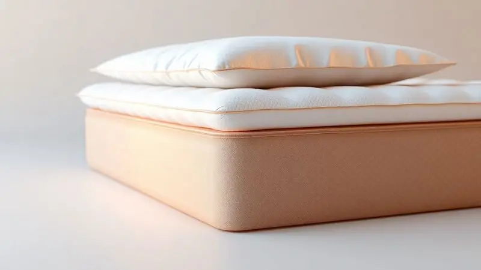
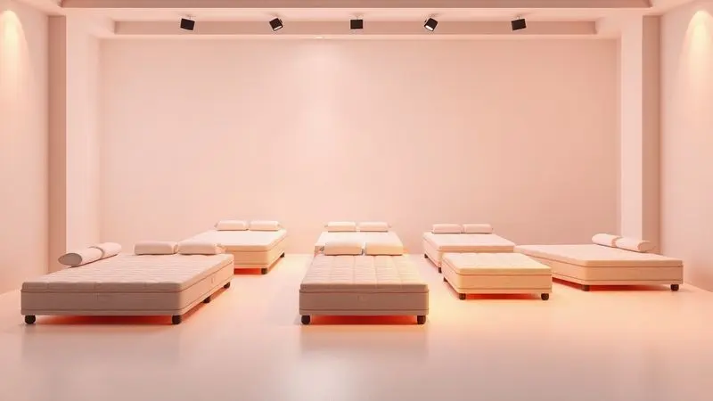

Escolher o colchão certo vai além de um simples móvel para o quarto. É um investimento direto na sua saúde, na forma como você acorda e na energia que carrega para enfrentar o dia.

Quando a qualidade do sono está em jogo, a linha de colchões Ortobom Nanolastic surge como uma das principais candidatas, prometendo durabilidade e um suporte que parece conversar com o seu corpo.

Mas entre tantos nomes, Elegant, Physical, Fashion, e tantas promessas técnicas, uma dúvida persiste: essa tecnologia de molas realmente funciona para o seu tipo de corpo? Neste guia, vamos além das especificações.

Vamos traduzir os números em sensações, analisar o que cada modelo tem a oferecer de verdade e descobrir, juntos, se um Ortobom Nanolastic é a peça que falta para suas noites perfeitas de sono.

<SummaryList products={frontmatter.top_products} />

## O que é a tecnologia de Molas Nanolastic da Ortobom?

Imagine um sistema de apoio que não trata seu corpo como um bloco único, mas como um conjunto de partes que precisam de atenção individual. É isso que a tecnologia Nanolastic faz.

As molas bicônicas são projetadas para responder independentemente a cada movimento e a cada curva do seu corpo.

O resultado não é apenas um colchão que parece confortável quando você se deita, mas um que se adapta enquanto você dorme, redistribuindo a pressão e mantendo sua coluna alinhada.

Mais do que uma noite de sono, é uma noite de descanso genuíno, onde você acorda sem aquela rigidez matinal tão familiar.

### 1. Colchão Ortobom Fashion Nanolastic

<ProductBox 
  title={frontmatter.top_products[0].title} 
  image={frontmatter.top_products[0].image} 
  link={frontmatter.top_products[0].link} 
/>

Pense naquele equilíbrio perfeito entre afundar em um abraço aconchegante e ter a segurança de um apoio firme. O Fashion Nanolastic busca exatamente isso.

Suas molas bicônicas trabalham para moldar-se ao seu contorno, minimizando a transferência de movimento (uma bênção para quem divide a cama) e oferecendo suporte anatômico pontual.

A espuma de poliuretano de densidade D26 é o segredo desse meio-termo, proporcionando maciez sem perder a estrutura necessária para suas costas.

Com altura entre 23 e 27 cm e capacidade para até 120 kg por pessoa, ele se apresenta como uma opção versátil. O revestimento em poliéster é macio ao toque e vem com a tranquilidade dos tratamentos antialérgico e antiácaro, padrão na linha.

Apenas fique atento a um detalhe de manutenção: alguns modelos exigem que você gire o colchão a cada 15 dias para garantir uma durabilidade uniforme.

<CaixaProsContras>

**Prós:**

- Molas Nanolastic que oferecem suporte personalizável.

- Espuma de alta densidade que proporciona conforto.

- Revestimento macio e durável com tratamento antiácaro.

- Vários tamanhos disponíveis para atender diferentes necessidades.

**Contras:**

- Necessidade de girar o colchão periodicamente.

- Alguns modelos podem ser mais pesados para manuseio.

</CaixaProsContras>

### 2. Colchão Ortobom Physical Nanolastic

<ProductBox 
  title={frontmatter.top_products[1].title} 
  image={frontmatter.top_products[1].image} 
  link={frontmatter.top_products[1].link} 
/>

Se você busca a sensação de leveza e acolhimento, como se deitasse em uma nuvem que ainda sabe sustentar você, o modelo Physical pode ser sua resposta. Ele utiliza o mesmo sistema inteligente de molas Nanolastic, mas adiciona uma camada extra de aconchego: a Ortopillow.

Feita de espuma D26, essa camada funciona como um abraço extra, aprimorando o conforto sem comprometer o suporte essencial para a coluna, sendo indicado para pessoas de até 120 kg.

O revestimento, uma combinação de viscose e poliéster, mantém a promessa de um sono saudável com seus tratamentos contra alergias. Disponível em diversas medidas, ele aposta na durabilidade.

O preço, contudo, pode refletir esse upgrade em conforto, posicionando-se um pouco acima de opções mais básicas do mercado.

<CaixaProsContras>

**Prós:**

- Conforto macio com sistema de molas Nanolastic

- Camada Ortopillow para melhor apoio

- Tratamento antialérgico e antiácaro

- Disponível em várias medidas

**Contras:**

- Preço pode ser mais elevado que modelos semelhantes

- Limitado a pessoas de até 120kg

</CaixaProsContras>

### 3. Colchão Ortobom Elegant Nanolastic

<ProductBox 
  title={frontmatter.top_products[2].title} 
  image={frontmatter.top_products[2].image} 
  link={frontmatter.top_products[2].link} 
/>

Para quem não quer fazer concessões, o Elegant Nanolastic é uma declaração de conforto e praticidade. Seu molejo é construído com aço de alto carbono, o que se traduz em uma resistência que dura anos sem perder a flexibilidade necessária para o conforto.

A sensação é descrita como "Macio com Firmeza", aquele equilíbrio ideal que acolhe seus ombros e quadris enquanto mantém suas costas perfeitamente alinhadas.

Um dos seus maiores trunfos é a praticidade. A tecnologia No Turn elimina a necessidade de virar o colchão periodicamente, simplificando sua rotina de cuidados. O revestimento em Malha Ecobambú oferece uma sensação refrescante, perfeita para noites mais quentes.

Com suporte que varia de 120 kg a 150 kg por pessoa, ele é robusto, mas essa pode ser uma limitação a considerar para casais com maior sobrecarga.

<CaixaProsContras>

**Prós:**

- Molejo Nanolastic proporciona ótima flexibilidade e durabilidade.

- Conforto equilibrado entre maciez e firmeza.

- Revestimento em Malha Ecobambú para uma sensação refrescante.

- Tecnologia No Turn facilita a manutenção do colchão.

**Contras:**

- Suporte de peso limitado a 150 kg por pessoa.

- Pode ser considerado menos acessível em comparação a outros modelos básicos.

</CaixaProsContras>

### 4. Colchão Ortobom Airtech Nanolastic

<ProductBox 
  title={frontmatter.top_products[3].title} 
  image={frontmatter.top_products[3].image} 
  link={frontmatter.top_products[3].link} 
/>

O Airtech Nanolastic é para quem prioriza a estabilidade e o suporte firme para a coluna. Sua tecnologia de molas oferece uma resistência progressiva, como se o colchão respondesse com precisão ao seu peso, garantindo um alinhamento corporal impecável durante o sono.

A camada extra de EPS (poliestireno expandido) é responsável por essa excelente estabilidade e durabilidade, mantendo a flexibilidade das molas.

O toque suave vem do revestimento em malha de poliéster com viscose, e o bordado em matelassê com espuma D20 ou D26 aumenta a sensação de conforto. Classificado como firme e com suporte para até 120 kg, ele é uma fortaleza para suas costas.

Com alturas que podem variar de 25 cm a 35 cm, ele se adapta a diferentes necessidades, embora possa não ser a melhor opção para camas muito baixas.

<CaixaProsContras>

**Prós:**

- Tecnologia de molas Nanolastic que proporciona ótimo suporte para a coluna.

- Camada de EPS que garante estabilidade e durabilidade.

- Revestimento suave e confortável que melhora a experiência do sono.

- Várias opções de tratamento antialérgico para um sono mais saudável.

**Contras:**

- Disponibilidade limitada de modelos com alturas muito baixas.

- Classificação firme pode não agradar todos os tipos de sleepers.

</CaixaProsContras>

### 5. Colchão Ortobom ISO Nanolastic

<ProductBox 
  title={frontmatter.top_products[4].title} 
  image={frontmatter.top_products[4].image} 
  link={frontmatter.top_products[4].link} 
/>

Versátil e adaptável, o ISO Nanolastic é a escolha daqueles que querem um colchão que se molde a diferentes preferências.

Seu sistema de molejo em aço de alto carbono se ajusta com precisão aos contornos do corpo, oferecendo um suporte equilibrado que promove um sono verdadeiramente reparador. A camada de espuma D26 Pró Aditivada, a conhecida Ortopillow, entra como um plus de aconchego.

Como seus irmãos, ele protege seu sono com tratamentos antialérgico e antiácaro. Disponível em diversas medidas e com uma firmeza que pode variar entre "firme" e "firmeza macia", ele suporta até 100 kg por pessoa.

A única ressalva é para quem busca uma sensação extremamente macia, pois mesmo na variação mais suave, ele mantém uma estrutura de apoio consistente.

<CaixaProsContras>

**Prós:**

- Molejo adaptável que se ajusta ao corpo

- Camada de espuma para maior conforto

- Tratamentos antialérgicos e antiácaros

- Várias opções de medida disponíveis

**Contras:**

- Firmeza pode não agradar a todos

- Algumas variações de modelo podem ter diferenças sutis

</CaixaProsContras>

## Características Técnicas e Atributos Gerais da Linha

Agora que você conhece as personalidades de cada modelo, vamos entender o DNA que todos eles compartilham.

A linha Ortobom Nanolastic não é apenas sobre tecnologia, é sobre uma filosofia de sono que combina suporte inteligente com materiais pensados para o seu bem-estar a longo prazo.

### Peso Máximo Suportado e Nível de Firmeza do Colchão

Um colchão deve ser um aliado, não uma limitação. Por isso, a linha Nanolastic foi projetada para oferecer suporte adequado a uma ampla gama de biotipos. Em geral, a capacidade gira em torno de 120 kg por pessoa, com exceções como o Elegant, que chega a 150 kg.

Essa versatilidade se estende à sensação ao deitar. Você não está preso a uma única opção.

A linha oferece uma gradiente de firmeza, desde o suave que abraça o corpo até o firme que sustenta com precisão, permitindo que você encontre a densidade que conversa com sua coluna e seu conforto pessoal.

### Densidade da Espuma e Camadas de Estofamento D26

Você já se perguntou por que alguns colchões afundam irremediavelmente após alguns anos enquanto outros mantêm sua forma? A resposta está na densidade, especificamente na D26, uma constante na linha Nanolastic. Esse número não é aleatório.

Ele representa o ponto ideal onde a espuma é densa o suficiente para resistir ao tempo e ao uso, garantindo durabilidade, mas ainda assim conserva a elasticidade necessária para um acolhimento confortável.

As camadas de estofamento são estrategicamente dispostas para distribuir seu peso de forma uniforme, aliviando pontos de pressão nos ombros e quadris. É a diferença entre dormir *em* um colchão e dormir *apoiado* por ele.

### O que é o Pillow Top Europeu (Euro Pillow)?

Alguns modelos da linha, como o Physical, incorporam o conceito do Pillow Top Europeu. Imagine acordar e perceber que a borda do seu colchão não é um degrau rígido, mas uma extensão suave e nivelada do conforto. É exatamente isso.

Trata-se de uma camada extra de conforto costurada na parte superior, que se integra perfeitamente às bordas, criando um visual elegante e, mais importante, uma sensação de maciez uniforme desde o centro até as extremidades.

É um detalhe que transforma a experiência, aliviando pontos de pressão e adicionando uma camada de refinamento e aconchego que faz você se sentir envolvido.

### Tecido com Tratamento Antiácaro e Antifungo

O verdadeiro luxo de um bom colchão é a paz de espírito. E nada tira mais a paz do que a preocupação com alergias ou ácaros se infiltrando no local onde você passa um terço da sua vida.

Todos os modelos Nanolastic vêm com um tecido que possui tratamento especial contra ácaros e fungos. Isso significa mais do que um simples recurso técnico. Significa respirar livremente à noite, sem acordar com coceira no nariz ou espirros.

Significa um ambiente mais saudável para seu sono, que contribui até para a longevidade do próprio tecido, mantendo-o fresco e em boas condições por mais tempo.

## Medidas e Dimensões dos Colchões Ortobom

Um colchão perfeito também precisa caber perfeitamente na sua vida e no seu espaço. A Ortobom entende isso e oferece uma gama de opções para que o ajuste seja impecável, seja em um quarto de solteiro compacto ou em um suíte espaçosa.

### Medidas Casal, Solteiro e Sob Medida Especial

A flexibilidade começa com as medidas padrão. Para o solteiro, pense em 88 cm de largura por 188 cm de comprimento, o espaço ideal para uma pessoa descansar com liberdade.

O modelo de casal comum oferece 138 cm x 188 cm, garantindo espaço para dois sem que ninguém fique na beirada. E para aquelas situações especiais, onde a cama tem um tamanho incomum ou o espaço exige um ajuste milimétrico, a marca disponibiliza a opção sob medida.

É a garantia de que, independentemente do layout do seu quarto, o conforto não precisa ser negociado.

## Como escolher o colchão Ortobom ideal?

Com todas essas informações, como tomar a decisão certa? A escolha do colchão ideal é uma conversa íntima entre suas necessidades físicas, seus hábitos de sono e suas expectativas de conforto.

É sobre ouvir seu corpo e entender o que ele precisa para se recuperar verdadeiramente.

### Diferença entre Molas Nanolastic e Molas Superpocket

Você pode encontrar essas duas tecnologias no mercado, e entender a diferença é crucial. As molas Nanolastic, como vimos, focam na adaptação precisa ao contorno do corpo, oferecendo um suporte personalizado.

Já as molas Superpocket trabalham com um princípio de independência total: cada mola é envelopada individualmente, o que as torna mestras em isolar movimento. Se um parceiro se vira, o outro mal percebe.

A escolha, então, depende da sua prioridade: quer um suporte que se molde perfeitamente a você (Nanolastic) ou a menor perturbação possível durante a noite (Superpocket)? Ambas melhoram a qualidade do sono, mas atendem a desejos diferentes.

### Você sabe o que é densidade de colchão?

Vamos simplificar: densidade é o que define a "personalidade" de suporte do seu colchão. Medida em quilogramas por metro cúbico (kg/m³), ela indica quanto material existe em um determinado volume.

Um número mais alto, como a D26 que vimos, significa uma espuma mais compacta, firme e, consequentemente, mais durável. É a escolha para quem precisa de um apoio consistente para a coluna.

Densidades mais baixas resultam em colchões mais macios e maleáveis, que podem ser muito confortáveis inicialmente, mas têm maior tendência a ceder com o tempo.

Escolher a densidade certa é o primeiro passo para garantir que o conforto de hoje seja também o conforto de daqui a cinco anos.

## Avaliação dos clientes e depoimentos de quem já comprou

A teoria é importante, mas a prova final está na experiência de quem já deitou a cabeça sobre um Nanolastic. O relato comum é de alívio.

Clientes com dores crônicas nas costas relatam uma melhora significativa, atribuindo ao suporte adaptável das molas a sensação de acordar "desenferrujado".

A durabilidade é outro ponto elogiado, com muitos afirmando que o colchão mantém sua forma e conforto após anos de uso, validando o investimento.

É justo mencionar que, para alguns, há um período inicial de adaptação, especialmente se vierem de colchões muito diferentes. O corpo pode levar alguns dias para se acostumar ao novo tipo de suporte.

No entanto, a grande maioria que passa por essa fase relata que, uma vez ajustado, o sono se torna mais profundo e reparador. A conclusão que emerge dos depoimentos é clara: mais do que um produto, é percebido como uma melhoria tangível na qualidade de vida.

## Conclusão

Escolher um colchão Ortobom Nanolastic é mais do que selecionar um modelo em uma lista. É optar por uma tecnologia que promete ouvir seu corpo, por materiais que priorizam sua saúde e por uma durabilidade que transforma o investimento em economia a longo prazo.

Seja o Fashion com seu equilíbrio, o Physical com seu aconchego extra, o Elegant com sua praticidade, o Airtech com seu suporte firme ou o ISO com sua versatilidade, cada um carrega o mesmo compromisso: melhorar a maneira como você descansa.

A decisão final passa por entender sua prioridade. Precisa de mais conforto ou de mais suporte? Divide a cama e quer minimizar as perturbações? Valoriza a praticidade da manutenção zero?

As respostas para essas perguntas vão direcionar você ao modelo que se tornará o pilar das suas noites bem dormidas. A jornada para um sono melhor começa com um bom apoio.

Que tal dar o primeiro passo e experimentar a sensação de um colchão que realmente se adapta a você?