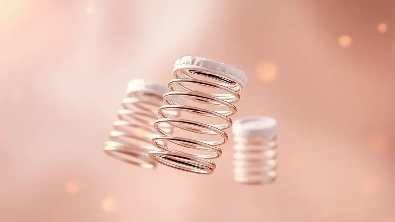
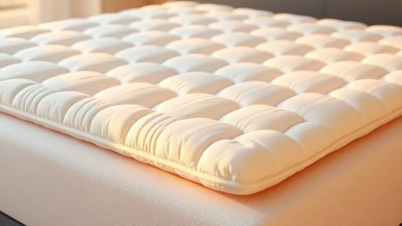
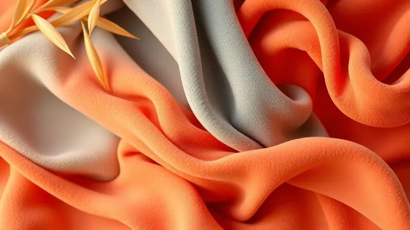

Imagine investir em um colchão que promete equilibrar suporte e maciez com perfeição.

O Colchão de Molas Ensacadas Ortobom Elegant aparece como essa proposta, mas você realmente pode confiar na sua estrutura SuperPocket e revestimento em fibras de bambu para transformar suas noites?

Neste artigo, vamos desvendar cada detalhe técnico, desde a espuma D26 até o sistema No Turn e o reforço Polyframe nas bordas, para que você decida se este é o investimento certo para renovar completamente sua experiência de sono.

<SummaryList products={frontmatter.top_products} />

## Conheça o Colchão de Molas Ensacadas Ortobom Elegant

<ProductBox 
  title={frontmatter.top_products[0].title} 
  image={frontmatter.top_products[0].image} 
  link={frontmatter.top_products[0].link} 
/>

O Elegant é uma criação que prioriza conforto sem sacrificar o suporte necessário para uma postura saudável.

Com molas individuais que trabalham independentemente, ele minimiza a transferência de movimento, tornando-se a escolha ideal para casais onde um se move sem perturbar o outro.

Sua camada de Ortopillow cria uma sensação de suavidade que equilibra delicadamente maciez com firmeza.

Além dessa base inteligente, o colchão conta com estofamento em espuma D26 e revestimento em Bambu Fresh, que não apenas melhoram a respirabilidade mas oferecem um toque refrescante que você sente desde o primeiro contato.

A praticidade do sistema No Turn significa que você não precisa se preocupar com virar o colchão, enquanto seu tratamento antialérgico garante um ambiente de sono saudável.

Com 28 cm de altura e disponível em diversos tamanhos, ele se adapta ao seu espaço e às suas necessidades.

<CaixaProsContras>

**Prós:**

- Molas ensacadas que reduzem a transferência de movimento

- Camada extra de conforto com Ortopillow

- Tratamento antialérgico e antiácaro

- Disponível em várias dimensões

**Contras:**

- A manutenção da sua estrutura pode ser complexa para algumas pessoas

- Não é dos mais baratos do mercado

</CaixaProsContras>

### Estrutura de Molas SuperPocket (Ensacadas)

Pense em cada mola como um pequeno trabalhador independente. As molas SuperPocket são envoltas individualmente em tecido, permitindo que elas se movam de forma autônoma.

Essa independência é o que torna o colchão tão especial para casais: quando um se levanta ou se ajusta, o outro continua imóvel, preservando o sono tranquilo.

Além disso, essa adaptabilidade às curvas do corpo promove um alinhamento natural da coluna, transformando cada posição em um apoio personalizado.

### Estofamento Interno em Espuma D26 e Poliol Vegetal

Deitar sobre a espuma D26 é como encontrar o encaixe perfeito para seu corpo. Esta espuma não apenas oferece durabilidade, mas se adapta de forma inteligente às suas formas, contribuindo para uma noite de sono onde cada ponto de pressão é cuidadosamente eliminado.

A adição do poliol vegetal na composição representa um compromisso com sustentabilidade, reduzindo produtos químicos e melhorando a respirabilidade. Assim, você não apenas dorme melhor, mas faz uma escolha consciente para o meio ambiente.

### Nível de Firmeza e Suporte de Peso até 150kg

Para quem precisa de um apoio robusto que não comprometa o conforto, o nível de firmeza do Ortobom Elegant se torna um aliado essencial. Sua estrutura acomoda pessoas de até 150kg com equilíbrio, oferecendo suporte onde você precisa e maciez onde deseja.

A tecnologia das molas ensacadas adapta-se ao corpo, minimizando pontos de pressão e garantindo que mesmo quem precisa de uma base mais resistente encontre um sono reparador. Esta combinação transforma firmeza em conforto adaptativo.

### Camada de Conforto Euro Pillow Top Europeu

Ao deitar, você sente imediatamente a maciez aconchegante da camada Euro Pillow Top. Esta camada adicional, composta por espuma de alta densidade, se adapta ao seu corpo como um abraço suave, reduzindo pontos de pressão antes mesmo que você perceba.

Essa tecnologia não apenas eleva o conforto, mas também favorece uma ventilação inteligente que mantiene a temperatura agradável durante toda a noite. O resultado é uma sensação de descanso que começa no primeiro momento.

### Tecnologia One Side e Sistema No Turn

Imagine a praticidade de um colchão que nunca precisa ser virado. A tecnologia One Side do Elegant elimina essa tarefa, simplificando sua vida e garantindo que todo o conforto e suporte sejam concentrados em um único lado projetado para uso permanente.

O sistema No Turn complementa essa ideia, assegurando que a estrutura das molas ensacadas continue oferecendo apoio adequado ao corpo sem necessidade de manutenção complexa. Para quem valoriza tempo ou tem mobilidade reduzida, essa combinação é um verdadeiro aliado.

### Revestimento em Tecido de Fibras Naturais de Bambu e Suede

O contato com o revestimento de bambu e suede é uma experiência que combina funcionalidade com sensação premium.

As fibras de bambu, com propriedades hipoalergênicas e respiráveis, regulam a temperatura corporal e reduzem a umidade, criando um microclima ideal para o sono.

O suede, por sua vez, oferece um toque macio e aconchegante que transforma o simples deitar em um momento de luxo discreto. Esta combinação não apenas aumenta a durabilidade do produto, mas cria um ambiente de descanso saudável e agradável.

## Diferenciais Técnicos e Acabamento do Ortobom Elegant

O Elegant eleva-se acima dos padrões com seus diferenciais técnicos que convergem para uma experiência completa.

Equipado com molas ensacadas que oferecem suporte individualizado e redução de movimentos, seu acabamento em tecido de malha garante maciez e respirabilidade em cada detalhe, criando um ecossistema onde conforto e funcionalidade se harmonizam.

### Sistema Polyframe de Reforço das Bordas em Espuma

Sentar na borda do colchão sem sentir aquela queda desconcertante é possível com o Sistema Polyframe. Este reforço nas bordas feito de espuma aumenta a durabilidade do colchão e oferece um suporte firme nas extremidades, prevenindo deformações ao longo do tempo.

A tecnologia mantiene a área útil do colchão intacta, proporcionando conforto mesmo nas bordas e distribuindo o peso de forma equilibrada. Você ganha estabilidade e segurança onde normalmente os colchões falham.

### Proteção Acrílica e Tratamento Antiácaro e Antifungo

Para quem busca um ambiente de sono verdadeiramente saudável, a proteção acrílica do Elegant é uma barreira inteligente contra acumulação de sujeira e líquidos, prolongando a vida útil do colchão.

O tratamento antiácaro e antifungo, por sua vez, é um diferencial essencial para pessoas com alergias ou problemas respiratórios, criando um espaço livre de alérgenos que assegura um descanso tranquilo.

Estas características transformam o colchão em um guardião da sua saúde enquanto dorme.

### Bordado Matelassê e Revestimento Inferior Antiderrapante

O bordado matelassê não é apenas estético; ele distribui o peso de maneira uniforme, resultando em uma superfície mais confortável para dormir onde cada detalhe visual corresponde a um benefício funcional.

Complementando esta experiência, o revestimento inferior antiderrapante garante que o colchão permaneça bem posicionado na base, evitando deslizamentos durante a noite e oferecendo a segurança de um descanso estável.

Juntos, esses elementos elevam a durabilidade e funcionalidade a um nível onde qualidade e conforto são inseparáveis.

## Tamanhos e Versões do Colchão Ortobom Pocket Elegant

Independentemente do espaço disponível, o Elegant se adapta através de suas diversas medidas: solteiro, casal, queen e king.

Cada versão é projetada para oferecer a mesma experiência premium de sono, com a tecnologia de molas ensacadas que se adapta ao corpo e proporciona alívio de pressão específico para cada dimensão.

Você encontra o tamanho ideal para seu espaço sem comprometer o conforto, mantendo a qualidade dos materiais e o design sofisticado consistente em toda a linha.

## Conclusão

O Colchão Molas Ensacadas Ortobom Elegant representa um investimento inteligente para quem busca transformar suas noites de descanso.

Combinando conforto adaptativo com suporte robusto através das molas SuperPocket, ele se torna um aliado para casais que valorizam independência de movimento e para indivíduos que necessitam de firmeza sem sacrificar a maciez.

Sua tecnologia No Turn elimina a complexidade da manutenção, enquanto os tratamentos antialérgicos e o revestimento em bambu criam um ambiente de sono saudável.

Embora seu custo possa ser mais elevado que algumas opções básicas, e sua estrutura requer cuidados específicos, a durabilidade oferecida pelo sistema Polyframe e a experiência premium do Euro Pillow Top justificam a escolha para quem prioriza qualidade de descanso acima do preço.

Se você está pronto para substituir a simples função de dormir por uma experiência de recuperação verdadeiramente personalizada, o Elegant oferece essa possibilidade com cada detalhe pensado para seu conforto.