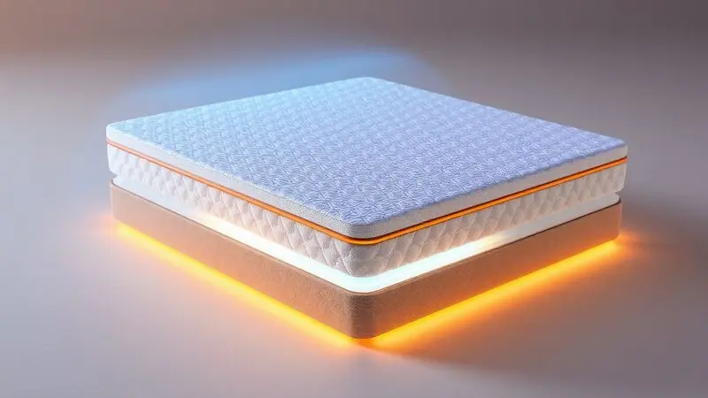
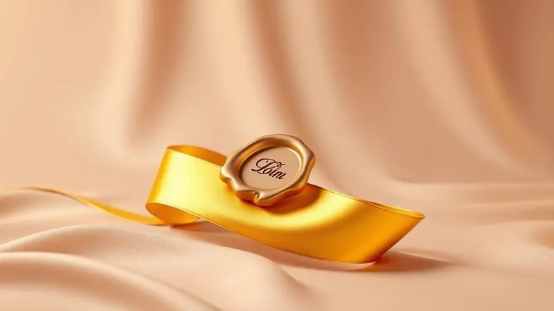

Imagine encontrar aquele equilíbrio perfeito entre suporte para sua coluna e o conforto que faz você suspirar ao se deitar. O Colchão Ortobom Liberty promete exatamente isso, mantendo sua tradição no mercado enquanto se adapta às exigências de 2025.

Se você está na dúvida se este clássico ainda vale seu investimento, vamos desvendar juntos cada detalhe que transforma noites em verdadeiros momentos de descanso.

<SummaryList products={frontmatter.top_products} />

## Conheça o Colchão Liberty da Ortobom

<ProductBox 
  title={frontmatter.top_products[0].title} 
  image={frontmatter.top_products[0].image} 
  link={frontmatter.top_products[0].link} 
/>

Quando você fecha os olhos no Liberty, está descansando sobre uma história de inovação consciente. A tecnologia Oceancare tece fios a partir de garrafas PET recicladas, transformando plástico que poluiria oceanos em uma superfície macia que abraça seu corpo.

O tecido em malha belga é tão suave que parece um carinho na pele, enquanto as molas superpocket trabalham em silêncio para garantir que cada movimento seu (ou do seu parceiro) não se transforme em uma noite de sono interrompida.

Com 31 cm de altura, o Liberty oferece uma presença imponente no seu quarto, capaz de suportar até 150 kg por pessoa sem perder sua elegância.

O nível de conforto é generosamente macio, como se sua coluna estivesse sendo levemente suspensa por nuvens que sabem exatamente onde apoiar cada curva do seu corpo.

<CaixaProsContras>

**Prós:**

- Material sustentável com fios de garrafas PET.

- Molas superpocket que minimizam o movimento entre os usuários.

- Tecnologia de espuma HR para suporte adequado à coluna.

- Tecido suave que oferece conforto adicional.

**Contras:**

- Possíveis deformações relatadas com o uso prolongado.

- Odor inicial que pode ser desconfortável nos primeiros dias.

</CaixaProsContras>

## Tecnologias e Diferenciais de Construção

O que realmente acontece dentro do Liberty enquanto você sonha? Uma camada de espuma de alta densidade se adapta ao seu corpo como uma impressão digital, memorizando seus pontos de pressão para oferecer suporte exatamente onde você mais precisa.

As molas não são apenas componentes metálicos, são pequenas engrenagens que trabalham independentemente, garantindo que seu quadril receba um apoio diferente do que seus ombros.

E aí vem a magia da ventilação inteligente: canais estrategicamente posicionados criam uma respiração constante, evitando que o calor do seu corpo se acumule e transforme seu refúgio em uma estufa. Você acorda revigorado, não suado e inquieto.

Esta combinação de tecnologias não é apenas sobre durabilidade, mas sobre preservar a qualidade do seu sono ano após ano.

## Certificações e Selo Inmetro de Qualidade

Quando você investe em um colchão, está confiando sua saúde e segurança a ele por anos. É por isso que o selo Inmetro no Liberty não é apenas um adesivo, mas uma promessa.

Ele garante que cada material passou por testes rigorosos, que cada costura resiste ao uso diário e que nada dentro daquela estrutura libera substâncias que possam afetar sua saúde enquanto você respira profundamente durante o sono.

As certificações da Ortobom vão além do obrigatório, criando uma camada extra de tranquilidade. Você pode fechar os olhos sabendo que está descansando em um ambiente que cuida de você tanto quanto você cuida da sua escolha de descanso.

## É preciso virar o colchão Liberty da Ortobom?

Lembra daquela cena clássica de virar o colchão pesado a cada poucos meses? Com o Liberty, essa tarefa praticamente desaparece da sua rotina. Sua tecnologia moderna foi desenvolvida para manter a forma e distribuição de peso de maneira uniforme ao longo do tempo.

No entanto, mesmo os melhores aliados do descanso se beneficiam de um cuidado ocasional.

Girar o colchão a cada três meses (de cabeceira para os pés) garante que todas as áreas recebam o mesmo nível de atenção, prolongando a vida útil e mantendo a sensação de "novo" por muito mais tempo. É um pequeno gesto que retribui todo o conforto que ele oferece.

## Por que comprar o colchão Ortobom online?

Pense na última vez que você tentou transportar um colchão no carro ou enfrentou filas intermináveis em lojas físicas.

Agora imagine escolher seu Liberty no conforto do sofá, comparando detalhes técnicos sem pressão de vendedores, lendo experiências reais de quem já dorme nele há meses.

Comprar online transforma uma decisão complexa em uma jornada de descoberta. Promoções exclusivas, entrega que chega até sua porta (e sobe as escadas se necessário), e a segurança de políticas de devolução claras criam um ecossistema onde você se sente no controle.

É sobre ter todas as informações nas suas mãos antes de tomar uma decisão que vai acompanhar suas noites por anos.

## Alternativas Recomendadas ao Ortobom Liberty

Se o Liberty despertou sua curiosidade mas você quer explorar todo o universo de possibilidades, conheça alternativas que também transformam o ato de dormir em uma experiência premium.

### Colchão Emma Premium Hybrid

<ProductBox 
  title={frontmatter.top_products[1].title} 
  image={frontmatter.top_products[1].image} 
  link={frontmatter.top_products[1].link} 
/>

Imagine um colchão que entende que seu corpo precisa de coisas diferentes em momentos diferentes.

O Emma Premium Hybrid combina a adaptabilidade suave da espuma de memória com a firmeza estruturada das molas ensacadas, criando uma sensação de médio-firme que parece ter sido personalizada para você.

As múltiplas zonas de suporte são como mãos invisíveis que seguram sua coluna na posição ideal, enquanto a respirabilidade mantém o frescor mesmo nas noites mais quentes.

A capa removível e lavável é aquele detalhe prático que faz toda diferença quando o café derrama ou o póleo do seu petzinho decide visitar sua cama.

O período de teste de 200 noites é quase sete meses para você realmente sentir se ele é seu parceiro de descanso ideal, e a garantia de 10 anos é um aceno de confiança que ecoa em cada noite tranquila.

<CaixaProsContras>

**Prós:**

- Combinação eficaz de espuma e molas ensacadas.

- Boa respirabilidade para um sono mais fresco.

- Suporte ergonômico com múltiplas zonas.

- Capa removível e lavável para fácil manutenção.

**Contras:**

- Pode não ser a opção mais barata disponível.

- Alguns usuários podem preferir uma sensação mais suave.

</CaixaProsContras>

### Colchão Ortobom Pocket Elegant Euro Pillow

<ProductBox 
  title={frontmatter.top_products[2].title} 
  image={frontmatter.top_products[2].image} 
  link={frontmatter.top_products[2].link} 
/>

Para quem acredita que o luxo do descanso está nos detalhes, o Pocket Elegant Euro Pillow é um abraço em forma de colchão.

O Pillow Top Europeu adiciona uma camada extra de maciez que recebe seu corpo como um travesseiro gigante, enquanto as molas Pocket trabalham nos bastidores para isolar cada movimento.

A tecnologia No Turn significa que você pode esquecer aquela tarefa trabalhosa de virar o colchão, focando apenas em desfrutar do conforto.

Sim, sua altura é imponente (quase um statement no seu quarto), mas é essa presença que comunica qualidade antes mesmo de você se deitar.

Para casais com diferentes hábitos de sono ou para quem simplesmente aprecia a sensação de afundar levemente em uma superfície que parece ter sido projetada apenas para seu conforto, esta é uma escolha que transforma seu quarto em um santuário pessoal.

<CaixaProsContras>

**Prós:**

- Conforto excepcional com a camada de Pillow Top.

- Sistema de molas Pocket reduz a transferência de movimento.

- Boa densidade e suporte para diferentes pesos.

- Fácil manutenção com a tecnologia No Turn.

**Contras:**

- Altura do colchão pode ser considerada alta para alguns.

- O preço pode ser um pouco elevado em comparação a modelos mais simples.

</CaixaProsContras>

## Conclusão

Escolher um colchão é mais do que selecionar um móvel para seu quarto, é investir em um terço da sua vida.

O Ortobom Liberty representa essa ponte entre tradição confiável e inovação consciente, oferecendo suporte que respeita sua coluna enquanto abraça seu corpo com conforto sustentável.

Seja pelo compromisso ambiental da tecnologia Oceancare, pela discrição das molas que isolam movimentos, ou pela segurança das certificações que garantem anos de descanso saudável, o Liberty convida você a repensar o que realmente significa uma boa noite de sono.

As alternativas apresentadas ampliam esse leque, provando que existe um universo de possibilidades esperando para transformar suas noites.

A decisão final é sua, mas agora você tem todas as informações para fazê-la não apenas com a mente, mas com a certeza de que cada detalhe foi considerado. Qual será a história do seu próximo descanso?