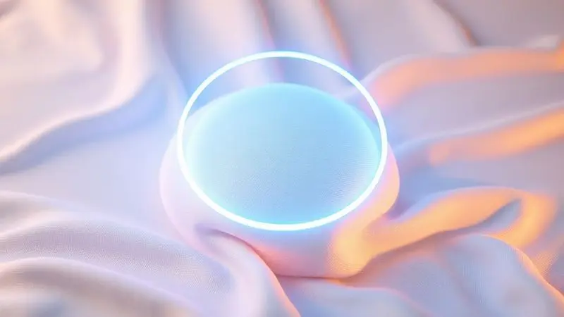
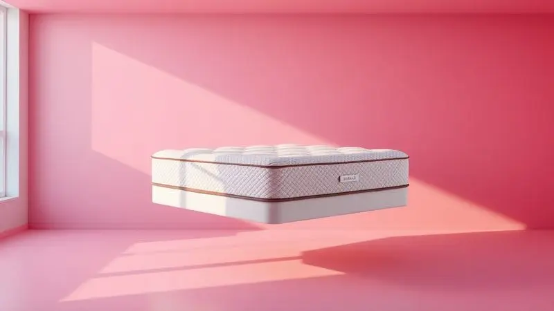

Escolher o colchão ideal é fundamental para garantir uma boa noite de sono e a saúde da sua coluna. Entre as opções mais buscadas no mercado brasileiro por quem busca economia, o Colchão Ortobom Physical Ultra Resistente D26 se destaca.

Mas será que um modelo focado em custo-benefício realmente entrega a durabilidade e o conforto necessários para o uso diário?

Neste artigo, vamos analisar profundamente as especificações técnicas, o tipo de espuma e os diferenciais deste modelo da Ortobom para responder se ele é a escolha certa para você ou se vale a pena investir um pouco mais em outra categoria.

<SummaryList products={frontmatter.top_products} />

## O que é o Colchão Ortobom Physical Ultra Resistente?

<ProductBox 
  title={frontmatter.top_products[0].title} 
  image={frontmatter.top_products[0].image} 
  link={frontmatter.top_products[0].link} 
/>

Imagine um colchão que desafia o tempo sem abrir mão da firmeza que sua coluna precisa, uma combinação rara na faixa de preço acessível.

O Colchão Casal Physical Ultra Resistente D26 da Ortobom é exatamente isso, uma opção robusta projetada com espuma 100% poliuretano de densidade D26 que oferece suporte firme especialmente adequado para pessoas com peso de até 90kg por lado.

Além da estrutura sólida, ele traz um aliado invisível contra alergias, tratamento antialérgico, antiácaro e antifungo que transforma seu quarto em um santuário de sono saudável.

Enquanto o revestimento em tecido de poliéster e viscose facilita a limpeza e mantém a higiene, o conforto surpreende com equilíbrio, embora possa parecer um pouco rígido para paladares acostumados com colchões mais macios, essa característica se revela uma bênção para quem busca descanso realmente estruturado.

<CaixaProsContras>

**Prós:**

- Fabricado com espuma de alta densidade, oferecendo firmeza e durabilidade.

- Tratamento antialérgico, promovendo um sono saudável.

- Revestimento que facilita a limpeza e manutenção.

- Disponível em tamanhos ideais para casais.

**Contras:**

- Pode ser considerado rígido para quem prefere um colchão mais macio.

- Suporte máximo de 90kg por lado pode não atender usuários mais pesados.

</CaixaProsContras>

## Especificações e Ficha Técnica do Colchão

Para entender o que realmente diferencia este modelo, precisamos mergulhar nas especificações que definem sua personalidade.

A espuma D26 não é apenas uma especificação técnica, é a garantia de que seu corpo encontrará o suporte ideal, enquanto as camadas internas trabalham em harmonia para entregar resistência que desafia o tempo, perfeita para quem precisa de um companheiro diário que não desaponta.

### Densidade da Espuma e Suporte de Peso (70 kg por pessoa)

A densidade D26 vai além de números, ela representa o abraço firme que sua coluna merece após um dia longo.

Essa característica permite suportar até 70 kg por pessoa, um detalhe importante que merece explicação: os 90kg por lado mencionados anteriormente se referem à capacidade estrutural total, enquanto estes 70kg por pessoa consideram o conforto ideal durante o sono, garantindo que o colchão mantenha suas propriedades mesmo com o movimento noturno.

Imagine acordar sem aquela dor nas costas que insiste em aparecer, essa é a promessa dessa estrutura equilibrada que evita o desgaste precoce.

### Nível de Firmeza e Conforto Macio

O verdadeiro segredo está na combinação inteligente que atende diferentes necessidades.

Enquanto a firmeza D26 oferece suporte adequado para uma postura saudável durante o sono, não pense que você vai descansar sobre uma tábua, o conforto macio emerge para acolher seus pontos de pressão de forma terapêutica.

É como ter um personal trainer para sua coluna que também sabe quando ser carinhoso, ajudando você a encontrar o ponto ideal entre estrutura e aconchego para uma noite verdadeiramente reparadora.

### Tipo de Espuma de Poliol Vegetal e Ecologicamente Correto

O que diferencia este colchão vai além do seu descanso pessoal, ele representa uma escolha consciente que respeita o planeta.

A espuma de poliol vegetal, menos agressiva ao meio ambiente que as convencionais, entrega um conforto superior que você sente na pele, literalmente.

Sua respirabilidade e flexibilidade melhoradas significam que o ar circula melhor durante a noite, mantendo a temperatura ideal sem aquela sensação abafada. Você não apenas dorme melhor, mas faz isso sabendo que escolheu uma opção que pensa no amanhã.

## Revestimento e Tratamentos do Tecido

O contato diário com o colchão merece atenção especial, principalmente para quem lida com sensibilidade respiratória.

O tecido tratado se transforma numa barreira invisível contra agentes que perturbam o sono saudável, oferecendo proteção extra que vai fazer diferença na qualidade das suas manhãs.

### Tratamento Antiácaro e Antifungo

Imagine dormir sabendo que cada respiração noturna acontece num ambiente protegido contra os maiores inimigos do sono alérgico.

Esse recurso não apenas preserva a higiene do colchão retardando a proliferação desses agentes indesejados, mas principalmente oferece paz mental para quem sofre com espirros e irritações.

Acordar com os olhos inchados e o nariz congestionado pode transformar seu dia, e esta camada de proteção trabalha silenciosamente para evitar exatamente isso.

### Bordado Contínuo e Forração em Poliéster e Viscose

A estética não fica em segundo plano quando o design encontra função.

O bordado contínuo não apenas embeleza, mas cria uma superfície uniforme que se adapta ao seu movimento, enquanto a combinação estratégica de poliéster e viscose trabalha para manter as características originais mesmo após anos de uso.

O resultado é um colchão que se integra harmonicamente ao seu quarto, oferecendo não apenas conforto físico, mas também visual, transformando o espaço em um refúgio realmente acolhedor.

## Diferenciais e Modo de Utilização

O que realmente faz este modelo durar anos sem perder sua essência vai além das especificações técnicas, está na forma inteligente como ele foi concebido para acompanhar sua rotina.

Desde a adaptação natural ao corpo que distribui peso e alivia pressão, até recomendações simples que prolongam sua vida útil, cada detalhe foi pensado para transformar seu investimento em uma relação duradoura.

### Sistema Double Side (Uso dos dois lados)

E se você pudesse comprar um colchão e, na prática, ter dois? O sistema Double Side oferece exatamente essa vantagem prática que muitos só percebem com o tempo.

Alternar entre os lados regularmente previne o desgaste desigual que costuma acontecer nos pontos onde aplicamos mais peso, prolongando significativamente a vida útil do produto.

Essa versatilidade também significa que você pode adaptar a firmeza conforme suas necessidades mudam, tornando o investimento ainda mais inteligente.

### Certificado de Qualidade Compulsória INMETRO

Na hora de escolher onde você vai passar cerca de um terço da sua vida, a segurança não pode ser negociável.

O selo INMETRO não é apenas mais uma etiqueta, é a tranquilidade de saber que especialistas avaliaram rigorosamente aspectos críticos como resistência, durabilidade e conforto.

Quando você deita neste colchão, faz isso com a confiança de que está apoiando seu corpo num produto que superou padrões mínimos de qualidade, uma garantia tangível em um mar de promessas de marketing.

## Garantia de Fábrica e Durabilidade do Produto

A Ortobom não apenas promete durabilidade, ela oferece uma extensão da sua confiança com a garantia de fábrica que cobre eventuais problemas de fabricação.

O poliuretano de alta densidade mantém suas características por mais tempo, resistindo ao peso elevado sem perder a forma que tanto precisamos.

É o tipo de segurança que transforma uma simples compra numa relação de longo prazo, sabendo que há um respaldo real por trás de cada camada de espuma.

## Nossa Avaliação e Depoimentos de Clientes

O que realmente conta não são apenas as especificações no papel, mas como elas se traduzem na experiência real de quem já dormiu sobre elas.

A durabilidade e conforto do Physical D26 recebem elogios consistentes, especialmente de quem encontrou nele o equilíbrio perfeito entre suporte e aconchego.

Enquanto alguns destacam a transformação na qualidade do sono graças à firmeza terapêutica, outros mencionam que a sensação pode ser intensa para paladares acostumados a opções mais macias.

O consenso, porém, aponta para um produto que cumpre o que promete na faixa de custo-benefício.

## Conclusão

O Colchão Ortobom Physical Ultra Resistente D26 se posiciona como uma escolha inteligente para quem busca firmeza sem abrir mão da economia.

Sua espuma D26 oferece suporte terapêutico que abraça sua coluna enquanto os tratamentos antialérgicos criam um ambiente mais saudável para o descanso.

O sistema Double Side e o poliol vegetal mostram que atenção ao detalhe e consciência ambiental podem coexistir com o custo-benefício.

Se você precisa de um colchão que se mantenha firme ao longo dos anos e ofereça proteção extra contra alergias, este modelo merece sua atenção.

Mas se sua preferência pende para sensações mais macias e aconchegantes, pode valer a pena explorar outras opções da linha Ortobom. Independentemente da escolha, lembre-se que investir em qualidade de sono é investir em qualidade de vida.

Comece hoje a transformar suas noites em verdadeiras experiências de recuperação.