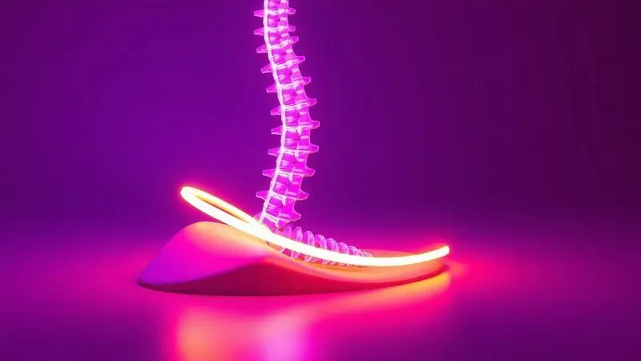

Imagine acordar e, em vez daquela rigidez familiar nas costas, sentir seu corpo leve e verdadeiramente descansado. É essa promessa, muitas vezes envolta em dúvidas e informações conflitantes, que faz tantas pessoas considerarem um colchão ortopédico.

Este guia vai além das etiquetas e do marketing. Vamos desvendar juntos o que realmente importa: desde o significado verdadeiro desse tipo de colchão até como ele pode, de fato, transformar suas noites.

Você vai descobrir como identificar se é a solução para o seu caso e, principalmente, como fazer a escolha certa, evitando erros que custam caro e frustrações.

<SummaryList products={frontmatter.top_products} />

## O que é Realmente um Colchão Ortopédico? Definição Precisa

Mais do que um nome ou uma categoria de produto, um colchão ortopédico é uma filosofia de suporte. Seu propósito central é manter sua coluna vertebral no seu alinhamento natural durante todas as fases do sono, independentemente da posição em que você dorme.

Para isso, ele emprega uma combinação inteligente de materiais e estruturas que trabalham para reduzir os pontos de pressão excessiva sobre quadris, ombros e outras articulações.

O resultado não é necessariamente um colchão 'duro', mas sim um que oferece a resistência certa para que seu corpo não afunde em posições prejudiciais.

### Colchão Ortopédico vs Semi-Ortopédico: Entenda a Diferença Crucial

Aqui está onde muitas dúvidas surgem. Se o ortopédico prioriza o suporte estrutural e o alinhamento, o semi-ortopédico entra como um ponte para o conforto tradicional.

Pense nisso como um espectro: de um lado, a firmeza dedicada ao suporte (ortopédico); do outro, camadas generosas de aconchego (convencional). O semi-ortopédico fica no meio, tentando equilibrar as duas coisas.

Ele geralmente possui uma base firme para suporte, mas é recoberto por mais espumas macias. A escolha entre um e outro não é sobre qual é 'melhor', mas sobre o que o seu corpo pede: suporte máximo ou um meio-termo entre firmeza e sensação acolhedora.

## 7 Benefícios Comprovados do Colchão Ortopédico para Sua Saúde

Os benefícios vão muito além de um simples 'não doer as costas'. Eles se entrelaçam, criando um ciclo positivo de recuperação e bem-estar que se reflete no seu dia a dia.

### 1. Alinhamento Perfeito da Coluna Vertebral

Este é o benefício fundador. Durante o sono, seus músculos relaxam, e é aí que a coluna mais precisa de apoio. Um bom colchão ortopédico atua como uma fundação sólida, impedindo que a região lombar afunde ou que o pescoço fique torcido. O que você sente ao acordar?

Uma sensação de integridade, como se seu corpo tivesse sido recomposto durante a noite, pronto para encarar o dia sem aquela tensão inicial.

### 2. Redução de Dores Crônicas nas Costas e Articulações

Quando a coluna está alinhada, a tensão sai dos músculos das costas, ombros e pescoço. Pontos de pressão em articulações como quadris e ombros são minimizados porque o peso do corpo é distribuído de forma mais inteligente.

Para quem vive com um incômodo constante, essa pode ser a diferença entre começar o dia remexendo-se para achar uma posição confortável e simplesmente sair da cama revigorado.

### 3. Melhora na Circulação Sanguínea Durante o Sono

Pouca gente associa o colchão à circulação, mas a conexão é direta. Quando um colchão muito mole comprime vasos sanguíneos em certas áreas, a circulação fica prejudicada.

O suporte uniforme do colchão ortopédico evita esses 'garrotes' involuntários, permitindo que o sangue flua livremente. Isso não só contribui para um sono mais profundo como ajuda na recuperação muscular e na oxigenação do corpo durante a noite.

### 4. Distribuição Uniforme da Pressão Corporal

Deitar em um colchão comum pode ser como se apoiar em uma superfície de pedra: alguns pontos (quadris, ombros) levam toda a carga. O colchão ortopédico, especialmente os de materiais como viscoelástica, funciona de modo diferente.

Ele se molda suavemente ao seu contorno, criando uma superfície de apoio personalizada que espalha seu peso. A sensação é de flutuar, sem aqueles pontos doloridos que fazem você se virar a cada hora.

### 5. Prevenção de Problemas Posturais em Longo Prazo

Passamos um terço da vida dormindo. Se durante esse tempo nossa postura é comprometida, os efeitos acumulativos aparecem. Um colchão que sustenta a coluna corretamente é um investimento na saúde postural futura.

Ele treina seu corpo, mesmo inconscientemente, a manter uma posição saudável, ajudando a prevenir aquela corcunda ou aquela dor lombar que parecem inevitáveis com o tempo.

### 6. Qualidade Superior do Sono e Redução do Ronco

Conforto e alinhamento são ingredientes essenciais para o sono profundo. Quando você para de se mover para buscar alívio da dor ou do desconforto, entra em estágios de sono mais reparadores.

E há um bônus: manter as vias aéreas abertas e o pescoço bem posicionado pode reduzir significativamente o ronco, beneficiando não só você, mas quem divide a cama.

### 7. Durabilidade Excepcional (Até 2x Mais que Colchões Comuns)

A construção robusta e os materiais de alta densidade usados nos colchões ortopédicos têm um resultado prático: eles duram muito mais. Enquanto um colchão comum pode começar a ceder após 5 anos, um ortopédico de qualidade mantém seu suporte por uma década ou mais.

É a paz de espírito de saber que seu investimento vai protegendo seu sono e sua coluna por muitos anos, sem a necessidade de uma nova compra a curto prazo.

## Mitos e Verdades: Desvendando os Segredos do Marketing

Antes de seguirmos para a escolha prática, é preciso limpar o terreno das ideias erradas que podem levar você a uma decisão equivocada.

### Mito 1: 'Colchão Ortopédico é Sempre Duro' (A Verdade Surpreendente)

Este é o mito mais persistente. 'Ortopédico' se refere à função (suporte ortopédico), não a uma sensação tátil.

Com os avanços em espumas viscoelásticas e látex, é perfeitamente possível ter um colchão que oferece suporte firme à estrutura do seu corpo enquanto proporciona uma sensação de aconchego na superfície.

A firmeza está na base, no suporte; o conforto está nas camadas superiores.

### Mito 2: 'Qualquer Colchão com essa Etiqueta Funciona'

Infelizmente, o termo 'ortopédico' não é rigidamente regulado como um selo médico. Algumas marcas usam-no apenas como estratégia de marketing em colchões apenas um pouco mais firmes.

A verdadeira funcionalidade ortopédica vem do projeto, dos materiais e da tecnologia empregada. Por isso, a etiqueta é um ponto de partida, nunca a garantia final. Sua experiência de teste e a reputação da marca são muito mais confiáveis.

## Para Quem é REALMENTE Indicado o Colchão Ortopédico?

Com tantos benefícios em jogo, a pergunta que fica é: isso é para mim? A resposta depende muito do seu perfil e das suas necessidades. Vamos ver em quais dessas situações você se encaixa.

### Perfil 1: Pessoas com Dores Crônicas nas Costas

Se você acorda com dor ou sente que ela piora após uma noite de sono, seu colchão atual pode ser um colaborador do problema. Para você, um colchão ortopédico não é um luxo, mas uma ferramenta de gestão da dor.

O suporte adequado tira a tensão da musculatura sobrecarregada e permite que inflamações nas articulações se acalmem. A escolha deve priorizar modelos com bom suporte lombar e que evitem que seu quadril afunde demais.

### Perfil 2: Indivíduos com Problemas de Postura

Se você passa o dia curvado sobre uma mesa e sente seus ombros e pescoço pagarem o preço, a noite é sua chance de reset. Um colchão ortopédico age como um 'corretor postural' passivo, ajudando a reposicionar sua coluna durante o relaxamento do sono.

Ele combate os maus hábitos do dia, prevenindo que dores ocasionais se tornem problemas crônicos.

### Perfil 3: Quem Procura Prevenção de Lesões

Atletas, pessoas muito ativas ou mesmo quem tem uma profissão fisicamente desgastante sabe que a recuperação noturna é sagrada.

Um colchão que oferece suporte ideal otimiza essa recuperação, garantindo que músculos e articulações estejam realmente descansados e prontos para o próximo dia, reduzindo o risco de lesões por fadiga ou má posição.

### Perfil 4: Pessoas com Sobrepeso ou Obesidade

Para suportar maior peso de forma segura e duradoura, é essencial uma estrutura robusta. Colchões muito macios podem ceder rapidamente, perdendo o suporte e criando uma 'rede' que deforma a coluna.

Colchões ortopédicos com molas ensacadas de calibre adequado ou espumas de alta densidade oferecem a resistência necessária para manter o alinhamento e a durabilidade, garantindo conforto e saúde a longo prazo.

## Guia Prático: Como Escolher o Colchão Ortopédico Perfeito em 5 Passos

Agora, com as dúvidas esclarecidas e sabendo do seu perfil, chegou a hora da ação. Siga estes passos para tomar uma decisão confiante.

### Passo 1: Avalie seu Tipo Corporal e Peso

Seu corpo é o principal critério. Pessoas com mais peso geralmente precisam de mais firmeza (suporte) para evitar que o colchão ceda além do ideal. Pessoas mais leves podem preferir uma sensação um pouco mais macia, pois pressionam menos a superfície.

Considere também sua altura e sua posição de dormir preferida (lado, costas, barriga), pois cada uma exige suporte em áreas diferentes.

### Passo 2: Teste Diferentes Níveis de Firmeza (Técnica do 'Teste de 15 Minutos')

Não confie apenas no tato com a mão. Deite-se no colchão na posição em que você normalmente dorme e fique pelo menos 15 minutos.

Sinta se sua coluna fica reta, se há espaço entre a cintura e o colchão (sinal de que está muito duro), ou se seu quadril afunda muito (sinal de que está muito mole). Leve seu parceiro se for o caso, e testem juntos.

### Passo 3: Escolha o Material Certo: Espuma, Molas ou Látex?

*   **Espuma Viscoelástica:** Ideal para quem busca adaptação total ao corpo e alívio de pressão. Ótima para casais, pois isola o movimento.

*   **Molas Ensacadas:** Oferecem suporte pontual e firmeza, com excelente ventilação. A opção clássica e muito durável.

*   **Látex Natural:** Conforto respirável, resiliente e hipoalergênico. Oferece um suporte firme com uma sensação de leve elasticidade.

### Passo 4: Verifique Certificações e Selos de Qualidade

Busque selos que vão além do marketing. O INMETRO atesta a segurança. O CertiPUR-US garante que as espumas são livres de substâncias nocivas. O OEKO-TEX certifica que os tecidos não têm produtos químicos prejudiciais.

Esses selos são seu escudo contra produtos de baixa qualidade que podem até prejudicar sua saúde.

### Passo 5: Considere o Custo-Benefício Real (Não Apenas o Preço)

Pergunte-se: qual o custo de uma noite mal dormida durante 10 anos? Um colchão barato pode economizar na compra, mas custar caro em saúde, disposição e na necessidade de uma troca precoce.

Avalie o investimento pelo conforto diário, pela durabilidade prometida (e respaldada pela garantia) e pela tranquilidade de fazer uma escolha consciente para seu bem-estar.

## Tabela Comparativa: Ortopédico vs Comum vs Semi-Ortopédico

Para visualizar as diferenças de forma clara, pense nesta comparação:

*   **Colchão Ortopédico:** Foco máximo em **suporte e alinhamento**. Prioriza a saúde da coluna. Sensação pode variar de média a firme. Ideal para quem tem dores, problemas posturais ou busca prevenção.

*   **Colchão Comum:** Foco máximo em **conforto e aconchego**. Prioriza a sensação imediata ao deitar. Pode não oferecer suporte adequado para a coluna a longo prazo. Ideal para quem não tem queixas e valoriza principalmente a maciez.

*   **Colchão Semi-Ortopédico:** Busca o **meio-termo**. Oferece uma base com mais suporte que o comum, recoberta por camadas de conforto. É a opção para quem quer um upgrade no suporte sem abrir mão da sensação acolhedora tradicional.

## Os Melhores Materiais para Colchões Ortopédicos em 2024

A tecnologia avança, mas alguns materiais se consolidaram como os melhores aliados do sono com suporte.

### Espuma Viscoelástica: O Padrão Ouro para Conforto e Suporte

<ProductBox 
  title={frontmatter.top_products[0].title} 
  image={frontmatter.top_products[0].image} 
  link={frontmatter.top_products[0].link} 
/>

A famosa 'espuma de memória' é insuperável na adaptação ao corpo. Ela amolece com o calor, contornando seus ombros e quadris perfeitamente para aliviar a pressão, enquanto mantém firmeza nas áreas que precisam de apoio, como a lombar.

Para quem se mexe muito à noite, ela ainda tem a vantagem de isolar o movimento, não perturbando o parceiro. Modelos mais modernos já vêm com tecnologias de resfriamento para quem sente calor.

### Molas Ensacadas Individualmente: Firmeza Controlada

<ProductBox 
  title={frontmatter.top_products[1].title} 
  image={frontmatter.top_products[1].image} 
  link={frontmatter.top_products[1].link} 
/>

Cada mola, envolta em seu próprio tecido, trabalha de forma independente. Isso significa que quando você se deita, apenas as molas sob seu corpo cedem, criando um suporte personalizado, enquanto o resto do colchão permanece firme.

A sensação é de firmeza consistente e excelente ventilação, ideal para climas quentes. A tecnologia também minimiza a transferência de movimento, mas de uma forma diferente da viscoelástica.

### Látex Natural: A Opção Premium Antialérgica

<ProductBox 
  title={frontmatter.top_products[2].title} 
  image={frontmatter.top_products[2].image} 
  link={frontmatter.top_products[2].link} 
/>

Extraído da seve da seringueira, o látex natural é resiliente, durável e naturalmente resistente a ácaros e fungos.

Ele oferece um suporte firme, mas com uma certa 'elasticidade' que proporciona uma sensação de leve impulso, diferente da moldagem profunda da viscoelástica.

É a escolha perfeita para alérgicos e para quem busca um material ecológico e de altíssima durabilidade, ainda que com um investimento inicial maior.

### Memória Gel: Tecnologia de Refrigeração para Noites Quentes

<ProductBox 
  title={frontmatter.top_products[3].title} 
  image={frontmatter.top_products[3].image} 
  link={frontmatter.top_products[3].link} 
/>

Para quem ama o conforto da viscoelástica mas sofre com o calor, a memória gel é a resposta. Pequenas partículas de gel são infundidas na espuma, ajudando a absorver e dissipar o calor do corpo.

Algumas tecnologias, como a infusão com cobre, potencializam ainda mais esse efeito resfriador. É a maneira de ter a adaptação perfeita do corpo sem a sensação de dormir em uma superfície abafada.

## Erros Comuns ao Comprar Colchão Ortopédico (Evite Custar Caro!)

Conhecer os acertos é importante, mas saber os deslizes mais comuns pode poupar você de uma grande frustração.

### Erro 1: Comprar sem Testar Físicamente

Fotos, descrições e reviews são úteis, mas não substituem a experiência do seu próprio corpo. A firmeza que é 'perfeita' para uma pessoa pode ser um tormento para outra. Aquele colchão 'super confortável' nas redes sociais pode não ter o suporte que sua lombar precisa.

Dedique tempo para ir a uma loja e vivenciar a sensação. Se comprar online, priorize marcas com políticas generosas de teste em casa.

### Erro 2: Ignorar a Garantia e Política de Troca

A garantia não serve apenas para defeitos de fábrica. Ela é um termômetro da confiança que a marca tem na durabilidade do produto. Uma garantia longa (de 10 anos ou mais) indica um colchão feito para durar.

Já a política de troca (ou período de experiência) é seu paraquedas. Ela permite que você teste o colchão no seu ambiente, com seu pijama e seus hábitos, por semanas, antes de decidir se fica com ele. Não abra mão disso.

### Erro 3: Focar Apenas no Preço (Barato Pode Sair Caro)

O preço baixo é tentador, mas em colchões, ele quase sempre vem de um lugar: materiais de baixa densidade e qualidade. Esses colchões perdem a forma e o suporte muito rápido, muitas vezes antes do primeiro ano.

Você acaba trocando com frequência, gastando mais no total, e ainda sofre com noites mal dormidas no processo. Veja o preço como um investimento a ser diluído pelos anos de sono de qualidade que você terá.

## FAQ: Perguntas Frequentes Respondidas por Especialistas

### 1. Colchão ortopédico dói no início? Quanto tempo para se acostumar?

É possível, sim. Se você vinha de um colchão muito macio e afundado, seu corpo estava 'acostumado' a uma postura errada. O novo suporte vai exigir que músculos e articulações se realinhem, o que pode causar um desconforto de adaptação de alguns dias até 2-3 semanas.

Se a dor for aguda ou persistir além desse período, o colchão pode estar realmente inadequado para você.

### 2. É indicado para gestantes e idosos?

Sim, e muito! Para gestantes, o suporte extra alivia o peso na lombar e ajuda a encontrar posições confortáveis conforme a barriga cresce.

Para idosos, além do benefício para dores articulares, um colchão com a firmeza certa facilita na hora de se levantar da cama, oferecendo mais estabilidade. Em ambos os casos, modelos com alívio de pressão (como viscoelástica) são especialmente recomendados.

### 3. Qual a durabilidade média? Quando trocar?

Um colchão ortopédico de qualidade dura, em média, de 8 a 10 anos. O sinal mais claro para a troca é o desgaste perceptível: se você acorda com dores que não tinha antes, se sente 'valas' ou ondulações ao deitar, ou se o colchão não retorna mais à forma plana.

Outro indicador é simplesmente o tempo: após uma década, mesmo que pareça inteiro, os materiais internos já perderam uma parte significativa de suas propriedades de suporte.

### 4. Como cuidar e manter para durar mais?

*   **Gire regularmente:** Gire o colchão (cabeceira/pés) a cada 3 meses no primeiro ano, e depois a cada 6 meses. Isso desgasta de forma uniforme.

*   **Use um protetor:** Um protetor à prova de água e ácaros é essencial. Ele protege contra suor, derramamentos e mantém o colchão higiênico.

*   **Aspire a superfície:** Use o bico estofado do aspirador para remover poeira e ácaros superficiais periodicamente.

*   **Evite dobrar ou pular:** Isso pode danificar as molas ou romper a estrutura interna da espuma.

*   **Use uma base adequada:** Uma base sólida ou com ripados adequados (com espaço máximo de 5cm entre eles) é fundamental para dar suporte e ventilação.

### 5. Colchão ortopédico vale o investimento? ROI do sono

Absolutamente. O Retorno sobre o Investimento (ROI) aqui não é medido em dinheiro, mas em qualidade de vida.

Considere: menos dias perdidos por dores, mais disposição e produtividade no trabalho, melhor humor, relacionamentos menos perturbados por noites mal dormidas e a prevenção de problemas de saúde futuros que gerariam custos médicos.

Quando você divide o valor do colchão pelos mais de 2.900 noites de sono que ele pode proporcionar em 8 anos, o custo por noite de conforto e saúde se torna irrisório.

## Conclusão

A busca pelo colchão ortopédico ideal é, no fundo, uma busca por autocuidado. É o reconhecimento de que um terço da nossa vida, a parte dedicada ao descanso e recuperação, merece tanta atenção quanto nossa alimentação ou atividade física.

Mais do que uma peça de mobiliário, é um parceiro silencioso na sua saúde.

Ao longo deste guio, você descobriu que a escolha certa vai além de uma etiqueta ou um preço. Ela passa por entender as reais necessidades do seu corpo, desconstruir mitos convenientes e dedicar tempo a uma escolha consciente.

Lembre-se: você não está apenas comprando um produto, está investindo em noites que constroem dias melhores.

Comece sua jornada revisitando seu perfil, marque um teste em uma loja de confiança e não tenha pressa. O colchão perfeito é aquele que, após uma noite de sono, faz você esquecer que ele existe, porque simplesmente funcionou.

Aqui termina o guia, mas começa sua experiência de acordar renovado. Boa escolha, e boas noites de sono.